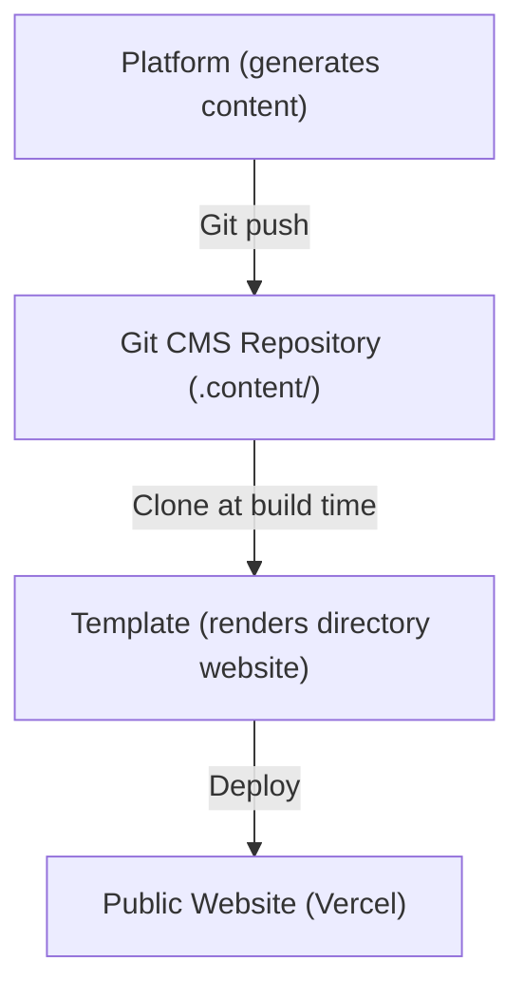
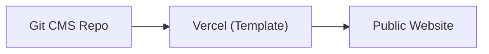
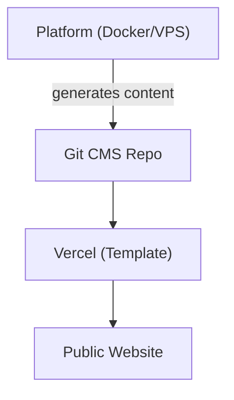
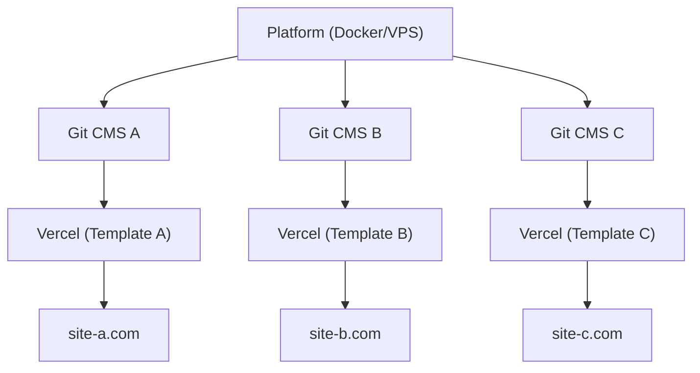

# Plattform vs Template

Ever Works besteht aus zwei Hauptprodukten, die unterschiedliche Zwecke erfüllen, aber als einheitliches Ökosystem zusammenarbeiten. Diese Seite erklärt den Unterschied und wann welches Produkt verwendet werden sollte.

## Ever Works Platform

Die **Ever Works Platform** ist die Backend-Infrastruktur zum Aufbau und zur Verwaltung von Verzeichniswebsites in großem Maßstab. Sie bietet eine REST-API, KI-gestützte Inhaltsgenerierungspipelines, ein Plugin-System und Deployment-Orchestrierung.

Vollständige Plattformdokumentation finden Sie unter [docs.ever.works](https://docs.ever.works).

## Directory Web Template

Das **Directory Web Template** (dieses Projekt) ist eine produktionsreife Full-Stack-Verzeichniswebsite, die Sie klonen, anpassen und als eigenständige Anwendung bereitstellen können.

### Was es macht

- Bietet eine vollständige **Verzeichniswebsite** mit Element-Listings, Suche, Filterung, Kategorien, Tags und Sammlungen
- Enthält **Authentifizierung** über NextAuth.js v5 mit OAuth-Anbietern (Google, GitHub, Facebook, Twitter, Microsoft) und Supabase Auth
- Unterstützt **Zahlungen** über Stripe, LemonSqueezy und Polar mit Abonnementverwaltung
- Bietet **Internationalisierung** mit mehreren Sprachen und RTL-Unterstützung über next-intl
- Verwendet ein **Git-basiertes CMS** zur Synchronisierung von Verzeichnisinhalten aus Git-Repositorys
- Enthält ein **Theming-System** mit integrierten Themes und dynamischer Farbgenerierung
- Bietet **Analysen und Monitoring** über PostHog und Sentry
- Enthält **SEO-Optimierung**, Sitemap-Generierung und strukturierte Daten (JSON-LD)
- Umfasst ein **Admin-Dashboard** mit Content-Management, Benutzerverwaltung und Analysen

### Tech-Stack

- **Framework:** Next.js 15, React 19
- **Sprache:** TypeScript 5
- **ORM:** Drizzle ORM (PostgreSQL)
- **UI:** Tailwind CSS 4, HeroUI React, Radix UI
- **Auth:** NextAuth.js v5, Supabase Auth
- **Zahlungen:** Stripe, LemonSqueezy, Polar
- **Testing:** Playwright (E2E)
- **Deployment:** Vercel (primär), Docker (alternativ)

## Vergleich Nebeneinander

| Aspekt             | Plattform                                  | Template                               |
| ------------------ | ------------------------------------------ | -------------------------------------- |
| **Zweck**          | Backend-Infrastruktur und KI-Pipeline      | Frontend-Verzeichniswebsite            |
| **Architektur**    | Monorepo (Turborepo + pnpm)                | Eigenständige Next.js-Anwendung        |
| **Backend**        | NestJS 11 API                              | Next.js API-Routen                     |
| **Datenbank-ORM**  | TypeORM                                    | Drizzle ORM                            |
| **Authentifizierung** | JWT + OAuth (NestJS Guards)             | NextAuth.js v5 + Supabase Auth         |
| **Zahlungen**      | Nicht enthalten                            | Stripe, LemonSqueezy, Polar            |
| **KI-Funktionen**  | LangChain-Agenten, 7 LLM-Anbieter          | Keine (konsumiert KI-generierten Inhalt) |
| **Inhalt**         | Generiert Inhalt über KI-Pipelines         | Liest Inhalt vom Git-basierten CMS     |
| **Deployment**     | Docker auf beliebigem VPS                  | Vercel (oder Docker)                   |
| **Testing**        | Jest + Vitest                              | Playwright                             |
| **Zielgruppe**     | Plattformbetreiber, KI-Entwickler          | Website-Builder, Verzeichnisersteller  |

## Wie sie zusammenwirken

Plattform und Template arbeiten zusammen durch das **Git-basierte CMS**-Muster:

### Unabhängiger Betrieb

- **Template ohne Plattform:** Pflegen Sie Verzeichnisinhalte manuell durch Bearbeitung von YAML- und Markdown-Dateien im Git-CMS-Repository. Das Template funktioniert als vollständig funktionale Verzeichniswebsite ohne KI-Generierung.
- **Plattform ohne Template:** Verwenden Sie die Platform-API, um Verzeichnisdaten zu generieren und in ein beliebiges Frontend zu exportieren.

## Wann Was Verwenden

### Das Template verwenden, wenn...

- Sie eine Verzeichniswebsite schnell mit minimaler Backend-Einrichtung starten möchten
- Ihre Verzeichnisinhalte manuell kuriert oder aus einer statischen Datenquelle stammen
- Sie eine produktionsreife Website mit Authentifizierung, Zahlungen und SEO out of the box benötigen
- Sie es vorziehen, auf Vercel ohne Serververwaltung bereitzustellen

### Die Plattform verwenden, wenn...

- Sie KI-gestützte Inhaltsgenerierung für große Verzeichnisse benötigen
- Sie automatisierte Pipelines benötigen, die Verzeichniseinträge entdecken, anreichern und aktualisieren
- Sie mehrere Verzeichnisse von einem einzigen Backend verwalten möchten
- Sie das Plugin-System für benutzerdefinierte Integrationen nutzen möchten

### Beides verwenden, wenn...

- Sie KI-generierten Inhalt in eine Produktionswebsite einfließen lassen möchten
- Sie ein SaaS-Produkt auf Basis von Ever Works aufbauen
- Sie automatisierte Inhaltsgenerierung UND ein ausgefeiltes Frontend benötigen

## Deployment-Architekturen

### Nur Template (Einfachste)

Manuelle Inhaltsverwaltung über Git. Einzelnes Vercel-Deployment.

### Plattform + Template (Full Stack)

Automatische Inhaltsgenerierung über die Plattform. Verbunden durch Git.

### Plattform + Mehrere Templates

Eine einzelne Plattforminstanz verwaltet mehrere Verzeichniswebsites.
