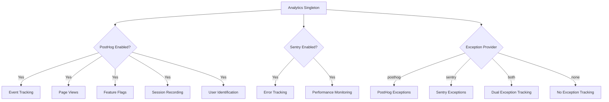
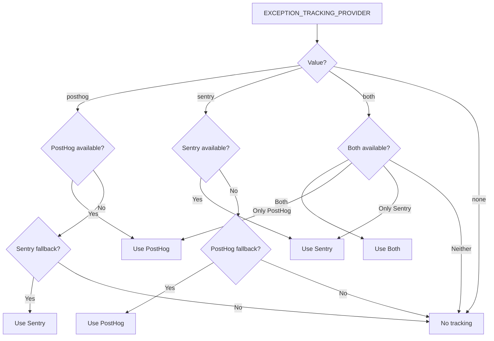

# Analytik-Konfiguration

Das Template bietet ein einheitliches Analysesystem, das PostHog für Produktanalytik und Sentry für Fehlerverfolgung integriert. Beide Anbieter werden über eine Singleton-Klasse `Analytics` mit automatischem Fallback-Verhalten verwaltet.

## Architektur



## Umgebungsvariablen

### PostHog-Konfiguration

| Variable | Erforderlich | Standard | Beschreibung |
|---|---|---|---|
| `NEXT_PUBLIC_POSTHOG_KEY` | Ja (für Analytik) | -- | PostHog-Projekt-API-Schlüssel |
| `NEXT_PUBLIC_POSTHOG_HOST` | Ja (für Analytik) | -- | PostHog-Instanz-URL |
| `POSTHOG_DEBUG` | Nein | `false` | Debug-Protokollierung aktivieren |
| `POSTHOG_SESSION_RECORDING_ENABLED` | Nein | `true` | Sitzungsaufzeichnungen aktivieren |
| `POSTHOG_AUTO_CAPTURE` | Nein | `false` | Seitenaufrufe automatisch erfassen |
| `POSTHOG_EXCEPTION_TRACKING` | Nein | `true` | PostHog-Ausnahmetracking aktivieren |

### Sentry-Konfiguration

| Variable | Erforderlich | Standard | Beschreibung |
|---|---|---|---|
| `NEXT_PUBLIC_SENTRY_DSN` | Ja (für Fehler) | -- | Sentry Data Source Name |
| `SENTRY_ENABLE_DEV` | Nein | `false` | Sentry in der Entwicklung aktivieren |
| `SENTRY_DEBUG` | Nein | `false` | Sentry-Debug-Modus aktivieren |
| `SENTRY_EXCEPTION_TRACKING` | Nein | `true` | Sentry-Ausnahmetracking aktivieren |

### Einheitliches Ausnahmetracking

| Variable | Erforderlich | Standard | Beschreibung |
|---|---|---|---|
| `EXCEPTION_TRACKING_PROVIDER` | Nein | `both` | Zu verwendender Anbieter: `posthog`, `sentry`, `both` oder `none` |

## PostHog-Einrichtung

### Schritt 1: Zugangsdaten abrufen

1. Registrieren Sie sich auf [posthog.com](https://posthog.com) oder hosten Sie PostHog selbst
2. Erstellen Sie ein Projekt
3. Kopieren Sie den Projekt-API-Schlüssel und die Host-URL

### Schritt 2: Umgebung konfigurieren

```env
NEXT_PUBLIC_POSTHOG_KEY=phc_your_project_key_here
NEXT_PUBLIC_POSTHOG_HOST=https://app.posthog.com
```

PostHog wird automatisch aktiviert, wenn sowohl `NEXT_PUBLIC_POSTHOG_KEY` als auch `NEXT_PUBLIC_POSTHOG_HOST` gesetzt sind.

### Schritt 3: Abtastraten

Die Abtastraten werden automatisch nach Umgebung angepasst:

| Umgebung | Ereignis-Abtastrate | Sitzungsaufzeichnungs-Abtastrate |
|---|---|---|
| Produktion | 10% (`0.1`) | 10% (`0.1`) |
| Entwicklung | 100% (`1.0`) | 100% (`1.0`) |

## Sentry-Einrichtung

### Schritt 1: DSN abrufen

1. Erstellen Sie ein Projekt auf [sentry.io](https://sentry.io)
2. Kopieren Sie den DSN aus den Projekteinstellungen

### Schritt 2: Umgebung konfigurieren

```env
NEXT_PUBLIC_SENTRY_DSN=https://examplePublicKey@o0.ingest.sentry.io/0
SENTRY_ENABLE_DEV=true  # Optional: in der Entwicklung aktivieren
```

Sentry wird in der Produktion automatisch aktiviert, wenn der DSN gesetzt ist. Für die Entwicklung setzen Sie explizit `SENTRY_ENABLE_DEV=true`.

## Analytik-Klassen-API

Die `Analytics`-Klasse ist ein Singleton, das in der gesamten Anwendung zugänglich ist:

```typescript
import { analytics } from '@/lib/analytics';
```

### Initialisierung

```typescript
// Analytics initialisieren (einmal im App-Root aufrufen)
analytics.init();
```

Die `init()`-Methode gilt nur für den Client und kann sicher in server-seitigen Kontexten aufgerufen werden (sie führt dort keine Aktion aus).

### Ereignisverfolgung

```typescript
// Ein benutzerdefiniertes Ereignis verfolgen
analytics.track('button_clicked', {
  buttonName: 'signup',
  page: '/landing'
});

// Einen Seitenaufruf verfolgen
analytics.trackPageView('/dashboard', {
  referrer: document.referrer
});
```

### Benutzeridentifikation

```typescript
// Einen Benutzer identifizieren (nach der Anmeldung)
analytics.identify('user-123', {
  email: 'user@example.com',
  plan: 'premium',
  company: 'Acme Inc.'
});

// Identität zurücksetzen (nach dem Abmelden)
analytics.reset();

// Persistente Benutzereigenschaften setzen
analytics.setUserProperties({
  subscription_tier: 'premium',
  signup_date: '2024-01-15'
});

// Supereigenschaften setzen (werden mit jedem Ereignis gesendet)
analytics.setSuperProperties({
  app_version: '2.0.0',
  platform: 'web'
});
```

### Feature-Flags

```typescript
// Prüfen, ob ein Feature-Flag aktiviert ist
const isEnabled = analytics.isFeatureEnabled('new-dashboard', false);

// Feature-Flags vom Server neu laden
await analytics.reloadFeatureFlags();
```

### Ausnahmetracking

```typescript
// Eine Ausnahme erfassen (wird an den konfigurierten Anbieter weitergeleitet)
analytics.captureException(error, {
  component: 'PaymentForm',
  action: 'submit'
});

// Mit einer Zeichenkettenmeldung erfassen
analytics.captureException('Payment processing failed', {
  orderId: 'ord-123'
});
```

## Auswahl des Ausnahmetracking-Anbieters



## Sitzungsaufzeichnung

Wenn `POSTHOG_SESSION_RECORDING_ENABLED=true`, zeichnet PostHog Benutzersitzungen mit diesen Datenschutzeinstellungen auf:

```typescript
session_recording: {
  maskAllInputs: true,        // Formulareingabewerte maskieren
  maskTextSelector: "[data-mask]",  // Elemente mit data-mask maskieren
  sampleRate: 0.1,            // 10% in der Produktion
}
```

Fügen Sie `data-mask` zu jedem Element hinzu, dessen Textinhalt in Aufzeichnungen verborgen sein soll.

## PostHog-Ausnahmetracking

Wenn das PostHog-Ausnahmetracking aktiviert ist, installiert das System globale Fehlerbehandler:

- **`window.onerror`** -- Fängt nicht behandelte JavaScript-Fehler ab
- **`unhandledrejection`** -- Fängt nicht behandelte Promise-Ablehnungen ab

Diese werden als `$exception`-Ereignisse mit Stack-Traces an PostHog weitergeleitet.

## Sentry-PostHog-Integration

Wenn beide Anbieter aktiv sind (`EXCEPTION_TRACKING_PROVIDER=both`), erstellt das System eine bidirektionale Verknüpfung:

1. Die `sentry`-Eigenschaft von PostHog wird auf das Sentry SDK gesetzt
2. Ein benutzerdefinierter Sentry-Ereignisprozessor leitet Fehler als `sentry_error`-Ereignisse an PostHog weiter
3. Dies ermöglicht die Korrelation von Benutzersitzungen (PostHog) mit Fehlerdetails (Sentry)

## Zuschauer-Tracking-Konstanten

Die Datei `lib/constants/analytics.ts` bietet Konstanten für die anonyme Besucherverfolgung:

```typescript
// Cookie-Name für anonyme Besucher-ID
```
