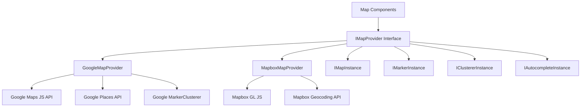
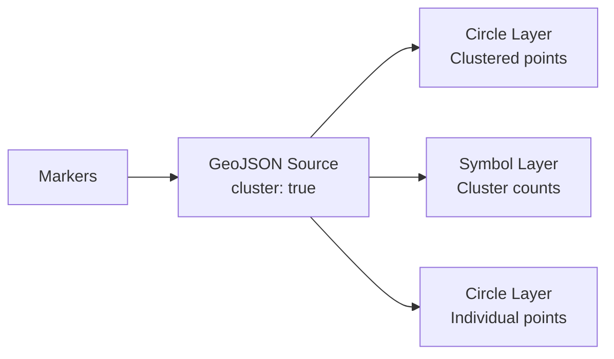

# Kartenkonfiguration

Das Template enthält ein anbieterneutrales Kartensystem, das sowohl Google Maps als auch Mapbox GL JS unterstützt. Eine gemeinsame Schnittstellenschicht ermöglicht den Wechsel zwischen Anbietern ohne Änderung des Komponentencodes.

## Architektur



## Anbieterauswahl

Der Kartenanbieter wird durch die konfigurierten API-Schlüssel bestimmt:

| Anbieter | Erforderliche Umgebungsvariable |
|---|---|
| Google Maps | `NEXT_PUBLIC_GOOGLE_MAPS_API_KEY` |
| Mapbox | `NEXT_PUBLIC_MAPBOX_ACCESS_TOKEN` |

Wenn beide konfiguriert sind, wird der Anbieter über die Kartenkonfigurationseinstellungen der Anwendung ausgewählt.

## Google Maps-Einrichtung

### Schritt 1: API-Schlüssel erhalten

1. Gehe zur [Google Cloud Console](https://console.cloud.google.com)
2. Aktiviere die folgenden APIs:
   - Maps JavaScript API
   - Places API
   - Geocoding API
3. Erstelle einen API-Schlüssel mit HTTP-Referrer-Einschränkungen

### Schritt 2: Umgebung konfigurieren

```env
NEXT_PUBLIC_GOOGLE_MAPS_API_KEY=AIzaSy...your-api-key
NEXT_PUBLIC_GOOGLE_MAPS_MAP_ID=your-map-id        # Optional: for styled maps
```

### Schritt 3: Sicherheit

Der Google Maps-Anbieter erzwingt die ausschließliche Nutzung des Schlüssels im Browser:

```typescript
// @security Uses NEXT_PUBLIC_GOOGLE_MAPS_API_KEY (browser-exposed).
// Only use HTTP referrer-restricted keys, never unrestricted or server keys.
```

**Erforderliche API-Schlüssel-Einschränkungen:**
- Anwendungsbeschränkung: HTTP-Referrer
- Füge deine Domainmuster hinzu (z. B. `https://ihredomain.com/*`)
- API-Beschränkung: Auf Maps JavaScript, Places und Geocoding APIs begrenzen

## Mapbox-Einrichtung

### Schritt 1: Zugriffstoken erhalten

1. Registriere dich auf [mapbox.com](https://www.mapbox.com)
2. Kopiere deinen öffentlichen Zugriffstoken (beginnt mit `pk.`)

### Schritt 2: Umgebung konfigurieren

```env
NEXT_PUBLIC_MAPBOX_ACCESS_TOKEN=pk.eyJ1Ijoi...your-token
```

### Schritt 3: Sicherheit

```typescript
// @security Uses NEXT_PUBLIC_MAPBOX_ACCESS_TOKEN (browser-exposed).
// Only use public tokens (pk.*) with URL restrictions, never secret tokens (sk.*).
```

**Erforderliche Token-Einschränkungen:**
- Verwende einen **öffentlichen** Token (Präfix `pk.`)
- Füge URL-Einschränkungen für deine Domains hinzu
- Verwende niemals geheime Token (`sk.*`) in clientseitigem Code

## Anbieter-Schnittstelle

Beide Anbieter implementieren die `IMapProvider`-Schnittstelle mit identischen Fähigkeiten:

### IMapProvider-Methoden

| Methode | Beschreibung |
|---|---|
| `isLoaded()` | Prüfe ob das Anbieter-Skript geladen ist |
| `loadScript()` | Lade die Anbieterbibliothek (idempotent) |
| `createMap(container, options)` | Erstelle eine Karteninstanz in einem DOM-Element |
| `createMarker(map, options)` | Füge eine Markierung zur Karte hinzu |
| `createClusterer(map, options, onClick)` | Gruppiere nahegelegene Markierungen zu Clustern |
| `createAutocomplete(input, onSelect)` | Füge Adress-Autocomplete an ein Eingabefeld an |
| `getStyleUrl(style)` | Hole die Stil-URL für Straßen- oder Satellitenansicht |
| `isConfigured()` | Prüfe ob API-Schlüssel vorhanden sind |

### Kartenstile

| Stil | Google Maps | Mapbox |
|---|---|---|
| `streets` | `roadmap` | `mapbox://styles/mapbox/streets-v12` |
| `satellite` | `satellite` | `mapbox://styles/mapbox/satellite-streets-v12` |

## Typsystem

Die Kartenbibliothek definiert umfassende Typen in `lib/maps/types.ts`:

### Kerntypen

```typescript
interface Coordinates {
  latitude: number;
  longitude: number;
}

interface MapBounds {
  north: number;
  south: number;
  east: number;
  west: number;
}

interface MapViewport {
  center: Coordinates;
  zoom: number;
  bounds?: MapBounds;
}
```

### Markierungstypen

```typescript
interface MapMarkerData {
  id: string;
  coordinates: Coordinates;
  title: string;
  icon?: string;
  category?: string;
  slug: string;
  description?: string;
}

interface MapMarkerWithDistance extends MapMarkerData {
  distanceKm?: number;
}
```

### Clusterkonfiguration

```typescript
interface ClusterOptions {
  radius?: number;     // Cluster radius in pixels (default: 60)
  maxZoom?: number;    // Max zoom for clustering (default: 16)
  minZoom?: number;    // Min zoom for clustering (default: 0)
  minPoints?: number;  // Min points to form cluster (default: 2)
}
```

### Ereignishandler

```typescript
interface MapEventHandlers {
  onMarkerClick?: (marker: MapMarkerData) => void;
  onClusterClick?: (cluster: MapClusterData) => void;
  onViewportChange?: (viewport: MapViewport) => void;
  onMapReady?: () => void;
  onMapError?: (error: Error) => void;
}
```

## Karteneigenschaften (Props)

Die `MapComponentProps`-Schnittstelle definiert den vollständigen Satz an Props für die Hauptkartenkomponente:

| Prop | Typ | Standard | Beschreibung |
|---|---|---|---|
| `markers` | `MapMarkerData[]` | `[]` | Anzuzeigende Markierungen |
| `center` | `Coordinates` | -- | Anfängliche Mittelposition |
| `zoom` | `number` | -- | Anfängliches Zoomniveau (1-20) |
| `style` | `MapStyle` | `streets` | Kartenstil (Straßen/Satellit) |
| `height` | `string \| number` | -- | Container-Höhe |
| `width` | `string \| number` | -- | Container-Breite |
| `enableClustering` | `boolean` | `false` | Markierungs-Clustering aktivieren |
| `clusterOptions` | `ClusterOptions` | -- | Clustering-Konfiguration |
| `controls` | `MapControlsConfig` | -- | Einstellungen für UI-Steuerelemente |
| `isLoading` | `boolean` | `false` | Externer Ladezustand |
| `isDisabled` | `boolean` | `false` | Interaktion deaktivieren |
| `onMarkerClick` | `function` | -- | Klick-Handler für Markierungen |
| `onClusterClick` | `function` | -- | Klick-Handler für Cluster |
| `onViewportChange` | `function` | -- | Handler für Viewport-Änderungen |

## Adress-Autocomplete

Beide Anbieter unterstützen Adress-Autocomplete mit einer einheitlichen Schnittstelle:

```typescript
interface AddressSuggestion {
  id: string;
  mainText: string;       // Street address
  secondaryText: string;  // City, state
  fullAddress: string;    // Complete formatted address
  coordinates?: Coordinates;
}
```

**Google Maps:** Verwendet die Places Autocomplete API mit den Feldern `formatted_address`, `geometry`, `name` und `address_components`.

**Mapbox:** Verwendet die Geocoding API (`/geocoding/v5/mapbox.places/`) mit Debounce-Eingabe (300ms) und einer benutzerdefinierten Dropdown-Benutzeroberfläche.

## Standortauswahl

Die `LocationPickerProps`-Schnittstelle unterstützt eine vollständige Standortauswahl-Erfahrung:

```typescript
interface LocationPickerValue {
  address?: string;
  city?: string;
  state?: string;
  country?: string;
  postalCode?: string;
  latitude?: number;
  longitude?: number;
  serviceArea?: 'local' | 'regional' | 'national' | 'global';
  isRemote?: boolean;
}
```

## Geocodierungsdienste

Serverseitige Geocodierung ist über `lib/services/geocoding/` verfügbar:

| Datei | Zweck |
|---|---|
| `geocoding-provider.interface.ts` | Gemeinsame Geocodierungsschnittstelle |
| `google-geocoding.provider.ts` | Implementierung der Google Geocoding API |
| `mapbox-geocoding.provider.ts` | Implementierung der Mapbox Geocoding API |
| `geocoding.service.ts` | Einheitlicher Geocodierungsdienst |

## Clustering-Implementierung

### Google Maps-Clustering

Verwendet `@googlemaps/markerclusterer` mit `AdvancedMarkerElement`:

- Importiert die Clusterer-Bibliothek dynamisch
- Erstellt benutzerdefinierte Markierungsinhalts-Elemente mit Symbolen
- Standardverhalten: Zoom auf Cluster-Grenzen beim Klicken

### Mapbox-Clustering

Verwendet natives Mapbox GL-Clustering auf Ebene der Quelle:

- GeoJSON-Quelle mit `cluster: true`
- Drei Ebenen: Cluster-Kreise, Zählebeschriftungen, nicht geclusterte Punkte
- Farbkodierung nach Clustergröße (klein: Cyan, mittel: Gelb, groß: Pink)



## Steuerelemente konfigurieren

```typescript
interface MapControlsConfig {
  showZoomControls?: boolean;        // Zoom in/out buttons
  showFullscreenControl?: boolean;   // Fullscreen toggle
  showNavigationControl?: boolean;   // Compass/navigation
  showScaleControl?: boolean;        // Distance scale
}
```

## Fehlerbehebung

| Problem | Lösung |
|---|---|
| Karte wird nicht gerendert | Überprüfe ob der API-Schlüssel gesetzt und korrekt ist |
| "Google Maps API key not configured" | Setze `NEXT_PUBLIC_GOOGLE_MAPS_API_KEY` |
| Mapbox-Karte leer | Stelle sicher, dass das Token mit `pk.` (öffentlich) beginnt |
| Markierungen nicht geclustert | Setze `enableClustering={true}` für die Kartenkomponente |
| Autocomplete funktioniert nicht | Prüfe ob Places API aktiviert ist (Google) |
| CORS-Fehler | Überprüfe die Domain-Einschränkungen des API-Schlüssels |
| Ratenbegrenzung | Überwache die API-Nutzung im Anbieter-Dashboard |
