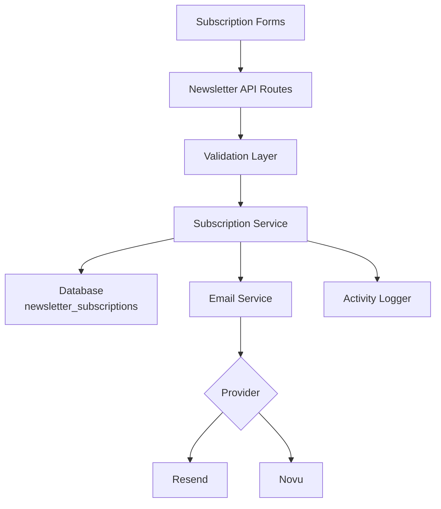
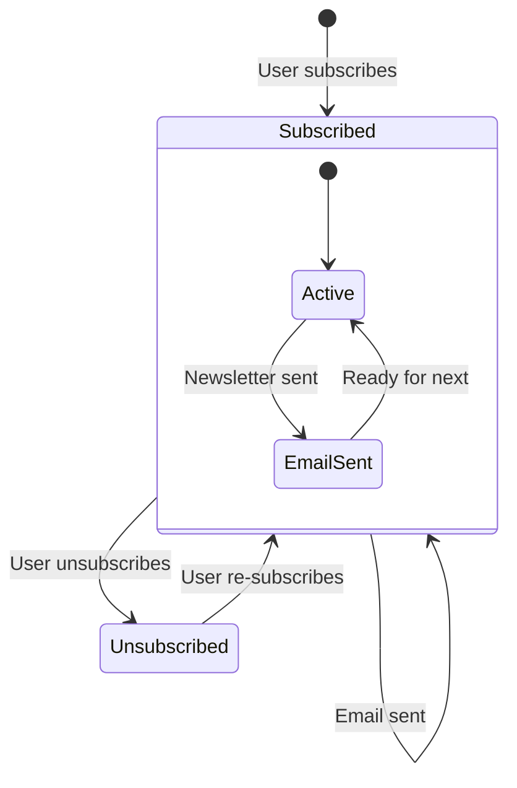

# Newsletter-Konfiguration

Das Template enthält ein vollständiges Newsletter-Abonnementsystem mit E-Mail-Anbieterintegration, Validierung, Abonnement-Lebenszyklusverwaltung und Aktivitätsprotokollierung. Die Konfiguration ist in `lib/newsletter/` zentralisiert.

## Architektur



## Dateistruktur

```
lib/newsletter/
├── config.ts    # Configuration, types, validation schemas
└── utils.ts     # Email sending, subscription validation, logging
```

## Konfigurationskonstanten

Das `NEWSLETTER_CONFIG`-Objekt in `config.ts` definiert alle Standardwerte und Nachrichten:

```typescript
export const NEWSLETTER_CONFIG = {
  DEFAULT_PROVIDER: "resend",
  DEFAULT_FROM: "onboarding@resend.dev",
  DEFAULT_COMPANY_NAME: "Ever Works",

  SOURCES: {
    FOOTER: "footer",
    POPUP: "popup",
    SIGNUP: "signup",
  },

  ERRORS: {
    INVALID_EMAIL: "Please enter a valid email address",
    ALREADY_SUBSCRIBED: "Email is already subscribed to the newsletter",
    NOT_SUBSCRIBED: "Email is not subscribed to the newsletter",
    SUBSCRIPTION_FAILED: "Failed to create subscription. Please try again.",
    UNSUBSCRIPTION_FAILED: "Failed to unsubscribe. Please try again.",
    EMAIL_SEND_FAILED: "Failed to send email. Please try again.",
    STATS_FAILED: "Failed to get newsletter statistics",
  },

  SUCCESS: {
    SUBSCRIBED: "Successfully subscribed to newsletter",
    UNSUBSCRIBED: "Successfully unsubscribed from newsletter",
  },
};
```

## E-Mail-Anbieter-Einrichtung

### Resend (Standard)

```env
RESEND_API_KEY=re_your_api_key_here
```

1. Registrieren Sie sich bei [resend.com](https://resend.com)
2. Erstellen Sie einen API-Schlüssel
3. Verifizieren Sie Ihre Versanddomain (oder verwenden Sie `onboarding@resend.dev` zum Testen)

### Novu

```env
NOVU_API_KEY=your_novu_api_key
```

Für Novu ist eine zusätzliche Konfiguration in der Site-Konfiguration verfügbar:

```yaml
mail:
  provider: "novu"
  template_id: "your-template-id"
  backend_url: "https://api.novu.co"
```

## E-Mail-Konfiguration

Die Funktion `createEmailConfig()` erstellt die E-Mail-Konfiguration aus der Anwendungskonfiguration:

```typescript
interface EmailConfig {
  provider: string;      // "resend" or "novu"
  defaultFrom: string;   // Sender email address
  domain: string;        // Application domain URL
  apiKeys: {
    resend: string;
    novu: string;
  };
  novu?: {
    templateId?: string;
    backendUrl?: string;
  };
}
```

Konfigurationspriorität:

| Einstellung      | Quelle                         | Fallback                   |
|---|---|---|
| Anbieter         | `config.mail.provider`         | `"resend"`                 |
| Absenderadresse  | `config.mail.default_from`     | `"onboarding@resend.dev"`  |
| Domain           | `config.app_url`               | `coreConfig.APP_URL`       |
| Resend-Schlüssel | `RESEND_API_KEY`-Umgebungsvar. | Leerer String              |
| Novu-Schlüssel   | `NOVU_API_KEY`-Umgebungsvar.  | Leerer String              |

## Validierungsschemata

Das Newsletter-System verwendet Zod-Schemata zur Eingabevalidierung:

### E-Mail-Schema

```typescript
const emailSchema = z.object({
  email: z
    .string()
    .email("Please enter a valid email address")
    .transform((email) => email.toLowerCase().trim()),
});
```

### Abonnementschema

```typescript
const newsletterSubscriptionSchema = z.object({
  email: z
    .string()
    .email("Please enter a valid email address")
    .transform((email) => email.toLowerCase().trim()),
  source: z
    .enum(["footer", "popup", "signup"])
    .default("footer"),
});
```

## Abonnementquellen

Verfolgen Sie, woher die Abonnements stammen:

| Quelle   | Beschreibung                               |
|---|---|
| `footer` | Abonnementformular in der Website-Fußzeile |
| `popup`  | Newsletter-Popup/Modal                     |
| `signup` | Konto-Registrierungsablauf                 |

## Newsletter-Dienstprogramme

### E-Mail-Versand

```typescript
import { sendEmailSafely, createEmailService } from '@/lib/newsletter/utils';

// Create email service
const { service, config } = await createEmailService();

// Send email with error handling
const result = await sendEmailSafely(
  service,
  config,
  {
    subject: "Welcome to our newsletter!",
    html: "<h1>Welcome!</h1>",
    text: "Welcome!"
  },
  "user@example.com",
  "welcome"
);

if (!result.success) {
  console.error(result.error);
}
```

### Abonnementvalidierung

```typescript
import { canSubscribe, canUnsubscribe } from '@/lib/newsletter/utils';

// Check if email can be subscribed
const { canSubscribe: allowed, error } = await canSubscribe("user@example.com");
if (!allowed) {
  // Email is already subscribed
}

// Check if email can be unsubscribed
const { canUnsubscribe: allowed, error } = await canUnsubscribe("user@example.com");
if (!allowed) {
  // Email is not currently subscribed
}
```

### Aktivitätsprotokollierung

```typescript
import { logNewsletterActivity, trackNewsletterMetric } from '@/lib/newsletter/utils';

// Log newsletter activity
logNewsletterActivity("subscribe", "user@example.com", "footer", {
  ip: "192.168.1.1"
});

// Track newsletter metrics
trackNewsletterMetric("subscription", "user@example.com", "popup");
```

Aktivitätstypen:

| Aktion         | Wann protokolliert                                 |
|---|---|
| `subscribe`    | Benutzer abonniert den Newsletter                  |
| `unsubscribe`  | Benutzer kündigt das Abonnement                    |
| `email_sent`   | Newsletter-E-Mail erfolgreich gesendet             |
| `email_failed` | Newsletter-E-Mail konnte nicht gesendet werden     |

### Vorlagendienstprogramme

```typescript
import { getTemplateWithCompany } from '@/lib/newsletter/utils';

// Generate email template with company name
const template = await getTemplateWithCompany(
  (email, companyName) => ({
    subject: `Welcome to ${companyName}`,
    html: `<p>Thanks for subscribing, ${email}!</p>`,
    text: `Thanks for subscribing, ${email}!`
  }),
  "user@example.com"
);
```

### Antwort-Hilfsfunktionen

```typescript
import { createErrorResponse, createSuccessResponse } from '@/lib/newsletter/utils';

// Standardized error response
const error = createErrorResponse(
  "Subscription failed",
  "user@example.com",
  "subscribe"
);
// { error: "Subscription failed", email: "user@example.com", context: "subscribe" }

// Standardized success response
const success = createSuccessResponse("user@example.com", "subscribe");
// { success: true, email: "user@example.com", context: "subscribe" }
```

## Datenbankschema

Newsletter-Abonnements werden in der `newsletter_subscriptions`-Tabelle gespeichert:

| Spalte           | Typ       | Beschreibung                                     |
|---|---|---|
| `id`             | UUID      | Primärschlüssel                                  |
| `email`          | String    | Abonnenten-E-Mail (eindeutig)                    |
| `isActive`       | Boolean   | Aktueller Abonnementstatus                       |
| `subscribedAt`   | Timestamp | Wann das Abonnement begann                       |
| `unsubscribedAt` | Timestamp | Wann abgemeldet (nullable)                       |
| `lastEmailSent`  | Timestamp | Letztes gesendetes E-Mail an Abonnenten          |
| `source`         | String    | Abonnementquelle (footer, popup, signup)         |

## Abonnement-Lebenszyklus



## Typen

```typescript
type NewsletterSource = "footer" | "popup" | "signup";

interface NewsletterActionResult {
  success?: boolean;
  error?: string;
  email?: string;
}

interface NewsletterStats {
  totalActive: number;
  recentSubscriptions: number;
}
```

## Sicherheit

- E-Mail-Adressen werden vor der Speicherung in Kleinbuchstaben umgewandelt und getrimmt
- Die E-Mail-Validierung verwendet einen sicheren Regex, der ReDoS-Angriffe verhindert (aus `lib/utils/email-validation.ts`)
- Die `sendEmailSafely`-Funktion hüllt alle E-Mail-Operationen in try-catch-Blöcke ein
- API-Schlüssel werden niemals dem Client zugänglich gemacht — alle E-Mail-Operationen finden serverseitig statt

## Fehlerbehebung

| Problem                          | Lösung                                                                            |
|---|---|
| E-Mails werden nicht gesendet    | Überprüfen Sie, ob `RESEND_API_KEY` oder `NOVU_API_KEY` gesetzt ist               |
| „Bereits abonniert"-Fehler       | Überprüfen Sie die `newsletter_subscriptions`-Tabelle auf aktiven Eintrag         |
| Falsche Absenderadresse          | Aktualisieren Sie `mail.default_from` in der Site-Konfiguration                   |
| Vorlage wird nicht geladen       | Stellen Sie sicher, dass `getCompanyName()` auf die Site-Konfiguration zugreifen kann |
| Quelle wird nicht verfolgt       | Übergeben Sie den `source`-Parameter in Abonnementanfragen                        |
