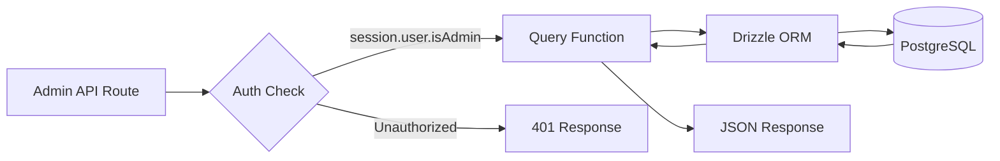
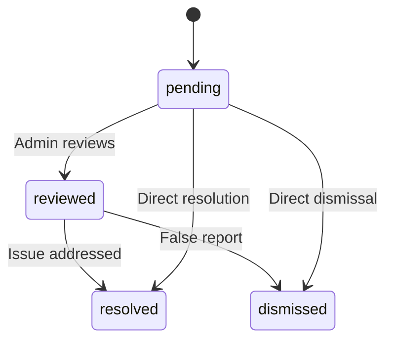

# Admin-Datenbankabfragen

Admin-Abfragen kümmern sich um die Elementverwaltung, Benutzer-/Clientverwaltung, rollenbasierten Zugriff, Dashboard-Statistiken, Berichtsmoderation und Einstellungen. Diese Funktionen werden hauptsächlich von API-Routen unter `app/api/admin/` genutzt.

## Admin-Abfrageablauf



## Benutzerverwaltung (`user.queries.ts`)

### Kernfunktionen

|Funktion|Parameter|Rückgaben|Beschreibung|
|----------|-----------|---------|-------------|
|`getUserByEmail`|`email: string`|`Benutzer \|null`|Benutzer anhand der E-Mail-Adresse finden|
|`getUserById`|`id: string`|`Benutzer \|null`|Benutzer anhand des Primärschlüssels finden|
|`insertNewUser`|`user: NewUser`|`User[]`|Erstellen Sie einen neuen Benutzerdatensatz|
|`updateUserPassword`|`hash, userId`|`void`|Passwort-Hash aktualisieren|
|`updateUserVerification`|`email, verified`|`void`|Legen Sie den E-Mail-Bestätigungsstatus fest|
|`softDeleteUser`|`userId: string`|`void`|Vorläufiges Löschen (hängt `-deleted` an die E-Mail an)|
|`isUserAdmin`|`userId: string`|`boolean`|Überprüfen Sie die Administratorrolle über den Beitritt|

### Überprüfung der Administratorrolle

Die Funktion `isUserAdmin` führt einen Multi-Table-Join durch, um den Administratorstatus zu überprüfen:

```typescript
export async function isUserAdmin(userId: string): Promise<boolean> {
  const result = await db
    .select({ isAdmin: roles.isAdmin })
    .from(userRoles)
    .innerJoin(roles, eq(userRoles.roleId, roles.id))
    .where(and(
      eq(userRoles.userId, userId),
      eq(roles.isAdmin, true),
      eq(roles.status, 'active')
    ))
    .limit(1);

  return result.length > 0;
}
```

### Soft-Delete-Muster

Benutzer werden niemals physisch gelöscht. Durch das vorläufige Löschen wird die Benutzer-ID mit der E-Mail verknüpft, um die E-Mail-Adresse für die erneute Registrierung freizugeben:

```typescript
export async function softDeleteUser(userId: string) {
  return db
    .update(users)
    .set({
      deletedAt: sql`CURRENT_TIMESTAMP`,
      email: sql`CONCAT(email, '-', id, '-deleted')`
    })
    .where(eq(users.id, userId));
}
```

## Kundenverwaltung (`client.queries.ts`)

### Profil CRUD

|Funktion|Beschreibung|
|----------|-------------|
|`createClientProfile(data)`|Erstellen Sie ein Profil mit einem automatisch generierten eindeutigen Benutzernamen|
|`getClientProfileById(id)`|Nach Profil-ID abrufen|
|`getClientProfileByUserId(userId)`|Nach Benutzerreferenz abrufen|
|`getClientProfileByEmail(email)`|Über die Kontentabellensuche abrufen|
|`updateClientProfile(id, data)`|Teilweise Aktualisierung mit Zeitstempel|
|`deleteClientProfile(id)`|Hartes Löschen des Profildatensatzes|

### Admin-Dashboard-Daten

Die Funktion `getAdminDashboardData` ist für das Admin-Dashboard optimiert und gibt in einer minimalen Anzahl von Abfragen sowohl eine paginierte Kundenliste als auch umfassende Statistiken zurück:

```typescript
export async function getAdminDashboardData(params: {
  page: number;
  limit: number;
  search?: string;
  status?: string;
  plan?: string;
  accountType?: string;
  provider?: string;
  createdAfter?: Date;
  createdBefore?: Date;
}): Promise<{
  clients: ClientProfileWithAuth[];
  stats: { overview, byProvider, byPlan, byAccountType, activity, growth };
  pagination: { page, totalPages, total, limit };
}>
```

Die Funktion schließt Admin-Benutzer mithilfe eines LEFT JOIN + IS NULL-Musters von Kundeneinträgen aus:

```typescript
// Exclude admin users from client listing
.leftJoin(userRoles, eq(userRoles.userId, clientProfiles.userId))
.leftJoin(roles, and(eq(userRoles.roleId, roles.id), eq(roles.isAdmin, true)))
.where(isNull(roles.id))  // Only non-admin users
```

### Erweiterte Kundensuche

`advancedClientSearch` unterstützt komplexe Filterung nach mehreren Kriterien:

|Kategorie filtern|Parameter|
|----------------|------------|
|**Textsuche**|`search` (über Name, E-Mail, Benutzername, Unternehmen, Biografie, Jobtitel, Branche, Standort)|
|**Enum-Filter**|`status`, `plan`, `accountType`, `provider`|
|**Datumsbereiche**|`createdAfter`, `createdBefore`, `updatedAfter`, `updatedBefore`, `dateRange`|
|**Fachspezifisch**|`emailDomain`, `companySearch`, `locationSearch`, `industrySearch`|
|**Numerisch**|`minSubmissions`, `maxSubmissions`|
|**Boolescher Wert**|`hasAvatar`, `hasWebsite`, `hasPhone`, `emailVerified`, `twoFactorEnabled`|
|**Sortieren**|`sortBy` (erstellt am, aktualisiert am, Name, E-Mail, Firma, Gesamteinreichungen), `sortOrder`|

### Kundenstatistiken

`getEnhancedClientStats` gibt eine umfassende Aufschlüsselung zurück:

```typescript
{
  overview: { total, active, inactive, suspended, trial },
  byProvider: { credentials, google, github, facebook, twitter, linkedin, other },
  byPlan: { free: number, standard: number, premium: number },
  byAccountType: { individual, business, enterprise },
  activity: { newThisWeek, newThisMonth, activeThisWeek, activeThisMonth },
  growth: { weeklyGrowth, monthlyGrowth },
}
```

## Berichtsverwaltung (`report.queries.ts`)

### CRUD melden

|Funktion|Beschreibung|
|----------|-------------|
|`createReport(data)`|Erstellen Sie einen Inhaltsbericht (Artikel oder Kommentar)|
|`getReportById(id)`|Erhalten Sie einen Bericht mit Reporter- und Prüferdetails|
|`getReports(params)`|Paginierte Berichtsliste mit Filtern|
|`updateReport(id, data)`|Status und Lösung aktualisieren, Überprüfungsnotizen hinzufügen|
|`getReportStats()`|Statistiken nach Status, Inhaltstyp, Grund|
|`hasUserReportedContent(reportedBy, contentType, contentId)`|Prüfung auf Duplikatberichte|

### Statusfluss melden



### Berichtsfilterung

Berichte unterstützen das Filtern nach Status, Inhaltstyp (Element/Kommentar) und Grund (Spam, Belästigung, unangemessen, andere):

```typescript
export async function getReports(params: {
  page?: number;
  limit?: number;
  search?: string;
  status?: ReportStatusValues;
  contentType?: ReportContentTypeValues;
  reason?: ReportReasonValues;
}): Promise<{
  reports: ReportWithReporter[];
  total: number;
  page: number;
  totalPages: number;
  limit: number;
}>
```

## Dashboard-Statistiken (`dashboard.queries.ts`)

### Verfügbare Metriken

|Funktion|Zweck|Verwendet in|
|----------|---------|---------|
|`getVotesReceivedCount(itemSlugs)`|Gesamtstimmenzahl für Artikel|Dashboard-Zusammenfassung|
|`getCommentsReceivedCount(itemSlugs)`|Gesamtzahl der Kommentare zu Artikeln|Dashboard-Zusammenfassung|
|`getUniqueItemsInteractedCount(clientId)`|Elemente, mit denen der Benutzer interagiert hat|Aktivitätsbereich|
|`getUserTotalActivityCount(clientId)`|Gesamtstimmen + Kommentare nach Benutzer|Aktivitätsbereich|
|`getWeeklyEngagementData(itemSlugs, weeks)`|Wöchentliche Abstimmungs-/Kommentartabelle|Engagement-Diagramm|
|`getDailyActivityData(clientId, itemSlugs, days)`|Aufschlüsselung der täglichen Aktivitäten|Aktivitätsdiagramm|
|`getTopItemsEngagement(itemSlugs, limit)`|Top-Artikel nach Engagement|Top-Elemente-Panel|

### Wöchentliche Engagement-Daten

Gibt nach ISO-Woche aggregierte Engagement-Daten zurück, die dem `to_char(date, 'IYYY-IW')`-Format von PostgreSQL entsprechen:

```typescript
const weeklyVotes = await db
  .select({
    week: sql<string>`to_char(${votes.createdAt}, 'IYYY-IW')`.as('week'),
    count: count(),
  })
  .from(votes)
  .where(and(inArray(votes.itemId, itemSlugs), gte(votes.createdAt, startDate)))
  .groupBy(sql`to_char(${votes.createdAt}, 'IYYY-IW')`)
  .orderBy(sql`to_char(${votes.createdAt}, 'IYYY-IW')`);
```

## Authentifizierungstoken-Verwaltung (`auth.queries.ts`)

|Funktion|Beschreibung|
|----------|-------------|
|`getPasswordResetTokenByEmail(email)`|Finden Sie das Reset-Token per E-Mail|
|`getPasswordResetTokenByToken(token)`|Finden Sie das Reset-Token anhand der Token-Zeichenfolge|
|`deletePasswordResetToken(token)`|Entfernen Sie den verwendeten/abgelaufenen Token|
|`getVerificationTokenByEmail(email)`|Finden Sie das Verifizierungstoken per E-Mail|
|`getVerificationTokenByToken(token)`|Finden Sie das Verifizierungstoken anhand der Tokenzeichenfolge|
|`deleteVerificationToken(token)`|Entfernen Sie den verwendeten/abgelaufenen Token|

Alle Token-Funktionen folgen dem gleichen einfachen Muster der Feldauswahl mit `.limit(1)`.
