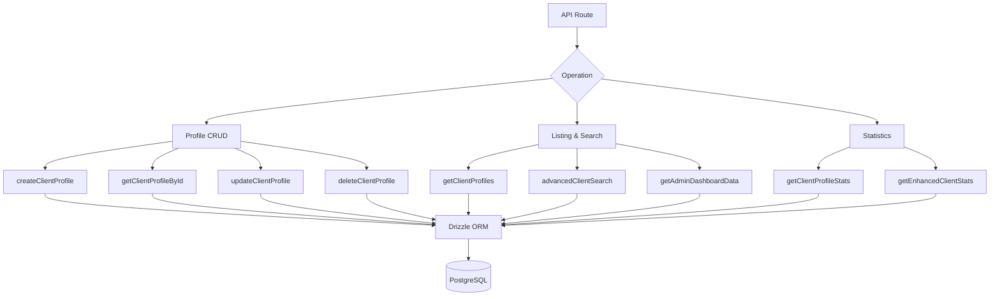

# Kundenbezogene Anfragen

Client-Abfragen übernehmen die Profilverwaltung, die Auflistung mit Authentifizierungsmetadaten, die erweiterte Suche nach mehreren Kriterien und umfassende Statistiken. Alle Funktionen befinden sich in `client.queries.ts` und werden sowohl von Administrator- als auch von clientseitigen API-Routen genutzt.

## Client-Abfragearchitektur



## Profil CRUD

### Profil erstellen

Neue Profile generieren automatisch eindeutige Benutzernamen aus der E-Mail-Adresse, wenn kein Benutzername angegeben wird:

```typescript
export async function createClientProfile(data: {
  userId: string;
  email: string;
  name: string;
  displayName?: string;
  username?: string;
  bio?: string;
  jobTitle?: string;
  company?: string;
  status?: string;
  plan?: string;
  accountType?: string;
}): Promise<ClientProfile>
```

Logik zur Generierung von Benutzernamen:

1. Wenn `username` angegeben wird, normalisieren und stellen Sie die Eindeutigkeit sicher
2. Andernfalls extrahieren Sie den Benutzernamen aus der E-Mail über `extractUsernameFromEmail()`
3. Fallback: Präfix `user<timestamp>` generieren
4. Alle Pfade verlaufen über `ensureUniqueUsername()`, das bei Bedarf numerische Suffixe anhängt

Bei der Erstellung angewendete Standardwerte:

|Feld|Standard|
|-------|---------|
|`displayName`|Gleich wie `name`|
|`bio`|`"Welcome! I'm a new user on this platform."`|
|`jobTitle`|`"User"`|
|`company`|`"Unknown"`|
|`status`|`"active"`|
|`plan`|`"free"`|
|`accountType`|`"individual"`|

### Lesevorgänge

|Funktion|Nachschlagefeld|Rückgaben|
|----------|-------------|---------|
|`getClientProfileById(id)`|`clientProfiles.id`|`ClientProfile \|null`|
|`getClientProfileByUserId(userId)`|`clientProfiles.userId`|`ClientProfile \|null`|
|`getClientProfileByEmail(email)`|Über die Tabelle `accounts`|`ClientProfile \|null`|

Die E-Mail-basierte Suche wird durch die Tabelle `accounts` aufgelöst, um das zugehörige `userId` zu finden, und fragt dann `clientProfiles` ab:

```typescript
export async function getClientProfileByEmail(email: string): Promise<ClientProfile | null> {
  const account = await getClientAccountByEmail(email);
  if (!account) return null;
  const [profile] = await db
    .select()
    .from(clientProfiles)
    .where(eq(clientProfiles.userId, account.userId))
    .limit(1);
  return profile || null;
}
```

### Aktualisieren und löschen

- **`updateClientProfile(id, data)`** – Teilweise Aktualisierung mit automatischem `updatedAt` Zeitstempel
- **`deleteClientProfile(id)`** – Hard delete (gibt booleschen Erfolg zurück)

## Paginierte Auflistung

`getClientProfiles` gibt paginierte Ergebnisse mit Authentifizierungsanbieterdaten zurück, ausgenommen Admin-Benutzer:

```typescript
export async function getClientProfiles(params: {
  page?: number;
  limit?: number;
  search?: string;
  status?: string;
  plan?: string;
  accountType?: string;
  provider?: string;
}): Promise<{
  profiles: ClientProfileWithAuth[];
  total: number;
  page: number;
  totalPages: number;
  limit: number;
}>
```

### Administrator-Ausschlussmuster

Sowohl die Zählabfrage als auch die Datenabfrage verwenden ein LEFT JOIN + IS NULL-Muster, um Administratorbenutzer auszuschließen:

```typescript
.leftJoin(userRoles, eq(userRoles.userId, clientProfiles.userId))
.leftJoin(roles, and(eq(userRoles.roleId, roles.id), eq(roles.isAdmin, true)))
.where(isNull(roles.id))  // Only non-admin users
```

### Anbieter-Unterabfrage

Um doppelte Zeilen zu vermeiden, wenn ein Benutzer über mehrere Authentifizierungskonten verfügt, wird der Anbieter über eine skalare Unterabfrage aufgelöst:

```typescript
accountProvider: sql<string>`coalesce(
  (SELECT provider FROM ${accounts}
   WHERE ${accounts.userId} = ${clientProfiles.userId}
   LIMIT 1),
  'unknown'
)`
```

### Suchfilter

Die Textsuche verwendet `ILIKE` über mehrere Felder hinweg mit SQL-Injection-Verhinderung:

```typescript
const escapedSearch = search
  .replace(/\\/g, '\\\\')
  .replace(/[%_]/g, '\\$&');

whereConditions.push(
  sql`(${clientProfiles.username} ILIKE ${`%${escapedSearch}%`} OR
       ${clientProfiles.displayName} ILIKE ${`%${escapedSearch}%`} OR
       ${clientProfiles.company} ILIKE ${`%${escapedSearch}%`} OR
       ${clientProfiles.name} ILIKE ${`%${escapedSearch}%`} OR
       ${clientProfiles.email} ILIKE ${`%${escapedSearch}%`})`
);
```

## Erweiterte Kundensuche

`advancedClientSearch` unterstützt über 20 Filterkriterien in mehreren Kategorien:

|Kategorie filtern|Parameter|
|----------------|------------|
|**Textsuche**|`search` (über Name, E-Mail, Benutzername, Unternehmen, Biografie, Jobtitel, Branche, Standort)|
|**Enum-Filter**|`status`, `plan`, `accountType`, `provider`|
|**Datumsbereiche**|`createdAfter`, `createdBefore`, `updatedAfter`, `updatedBefore`, `dateRange`|
|**Fachspezifisch**|`emailDomain`, `companySearch`, `locationSearch`, `industrySearch`|
|**Numerisch**|`minSubmissions`, `maxSubmissions`|
|**Boolescher Wert**|`hasAvatar`, `hasWebsite`, `hasPhone`, `emailVerified`, `twoFactorEnabled`|
|**Sortieren**|`sortBy`, `sortOrder`|

## Kundenstatistiken

### Grundlegende Statistiken

`getClientProfileStats` gibt einfache Zählungen zurück:

```typescript
{
  total: number;
  active: number;
  inactive: number;
  byPlan: Record<string, number>;
  byAccountType: Record<string, number>;
}
```

### Erweiterte Statistiken

`getEnhancedClientStats` bietet eine umfassende mehrdimensionale Aufschlüsselung:

```typescript
{
  overview: { total, active, inactive, suspended, trial },
  byProvider: { credentials, google, github, facebook, twitter, linkedin, other },
  byPlan: { free: number, standard: number, premium: number },
  byAccountType: { individual, business, enterprise },
  activity: { newThisWeek, newThisMonth, activeThisWeek, activeThisMonth },
  growth: { weeklyGrowth, monthlyGrowth },
}
```

Die erweiterten Statistiken verwenden `countDistinct` mit Multi-Table-Joins, um genaue Zählungen zu erstellen, selbst wenn Benutzer über mehrere Kontoanbieter verfügen:

```typescript
const statsResult = await db
  .select({
    status: clientProfiles.status,
    plan: clientProfiles.plan,
    accountType: clientProfiles.accountType,
    provider: accounts.provider,
    count: countDistinct(clientProfiles.id)
  })
  .from(clientProfiles)
  .leftJoin(accounts, eq(clientProfiles.userId, accounts.userId))
  .leftJoin(userRoles, eq(userRoles.userId, clientProfiles.userId))
  .leftJoin(roles, and(eq(userRoles.roleId, roles.id), eq(roles.isAdmin, true)))
  .where(isNull(roles.id))
  .groupBy(
    clientProfiles.status,
    clientProfiles.plan,
    clientProfiles.accountType,
    accounts.provider
  );
```

### Aktivitätsmetriken

Aktivitätsfenster werden mithilfe der Datumsarithmetik berechnet:

```typescript
const oneWeekAgo = new Date(now.getTime() - 7 * 24 * 60 * 60 * 1000);
const oneMonthAgo = new Date(now.getTime() - 30 * 24 * 60 * 60 * 1000);
```

Wachstumsraten sind vereinfachte Prozentsätze der Neuzulassungen im Verhältnis zur Gesamtzahl:

```typescript
const weeklyGrowth = total > 0 ? Math.round((newThisWeek / total) * 100) : 0;
```

## Typen

Alle Client-Abfragetypen sind in `lib/db/queries/types.ts` definiert:

```typescript
export type ClientProfileWithAuth = ClientProfile & {
  accountProvider: string;
  isActive: boolean;
};

export type ClientStatus = "active" | "inactive" | "suspended" | "trial";
export type ClientPlan = "free" | "standard" | "premium";
export type ClientAccountType = "individual" | "business" | "enterprise";
```
