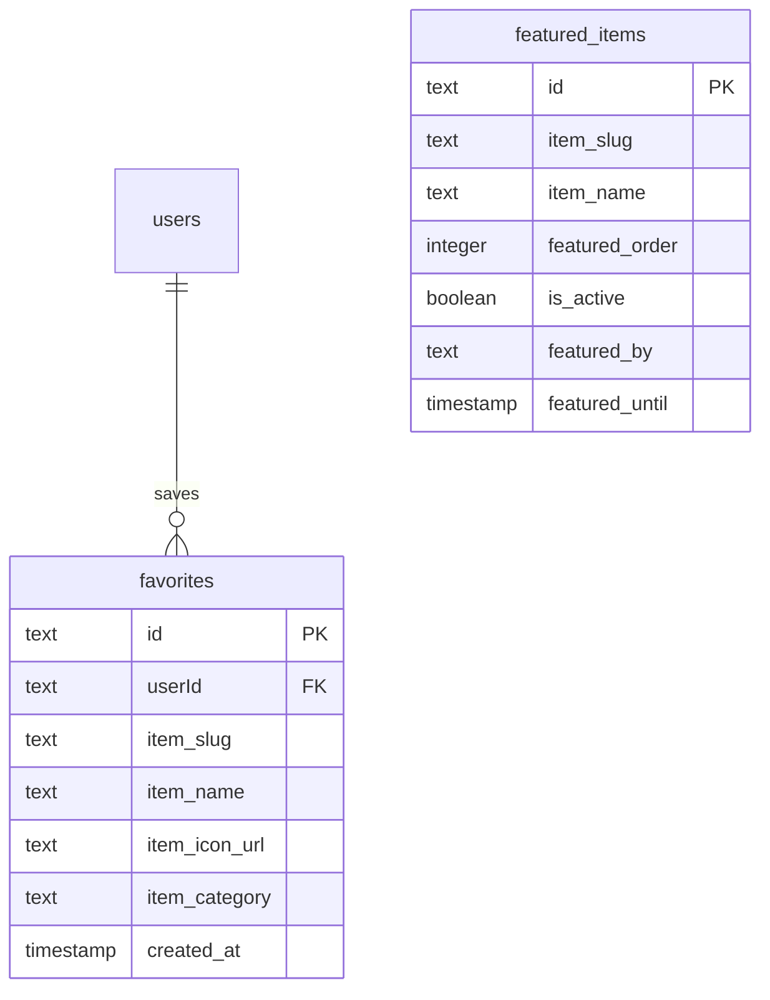

# Favoriten & Sammlungen Schema Deep Dive

## Übersicht

Die Ever Works-Vorlage implementiert ein **Favoritensystem**, das als Benutzererfassungsmechanismus dient. Es gibt keine separate `collections`-Tabelle – die Benutzerkuratierung von Elementen erfolgt über die `favorites`-Tabelle, in der vom Benutzer gespeicherte Elemente mit denormalisierten Metadaten für eine effiziente Anzeige gespeichert werden. Für vom Administrator kuratierte Sammlungen stellt die Tabelle `featured_items` einen verwalteten Satz hervorgehobener Elemente bereit.

**Quelldatei:** `template/lib/db/schema.ts`
**Beziehungsdatei:** `template/lib/db/migrations/relations.ts`

---

## Table: `favorites`

User-created bookmark/collection of items. Each user can save items to their personal favorites list.

### Columns

| Column | DB Name | Type | Nullable | Default | Constraints |
|---|---|---|---|---|---|
| `id` | `id` | `text` | No | `crypto.randomUUID()` | Primary Key |
| `userId` | `userId` | `text` | No | - | FK -> `users.id` (CASCADE) |
| `itemSlug` | `item_slug` | `text` | No | - | Item identifier |
| `itemName` | `item_name` | `text` | No | - | Denormalized display name |
| `itemIconUrl` | `item_icon_url` | `text` | Yes | - | Denormalized icon URL |
| `itemCategory` | `item_category` | `text` | Yes | - | Denormalized category |
| `createdAt` | `created_at` | `timestamp` | No | `now()` | - |
| `updatedAt` | `updated_at` | `timestamp` | No | `now()` | - |

### Indexes

| Name | Columns | Type |
|---|---|---|
| `user_item_favorite_unique_idx` | `(userId, itemSlug)` | Unique |
| `favorites_user_id_idx` | `userId` | B-tree |
| `favorites_item_slug_idx` | `itemSlug` | B-tree |
| `favorites_created_at_idx` | `createdAt` | B-tree |

### Key Constraints

- **One favorite per user per item:** The unique composite index `user_item_favorite_unique_idx` on `(userId, itemSlug)` prevents duplicate favorites.
- **Cascade deletion:** When a user is deleted, all their favorites are automatically removed.

### TypeScript Types

```typescript
export type Favorite = typeof favorites.$inferSelect;
export type NewFavorite = typeof favorites.$inferInsert;
export type FavoriteWithUser = Favorite & {
    user: typeof users.$inferSelect;
};
```

---

## Tabelle: `featured_items`

Vom Administrator kuratierte Sammlung hervorgehobener Elemente. Unterstützt Bestellung, Aktivierung/Deaktivierung und optionalen zeitbasierten Ablauf.

### Spalten

|Spalte|DB-Name|Typ|Nullbar|Standard|Einschränkungen|
|---|---|---|---|---|---|
|`id`|`id`|`text`|Nein|`crypto.randomUUID()`|Primärschlüssel|
|`itemSlug`|`item_slug`|`text`|Nein| - |Artikelkennung|
|`itemName`|`item_name`|`text`|Nein| - |Denormalisiert|
|`itemIconUrl`|`item_icon_url`|`text`|Ja| - |Denormalisiert|
|`itemCategory`|`item_category`|`text`|Ja| - |Denormalisiert|
|`itemDescription`|`item_description`|`text`|Ja| - |Denormalisiert|
|`featuredOrder`|`featured_order`|`integer`|Nein| `0` |Sortierreihenfolge|
|`featuredUntil`|`featured_until`|`timestamp`|Ja| - |Automatisches Ablaufdatum|
|`isActive`|`is_active`|`boolean`|Nein|`true`|Aktives Umschalten|
|`featuredBy`|`featured_by`|`text`|Nein| - |Admin-Benutzer-ID|
|`featuredAt`|`featured_at`|`timestamp`|Nein|`now()`| - |
|`createdAt`|`created_at`|`timestamp`|Nein|`now()`| - |
|`updatedAt`|`updated_at`|`timestamp`|Nein|`now()`| - |

### Indizes

|Name|Spalten|Typ|
|---|---|---|
|`featured_items_item_slug_idx`|`itemSlug`|B-Baum|
|`featured_items_featured_order_idx`|`featuredOrder`|B-Baum|
|`featured_items_is_active_idx`|`isActive`|B-Baum|
|`featured_items_featured_at_idx`|`featuredAt`|B-Baum|
|`featured_items_featured_until_idx`|`featuredUntil`|B-Baum|

### TypeScript-Typen

```typescript
export type FeaturedItem = typeof featuredItems.$inferSelect;
export type NewFeaturedItem = typeof featuredItems.$inferInsert;
```

---

## Relations

```typescript
// From relations.ts
export const favoritesRelations = relations(favorites, ({ one }) => ({
    user: one(users, {
        fields: [favorites.userId],
        references: [users.id]
    }),
}));
```

---

## Beziehungsdiagramm



---

## Favorites vs. Featured Items

| Aspect | `favorites` | `featured_items` |
|---|---|---|
| **Created by** | End users | Admin users |
| **Per-user** | Yes (user-scoped) | No (global) |
| **Ordering** | By `createdAt` | By `featuredOrder` |
| **Expiration** | None | Optional `featuredUntil` |
| **Active toggle** | No (exists = active) | Yes (`isActive` flag) |
| **Foreign key** | `users.id` | None (stores admin ID as text) |

---

## Abfragebeispiele

### Artikel zu Favoriten hinzufügen

```typescript
import { db } from '@/lib/db/drizzle';
import { favorites } from '@/lib/db/schema';

await db.insert(favorites).values({
    userId,
    itemSlug: 'my-tool-slug',
    itemName: 'My Tool',
    itemIconUrl: '/icons/my-tool.png',
    itemCategory: 'Productivity',
}).onConflictDoNothing(); // Prevent duplicates
```

### Artikel aus Favoriten entfernen

```typescript
import { eq, and } from 'drizzle-orm';

await db
    .delete(favorites)
    .where(
        and(
            eq(favorites.userId, userId),
            eq(favorites.itemSlug, 'my-tool-slug')
        )
    );
```

### Überprüfen Sie, ob das Element zu den Favoriten gehört

```typescript
const isFavorited = await db
    .select({ id: favorites.id })
    .from(favorites)
    .where(
        and(
            eq(favorites.userId, userId),
            eq(favorites.itemSlug, 'my-tool-slug')
        )
    )
    .limit(1);
```

### Rufen Sie die Favoritenliste des Benutzers ab

```typescript
const userFavorites = await db
    .select()
    .from(favorites)
    .where(eq(favorites.userId, userId))
    .orderBy(desc(favorites.createdAt));
```

### Holen Sie sich die beliebtesten Artikel

```typescript
import { sql } from 'drizzle-orm';

const popular = await db
    .select({
        itemSlug: favorites.itemSlug,
        itemName: favorites.itemName,
        count: sql<number>`count(*)`,
    })
    .from(favorites)
    .groupBy(favorites.itemSlug, favorites.itemName)
    .orderBy(sql`count(*) desc`)
    .limit(10);
```

### Fügen Sie einen hervorgehobenen Artikel hinzu

```typescript
import { featuredItems } from '@/lib/db/schema';

await db.insert(featuredItems).values({
    itemSlug: 'premium-tool',
    itemName: 'Premium Tool',
    itemCategory: 'Productivity',
    featuredOrder: 1,
    isActive: true,
    featuredBy: adminUserId,
    featuredUntil: new Date('2025-12-31'),
});
```

### Erhalten Sie aktive vorgestellte Artikel (nicht abgelaufen)

```typescript
import { or, isNull, gte } from 'drizzle-orm';

const activeFeatured = await db
    .select()
    .from(featuredItems)
    .where(
        and(
            eq(featuredItems.isActive, true),
            or(
                isNull(featuredItems.featuredUntil),
                gte(featuredItems.featuredUntil, new Date())
            )
        )
    )
    .orderBy(asc(featuredItems.featuredOrder));
```

---

## Design Notes

- **Denormalized item data.** Both tables store `itemName`, `itemIconUrl`, and `itemCategory` directly rather than looking up the Git CMS at read time. This makes list queries fast but means data can become stale if items are renamed.
- **No collection grouping.** Unlike a full "collection" system with folders/lists, favorites is a flat list per user. Items can be filtered by `itemCategory` for grouping.
- **Featured items are global.** They appear the same for all users, unlike favorites which are per-user.
