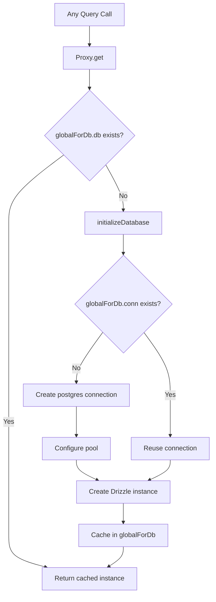

# Datenbankverbindung und Pooling

Die Vorlage verwendet `postgres.js` (das `postgres` npm-Paket) als PostgreSQL-Treiber mit Drizzle ORM. Die Verbindungsverwaltung erfolgt über ein verzögertes Initialisierungsmuster mit globalem Singleton-Caching, um den Hot Module Replacement (HMR) von Next.j in der Entwicklung zu überstehen.

## Verbindungsarchitektur



## Datenbank-Setup (`lib/db/drizzle.ts`)

### Verzögerte Initialisierung mit Proxy

Die Datenbankinstanz wird als `Proxy` exportiert, das die Verbindung beim ersten Zugriff initialisiert:

```typescript
export const db = new Proxy({} as ReturnType<typeof drizzle>, {
  get(target, prop) {
    const database = initializeDatabase();
    return database[prop as keyof typeof database];
  },
});
```

Dies gewährleistet:
- Zum Zeitpunkt des Imports wird keine Verbindung erstellt
- Skripte, die das Modul importieren, aber die Datenbank nicht abfragen, verursachen keinen Verbindungsaufwand
- Der erste tatsächliche Datenbankvorgang löst die Initialisierung aus

### Initialisierungsfunktion

```typescript
function initializeDatabase(): ReturnType<typeof drizzle> {
  if (!getDatabaseUrl()) {
    throw new Error('DATABASE_URL environment variable is required');
  }

  if (globalForDb.db) {
    return globalForDb.db;
  }

  const poolSize = getPoolSize();
  const conn = postgres(getDatabaseUrl()!, {
    max: poolSize,
    idle_timeout: 20,
    connect_timeout: 30,
    prepare: false,
    onnotice: getNodeEnv() === 'development' ? console.log : undefined,
  });

  globalForDb.conn = conn;
  globalForDb.db = drizzle(conn, { schema });
  return globalForDb.db;
}
```

### Verbindungsoptionen

|Option|Wert|Zweck|
|--------|-------|---------|
|`max`|Konfigurierbar (siehe Poolgröße)|Maximale Verbindungen im Pool|
|`idle_timeout`|`20` Sekunden|Schließen Sie inaktive Verbindungen nach dieser Zeit|
|`connect_timeout`|`30` Sekunden|Maximale Zeit zum Aufbau einer Verbindung|
|`prepare`|`false`|Vorbereitete Anweisungen deaktivieren (für einige PaaS-Umgebungen erforderlich)|
|`onnotice`|`console.log` (nur Entwickler)|Protokollieren Sie PostgreSQL-HINWEIS-Meldungen in der Entwicklung|

## Poolgröße

### Konfiguration

Die Poolgröße kann über die Umgebungsvariable `DB_POOL_SIZE` mit umgebungsbezogenen Standardwerten konfiguriert werden:

```typescript
const getPoolSize = (): number => {
  const envPoolSize = process.env.DB_POOL_SIZE;
  if (envPoolSize) {
    const parsed = parseInt(envPoolSize, 10);
    return isNaN(parsed) ? 20 : Math.max(1, Math.min(parsed, 50));
  }
  return getNodeEnv() === 'production' ? 20 : 10;
};
```

### Standardeinstellungen

|Umwelt|Standard-Poolgröße|Reichweite|
|-------------|------------------|-------|
|Produktion| 20 | 1 - 50 |
|Entwicklung| 10 | 1 - 50 |

Die Poolgröße liegt unabhängig vom konfigurierten Wert zwischen 1 und 50.

### Richtlinien zur Poolgröße

- **Entwicklung (10):** Ausreichend für einen einzelnen Entwickler mit HMR. Hält den Ressourcenverbrauch niedrig.
- **Produktion (20):** Verarbeitet gleichzeitige API-Anfragen. Erhöhung für Bereitstellungen mit hohem Datenverkehr.
- **Serverlos (1-5):** Verwenden Sie kleine Pools, wenn Sie auf serverlosen Plattformen bereitgestellt werden, auf denen jede Instanz ihren eigenen Pool erhält.

## Globales Singleton-Muster

### HMR-Sicherheit

Der Next.js-Entwicklungsmodus führt Module bei Dateiänderungen erneut aus. Ohne Schutz würde jeder HMR-Zyklus einen neuen Verbindungspool erstellen, wodurch die Datenbankverbindungen schnell erschöpft wären.

Die Vorlage hängt die Verbindung an `globalThis` an, um HMR zu überleben:

```typescript
const globalForDb = globalThis as unknown as {
  conn: postgres.Sql | undefined;
  db: ReturnType<typeof drizzle> | undefined;
};
```

Wenn ein Modul erneut ausgeführt wird:
1. `initializeDatabase()` Schecks `globalForDb.db`
2. Wenn die Instanz vorhanden ist, wird sie sofort zurückgegeben
3. Wenn die Verbindung vorhanden ist, die Drizzle-Instanz jedoch nicht, wird die vorhandene Verbindung wiederverwendet

Die Entwicklungsprotokollierung zeigt an, ob eine Verbindung wiederverwendet wurde:

```
Reusing existing database connection; pool size is unchanged
```

oder frisch erstellt:

```
Database connection established successfully with pool size: 10
```

### Direkter Instanzzugriff

Für Bibliotheken, die eine konkrete Drizzle-Instanz benötigen (z. B. der Auth.js-Adapter), wird eine Getter-Funktion bereitgestellt:

```typescript
export function getDrizzleInstance(): ReturnType<typeof drizzle> {
  return initializeDatabase();
}
```

## Konfigurationsmodul (`lib/db/config.ts`)

Ein skriptsicheres Konfigurationsmodul, das `server-only` **nicht** importiert, sodass es von Migrations- und Seed-Skripten verwendet werden kann:

```typescript
export function getDatabaseUrl(): string | undefined {
  return process.env.DATABASE_URL;
}

export function getNodeEnv(): 'development' | 'production' | 'test' {
  const env = process.env.NODE_ENV;
  if (env === 'production' || env === 'test') return env;
  return 'development';
}

export function isProduction(): boolean {
  return getNodeEnv() === 'production';
}
```

## Migrationsläufer (`lib/db/migrate.ts`)

Der Migration Runner ist idempotent und kann bei jedem Anwendungsstart sicher aufgerufen werden:

```typescript
export async function runMigrations(): Promise<boolean> {
  const { db } = await import('./drizzle');
  await migrate(db, { migrationsFolder: './lib/db/migrations' });
  return true;
}
```

Wichtige Verhaltensweisen:
- Drizzle verfolgt angewandte Migrationen in `drizzle.__drizzle_migrations`
- Bereits angewendete Migrationen werden automatisch übersprungen
- Gibt `true` bei Erfolg zurück, `false` bei Fehler (wird nicht ausgelöst)
- Protokolliert den Migrationsstatus vor und nach der Ausführung

## Umgebungsvariablen

|Variabel|Erforderlich|Standard|Beschreibung|
|----------|----------|---------|-------------|
|`DATABASE_URL`|Ja| -- |PostgreSQL-Verbindungszeichenfolge|
|`DB_POOL_SIZE`|Nein|`20` (Produkt) / `10` (Entwickler)|Verbindungspoolgröße (1–50)|
|`NODE_ENV`|Nein|`development`|Umgebung (Entwicklung/Produktion/Test)|

## Konfiguration des Nieselregen-Kits

Die Drizzle Kit-Konfiguration für die Schemagenerierung und Migrationsverwaltung:

```typescript
// drizzle.config.ts
export default {
  schema: "./lib/db/schema.ts",
  out: "./lib/db/migrations",
  dialect: "postgresql",
  dbCredentials: {
    url: process.env.DATABASE_URL,
  },
} satisfies Config;
```

## Fehlerbehebung

|Problem|Ursache|Lösung|
|-------|-------|----------|
|`DATABASE_URL is required`|Fehlende Umgebungsvariable|Setzen Sie `DATABASE_URL` in `.env.local`|
|Verbindungszeitüberschreitungen|Langsames Netzwerk oder überlastete Datenbank|Erhöhen Sie `connect_timeout` oder überprüfen Sie den DB-Zustand|
|Pool-Erschöpfung in Dev|HMR erstellt mehrere Pools|Stellen Sie sicher, dass das Muster `globalForDb` intakt ist|
|Pool-Erschöpfung in Produkt|Zu viele gleichzeitige Anfragen|`DB_POOL_SIZE` erhöhen (maximal 50)|
|`prepare` Fehler bei PaaS|PaaS pgBouncer im Transaktionsmodus|Behalten Sie `prepare: false`|
