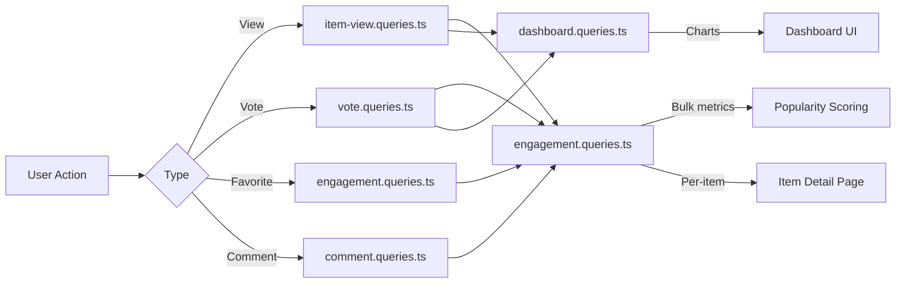

# Engagement- und Interaktionsanfragen

Interaktionsabfragen aggregieren Benutzerinteraktionen (Ansichten, Stimmen, Favoriten, Kommentare) über Elemente hinweg. Diese Abfragen ermöglichen die Sortierung nach Beliebtheit, Dashboard-Diagramme und Engagement-Panels pro Artikel. Die relevanten Module sind `engagement.queries.ts`, `vote.queries.ts`, `comment.queries.ts`, `item-view.queries.ts` und `dashboard.queries.ts`.

## Engagement-Datenfluss



## Massen-Engagement-Metriken (`engagement.queries.ts`)

### `getEngagementMetricsPerItem`

Die primäre Funktion für die Beliebtheitsbewertung. Gibt alle Interaktionsdimensionen für mehrere Elemente in einem einzigen parallelen Abfragebatch zurück:

```typescript
export async function getEngagementMetricsPerItem(
  itemSlugs: string[]
): Promise<Map<string, ItemEngagementMetrics>>
```

Rückgabetyp:

```typescript
export interface ItemEngagementMetrics {
  views: number;
  votes: number;       // Net votes (upvotes - downvotes)
  favorites: number;
  comments: number;
  avgRating: number;   // Average rating from comments (0-5)
}
```

### Parallele Abfragestrategie

Für maximalen Durchsatz werden vier unabhängige Abfragen über `Promise.all` ausgeführt:

```typescript
const [viewsData, votesData, favoritesData, commentsData] = await Promise.all([
  // 1. Views per item
  db.select({ itemId: itemViews.itemId, count: count() })
    .from(itemViews)
    .where(inArray(itemViews.itemId, itemSlugs))
    .groupBy(itemViews.itemId),

  // 2. Net votes per item (upvotes - downvotes)
  db.select({
      itemId: votes.itemId,
      netScore: sql<number>`SUM(CASE
        WHEN vote_type = 'upvote' THEN 1
        WHEN vote_type = 'downvote' THEN -1
        ELSE 0 END)`.as('netScore'),
    })
    .from(votes)
    .where(inArray(votes.itemId, itemSlugs))
    .groupBy(votes.itemId),

  // 3. Favorites per item
  db.select({ itemSlug: favorites.itemSlug, count: count() })
    .from(favorites)
    .where(inArray(favorites.itemSlug, itemSlugs))
    .groupBy(favorites.itemSlug),

  // 4. Comments count + average rating (excluding soft-deleted)
  db.select({
      itemId: comments.itemId,
      count: count(),
      avgRating: sql<number>`COALESCE(AVG(${comments.rating}), 0)`.as('avgRating'),
    })
    .from(comments)
    .where(and(inArray(comments.itemId, itemSlugs), isNull(comments.deletedAt)))
    .groupBy(comments.itemId),
]);
```

### Ergebnisnormalisierung

Jedes Abfrageergebnis wird in ein `Map` für die O(1)-Suche konvertiert und dann in der endgültigen Metrikkarte kombiniert:

```typescript
const viewsMap = new Map<string, number>(
  viewsData.map(v => [v.itemId, Number(v.count)])
);
// ... same for votesMap, favoritesMap, commentsMap

for (const slug of itemSlugs) {
  metricsMap.set(slug, {
    views: viewsMap.get(slug) ?? 0,
    votes: votesMap.get(slug) ?? 0,
    favorites: favoritesMap.get(slug) ?? 0,
    comments: commentsMap.get(slug)?.count ?? 0,
    avgRating: commentsMap.get(slug)?.avgRating ?? 0,
  });
}
```

### Eigenständige Metrikfunktionen

|Funktion|Rückgaben|Beschreibung|
|----------|---------|-------------|
|`getFavoritesPerItem(itemSlugs)`|`Map<string, number>`|Favoriten zählen pro Artikel|
|`getCommentsPerItem(itemSlugs)`|`Map<string, { count, avgRating }>`|Kommentaranzahl und durchschnittliche Bewertungen|

Beide Funktionen verwenden das gleiche Muster: frühe Rückgabe für leere Arrays, `groupBy` Aggregation, `Map` Konstruktion.

## Abstimmungsanfragen (`vote.queries.ts`)

### Wählen Sie CRUD

|Funktion|Beschreibung|
|----------|-------------|
|`createVote(vote)`|Erstellen Sie eine Abstimmung mit Slug-Normalisierung|
|`getVoteByUserIdAndItemId(userId, itemSlug)`|Überprüfen Sie die vorhandene Abstimmung|
|`deleteVote(voteId)`|Eine Abstimmung endgültig löschen|

Alle Abstimmungsfunktionen normalisieren Item-Slugs durch `getItemIdFromSlug()` vor der Abfrage.

### Berechnung des Nettoscores

Einzelelementbewertung mit bedingtem `SUM`:

```typescript
export async function getVoteCountForItem(itemSlug: string): Promise<number> {
  const itemId = getItemIdFromSlug(itemSlug);
  const [result] = await db
    .select({
      netScore: sql<number>`
        SUM(CASE
          WHEN vote_type = 'upvote' THEN 1
          WHEN vote_type = 'downvote' THEN -1
          ELSE 0
        END)`.as('netScore')
    })
    .from(votes)
    .where(eq(votes.itemId, itemId));
  return Number(result?.netScore ?? 0);
}
```

### Massenabstimmungsergebnisse

`getVotesPerItem` gibt einen `Map<string, number>` Netto-Scores für mehrere Elemente unter Verwendung von `inArray` und `groupBy` zurück.

### Nach Stimmen sortierte Elemente

```typescript
export async function getItemsSortedByVotes(limit = 10, offset = 0) {
  return db
    .select({
      itemId: votes.itemId,
      voteCount: sql<number>`count(${votes.id})`.as('vote_count')
    })
    .from(votes)
    .groupBy(votes.itemId)
    .orderBy(sql`vote_count DESC`)
    .limit(limit)
    .offset(offset);
}
```

## Kommentarabfragen (`comment.queries.ts`)

### Kommentar CRUD

|Funktion|Beschreibung|
|----------|-------------|
|`createComment(data)`|Erstellen Sie mit Slug-Normalisierung|
|`getCommentById(id)`|Roher Kommentardatensatz|
|`getCommentWithUserById(id)`|Kommentieren Sie mit dem Benutzerprofil beitreten|
|`updateComment(id, { content?, rating? })`|Aktualisierung mit `editedAt` Zeitstempel|
|`updateCommentRating(id, rating)`|Nur-Bewertungs-Update|
|`deleteComment(id)`|Vorläufiges Löschen (`deletedAt = new Date()`)|

### Kommentare mit Benutzerdaten

`getCommentsByItemId` verwendet ein `innerJoin` mit `clientProfiles`, um jeden Kommentar mit Autoreninformationen anzureichern:

```typescript
export async function getCommentsByItemId(itemSlug: string): Promise<CommentWithUser[]> {
  const itemId = getItemIdFromSlug(itemSlug);
  return db
    .select({
      id: comments.id,
      content: comments.content,
      rating: comments.rating,
      userId: comments.userId,
      itemId: comments.itemId,
      createdAt: comments.createdAt,
      updatedAt: comments.updatedAt,
      editedAt: comments.editedAt,
      deletedAt: comments.deletedAt,
      user: {
        id: clientProfiles.id,
        name: clientProfiles.name,
        email: clientProfiles.email,
        image: clientProfiles.avatar
      }
    })
    .from(comments)
    .innerJoin(clientProfiles, eq(comments.userId, clientProfiles.id))
    .where(and(eq(comments.itemId, itemId), isNull(comments.deletedAt)))
    .orderBy(desc(comments.createdAt));
}
```

## Tracking anzeigen (`item-view.queries.ts`)

### Tägliche Deduplizierung

Ansichten werden pro Betrachter, pro Element und pro UTC-Tag mithilfe des Upsert-Musters `onConflictDoNothing` dedupliziert:

```typescript
export async function recordItemView(
  view: Pick<NewItemView, 'itemId' | 'viewerId' | 'viewedDateUtc'>
): Promise<boolean> {
  const result = await db
    .insert(itemViews)
    .values(view)
    .onConflictDoNothing()
    .returning({ id: itemViews.id });
  return result.length > 0; // true = new view, false = duplicate
}
```

### Aggregationsfunktionen anzeigen

|Funktion|Parameter|Rückgaben|Beschreibung|
|----------|-----------|---------|-------------|
|`getTotalViewsCount(itemSlugs)`|`string[]`|`number`|Gesamtansichten aller Elemente|
|`getRecentViewsCount(itemSlugs, days)`|`string[], number`|`number`|Aufrufe in den letzten N Tagen|
|`getDailyViewsData(itemSlugs, days)`|`string[], number`|`Map<string, number>`|Der tägliche Aufruf zählt|
|`getViewsPerItem(itemSlugs)`|`string[]`|`Map<string, number>`|Anzahl der Aufrufe pro Element|

### UTC-Datumshelfer

Bei allen Datumsberechnungen wird UTC verwendet, um Zeitzonen-bezogene Abweichungsfehler zu vermeiden:

```typescript
function getUtcDateString(daysAgo: number = 0): string {
  const date = new Date();
  date.setUTCDate(date.getUTCDate() - daysAgo);
  return date.toISOString().split('T')[0]; // "YYYY-MM-DD"
}
```

## Dashboard-Statistiken (`dashboard.queries.ts`)

### Verfügbare Metriken

|Funktion|Zweck|
|----------|---------|
|`getVotesReceivedCount(itemSlugs)`|Gesamtstimmen zu den Artikeln des Benutzers|
|`getCommentsReceivedCount(itemSlugs)`|Gesamtzahl der Kommentare zu den Artikeln des Benutzers|
|`getUniqueItemsInteractedCount(clientId)`|Elemente, mit denen der Benutzer interagiert hat|
|`getUserTotalActivityCount(clientId)`|Gesamtstimmen + Kommentare nach Benutzer|
|`getWeeklyEngagementData(itemSlugs, weeks)`|Wöchentlich aggregierte Diagrammdaten|
|`getDailyActivityData(clientId, itemSlugs, days)`|Aufschlüsselung der täglichen Aktivitäten|
|`getTopItemsEngagement(itemSlugs, limit)`|Top-Artikel nach Engagement-Score|

### Wöchentliche Engagement-Aggregation

Verwendet PostgreSQLs `to_char` mit ISO-Wochenformat für eine konsistente Wocheneinteilung:

```typescript
const weeklyVotes = await db
  .select({
    week: sql<string>`to_char(${votes.createdAt}, 'IYYY-IW')`.as('week'),
    count: count(),
  })
  .from(votes)
  .where(and(inArray(votes.itemId, itemSlugs), gte(votes.createdAt, startDate)))
  .groupBy(sql`to_char(${votes.createdAt}, 'IYYY-IW')`)
  .orderBy(sql`to_char(${votes.createdAt}, 'IYYY-IW')`);
```

## Leistungsüberlegungen

- Alle Massenfunktionen akzeptieren Arrays und verwenden `inArray` für die Stapelverarbeitung
- Leere Array-Eingaben kehren vorzeitig zurück, ohne die Datenbank zu treffen
- `Promise.all` führt gleichzeitig unabhängige Aggregationen aus
- `Map` Datenstrukturen ermöglichen eine O(1)-Suche während der Ergebnisassemblierung
- Vorläufig gelöschte Kommentare werden über `isNull(comments.deletedAt)` in allen Aggregationen ausgeschlossen
