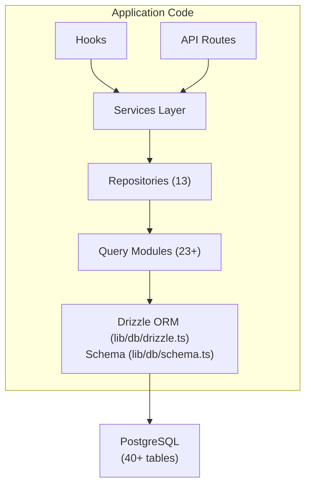

# Datenbankübersicht

Die Ever Works-Vorlage verwendet **Drizzle ORM** mit **PostgreSQL** als Datenbankschicht. Die Datenbank ist optional – die Anwendung kann bei reinen Inhaltsbereitstellungen ohne sie ausgeführt werden – sie unterstützt jedoch alle Benutzer-, Abonnement-, Engagement- und Administratorfunktionen.

## Technologie-Stack

|Komponente|Technologie|Zweck|
|-----------|-----------|---------|
|ORM|ORM darüber träufeln|Typsicherer Abfrage-Builder und Schemaverwaltung|
|Datenbank|PostgreSQL|Primäre relationale Datenbank|
|Fahrer|`postgres` (postgres.js)|PostgreSQL-Client für Node.js|
|Migrationen|Nieselregen-Set|Generierung und Ausführung der Schemamigration|
|Aussaat|`drizzle-seed` + benutzerdefinierte Skripte|Datenbankinitialisierung mit Standarddaten|

## Datenbankarchitektur



## Konfiguration

### Drizzle-Konfiguration (`drizzle.config.ts`)

```typescript
export default {
  schema: "./lib/db/schema.ts",
  out: "./lib/db/migrations",
  dialect: "postgresql",
  dbCredentials: {
    url: process.env.DATABASE_URL,
  },
} satisfies Config;
```

Die Konfiguration weist auf Folgendes hin:
- **Schemadatei**: `lib/db/schema.ts` – die einzige Quelle der Wahrheit für alle Tabellendefinitionen
- **Migrationsausgabe**: `lib/db/migrations/` – wo generierte SQL-Migrationsdateien gespeichert werden
- **Dialekt**: PostgreSQL
- **Verbindung**: Über die Umgebungsvariable `DATABASE_URL`

### Verbindungsverwaltung (`lib/db/drizzle.ts`)

Die Datenbankverbindung wird bei der ersten Verwendung verzögert initialisiert und verwendet Verbindungen bei Hot-Reloads in der Entwicklung über ein globales Singleton-Muster wieder.

Hauptmerkmale:
- **Verzögerte Initialisierung**: Die Datenbankverbindung wird erst erstellt, wenn die erste Abfrage ausgeführt wird
- **Proxy-basierter Zugriff**: Das exportierte `db`-Objekt verwendet ein JavaScript `Proxy`, um die Verbindung transparent zu initialisieren
- **Verbindungspooling**: Konfigurierbare Poolgröße über die Umgebungsvariable `DB_POOL_SIZE` (Standard: 20 in der Produktion, 10 in der Entwicklung, geklemmt 1-50)
- **Leerlaufzeitlimit**: Verbindungen werden nach 20 Sekunden Inaktivität freigegeben
- **Verbindungszeitlimit**: 30 Sekunden Zeitlimit für den Aufbau neuer Verbindungen
- **Singleton-Muster**: Verwendet `globalThis`, um Verbindungen über Next.js-Hot-Reloads hinweg beizubehalten

```typescript
// Usage - just import and use
import { db } from '@/lib/db/drizzle';

const users = await db.select().from(schema.users);
```

### Umgebungsvariablen

|Variabel|Erforderlich|Standard|Beschreibung|
|----------|----------|---------|-------------|
|`DATABASE_URL`|Nein| - |PostgreSQL-Verbindungszeichenfolge|
|`DB_POOL_SIZE`|Nein| 10/20 |Verbindungspoolgröße (Dev/Prod)|

Wenn `DATABASE_URL` nicht festgelegt ist, werden die Datenbankfunktionen stillschweigend deaktiviert, sodass die Anwendung im reinen Inhaltsmodus ausgeführt werden kann.

## Schemaübersicht

Das Datenbankschema ist in einer einzigen Datei (`lib/db/schema.ts`) definiert, die mehr als 40 Tabellen enthält, die nach Domäne organisiert sind:

|Domäne|Tische|Beschreibung|
|--------|--------|-------------|
|Benutzer und Auth| 8 |Benutzer, Konten, Sitzungen, Token, Authentifikatoren|
|Rollen und Berechtigungen| 3 |RBAC mit Rollen, Berechtigungen und Rollen-Berechtigungszuordnungen|
|Kundenprofile| 1 |Erweiterte Benutzerprofile für Kundenkonten|
|Content-Engagement| 4 |Kommentare, Stimmen, Favoriten, Artikelansichten|
|Abonnements| 4 |Pläne, Abonnementverlauf, Zahlungsanbieter, Zahlungskonten|
|Benachrichtigungen| 1 |In-App-Benachrichtigungssystem|
|Verwaltung und Moderation| 4 |Berichte, Moderationsverlauf, Artikelüberwachungsprotokolle, Aktivitätsprotokolle|
|Integrationen| 2 |CRM-Konfiguration, Integrationszuordnungen|
|Unternehmen| 2 |Unternehmen und Artikel-Unternehmensverbände|
|Sponsor-Anzeigen| 1 |Werbung für gesponserte Artikel|
|Umfragen| 2 |Umfragen und Umfrageantworten|
|Newsletter| 1 |Newsletter-Abonnements|
|System| 1 |Verfolgung des Saatgutstatus|

## Datenbankinitialisierung

Beim Start der Anwendung (über `instrumentation.ts`) führt die Vorlage automatisch Folgendes aus:

1. **Führt Migrationen aus**: Die Funktion `migrate()` von Drizzle wendet alle ausstehenden Migrationen an (idempotent – bereits angewendete Migrationen werden übersprungen)
2. **Seeds von Daten**: Wenn die Datenbank nicht geseedet wurde, wird das Seed-Skript mit beratendem Sperrschutz ausgeführt, um Race Conditions in Multiprozessbereitstellungen zu verhindern

Dies wird von `lib/db/initialize.ts` erledigt. Weitere Informationen finden Sie im [Migrationsleitfaden](./migrations-guide) und im [Datenbank-Seeding](./seeding).

## Schlüsselbefehle

```bash
# Generate a migration from schema changes
pnpm db:generate

# Run pending migrations
pnpm db:migrate

# Seed the database
pnpm db:seed

# Open Drizzle Studio (database GUI)
pnpm db:studio
```
