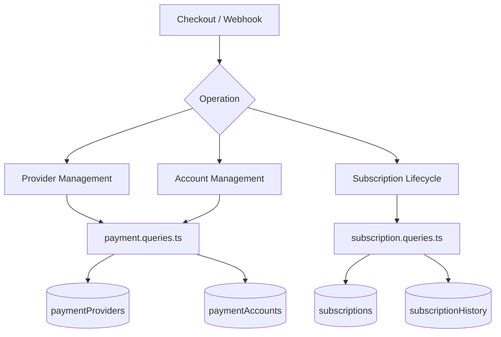
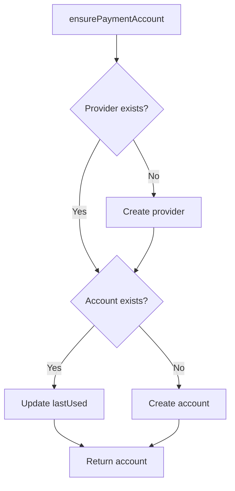
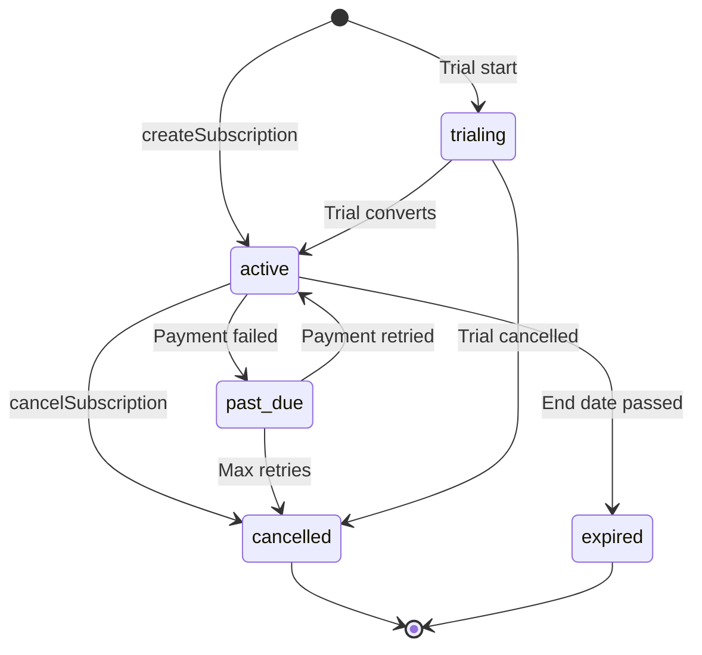

# Fragen zu Zahlungen und Abonnements

Zahlungsabfragen verwalten das Anbieterregister, Benutzerzahlungskonten und den gesamten Abonnementlebenszyklus. Die relevanten Module sind `payment.queries.ts` und `subscription.queries.ts`.

## Architektur des Zahlungssystems



## Anfragen zum Zahlungsanbieter (`payment.queries.ts`)

### Anbieter CRUD

|Funktion|Beschreibung|
|----------|-------------|
|`getPaymentProvider(id)`|Anbieter anhand der ID ermitteln|
|`getPaymentProviderByName(name)`|Rufen Sie den Anbieter nach Namen ab (z. B. `'stripe'`).|
|`getActivePaymentProviders()`|Listen Sie alle aktiven Anbieter auf, sortiert nach Namen|
|`createPaymentProvider(data)`|Erstellen Sie einen neuen Anbieterdatensatz|
|`updatePaymentProvider(id, data)`|Teilweise Aktualisierung der Anbieterfelder|
|`deactivatePaymentProvider(id)`|Stellen Sie `isActive = false` ein|

Unterstützte Anbieternamen: `stripe`, `lemonsqueezy`, `polar`, `solidgate`.

### Anfragen zu Zahlungskonten

Zahlungskonten verknüpfen einen Benutzer mit einer anbieterspezifischen Kunden-ID:

|Funktion|Beschreibung|
|----------|-------------|
|`getPaymentAccountByUserId(userId, providerId)`|Erhalten Sie ein Konto mit aktivem Anbietercheck|
|`getPaymentAccountByCustomerId(customerId, providerId)`|Reverse-Lookup nach Kunden-ID|
|`createPaymentAccount(data)`|Erstellen Sie ein Konto mit dem Zeitstempel `lastUsed`|
|`updatePaymentAccountLastUsed(accountId)`|Berühren Sie `lastUsed` Zeitstempel|
|`getUserPaymentAccountByProvider(userId, providerName)`|Suche nach Anbieternamen (Anbieter zuerst auflösen)|

### Aktive Anbietervalidierung

`getPaymentAccountByUserId` führt einen Triple Inner Join durch, um sicherzustellen, dass sowohl der Anbieter als auch der Benutzer gültig sind:

```typescript
export async function getPaymentAccountByUserId(
  userId: string,
  providerId: string
): Promise<PaymentAccount | null> {
  const result = await db
    .select({ /* payment account fields */ })
    .from(paymentAccounts)
    .innerJoin(paymentProviders, eq(paymentAccounts.providerId, paymentProviders.id))
    .innerJoin(users, eq(paymentAccounts.userId, users.id))
    .where(and(
      eq(paymentAccounts.userId, userId),
      eq(paymentAccounts.providerId, providerId),
      eq(paymentProviders.isActive, true)
    ))
    .limit(1);
  return result[0] || null;
}
```

### Stellen Sie sicher, dass das Zahlungskonto vorhanden ist

`ensurePaymentAccount` implementiert ein idempotentes Upsert-Muster für Zahlungskonten:



```typescript
export async function ensurePaymentAccount(
  providerName: string,
  userId: string,
  customerId: string,
  accountId?: string
): Promise<PaymentAccount>
```

### Richten Sie ein Benutzerzahlungskonto ein

`setupUserPaymentAccount` erweitert das Sicherstellungsmuster um die Erkennung von Kunden-ID-Änderungen:

```typescript
if (existingAccount.customerId !== customerId) {
  await db
    .update(paymentAccounts)
    .set({
      customerId,
      accountId: accountId || existingAccount.accountId,
      lastUsed: new Date(),
      updatedAt: new Date()
    })
    .where(eq(paymentAccounts.id, existingAccount.id));
}
```

### Komfort-Aliase

- `getOrCreatePaymentAccount` – Alias für `ensurePaymentAccount`
- `createOrGetPaymentAccount` – Alias für `setupUserPaymentAccount`

## Abonnementabfragen (`subscription.queries.ts`)

### Abonnementsuche

|Funktion|Parameter|Rückgaben|
|----------|-----------|---------|
|`getUserActiveSubscription(userId)`|Benutzer-ID|Aktives Abonnement oder null|
|`getUserSubscriptions(userId)`|Benutzer-ID|Alle Abonnements (sortiert nach Datum)|
|`getSubscriptionByProviderSubscriptionId(provider, subId)`|Anbieter + Sub-ID|Abonnement oder null|
|`getSubscriptionByUserIdAndSubscriptionId(userId, subId)`|Benutzer + Sub-ID|Abonnement oder null|
|`getSubscriptionWithUser(subId)`|Abonnement-ID|Abonnement mit Benutzerbeitritt|
|`hasActiveSubscription(userId)`|Benutzer-ID|Boolescher Wert|

### Abonnementlebenszyklus

#### Erstellen

```typescript
export async function createSubscription(data: NewSubscription): Promise<Subscription> {
  const result = await db
    .insert(subscriptions)
    .values({ ...data, createdAt: new Date(), updatedAt: new Date() })
    .returning();
  return result[0];
}
```

#### Aktualisierungsstatus

Statusänderungen setzen automatisch `cancelledAt` und `cancelReason` beim Übergang zu `CANCELLED`:

```typescript
export async function updateSubscriptionStatus(
  subscriptionId: string,
  status: string,
  reason?: string
): Promise<Subscription | null>
```

#### Abbrechen

Unterstützt sowohl die sofortige Stornierung als auch die Stornierung am Ende des Zeitraums:

```typescript
export async function cancelSubscription(
  subscriptionId: string,
  reason?: string,
  cancelAtPeriodEnd: boolean = false
): Promise<Subscription | null>
```

Wenn `cancelAtPeriodEnd = true`, bleibt der Status `ACTIVE`, aber `cancelledAt` und `cancelAtPeriodEnd` werden gesetzt.

### Abonnementstatusfluss



### Planauflösung

`getUserPlan` prüft den Ablauf des Abonnements und greift auf den kostenlosen Plan zurück:

```typescript
export async function getUserPlan(userId: string): Promise<string> {
  const subscription = await getUserActiveSubscription(userId);
  if (!subscription) return PaymentPlan.FREE;
  return getEffectivePlan(subscription.planId, subscription.endDate, subscription.status);
}
```

`getUserPlanWithExpiration` gibt die vollständigen Ablaufdetails zurück:

```typescript
{
  planId: string;         // Stored plan
  effectivePlan: string;  // Actual plan after expiration check
  isExpired: boolean;
  expiresAt: Date | null;
  status: string | null;
  subscriptionId: string | null;
}
```

### Ablauf und Erneuerung

|Funktion|Beschreibung|
|----------|-------------|
|`getSubscriptionsExpiringSoon(days)`|Aktive Abonnements, die innerhalb von N Tagen ablaufen|
|`getExpiredSubscriptions()`|Abonnements haben ihr Enddatum überschritten|
|`getSubscriptionsForRenewalReminder(days)`|Abonnements, für die eine Verlängerungsmitteilung erforderlich ist|

### Abonnementverlauf

Änderungen werden in der Tabelle `subscriptionHistory` protokolliert:

```typescript
export async function logSubscriptionHistory(data: NewSubscriptionHistory)
export async function getSubscriptionHistory(subscriptionId: string)
```

### Subscription Statistics

`getSubscriptionStats` gibt aggregierte Anzahlen zurück:

```typescript
{
  total: number;
  active: number;
  cancelled: number;
  expired: number;
  pastDue: number;
  trialing: number;
}
```

## Schema Constants

```typescript
// lib/db/schema.ts
export const SubscriptionStatus = {
  ACTIVE: 'active',
  CANCELLED: 'cancelled',
  EXPIRED: 'expired',
  PAST_DUE: 'past_due',
  TRIALING: 'trialing',
} as const;

// lib/constants/payment.ts
export const PaymentPlan = {
  FREE: 'free',
  STANDARD: 'standard',
  PREMIUM: 'premium',
} as const;

export const PaymentProvider = {
  STRIPE: 'stripe',
  LEMONSQUEEZY: 'lemonsqueezy',
  POLAR: 'polar',
  SOLIDGATE: 'solidgate',
} as const;
```
