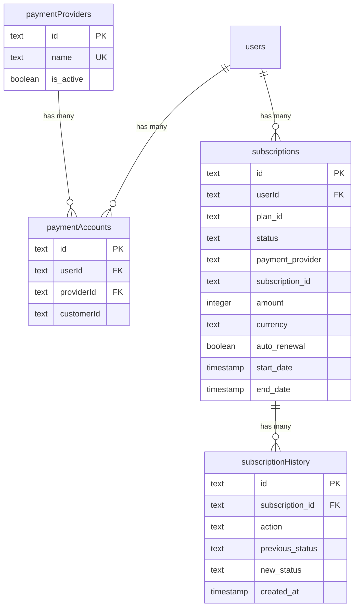
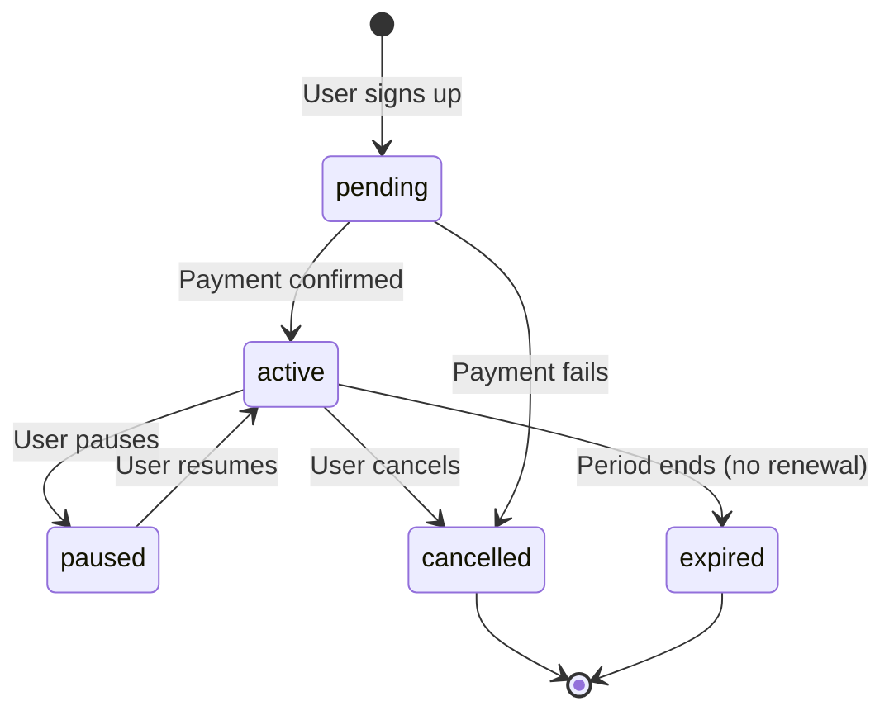

# Deep Dive zum Zahlungs- und Abonnementschema

## Übersicht

Das Zahlungsmodul verwaltet den gesamten Abonnementlebenszyklus: Zahlungsanbieter, Kundenkonten, Abonnements mit Testunterstützung, automatische Verlängerungsverwaltung und ein vollständiges Prüfprotokoll für den Abonnementverlauf. Das System unterstützt mehrere Zahlungsanbieter (Stripe, Solidgate, LemonSqueezy, Polar).

**Quelldatei:** `template/lib/db/schema.ts`
**Konstanten:** `template/lib/constants/payment.ts`
**Beziehungsdatei:** `template/lib/db/migrations/relations.ts`

---

## Tables in This Module

| Table | Purpose |
|---|---|
| `paymentProviders` | Registry of available payment providers |
| `paymentAccounts` | Links users to their payment provider customer IDs |
| `subscriptions` | Active and historical subscription records |
| `subscriptionHistory` | Audit trail of subscription lifecycle events |

---

## Tabelle: `paymentProviders`

Verzeichnis der unterstützten Zahlungsanbieter.

### Spalten

|Spalte|DB-Name|Typ|Nullbar|Standard|Einschränkungen|
|---|---|---|---|---|---|
|`id`|`id`|`text`|Nein|`crypto.randomUUID()`|Primärschlüssel|
|`name`|`name`|`text`|Nein|`'stripe'`|Einzigartig|
|`isActive`|`is_active`|`boolean`|Nein|`true`| - |
|`createdAt`|`created_at`|`timestamp`|Nein|`now()`| - |
|`updatedAt`|`updated_at`|`timestamp`|Nein|`now()`| - |

### Indizes

|Name|Spalten|Typ|
|---|---|---|
|`paymentProviders_name_unique`|`name`|Einzigartig|
|`payment_provider_active_idx`|`isActive`|B-Baum|
|`payment_provider_created_at_idx`|`createdAt`|B-Baum|

### Unterstützte Anbieter (Enum)

```typescript
export enum PaymentProvider {
    STRIPE = 'stripe',
    SOLIDGATE = 'solidgate',
    LEMONSQUEEZY = 'lemonsqueezy',
    POLAR = 'polar'
}
```

---

## Table: `paymentAccounts`

Links users to their external payment provider customer accounts.

### Columns

| Column | DB Name | Type | Nullable | Default | Constraints |
|---|---|---|---|---|---|
| `id` | `id` | `text` | No | `crypto.randomUUID()` | Primary Key |
| `userId` | `userId` | `text` | No | - | FK -> `users.id` (CASCADE) |
| `providerId` | `providerId` | `text` | No | - | FK -> `paymentProviders.id` (CASCADE) |
| `customerId` | `customerId` | `text` | No | - | External customer ID |
| `accountId` | `accountId` | `text` | Yes | - | Optional account identifier |
| `lastUsed` | `lastUsed` | `timestamp` | Yes | - | - |
| `createdAt` | `created_at` | `timestamp` | No | `now()` | - |
| `updatedAt` | `updated_at` | `timestamp` | No | `now()` | - |

### Indexes

| Name | Columns | Type |
|---|---|---|
| `user_provider_unique_idx` | `(userId, providerId)` | Unique |
| `customer_provider_unique_idx` | `(customerId, providerId)` | Unique |
| `payment_account_customer_id_idx` | `customerId` | B-tree |
| `payment_account_provider_idx` | `providerId` | B-tree |
| `payment_account_created_at_idx` | `createdAt` | B-tree |

### Key Constraints

- **One account per provider per user:** The `user_provider_unique_idx` ensures a user can only have one customer account per payment provider.
- **Unique customer IDs per provider:** The `customer_provider_unique_idx` ensures no duplicate customer IDs within a provider.

---

## Tabelle: `subscriptions`

Die zentrale Abonnementtabelle mit umfassender Unterstützung für Testversionen, automatische Verlängerung, Kündigung und Abrechnung über mehrere Anbieter.

### Spalten

|Spalte|DB-Name|Typ|Nullbar|Standard|Einschränkungen|
|---|---|---|---|---|---|
|`id`|`id`|`text`|Nein|`crypto.randomUUID()`|Primärschlüssel|
|`userId`|`userId`|`text`|Nein| - |FK -> `users.id` (KASKADE)|
|`planId`|`plan_id`|`text`|Nein|`'free'`|Plan-ID|
|`status`|`status`|`text`|Nein|`'pending'`|Abonnementstatus|
|`startDate`|`start_date`|`timestamp`|Nein|`now()`| - |
|`endDate`|`end_date`|`timestamp`|Ja| - | - |
|`paymentProvider`|`payment_provider`|`text`|Nein|`'stripe'`| - |
|`subscriptionId`|`subscription_id`|`text`|Ja| - |Externe Abonnement-ID|
|`invoiceId`|`invoice_id`|`text`|Ja| - |Externe Rechnungs-ID|
|`amountDue`|`amount_due`|`integer`|Ja| `0` |In Cent|
|`amountPaid`|`amount_paid`|`integer`|Ja| `0` |In Cent|
|`priceId`|`price_id`|`text`|Ja| - |Externe Preis-ID|
|`customerId`|`customer_id`|`text`|Ja| - |Externe Kunden-ID|
|`currency`|`currency`|`text`|Ja|`'usd'`|ISO-Währungscode|
|`amount`|`amount`|`integer`|Ja| `0` |In Cent|
|`interval`|`interval`|`text`|Ja|`'month'`|Abrechnungsintervall|
|`intervalCount`|`interval_count`|`integer`|Ja| `1` | - |
|`trialStart`|`trial_start`|`timestamp`|Ja| - | - |
|`trialEnd`|`trial_end`|`timestamp`|Ja| - | - |
|`autoRenewal`|`auto_renewal`|`boolean`|Ja|`true`| - |
|`renewalReminderSent`|`renewal_reminder_sent`|`boolean`|Ja|`false`| - |
|`lastRenewalAttempt`|`last_renewal_attempt`|`timestamp (tz)`|Ja| - | - |
|`failedPaymentCount`|`failed_payment_count`|`integer`|Ja| `0` | - |
|`cancelledAt`|`cancelled_at`|`timestamp`|Ja| - | - |
|`cancelAtPeriodEnd`|`cancel_at_period_end`|`boolean`|Ja|`false`| - |
|`cancelReason`|`cancel_reason`|`text`|Ja| - | - |
|`hostedInvoiceUrl`|`hosted_invoice_url`|`text`|Ja| - | - |
|`invoicePdf`|`invoice_pdf`|`text`|Ja| - | - |
|`metadata`|`metadata`|`text`|Ja| - |JSON-Zeichenfolge|
|`createdAt`|`created_at`|`timestamp`|Nein|`now()`| - |
|`updatedAt`|`updated_at`|`timestamp`|Nein|`now()`| - |

### Indizes

|Name|Spalten|Typ|
|---|---|---|
|`user_subscription_idx`|`userId`|B-Baum|
|`subscription_status_idx`|`status`|B-Baum|
|`provider_subscription_idx`|`(paymentProvider, subscriptionId)`|Einzigartig|
|`subscription_plan_idx`|`planId`|B-Baum|
|`subscription_created_at_idx`|`createdAt`|B-Baum|

### Überprüfen Sie die Einschränkungen

```sql
-- auto_renewal and cancel_at_period_end cannot both be true
CHECK (NOT (auto_renewal AND cancel_at_period_end))
```

### Statusaufzählung

```typescript
export const SubscriptionStatus = {
    ACTIVE: 'active',
    CANCELLED: 'cancelled',
    EXPIRED: 'expired',
    PENDING: 'pending',
    PAUSED: 'paused'
} as const;
```

### Enum planen

```typescript
export enum PaymentPlan {
    FREE = 'free',
    STANDARD = 'standard',
    PREMIUM = 'premium'
}
```

### TypeScript-Typen

```typescript
export type Subscription = typeof subscriptions.$inferSelect;
export type NewSubscription = typeof subscriptions.$inferInsert;
export type SubscriptionWithUser = Subscription & {
    user: typeof users.$inferSelect;
};
```

---

## Table: `subscriptionHistory`

Immutable audit trail of every subscription lifecycle event.

### Columns

| Column | DB Name | Type | Nullable | Default | Constraints |
|---|---|---|---|---|---|
| `id` | `id` | `text` | No | `crypto.randomUUID()` | Primary Key |
| `subscriptionId` | `subscription_id` | `text` | No | - | FK -> `subscriptions.id` (CASCADE) |
| `action` | `action` | `text` | No | - | Event description |
| `previousStatus` | `previous_status` | `text` | Yes | - | Status before change |
| `newStatus` | `new_status` | `text` | Yes | - | Status after change |
| `previousPlan` | `previous_plan` | `text` | Yes | - | Plan before change |
| `newPlan` | `new_plan` | `text` | Yes | - | Plan after change |
| `reason` | `reason` | `text` | Yes | - | - |
| `metadata` | `metadata` | `text` | Yes | - | JSON string |
| `createdAt` | `created_at` | `timestamp` | No | `now()` | - |

### Indexes

| Name | Columns | Type |
|---|---|---|
| `subscription_history_idx` | `subscriptionId` | B-tree |
| `subscription_action_idx` | `action` | B-tree |
| `subscription_history_created_at_idx` | `createdAt` | B-tree |

### TypeScript Types

```typescript
export type SubscriptionHistory = typeof subscriptionHistory.$inferSelect;
export type NewSubscriptionHistory = typeof subscriptionHistory.$inferInsert;
```

---

## Beziehungsdiagramm



---

## Subscription Lifecycle



---

## Abfragebeispiele

### Erhalten Sie ein aktives Abonnement für einen Benutzer

```typescript
import { db } from '@/lib/db/drizzle';
import { subscriptions } from '@/lib/db/schema';
import { eq, and } from 'drizzle-orm';

const activeSub = await db
    .select()
    .from(subscriptions)
    .where(
        and(
            eq(subscriptions.userId, userId),
            eq(subscriptions.status, 'active')
        )
    )
    .limit(1);
```

### Erstellen Sie ein neues Abonnement

```typescript
await db.insert(subscriptions).values({
    userId,
    planId: 'standard',
    status: 'active',
    paymentProvider: 'stripe',
    subscriptionId: stripeSubscription.id,
    customerId: stripeCustomer.id,
    priceId: stripePriceId,
    amount: 1999, // $19.99 in cents
    currency: 'usd',
    interval: 'month',
});
```

### Protokollieren Sie eine Abonnementänderung

```typescript
await db.insert(subscriptionHistory).values({
    subscriptionId: sub.id,
    action: 'plan_upgrade',
    previousStatus: 'active',
    newStatus: 'active',
    previousPlan: 'free',
    newPlan: 'standard',
    reason: 'User upgraded via billing page',
});
```

### Finden Sie ein Zahlungskonto anhand der Stripe-Kunden-ID

```typescript
import { paymentAccounts } from '@/lib/db/schema';

const account = await db
    .select()
    .from(paymentAccounts)
    .where(eq(paymentAccounts.customerId, stripeCustomerId))
    .limit(1);
```
