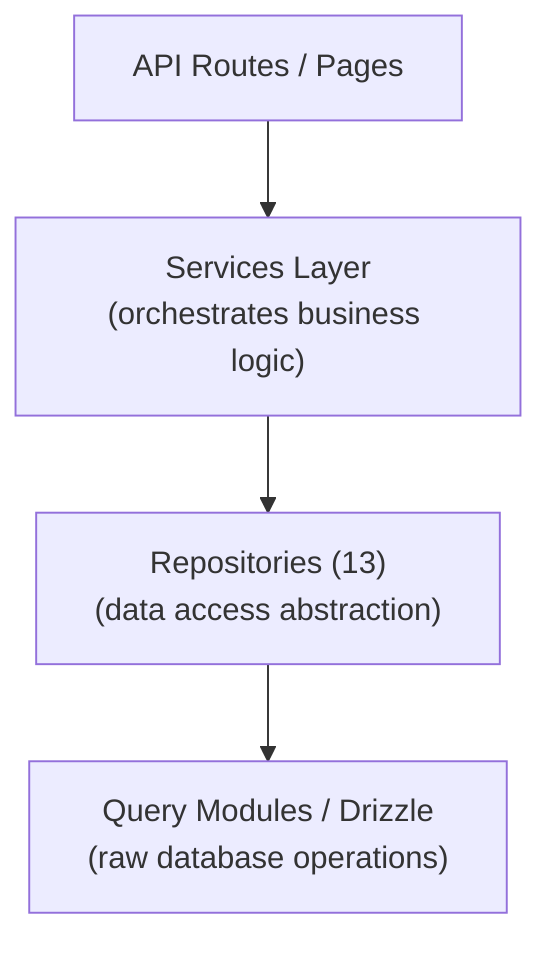

# Repository-Muster

Die Ever Works-Vorlage implementiert ein Repository-Muster durch 13 spezialisierte Repository-Klassen in `lib/repositories/`. Repositorys bieten eine Abstraktion auf höherer Ebene über reine Datenbankabfragen und kapseln komplexe Abfragelogik, Geschäftsregeln und Datentransformation.

## Architektur



## Repository-Liste

|Repository|Datei|Domäne|
|------------|------|--------|
|Admin Analytics (optimiert)|`admin-analytics-optimized.repository.ts`|Admin-Analyse mit Leistungsoptimierung|
|Admin-Statistiken|`admin-stats.repository.ts`|Statistiken zum Admin-Dashboard|
|Kategorie|`category.repository.ts`|Kategoriemanagement|
|Kunden-Dashboard|`client-dashboard.repository.ts`|Client-Dashboard-Vorgänge|
|Kundenartikel|`client-item.repository.ts`|Übermittlung von Kundenartikeln|
|Sammlung|`collection.repository.ts`|Sammlungsverwaltung|
|Integrationszuordnung|`integration-mapping.repository.ts`|CRM-Integrationszuordnungen|
|Artikel|`item.repository.ts`|Artikeloperationen|
|Rolle|`role.repository.ts`|Rollenmanagement|
|Sponsor-Anzeige|`sponsor-ad.repository.ts`|Gesponserte Anzeigenverwaltung|
|Etikett|`tag.repository.ts`|Tag-Verwaltung|
|Zwanzig CRM-Konfiguration|`twenty-crm-config.repository.ts`|CRM-Konfiguration|
|Benutzer|`user.repository.ts`|Benutzerverwaltung|

## Git-basiertes Content-Repository (`lib/repository.ts`)

Zusätzlich zu den Datenbank-Repositorys enthält die Vorlage ein Git-basiertes Inhalts-Repository unter `lib/repository.ts`. Dies behandelt die Git-CMS-Vorgänge:

- Klonen Sie das Inhalts-Repository von der URL `DATA_REPOSITORY`
- Inhalte mit Upstream synchronisieren (Pull/Push mit Konflikterkennung)
- Verfolgen Sie lokale Änderungen und übernehmen Sie sie
- Timeout-Schutz für Git-Vorgänge (120-Sekunden-Timeout)

Dies unterscheidet sich von den Datenbank-Repositorys und verwaltet das Verzeichnis `.content/`, das von der Inhaltsschicht verwendet wird.

## Repository-Details

### admin-analytics-optimized.repository.ts

Leistungsoptimiertes Analyse-Repository für das Admin-Dashboard. Verwendet Batch-Abfragen und Caching-Strategien, um die Datenbanklast beim Generieren von Analyseansichten zu minimieren.

Hauptfunktionen:
- Aggregierte Ansichtsstatistiken
- Trends beim Benutzerwachstum
- Zusammenfassungen zum Content-Engagement
- Umsatzanalyse

### admin-stats.repository.ts

Stellt Dashboard-Statistiken für das Admin-Panel bereit.

Hauptfunktionen:
- Gesamtzahl der Benutzer
- Aktive Abonnements zählen
- Inhaltsstatistiken (Artikel, Kommentare, Berichte)
- Aktuelle Aktivitätszusammenfassungen

### Kategorie.repository.ts

Verwaltet Kategoriedaten mit CRUD-Operationen und Beziehungsverarbeitung.

Hauptfunktionen:
- Kategorieliste mit Artikelanzahl
- Durchquerung des Kategoriebaums (übergeordnet/untergeordnet)
- Kategoriesuche und Filterung
- Reihenfolge der Kategorien

### client-dashboard.repository.ts

Das größte Repository (28 KB), das alle clientseitigen Dashboard-Daten verarbeitet.

Hauptfunktionen:
- Verwaltung der Kundeneinreichung
- Einreichungsanalyse (Ansichten, Stimmen, Kommentare pro Artikel)
- Verlauf der Kundenaktivität
- Dashboard-Zusammenfassungsstatistiken
- Paginierte Artikelliste mit Filtern

### client-item.repository.ts

Verwaltet Elemente aus der Sicht des Kunden (Einreicher).

Hauptfunktionen:
- Erstellung und Aktualisierung von Artikeleinreichungen
- Artikelstatusverfolgung
- Einreichungshistorie
- Kundenspezifische Artikelfilterung

### Sammlung.repository.ts

Sammlungsverwaltung für kuratierte Artikelgruppen.

Hauptfunktionen:
- Sammlung von CRUD-Operationen
- Assoziationen zwischen Artikel und Sammlung
- Reihenfolge und Status der Sammlung
- Paginierte Auflistung der Sammlung

### integration-mapping.repository.ts

Persistenz der CRM-Integrationszuordnung.

Hauptfunktionen:
- Erstellen und aktualisieren Sie Zuordnungen zwischen internen IDs und CRM-IDs
- Massen-Upsert-Vorgänge
- Suche nach interner ID oder CRM-ID
- Zeitstempelverfolgung synchronisieren
- Versions-Hash-Management zur Änderungserkennung

### item.repository.ts

Kernelementdatenoperationen (für in der Datenbank gespeicherte Metadaten, nicht für Git-Inhalte).

Hauptfunktionen:
- Artikelmetadatenverwaltung
- Artikelsuche mit mehreren Filtern
- Aggregation von Artikel-Engagement-Daten
- Verwaltung ausgewählter Artikel

### Role.repository.ts

Rollenverwaltung für das RBAC-System.

Hauptfunktionen:
- Rolle CRUD-Operationen
- Rollen-Berechtigungs-Zuordnungen
- Benutzerrollenzuweisungen
- Rollenvalidierung

### sponsor-ad.repository.ts

Lebenszyklusmanagement gesponserter Werbung.

Hauptfunktionen:
- Erstellung und Verwaltung von Sponsoranzeigen
- Statusübergänge (ausstehend, aktiv, abgelaufen)
- Anzeigenfilterung nach Status, Benutzer oder Artikel
- Daten zur Zahlungsintegration
- Ablaufbehandlung

### tag.repository.ts

Tag-Verwaltung mit Artikelzuordnungen.

Hauptfunktionen:
- Markieren Sie CRUD-Operationen
- Tag-Suche und automatische Vervollständigung
- Statistiken zur Tag-Nutzung
- Element-Tag-Zuordnungen

### twenty-crm-config.repository.ts

Zwanzig CRM-Singleton-Konfigurationsmanagement.

Hauptfunktionen:
- CRM-Konfiguration abrufen/aktualisieren
- CRM-Integration aktivieren/deaktivieren
- Verwaltung des Synchronisierungsmodus
- API-Schlüsselverwaltung

### user.repository.ts

Benutzerkontoverwaltung.

Hauptfunktionen:
- Benutzerprofilvorgänge
- Benutzersuche und -filterung
- Kontostatusverwaltung
- Benutzerlöschung (vorläufiges Löschen)

## Nutzungsmuster

Repositorys werden importiert und direkt in API-Routen, Diensten und Serverkomponenten verwendet:

```typescript
import { clientDashboardRepository } from '@/lib/repositories/client-dashboard.repository';

// In an API route
export async function GET(request: NextRequest) {
  const session = await auth();
  const dashboard = await clientDashboardRepository.getDashboardStats(session.user.id);
  return NextResponse.json({ success: true, data: dashboard });
}
```

```typescript
import { itemRepository } from '@/lib/repositories/item.repository';

// In a server component
export default async function ItemPage({ params }) {
  const item = await itemRepository.findBySlug(params.slug);
  return <ItemDetail item={item} />;
}
```

## Repository vs. Abfragemodule

|Aspekt|Abfragemodule (`lib/db/queries/`)|Repositories (`lib/repositories/`)|
|--------|-----------------------------------|-------------------------------------|
|Komplexität|Einfache, gezielte Abfragen|Komplexe Operationen mit mehreren Tabellen|
|Geschäftslogik|Keine (reiner Datenzugriff)|Beinhaltet Validierung und Geschäftsregeln|
|Datentransformation|Rohe Datenbankergebnisse|Transformierte/angereicherte Daten|
|Anwendungsfall|Direkte Datenbankoperationen|Datenzugriff auf Funktionsebene|
|Typischer Verbraucher|Andere Abfragemodule, einfache Routen|Dienste, API-Routen, Serverkomponenten|

Beide Schichten verwenden Drizzle ORM und importieren die Datenbankverbindung von `lib/db/drizzle.ts`. Die Wahl zwischen ihnen hängt von der Komplexität des Vorgangs ab: Einfache Lesevorgänge verwenden Abfragemodule direkt, während komplexe Funktionen Repositorys durchlaufen.
