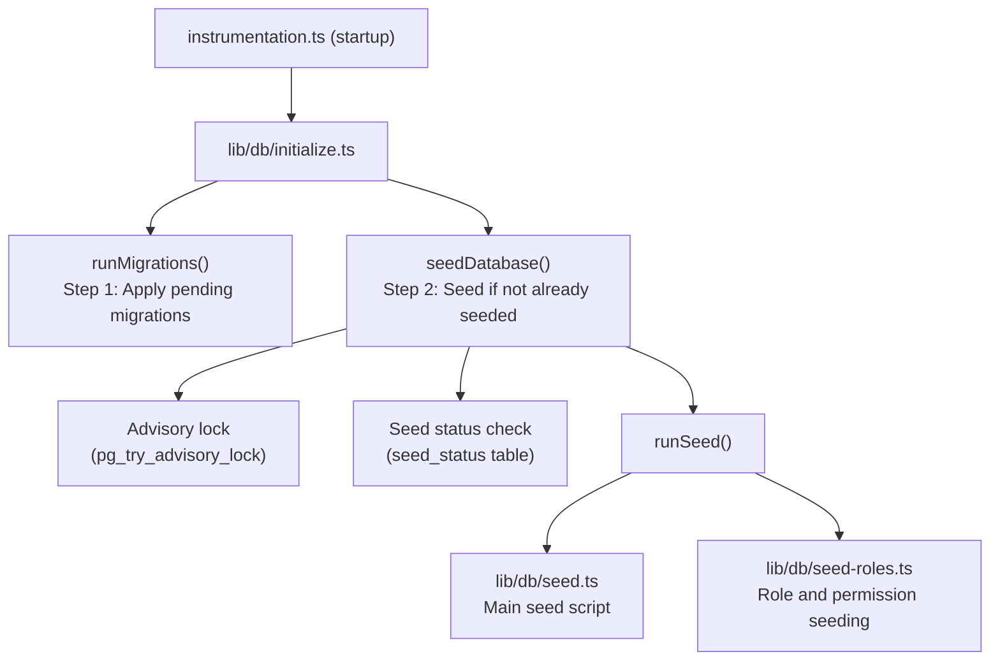

# Datenbank-Seeding

Die Ever Works-Vorlage umfasst ein umfassendes Datenbank-Seeding-System, das wesentliche Daten (Rollen, Berechtigungen, Zahlungsanbieter) initialisiert und optional Demodaten für Entwicklung und Tests generiert.

## Saatarchitektur



## Seed-Skripte

### Haupt-Seed-Skript (`lib/db/seed.ts`)

Das primäre Seed-Skript übernimmt die gesamte Datenbankinitialisierung. Es funktioniert in zwei Modi:

**Produktionsmodus**: Setzt nur wesentliche Daten, die für die Funktion der Anwendung erforderlich sind:
- Administrator- und Kundenrollen
- Systemberechtigungen
- Standard-Zahlungsanbieter
- Erforderliche Systemdatensätze

**Demo-Modus**: Zusätzlich werden umfassende Testdaten für die Entwicklung bereitgestellt:
- Beispielbenutzer mit unterschiedlichen Rollen
- Beispielkundenprofile
- Beispielabonnements
- Demo-Kommentare, Stimmen und Favoriten
- Testbenachrichtigungen
- Einträge im Aktivitätsprotokoll

Der Demomodus wird aktiviert, wenn die Umgebungsvariable `DEMO_MODE` gesetzt ist.

Hauptmerkmale:
- **Pro-Tabellen-Idempotenz**: Jede Tabelle wird vor dem Seeding überprüft. Es werden nur leere Tabellen gefüllt
- **Überprüfungen der Tabellenexistenz**: Überprüft, ob Tabellen vorhanden sind, bevor versucht wird, sie einzufügen
- **Verwendet `drizzle-seed`**: Nutzt die offizielle Drizzle-Seeding-Bibliothek für die Generierung strukturierter Daten
- **Sicher für Wiederholungen**: Kann mehrmals aufgerufen werden, ohne dass Daten dupliziert werden

```typescript
// Simplified seed flow
export async function runSeed(): Promise<void> {
  await ensureDb();
  const isDemo = isDemoMode();

  if (isDemo) {
    // Seed comprehensive test data
  } else {
    // Seed minimal essential data only
  }

  // Seed roles (always)
  if (await isTableEmpty('roles', roles)) {
    await seedRoles();
  }

  // Seed permissions (always)
  if (await isTableEmpty('permissions', permissions)) {
    await seedPermissions();
  }

  // Seed payment providers (always)
  if (await isTableEmpty('paymentProviders', paymentProviders)) {
    await seedPaymentProviders();
  }

  // Demo-only: seed users, profiles, subscriptions, etc.
  if (isDemo) {
    await seedDemoData();
  }
}
```

### Rollenaussaat (`lib/db/seed-roles.ts`)

Ein spezielles Skript zum Seeding des RBAC-Systems, das auch unabhängig ausgeführt werden kann.

**`seedPermissions()`** erstellt den anfänglichen Berechtigungssatz:

|Berechtigungsschlüssel|Beschreibung|
|---------------|-------------|
|`read:own`|Kann eigene Daten lesen|
|`write:own`|Kann eigene Daten schreiben|
|`admin:all`|Vollständiger administrativer Zugriff|
|`client:manage`|Kann kundenspezifische Vorgänge verwalten|
|`user:read`|Kann Benutzerdaten lesen|
|`user:write`|Kann Benutzerdaten schreiben|

Verwendet `onConflictDoUpdate`, um vorhandene Berechtigungen sicher zu aktualisieren, ohne dass bei Wiederholungen ein Fehler auftritt.

**`linkRolesToPermissions()`** erstellt Rollen-Berechtigungs-Zuordnungen:

- **Administratorrolle**: Erhält ALLE Berechtigungen
- **Client-Rolle**: Ruft `read:own`, `write:own` und `client:manage` ab.

Die Funktion überprüft, ob die erforderlichen Rollen (Administrator, Client) vorhanden und aktiv sind, bevor Zuordnungen erstellt werden.

**`seedRolesAndPermissions()`** orchestriert beide Vorgänge innerhalb einer Datenbanktransaktion:

```typescript
export async function seedRolesAndPermissions() {
  await db.transaction(async () => {
    await seedPermissions();
    await linkRolesToPermissions();
  });
}
```

Kann eigenständig ausgeführt werden:
```bash
# Run directly (if configured as a script)
npx tsx lib/db/seed-roles.ts
```

## Initialisierungssystem (`lib/db/initialize.ts`)

Das Initialisierungssystem verwaltet die gesamte Startsequenz mit Parallelitätsschutz.

### Verfolgung des Saatgutstatus

Eine `seed_status`-Tabelle verfolgt den Seeding-Status:

|Status|Bedeutung|
|--------|---------|
|`seeding`|Saatvorgang läuft|
|`completed`|Seed erfolgreich abgeschlossen|
|`failed`|Seed fehlgeschlagen (Fehler gespeichert)|

### Parallelitätsschutz

Bei Bereitstellungen mit mehreren Prozessen (z. B. wenn mehrere serverlose Vercel-Funktionen gleichzeitig gestartet werden) verhindert das System doppeltes Seeding mithilfe von:

1. **PostgreSQL Advisory Locks**: `pg_try_advisory_lock(12345)` bietet eine nicht blockierende Sperre. Nur ein Prozess kann es erwerben.
2. **Seed-Statustabelle**: Andere Prozesse überprüfen die Tabelle `seed_status` und warten auf den Abschluss.
3. **Veraltete Erkennung**: Wenn ein `seeding`-Status älter als 5 Minuten ist, wird er als veraltet behandelt und bereinigt.
4. **Wartezeitüberschreitung**: Prozesse, die auf den Abschluss einer anderen Instanz warten, werden nach 60 Sekunden abgebrochen.

### Initialisierungsablauf

```
initializeDatabase()
│
├── DATABASE_URL not set? → Silent skip (DB is optional)
│
├── Step 1: Run migrations (always, idempotent)
│   └── Failure? → Error in production, warning in dev/preview
│
├── Step 2: Check if already seeded
│   └── seed_status = 'completed'? → Done
│
├── Step 3: Handle edge cases
│   ├── Previous seed failed? → Delete failed status, retry
│   ├── Stale seeding (>5min)? → Clean up, retry
│   └── Another instance seeding? → Wait for completion
│
├── Step 4: Acquire advisory lock
│   └── Lock not available? → Wait for other instance
│
├── Step 5: Double-check (another instance may have finished)
│
├── Step 6: Run seed
│   ├── Create seed_status record ('seeding')
│   ├── Execute runSeed()
│   └── Update seed_status ('completed' or 'failed')
│
└── Step 7: Release advisory lock (always, in finally block)
```

## Samen manuell ausführen

### Standardsamen

```bash
pnpm db:seed
```

### Individuelle Seed-Skripte

```bash
# Seed roles and permissions only
npx tsx lib/db/seed-roles.ts
```

### Demo-Modus

Um Demodaten zu verwenden, legen Sie die Umgebungsvariable `DEMO_MODE` fest:

```bash
DEMO_MODE=true pnpm db:seed
```

## Umgebungsvariablen

|Variabel|Standard|Beschreibung|
|----------|---------|-------------|
|`DATABASE_URL`| - |PostgreSQL-Verbindungszeichenfolge (erforderlich für Seeding)|
|`DEMO_MODE`|`false`|Aktivieren Sie das Seeding von Demodaten|

## Zusammenfassung der Saatdaten

### Immer gesät (Produktionsmodus)

|Tisch|Daten|
|-------|------|
|`roles`|Administrator- und Kundenrollen|
|`permissions`|Systemberechtigungsdefinitionen|
|`rolePermissions`|Rollen-Berechtigungs-Zuordnungen|
|`paymentProviders`|Stripe, LemonSqueezy, Polar, Solidgate|

### Nur Demo-Modus

|Tisch|Daten|
|-------|------|
|`users`|Beispiele für Administrator- und Clientbenutzer|
|`accounts`|Authentifizierungskonten für Beispielbenutzer|
|`clientProfiles`|Kundenprofile mit unterschiedlichen Status|
|`subscriptions`|Beispielabonnements für alle Pläne|
|`comments`|Beispielartikelkommentare|
|`votes`|Beispielstimmen|
|`favorites`|Probieren Sie Favoriten aus|
|`notifications`|Beispiel-Administratorbenachrichtigungen|
|`activityLogs`|Beispiel für einen Aktivitätsverlauf|

## Best Practices

1. **Führen Sie Seed niemals in der Produktion mit DEMO_MODE aus**: Demodaten sollten nur in der Entwicklung und im Staging verwendet werden
2. **Überprüfen Sie den Seed-Status vor dem manuellen erneuten Seeding**: Fragen Sie die Tabelle `seed_status` ab, um den aktuellen Status zu verstehen
3. **Transaktionen verwenden**: Das Rollen-Seeding verwendet Transaktionen, um Konsistenz sicherzustellen
4. **Idempotentes Design**: Überprüfen Sie vor dem Einfügen immer, ob Daten vorhanden sind, um sichere Wiederholungen zu unterstützen
5. **Advisory-Sperren**: Das Advisory-Sperrsystem verhindert Probleme in serverlosen Umgebungen, in denen mehrere Instanzen gleichzeitig gestartet werden können
