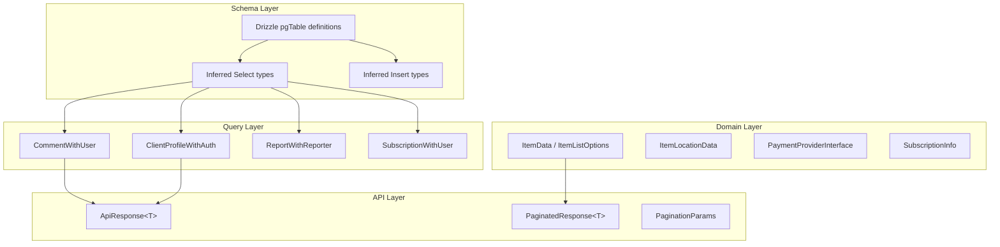

# TypeScript-Typsystem

Die Vorlage verwendet ein mehrschichtiges Typsystem, das Typen auf Schemaebene (automatisch von Drizzle abgeleitet), Domänentypen für Geschäftslogik und API-Typen für Anfrage-/Antwortverträge umfasst.

## Geben Sie Standorte ein

|Verzeichnis|Zweck|
|-----------|---------|
|`lib/db/schema.ts`|Drizzle-Tabellendefinitionen und abgeleitete Einfüge-/Auswahltypen|
|`lib/db/queries/types.ts`|Zusammengesetzte Typen auf Abfrageebene (Joins, angereicherte Datensätze)|
|`lib/types/`|Domänentypen für Artikel, Kunden, Kommentare, Kategorien usw.|
|`lib/api/types.ts`|API-Clienttypen und Antwortverträge|
|`lib/payment/types/`|Schnittstellen und Checkout-Typen von Zahlungsanbietern|
|`types/`|Globale Erweiterungen (`next-auth.d.ts`) und gemeinsame UI-Typen|

## Vom Schema abgeleitete Typen

Drizzle ORM leitet mithilfe der Dienstprogramme `$inferSelect` und `$inferInsert` automatisch TypeScript-Typen aus Tabellendefinitionen ab. Diese werden direkt aus `lib/db/schema.ts` exportiert:

```typescript
// From lib/db/schema.ts
export const users = pgTable('users', {
  id: text('id').primaryKey().$defaultFn(() => crypto.randomUUID()),
  email: text('email').unique(),
  image: text('image'),
  emailVerified: timestamp('emailVerified', { mode: 'date' }),
  passwordHash: text('password_hash'),
  createdAt: timestamp('created_at').notNull().defaultNow(),
  updatedAt: timestamp('updated_at').notNull().defaultNow(),
  deletedAt: timestamp('deleted_at'),
});

// Inferred types
export type User = typeof users.$inferSelect;
export type NewUser = typeof users.$inferInsert;
```

### Kernschematypen

|Tisch|Wählen Sie Typ aus|Typ einfügen|Schlüsselfelder|
|-------|------------|-------------|------------|
|`users`|`User`|`NewUser`|`id`, `email`, `passwordHash`, `createdAt`|
|`accounts`|`Account`| -- |`userId`, `provider`, `providerAccountId`|
|`clientProfiles`|`ClientProfile`|`NewClientProfile`|`userId`, `email`, `name`, `username`, `plan`, `status`|
|`roles`|`Role`| -- |`id`, `name`, `isAdmin`, `status`|
|`permissions`|`Permission`| -- |`id`, `key`, `description`|
|`subscriptions`|`Subscription`|`NewSubscription`|`userId`, `planId`, `status`, `startDate`, `endDate`|
|`subscriptionHistory`|`SubscriptionHistory`|`NewSubscriptionHistory`|`subscriptionId`, `action`, `previousStatus`|
|`votes`|`Vote`|`InsertVote`|`userId`, `itemId`, `voteType`|
|`comments`|`Comment`|`NewComment`|`userId`, `itemId`, `content`, `rating`|
|`favorites`|`Favorite`| -- |`userId`, `itemSlug`|
|`itemViews`|`ItemView`|`NewItemView`|`itemId`, `viewerId`, `viewedDateUtc`|
|`reports`|`Report`|`NewReport`|`contentType`, `contentId`, `reason`, `status`|
|`paymentProviders`|`OldPaymentProvider`|`NewPaymentProvider`|`name`, `isActive`|
|`paymentAccounts`|`PaymentAccount`|`NewPaymentAccount`|`userId`, `providerId`, `customerId`|
|`notifications`|`Notification`| -- |`userId`, `type`, `title`, `read`|

## Zusammengesetzte Typen abfragen

Diese in `lib/db/queries/types.ts` gefundenen Typen stellen verbundene oder angereicherte Daten dar:

```typescript
// Client profile with authentication metadata
export type ClientProfileWithAuth = ClientProfile & {
  accountProvider: string;
  isActive: boolean;
};

// Enum types used in filtering
export type ClientStatus = "active" | "inactive" | "suspended" | "trial";
export type ClientPlan = "free" | "standard" | "premium";
export type ClientAccountType = "individual" | "business" | "enterprise";

// Comment enriched with user info from a join
export type CommentWithUser = {
  id: string;
  content: string;
  rating: number | null;
  userId: string;
  itemId: string;
  createdAt: Date;
  updatedAt: Date;
  editedAt: Date | null;
  deletedAt: Date | null;
  user: {
    id: string;
    name: string | null;
    email: string | null;
    image: string | null;
  };
};
```

## Domänentypen

### Artikeltypen (`lib/types/item.ts`)

```typescript
export interface ItemData {
  id: string;
  name: string;
  slug: string;
  description: string;
  source_url: string;
  category: string | string[];
  tags: string[];
  collections?: string[];
  featured?: boolean;
  icon_url?: string;
  updated_at: string;
  status: 'draft' | 'pending' | 'approved' | 'rejected';
  submitted_by?: string;
  location?: ItemLocationData;
}

export interface ItemListOptions {
  status?: ItemStatus;
  categories?: string[];
  tags?: string[];
  page?: number;
  limit?: number;
  sortBy?: SortField;
  sortOrder?: SortOrder;
  includeDeleted?: boolean;
  submittedBy?: string;
  search?: string;
  city?: string;
  country?: string;
}

export interface ItemListResponse {
  items: ItemData[];
  total: number;
  page: number;
  limit: number;
  totalPages: number;
}
```

### Kundentypen (`lib/types/client.ts`, `lib/types/client-item.ts`)

Kundenorientierte Typen für die Profilverwaltung und Artikelübermittlung.

### Authentifizierungstypen (`types/next-auth.d.ts`)

Erweitert die NextAuth-Typen `Session` und `User`:

```typescript
declare module "next-auth" {
  interface User {
    isAdmin?: boolean;
    role?: string;
  }
  interface Session {
    user: User & DefaultSession["user"];
  }
}
```

### Berichtstypen (inline in `report.queries.ts`)

```typescript
export type ReportWithReporter = Report & {
  reporter: {
    id: string;
    name: string;
    email: string;
    avatar: string | null;
  } | null;
  reviewer: {
    id: string;
    email: string | null;
  } | null;
};
```

## Zahlungsarten (`lib/payment/types/payment-types.ts`)

Ein umfangreiches System für die Zahlungsintegration mehrerer Anbieter:

```typescript
// Provider interface (Stripe, LemonSqueezy, Polar, Solidgate)
export interface PaymentProviderInterface {
  createPaymentIntent(params: CreatePaymentParams): Promise<PaymentIntent>;
  createSubscription(params: CreateSubscriptionParams): Promise<SubscriptionInfo>;
  cancelSubscription(subscriptionId: string): Promise<SubscriptionInfo>;
  handleWebhook(payload: any, signature: string): Promise<WebhookResult>;
  getClientConfig(): ClientConfig;
}

export type SupportedProvider = 'stripe' | 'solidgate' | 'lemonsqueezy' | 'polar';

export enum SubscriptionStatus {
  INCOMPLETE = 'incomplete',
  TRIALING = 'trialing',
  ACTIVE = 'active',
  PAST_DUE = 'past_due',
  CANCELED = 'canceled',
  UNPAID = 'unpaid',
}

export enum WebhookEventType {
  PAYMENT_SUCCEEDED = 'payment_succeeded',
  SUBSCRIPTION_CREATED = 'subscription_created',
  SUBSCRIPTION_CANCELLED = 'subscription_cancelled',
  // ... 20+ event types
}
```

## API-Typen (`lib/api/types.ts`)

Diskriminierte Union-Typen für API-Antworten:

```typescript
// Success/error discriminated union
export type ApiResponse<T = unknown> =
  | { success: true; data: T; total?: number; page?: number; }
  | { success: false; error: string };

// Paginated response with metadata
export type PaginatedResponse<T> =
  | {
      success: true;
      data: T[];
      meta: { page: number; totalPages: number; total: number; limit: number };
    }
  | { success: false; error: string };

// Pagination query params
export interface PaginationParams {
  page?: number;
  limit?: number;
  search?: string;
  sortBy?: string;
  sortOrder?: 'asc' | 'desc';
}
```

## Typhierarchiediagramm



## Enum-Konstanten

Das Schema verwendet Zeichenfolgenaufzählungen, die sowohl im Schema als auch als Konstanten definiert sind:

```typescript
// Schema-level enums (lib/db/schema.ts)
export const SubscriptionStatus = {
  ACTIVE: 'active',
  CANCELLED: 'cancelled',
  EXPIRED: 'expired',
  PAST_DUE: 'past_due',
  TRIALING: 'trialing',
} as const;

// Payment constants (lib/constants/payment.ts)
export const PaymentPlan = {
  FREE: 'free',
  STANDARD: 'standard',
  PREMIUM: 'premium',
} as const;

export const PaymentProvider = {
  STRIPE: 'stripe',
  LEMONSQUEEZY: 'lemonsqueezy',
  POLAR: 'polar',
  SOLIDGATE: 'solidgate',
} as const;
```

## Best Practices

1. **Bevorzugen Sie vom Schema abgeleitete Typen** für Datenbankoperationen, anstatt Typen manuell zu definieren
2. **Verwenden Sie zusammengesetzte Typen** (`CommentWithUser`, `ClientProfileWithAuth`) für Join-Ergebnisse
3. **Verwenden Sie diskriminierte Unions** (`ApiResponse<T>`) für API-Antworten, um eine typsichere Fehlerbehandlung zu ermöglichen
4. **Definieren Sie Domänentypen** in `lib/types/` für Geschäftslogik, die Datenbanktabellen nicht 1:1 zuordnet
5. **Exportieren Sie von Zod abgeleitete Typen** zusammen mit Schemata, um die Typensicherheit auf der Validierungsebene zu gewährleisten
