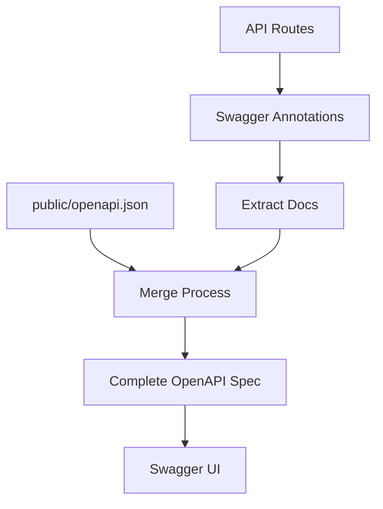

# Automatisiertes API Dokumentationssystem

Ever Works enthält ein automatisiertes OpenAPI-Dokumentationssystem, das umfassende API-Dokumentation aus Ihrem Code generiert.

## Übersicht

Das System bietet:
- 📝 **Automatisierte Generierung** – Von Code-Annotationen zur OpenAPI-Spezifikation
- 🔄 **Hybrider Ansatz** – Bewahrt manuelle Dokumentation, fügt automatisierte hinzu
- 🎯 **Typsicher** – TypeScript-Integration
- 📊 **Swagger UI** – Interaktiver API-Explorer
- 🔧 **Hot Reload** – Auto-Regenerierung während der Entwicklung

## Architektur



### Hybrider Ansatz

- ✅ **Bewahrt** vorhandene `public/openapi.json` Datei
- ✅ **Fügt** `@swagger` Annotationen im Routen-Code hinzu
- ✅ **Führt** beide Quellen automatisch zusammen
- ✅ **Generiert** vollständige und konsistente OpenAPI-Datei

## Installation

### 1. Abhängigkeiten installieren

```bash
# Installationsskript ausführen
./scripts/install-swagger-deps.sh

# Oder manuell mit npm
npm install -D swagger-jsdoc @types/swagger-jsdoc tsx nodemon
```

### 2. Verfügbare Skripte

```bash
# Dokumentation einmalig generieren
npm run generate-docs

# Watch-Modus für die Entwicklung (auto-regeneriert)
npm run docs:watch

# Entwicklung mit automatischer Generierung
npm run dev
```

## Verwendung

### Annotationen zu Routen hinzufügen

```typescript
// app/api/example/route.ts
import { NextRequest, NextResponse } from 'next/server';

/**
 * @swagger
 * /api/example:
 *   get:
 *     tags: ["Example"]
 *     summary: "Get example data"
 *     description: "Returns example data from the API"
 *     responses:
 *       200:
 *         description: "Success"
 *         content:
 *           application/json:
 *             schema:
 *               type: object
 *               properties:
 *                 success:
 *                   type: boolean
 *                   example: true
 *                 data:
 *                   type: array
 *                   items:
 *                     type: string
 */
export async function GET() {
  return NextResponse.json({ success: true, data: ["example"] });
}
```

### Annotations-Hilfsmittel verwenden

```typescript
import { createAdminRouteAnnotation, CommonAnnotations } from '@/lib/swagger/annotations';

/**
 * @swagger
 * /api/admin/users:
 *   get:
 *     tags: ["Admin"]
 *     summary: "Get all users"
 *     security:
 *       - bearerAuth: []
 *     responses:
 *       200:
 *         description: "Success"
 *       401:
 *         $ref: '#/components/responses/Unauthorized'
 *       500:
 *         $ref: '#/components/responses/ServerError'
 */
export async function GET() {
  // Implementierung
}
```

### Allgemeine Annotationen

Das System bietet wiederverwendbare Annotations-Komponenten:

```typescript
// lib/swagger/annotations.ts

export const CommonAnnotations = {
  responses: {
    unauthorized: {
      description: "Unauthorized - Invalid or missing authentication",
      content: {
        "application/json": {
          schema: {
            type: "object",
            properties: {
              error: { type: "string", example: "Unauthorized" }
            }
          }
        }
      }
    },
    serverError: {
      description: "Internal Server Error",
      content: {
        "application/json": {
          schema: {
            type: "object",
            properties: {
              error: { type: "string", example: "Internal server error" }
            }
          }
        }
      }
    }
  },
  
  security: {
    bearerAuth: {
      type: "http",
      scheme: "bearer",
      bearerFormat: "JWT"
    }
  }
};
```

## Dateistruktur

```
scripts/
├── generate-openapi.ts     # Hauptgenerierungsskript
├── tsconfig.json          # TypeScript-Konfiguration für Skripte
└── install-swagger-deps.sh # Abhängigkeiten-Installer

lib/swagger/
└── annotations.ts         # Wiederverwendbare Annotations-Hilfsmittel

templates/
└── route-template.ts      # Vorlage für neue Routen

public/
└── openapi.json          # Generierte OpenAPI-Spezifikation
```

## Konfiguration

### OpenAPI-Basiskonfiguration

```typescript
// scripts/generate-openapi.ts
const swaggerDefinition = {
  openapi: '3.0.0',
  info: {
    title: 'Ever Works API',
    version: '1.0.0',
    description: 'API-Dokumentation für die Ever Works Directory-Plattform',
  },
  servers: [
    {
      url: 'http://localhost:3000',
      description: 'Entwicklungsserver',
    },
    {
      url: 'https://yourdomain.com',
      description: 'Produktionsserver',
    },
  ],
  components: {
    securitySchemes: {
      bearerAuth: {
        type: 'http',
        scheme: 'bearer',
        bearerFormat: 'JWT',
      },
    },
  },
};
```

### Swagger UI Konfiguration

Zugriff auf die interaktive API-Dokumentation unter:
- Entwicklung: `http://localhost:3000/api-docs`
- Produktion: `https://yourdomain.com/api-docs`

## Best Practices

### 1. Konsistentes Tagging

Verwandte Endpunkte mit Tags gruppieren:

```typescript
/**
 * @swagger
 * /api/items:
 *   get:
 *     tags: ["Items"]  // Konsistente Tag-Namen verwenden
 */
```

### 2. Detaillierte Beschreibungen

Klare Beschreibungen und Beispiele bereitstellen:

```typescript
/**
 * @swagger
 * /api/items/{id}:
 *   get:
 *     summary: "Element nach ID abrufen"
 *     description: "Ruft ein einzelnes Element aus dem Verzeichnis anhand seiner eindeutigen Kennung ab"
 *     parameters:
 *       - name: id
 *         in: path
 *         required: true
 *         description: "Eindeutige Element-Kennung"
 *         schema:
 *           type: string
 *           example: "item-123"
 */
```

### 3. Schema-Definitionen

Wiederverwendbare Schemas in Komponenten definieren:

```typescript
/**
 * @swagger
 * components:
 *   schemas:
 *     Item:
 *       type: object
 *       required:
 *         - id
 *         - name
 *       properties:
 *         id:
 *           type: string
 *           example: "item-123"
 *         name:
 *           type: string
 *           example: "Beispiel-Element"
 *         description:
 *           type: string
 *           example: "Element-Beschreibung"
 */
```

### 4. Fehlerantworten

Alle möglichen Fehlerantworten dokumentieren.
