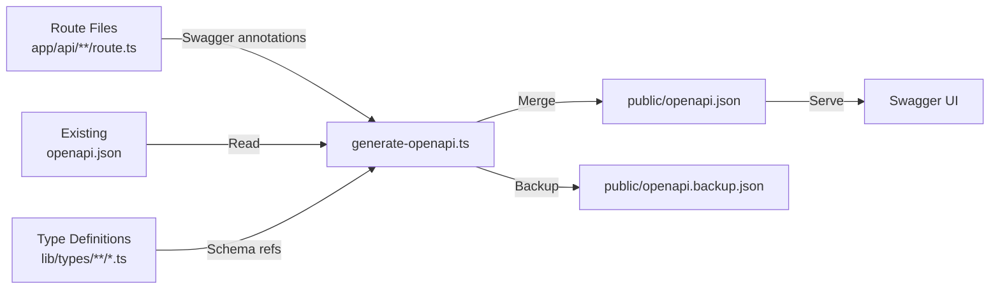
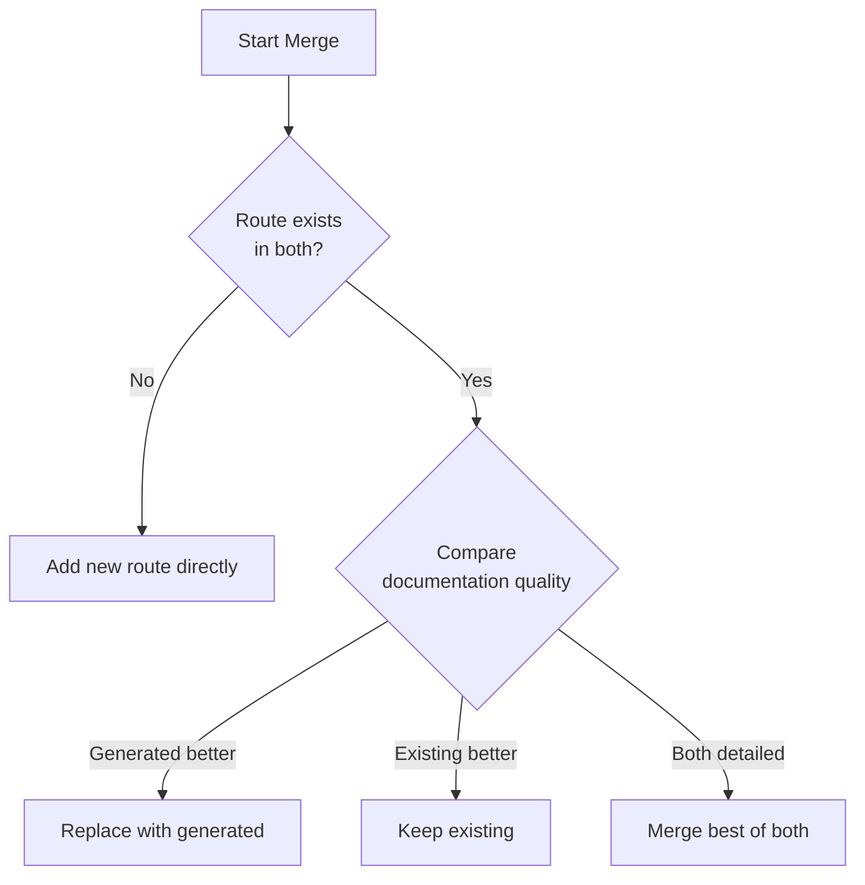

# OpenAPI Generierung

Die Vorlage enthält ein automatisiertes OpenAPI-Dokumentationsgenerierungssystem, das `@swagger` JSDoc-Annotationen in API-Routendateien scannt, sie mit vorhandener Dokumentation zusammenführt und eine vollständige `openapi.json`-Spezifikation erstellt.

## Übersicht



## Generator ausführen

```bash
# Standardgenerierung mit Ausgabe
tsx scripts/generate-openapi.ts

# Stiller Modus (für CI/CD)
tsx scripts/generate-openapi.ts --silent
```

Das Skript läuft automatisch im stillen Modus, wenn CI-Umgebungsvariablen erkannt werden (`CI`, `GITHUB_ACTIONS`, `GITLAB_CI`, `VERCEL`, etc.).

## Konfiguration

Der Generator verwendet `swagger-jsdoc` mit der folgenden Basiskonfiguration:

```typescript
const swaggerOptions = {
	definition: {
		openapi: '3.0.0',
		info: {
			title: 'Ever Works API',
			version: '1.0.0',
			description: 'Comprehensive API documentation for Directory Web Template',
			contact: {
				name: 'Ever Works Team',
				url: 'https://ever.works'
			}
		},
		servers: [{ url: '/', description: 'Current Environment' }],
		components: {
			securitySchemes: {
				sessionAuth: { type: 'http', scheme: 'bearer', bearerFormat: 'JWT' },
				session: { type: 'apiKey', in: 'cookie', name: 'session_token' },
				cronSecret: { type: 'http', scheme: 'bearer', bearerFormat: 'Secret' }
			}
		}
	},
	apis: ['./app/api/**/route.ts', './app/api/**/*.ts', './lib/types/**/*.ts']
};
```

## Sicherheitsschemata

| Schema | Typ | Verwendung |
| ------------- | ------------------------ | ------------------------------ |
| `sessionAuth` | Bearer JWT | Authentifizierte Benutzerendpunkte |
| `session` | Cookie (`session_token`) | Browser-Session-Authentifizierung |
| `cronSecret` | Bearer Secret | Cron-Job-Endpunkte |

## Integrierte Komponentenschemata

Der Generator stellt diese wiederverwendbaren Schemas out-of-the-box bereit:

### ErrorResponse

```json
{
	"type": "object",
	"properties": {
		"success": { "type": "boolean", "example": false },
		"error": { "type": "string", "example": "Error message" }
	},
	"required": ["success", "error"]
}
```

### PaginationMeta

```json
{
	"type": "object",
	"properties": {
		"page": { "type": "integer", "example": 1 },
		"pageSize": { "type": "integer", "example": 20 },
		"total": { "type": "integer", "example": 150 },
		"totalPages": { "type": "integer", "example": 8 }
	}
}
```

## Swagger-Annotationen schreiben

### Grundlegende Routen-Annotation

`@swagger` JSDoc-Kommentare direkt über oder innerhalb Ihrer Routendateien hinzufügen:

```typescript
/**
 * @swagger
 * /api/items:
 *   get:
 *     tags: ["Items"]
 *     summary: "List all items"
 *     description: "Returns a paginated list of items with optional filtering"
 *     parameters:
 *       - name: "page"
 *         in: query
 *         schema:
 *           type: integer
 *           minimum: 1
 *           default: 1
 *       - name: "limit"
 *         in: query
 *         schema:
 *           type: integer
 *           minimum: 1
 *           maximum: 100
 *           default: 10
 *     responses:
 *       200:
 *         description: "Successful response"
 *         content:
 *           application/json:
 *             schema:
 *               $ref: "#/components/schemas/Pagination"
 *       500:
 *         description: "Internal server error"
 *         content:
 *           application/json:
 *             schema:
 *               $ref: "#/components/schemas/ErrorResponse"
 */
export async function GET(request: Request) {
	// Handler-Implementierung
}
```

### Authentifizierte Route

```typescript
/**
 * @swagger
 * /api/admin/users:
 *   get:
 *     tags: ["Admin"]
 *     summary: "List users (admin)"
 *     security:
 *       - sessionAuth: []
 *     responses:
 *       200:
 *         description: "User list"
 *       401:
 *         description: "Authentication required"
 *       403:
 *         description: "Admin access required"
 */
```

## Zusammenführungsstrategie

Der Generator verwendet einen intelligenten Zusammenführungsalgorithmus beim Kombinieren vorhandener und generierter Dokumentation:



### Dokumentationsqualitätskriterien

Eine Route gilt als „detaillierte Dokumentation", wenn sie mindestens 2 von 3 Kriterien erfüllt:

| Kriterium | Schwellenwert |
| ------------------- | ------------------------------------------------ |
| Lange Beschreibung | Mehr als 50 Zeichen |
| Antwortbeispiele | Enthält `example` oder `examples` in Antworten |
| Detaillierte Parameter | Parameter haben sowohl `description` als auch `example` |

### Zusammenführungsprioritätsregeln

1. **Pfade**: Generierte Annotationen überschreiben vorhandene nur, wenn detaillierter
2. **Komponenten/Schemas**: Vorhandene Schemas haben Priorität (manuelle Schemas werden beibehalten)
