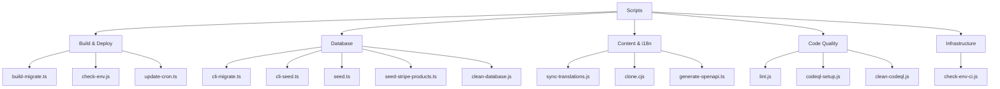
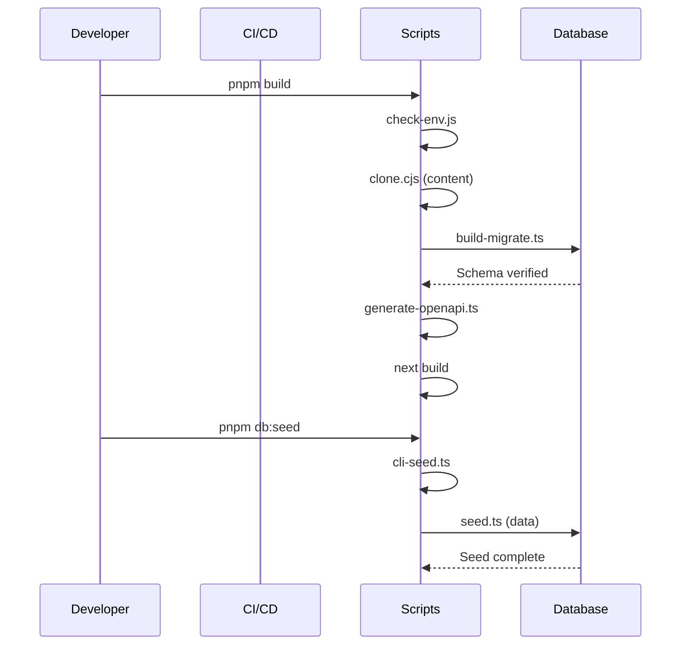

# Skripte Übersicht

Das `scripts/`-Verzeichnis enthält Automatisierungsskripte, die die Build-Pipeline, den Datenbanklebenszyklus, die Inhaltssynchronisierung, die Codequalität und die Bereitstellungsinfrastruktur verwalten. Jedes Skript ist für eine bestimmte Phase des Entwicklungs- oder Bereitstellungsworkflows konzipiert.

## Verzeichnisstruktur

```
scripts/
├── build-migrate.ts          # Build-Time-Datenbankmigrationen
├── check-env.js              # Validierung von Umgebungsvariablen
├── check-env-ci.js           # CI-spezifische Env-Validierung
├── clean-database.js         # Datenbank-Reset-Hilfsprogramm
├── cli-migrate.ts            # Manuelle Migrations-CLI
├── cli-seed.ts               # Manuelle Seeding-CLI
├── clone.cjs                 # Git-basiertes CMS-Inhalts-Klonen
├── codeql-setup.js           # CodeQL-Sicherheitsanalyse-Einrichtung
├── clean-codeql.js           # CodeQL-Bereinigungsdienstprogramm
├── generate-openapi.ts       # OpenAPI-Spec-Generierung
├── lint.js                   # ESLint-Wrapper-Skript
├── seed.ts                   # Vollständiger Datenbank-Seeder
├── seed-stripe-products.ts   # Stripe-Produkt/Preis-Seeder
├── sync-translations.js      # i18n-Übersetzungssynchronisierung
├── update-cron.ts            # Vercel-Cron-Job-Verwaltung
└── tsconfig.json             # TypeScript-Konfiguration für Skripte
```

## Skript-Kategorien



## Build- und Bereitstellungsskripte

### build-migrate.ts

Führt Datenbankmigrationen während des Vercel-Build-Prozesses aus. Stellt Schema-Konsistenz vor der Live-Bereitstellung sicher.

```bash
tsx scripts/build-migrate.ts
```

| Funktion | Verhalten |
|---|---|
| CI-Erkennung | Überspringt Migrationen in GitHub Actions (non-Vercel) |
| Skip-Flag | `SKIP_BUILD_MIGRATIONS=true` setzen, um zu umgehen |
| Schema-Überprüfung | Validiert kritische Spalten nach der Migration |
| Produktionssicherheit | Build schlägt fehl, wenn Produktionsmigrationen fehlschlagen |
| Vorschautoleranz | Erlaubt Verbindungsfehler bei Vorschau-Bereitstellungen |

### check-env.js

Validiert Umgebungsvariablen vor dem Anwendungsstart. Kategorisiert Variablen dynamisch nach Präfix und prüft auf Vollständigkeit.

```bash
node scripts/check-env.js [--silent] [--quick]
```

| Flag | Beschreibung |
|---|---|
| `--silent`, `-s` | Nicht-kritische Ausgabe unterdrücken |
| `--quick`, `-q` | Detaillierte Prüfungen überspringen, minimale Ausgabe |

Automatisch erkannte Kategorien: `core`, `database`, `auth`, `supabase`, `content`, `email`, `payment`, `analytics`, `storage`, `api`, `security`, `background-jobs`.

### update-cron.ts

Verwaltet Vercel Cron-Job-Zeitpläne über die Vercel-API. Passt die Synchronisierungsfrequenz basierend auf dem Projektplan an.

```bash
tsx scripts/update-cron.ts
```

| Umgebungsvariable | Zweck |
|---|---|
| `VERCEL_TOKEN` | API-Authentifizierungstoken |
| `VERCEL_PROJECT_ID` | Zielprojekt-Kennung |
| `VERCEL_TEAM_SCOPE` | Team-Scope für API-Aufrufe |
| `VERCEL_DEPLOYMENT_ID` | Bereitstellung, auf die vor der Aktualisierung gewartet werden soll |
| `CRON_FREQUENCY` | Auf `5min` für hochfrequente Synchronisierung setzen |

Standardzeitpläne: Free-Plan verwendet `0 3 * * *` (täglich um 3 Uhr), Pro-Plan verwendet `*/5 * * * *` (alle 5 Minuten).

## Datenbankskripte

### seed.ts

Befüllt die Datenbank mit realistischen Testdaten einschließlich Benutzern, Profilen, Rollen, Berechtigungen, Aktivitätsprotokollen, Kommentaren und Abstimmungen.

```bash
DATABASE_URL=postgres://... pnpm seed
```

Standardmäßig gesäte Daten (20 Benutzer):

| Entität | Anzahl | Details |
|---|---|---|
| Rollen | 2 | `admin` und `user` |
| Berechtigungen | Alle | Aus `getAllPermissions()`-Definitionen |
| Benutzer | 20 | Mit sequenziellen E-Mail-Adressen |
| Client-Profile | 20 | Gemischte Pläne: free, standard, premium |
| Benutzerrollen | 20 | Erster Benutzer ist Admin |
| Newsletter-Abos | ~7 | Jeder 3. Benutzer |
| Aktivitätsprotokolle | 30 | SIGN_UP, SIGN_IN, COMMENT, VOTE-Aktionen |
| Kommentare | 15 | Beispielkommentare mit Bewertungen |
| Abstimmungen | 25 | Mix aus Upvotes und Downvotes |

### seed-stripe-products.ts

Erstellt Stripe-Produkte und -Preise passend zu den Template-Abrechnungsstufen.

```bash
npx tsx scripts/seed-stripe-products.ts
```

Erstellte Produkte:

| Produkt | Monatlich | Jährlich | Typ |
|---|---|---|---|
| Free | $0 | $0 | Abonnement |
| Standard | $10/Monat | $96/Jahr (20% Rabatt) | Abonnement |
| Premium | $20/Monat | $180/Jahr (25% Rabatt) | Abonnement |
| Sponsored Ad - Weekly | $100 | -- | Einmalig |
| Sponsored Ad - Monthly | $300 | -- | Einmalig |

### clean-database.js

Löscht alle Tabellen im `public`-Schema und das `drizzle`-Migrationsverfolgungsschema. Mit Vorsicht verwenden.

```bash
node scripts/clean-database.js
```

**Warnung:** Dies ist eine destruktive Operation. Sie entfernt alle Daten und Schema-Definitionen.

## Inhalts- und i18n-Skripte

### clone.cjs

Klont das Git-basierte CMS-Inhaltsrepository in `.content/` basierend auf der `DATA_REPOSITORY`-Umgebungsvariable. Wird automatisch während des Builds aufgerufen.

### sync-translations.js

Synchronisiert Übersetzungsdateien mit der englischen Referenz. Stellt sicher, dass alle Locale-Dateien jeden in `en.json` vorhandenen Schlüssel enthalten.

```bash
node scripts/sync-translations.js
```

Derzeit unterstützte Locales: `ar`, `bg`, `de`, `es`, `fr`, `he`, `hi`, `id`, `it`, `ja`, `ko`, `nl`, `pl`, `pt`, `ru`, `th`, `tr`, `uk`, `vi`.

### generate-openapi.ts

Scannt `@swagger` JSDoc-Annotationen in Routendateien und führt sie mit der vorhandenen `public/openapi.json`-Spezifikation zusammen.

```bash
tsx scripts/generate-openapi.ts [--silent]
```

## Codequalitätsskripte

### lint.js

Umhüllt ESLint mit dem Flat-Config-Format und umgeht Next.js-Lint-Kompatibilitätsprobleme.

```bash
node scripts/lint.js
```

Führt intern `npx eslint . --max-warnings=55` aus.

## Package.json-Skript-Zuordnungen

| npm-Skript | Zugrundeliegender Befehl | Zweck |
|---|---|---|
| `pnpm dev` | `next dev` | Entwicklungsserver |
| `pnpm build` | Build-Pipeline mit Migrationen | Produktionsbuild |
| `pnpm lint` | `node scripts/lint.js` | Code-Linting |
| `pnpm db:generate` | `drizzle-kit generate` | Migrationsdateien generieren |
| `pnpm db:migrate` | `tsx scripts/build-migrate.ts` | Migrationen ausführen |
| `pnpm db:migrate:cli` | `tsx scripts/cli-migrate.ts` | Manuelle Migrations-CLI |
| `pnpm db:seed` | `tsx scripts/cli-seed.ts` | Datenbank-Seeding |
| `pnpm db:studio` | `drizzle-kit studio` | Datenbank-GUI |

## Ausführungsfluss



## Neue Skripte hinzufügen

Beim Hinzufügen eines neuen Skripts:

1. Im `scripts/`-Verzeichnis platzieren
2. TypeScript (`.ts`) für neue Skripte verwenden, wenn möglich
3. Umgebungsvariablen über `dotenv` am Anfang laden
4. Ordnungsgemäße JSDoc-Header mit Verwendungsanweisungen hinzufügen
5. In `package.json`-Skripten registrieren, wenn es benutzerseitig sein soll
6. Fehler graceful mit aussagekräftigen Exit-Codes behandeln
