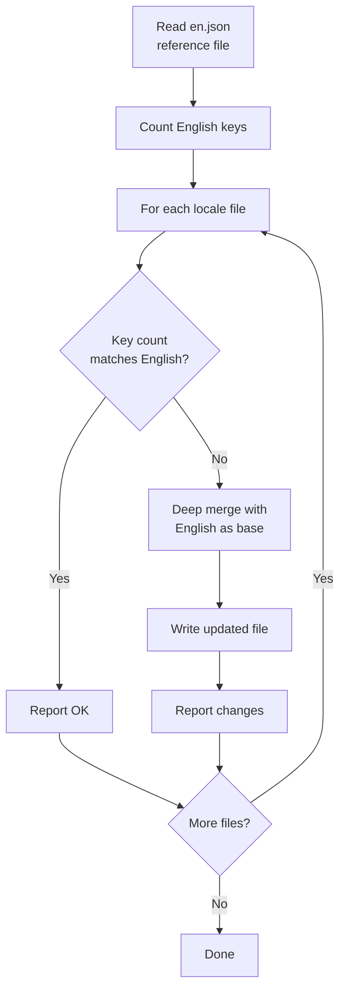

# Übersetzungsworkflow

Die Vorlage verwendet `next-intl` für die Internationalisierung (i18n) mit JSON-basierten Nachrichtendateien. Der Übersetzungsworkflow stellt sicher, dass alle unterstützten Locales durch ein automatisiertes Synchronisierungsskript mit der englischen Referenzdatei synchronisiert bleiben.

## Unterstützte Locales

Die Vorlage wird mit 20 unterstützten Sprachen ausgeliefert:

| Code | Sprache | Code | Sprache |
|---|---|---|---|
| `en` | Englisch (Referenz) | `ko` | Koreanisch |
| `ar` | Arabisch | `nl` | Niederländisch |
| `bg` | Bulgarisch | `pl` | Polnisch |
| `de` | Deutsch | `pt` | Portugiesisch |
| `es` | Spanisch | `ru` | Russisch |
| `fr` | Französisch | `th` | Thailändisch |
| `he` | Hebräisch | `tr` | Türkisch |
| `hi` | Hindi | `uk` | Ukrainisch |
| `id` | Indonesisch | `vi` | Vietnamesisch |
| `it` | Italienisch | `ja` | Japanisch |

## Dateistruktur

```
messages/
├── en.json          # Englisch (Referenz – Quelle der Wahrheit)
├── ar.json          # Arabisch
├── bg.json          # Bulgarisch
├── de.json          # Deutsch
├── es.json          # Spanisch
├── fr.json          # Französisch
├── he.json          # Hebräisch
├── hi.json          # Hindi
├── id.json          # Indonesisch
├── it.json          # Italienisch
├── ja.json          # Japanisch
├── ko.json          # Koreanisch
├── nl.json          # Niederländisch
├── pl.json          # Polnisch
├── pt.json          # Portugiesisch
├── ru.json          # Russisch
├── th.json          # Thailändisch
├── tr.json          # Türkisch
├── uk.json          # Ukrainisch
└── vi.json          # Vietnamesisch
```

## Übersetzungs-Synchronisierungsskript

Das `scripts/sync-translations.js`-Skript stellt sicher, dass alle Locale-Dateien jeden in `en.json` definierten Schlüssel haben.

### Synchronisierung ausführen

```bash
node scripts/sync-translations.js
```

### Funktionsweise



### Zusammenführungsstrategie

Die Synchronisierung verwendet eine tiefe Zusammenführung, bei der vorhandene Übersetzungen Priorität haben:

```javascript
function deepMerge(target, source) {
  const result = { ...source };  // Mit Englisch (Quelle) beginnen
  for (const key in target) {
    if (typeof target[key] === 'object' && !Array.isArray(target[key])) {
      result[key] = deepMerge(target[key], source[key] || {});
    } else {
      result[key] = target[key]; // Vorhandene Übersetzung gewinnt
    }
  }
  return result;
}
```

**Wesentliches Verhalten:**

- Fehlende Schlüssel werden mit englischen Werten als Platzhalter gefüllt
- Vorhandene Übersetzungen werden nie überschrieben
- Verschachtelte Strukturen werden rekursiv behandelt
- Arrays werden als Blattwerte behandelt (nicht zusammengeführt)

### Beispielausgabe

```
English file has 342 translation keys

ar.json: 340/342 keys (missing 2)
  -> Updated ar.json with missing keys from English

bg.json: 342/342 keys - OK
de.json: 342/342 keys - OK
es.json: 338/342 keys (missing 4)
  -> Updated es.json with missing keys from English

Done!
```

## Nachrichtendateiformat

Übersetzungsdateien verwenden verschachteltes JSON mit Punkt-Notation-Schlüsselzugriff:

```json
{
  "common": {
    "loading": "Wird geladen...",
    "error": "Ein Fehler ist aufgetreten",
    "save": "Speichern",
    "cancel": "Abbrechen"
  },
  "auth": {
    "signIn": "Anmelden",
    "signOut": "Abmelden",
    "email": "E-Mail-Adresse",
    "password": "Passwort"
  },
  "navigation": {
    "home": "Startseite",
    "about": "Über uns",
    "contact": "Kontakt"
  }
}
```

## Übersetzungen im Code verwenden

### Client-Komponenten

```tsx
'use client';
import { useTranslations } from 'next-intl';

export function LoginButton() {
  const t = useTranslations('auth');
  return <button>{t('signIn')}</button>;
}
```

### Server-Komponenten

```tsx
import { getTranslations } from 'next-intl/server';

export default async function Page() {
  const t = await getTranslations('common');
  return <h1>{t('loading')}</h1>;
}
```

### Mit Variablen

```json
{
  "greeting": "Hallo, {name}!",
  "itemCount": "Sie haben {count, plural, =0 {keine Elemente} one {1 Element} other {# Elemente}}"
}
```

```tsx
const t = useTranslations('dashboard');
t('greeting', { name: 'John' });     // "Hallo, John!"
t('itemCount', { count: 5 });         // "Sie haben 5 Elemente"
```

## Eine neue Sprache hinzufügen

Folgen Sie diesen Schritten, um ein neues Locale hinzuzufügen:

### Schritt 1: Nachrichtendatei erstellen

```bash
# Englische Datei als Ausgangspunkt kopieren
cp messages/en.json messages/NEW_LOCALE.json
```

### Schritt 2: Locale registrieren

Locale-Konfiguration in `i18n/routing.ts` und `next.config.ts` aktualisieren.
