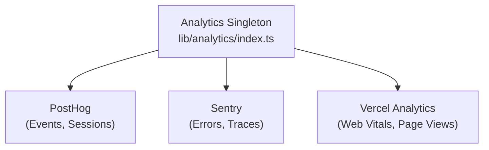

# Analysesystem

Die Ever Works-Vorlage lässt sich in **PostHog**, **Sentry** und **Vercel Analytics** integrieren, um eine umfassende Ereignisverfolgung, Fehlerüberwachung, Sitzungsaufzeichnung und Leistungsanalyse zu ermöglichen.

## Architektur



## Analytics-Klasse

Die Kernklasse `Analytics` in `lib/analytics/index.ts` ist ein Singleton, der die Initialisierung und Ereignisverteilung über Anbieter hinweg verwaltet:

```typescript
class Analytics {
  private static instance: Analytics;
  private initialized: boolean;
  private exceptionTrackingProvider: ExceptionTrackingProvider;

  static getInstance(): Analytics;
  init(): void;
  trackEvent(name: string, properties?: EventProperties): void;
  trackPageView(url: string): void;
  identify(userId: string, properties?: UserProperties): void;
  reset(): void;
}
```

### Lösung für Ausnahmeverfolgungsanbieter

Das System unterstützt die flexible Konfiguration der Ausnahmeverfolgung:

```typescript
type ExceptionTrackingProvider = 'sentry' | 'posthog' | 'both' | 'none';
```

Der Anbieter wird durch Prüfung der Verfügbarkeit ermittelt:
1. `EXCEPTION_TRACKING_PROVIDER` Konfigurationswert lesen
2. Überprüfen Sie, ob der ausgewählte Anbieter aktiviert ist
3. Greifen Sie auf die verfügbare Alternative zurück, wenn der Primärserver nicht konfiguriert ist

## PostHog-Integration

### Konfiguration

```bash
NEXT_PUBLIC_POSTHOG_KEY=phc_xxx
NEXT_PUBLIC_POSTHOG_HOST=https://us.i.posthog.com

# Optional
NEXT_PUBLIC_POSTHOG_DEBUG=false
NEXT_PUBLIC_POSTHOG_SESSION_RECORDING=true
NEXT_PUBLIC_POSTHOG_AUTO_CAPTURE=true
NEXT_PUBLIC_POSTHOG_SAMPLE_RATE=1.0
NEXT_PUBLIC_POSTHOG_SESSION_RECORDING_SAMPLE_RATE=0.1
NEXT_PUBLIC_POSTHOG_EXCEPTION_TRACKING=true
```

### PostHog-API-Dienst

Der serverseitige Dienst befindet sich bei `lib/services/posthog-api.service.ts` und stellt Administratoranalysedaten bereit:

```typescript
class PostHogApiService {
  constructor(); // Reads from analyticsConfig

  isConfigured(): boolean;
  async getTotalPageViews(days?: number): Promise<number>;
  async getTopPages(days?: number): Promise<PageData[]>;
  async getEventCounts(eventName: string, days?: number): Promise<number>;
}
```

**Erforderlich für serverseitigen API-Zugriff:**
```bash
POSTHOG_PERSONAL_API_KEY=phx_xxx
POSTHOG_PROJECT_ID=12345
```

### Clientseitiger Hook

```typescript
import { useAnalytics } from '@/hooks/use-analytics';

const {
  trackEvent,      // (name: string, properties?: object) => void
  trackPageView,   // (url: string) => void
  identify,        // (userId: string, properties?: object) => void
} = useAnalytics();
```

### Geo Analytics-Hook

```typescript
import { useGeoAnalytics } from '@/hooks/use-geo-analytics';

const {
  geoData,         // Geographic analytics data
  isLoading,
} = useGeoAnalytics();
```

## Sentry-Integration

### Konfiguration

```bash
NEXT_PUBLIC_SENTRY_DSN=https://xxx@sentry.io/xxx
SENTRY_AUTH_TOKEN=sntrys_xxx
SENTRY_ORG=your-org
SENTRY_PROJECT=your-project
NEXT_PUBLIC_SENTRY_EXCEPTION_TRACKING=true
```

Sentry bietet:
- **Fehlerverfolgung** – Automatische Erfassung nicht behandelter Ausnahmen
- **Leistungsüberwachung** – Transaktionsverfolgung für API-Routen und Seitenladevorgänge
- **Sitzungswiedergabe** – Optionale Sitzungsaufzeichnung

## Vercel Analytics

Vercel Analytics ist automatisch verfügbar, wenn es auf Vercel bereitgestellt wird:

```bash
# Enabled by default on Vercel deployments
NEXT_PUBLIC_VERCEL_ANALYTICS=true
```

Bietet:
- **Web Vitals** – Überwachung der Core Web Vitals (LCP, FID, CLS).
- **Seitenaufrufe** – Automatische Seitenaufrufverfolgung
- **Zielgruppeneinblicke** – Geografische und Geräteanalysen

## Admin-Analyse-Dashboard

Das Admin-Dashboard bietet aggregierte Analysen über den `useAdminStats` -Hook:

```typescript
import { useAdminStats } from '@/hooks/use-admin-stats';

const {
  stats,           // Dashboard statistics
  isLoading,
} = useAdminStats();
```

Der `useDashboardStats` -Hook bietet detailliertere Metriken:

```typescript
import { useDashboardStats } from '@/hooks/use-dashboard-stats';

const {
  stats,           // { items, users, revenue, pageViews, ... }
  isLoading,
  refetch,
} = useDashboardStats();
```

## Analytics deaktivieren

Analytics-Anbieter werden deaktiviert, wenn ihre Konfiguration fehlt. Es wird kein Tracking-Code geladen, wenn die entsprechenden Umgebungsvariablen nicht gesetzt sind. Dadurch kann die Vorlage ohne Analyse in der Entwicklung funktionieren.
