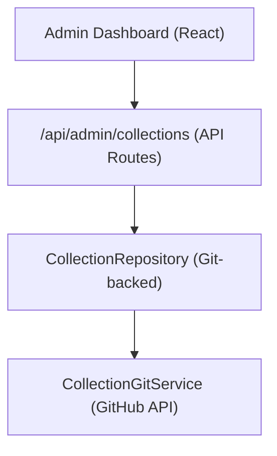

# Sammlungssystem

Mithilfe von Sammlungen können Administratoren Gruppen von Elementen für die Anzeige auf der Website kuratieren. Das System speichert Erfassungsdaten im Git-basierten CMS-Repository und stellt CRUD-Vorgänge über das Admin-Dashboard bereit.

## Architektur



Sammlungen werden als Dateien im Git-basierten CMS-Repository (konfiguriert über `DATA_REPOSITORY` ) gespeichert, wobei `CollectionGitService` für Lese-/Schreibvorgänge über die GitHub-API verwendet wird.

## Datenmodell

```typescript
interface Collection {
  id: string;
  name: string;
  slug: string;
  description?: string;
  isActive: boolean;
  items: string[];          // Array of item slugs
  item_count: number;       // Computed from items array
  displayOrder?: number;
  created_at: string;
  updated_at: string;
}
```

## CollectionRepository

Das Repository befindet sich bei `lib/repositories/collection.repository.ts` und bietet Folgendes:

```typescript
class CollectionRepository {
  async findAll(options?: CollectionListOptions): Promise<Collection[]>;
  async findById(id: string): Promise<Collection | null>;
  async findBySlug(slug: string): Promise<Collection | null>;
  async create(data: CreateCollectionRequest): Promise<Collection>;
  async update(id: string, data: UpdateCollectionRequest): Promise<Collection>;
  async delete(id: string): Promise<void>;
  async assignItems(id: string, itemSlugs: string[]): Promise<void>;
}
```

### Listenoptionen

```typescript
interface CollectionListOptions {
  search?: string;           // Filter by name
  includeInactive?: boolean; // Include inactive collections
  sortBy?: 'name' | 'item_count' | 'created_at';
  sortOrder?: 'asc' | 'desc';
  page?: number;
  limit?: number;
}
```

## Admin-Hook

```typescript
import { useAdminCollections } from '@/hooks/use-admin-collections';

const {
  collections,        // Collection[]
  total, page, totalPages, limit,
  isLoading, isSubmitting,
  createCollection,   // (data: CreateCollectionRequest) => Promise<boolean>
  updateCollection,   // (id: string, data: UpdateCollectionRequest) => Promise<boolean>
  deleteCollection,   // (id: string) => Promise<boolean>
  assignItems,        // (id: string, itemSlugs: string[]) => Promise<boolean>
  fetchAssignedItems, // (id: string) => Promise<Item[]>
  refetch, refreshData,
} = useAdminCollections({ page: 1, limit: 10, search: '' });
```

## API-Endpunkte

| Methode | Endpunkt | Beschreibung |
|--------|----------|-------------|
| GET | `/api/admin/collections` | Sammlungen auflisten (paginiert) |
| POST | `/api/admin/collections` | Erstellen Sie eine neue Sammlung |
| PUT | `/api/admin/collections/:id` | Eine Sammlung aktualisieren |
| LÖSCHEN | `/api/admin/collections/:id` | Eine Sammlung löschen |
| GET | `/api/admin/collections/:id/items` | Zugeordnete Elemente abrufen |
| POST | `/api/admin/collections/:id/items` | Elemente der Sammlung zuweisen |

## Clientseitige Anzeige

Der `useCollectionsExists` -Hook prüft, ob aktive Sammlungen vorhanden sind, die für das bedingte Rendering verwendet werden:

```typescript
import { useCollectionsExists } from '@/hooks/use-collections-exists';
const { exists, isLoading } = useCollectionsExists();
```

## Konfiguration

Sammlungen erfordern die folgenden Umgebungsvariablen:

```bash
DATA_REPOSITORY=https://github.com/owner/repo   # Git CMS repository
GH_TOKEN=ghp_xxx                                  # GitHub API token
GITHUB_BRANCH=main                                # Branch for collection data
```

Der `CollectionRepository` analysiert die `DATA_REPOSITORY` -URL, um den GitHub-Besitzer und das Repo zu extrahieren, und verwendet dann das Token für die API-Authentifizierung.
