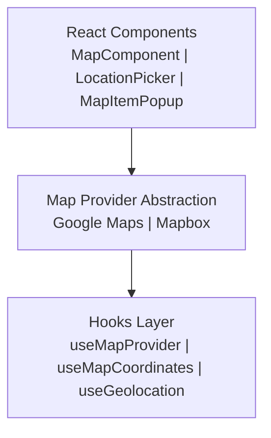

# Karten- und Standortfunktionen

Die Ever Works-Vorlage unterstützt interaktive Karten mit einer Anbieterabstraktionsschicht sowohl für **Google Maps** als auch **Mapbox**. Das System umfasst Geokodierung, Standortauswahl, Marker-Clustering und Geolokalisierung.

## Architektur



Das Modul `lib/maps/` reexportiert alle Typen und Anbieter:

```typescript
// lib/maps/index.ts
export * from './types';
export * from './providers';
```

## Kerntypen

### Koordinaten

```typescript
interface Coordinates {
  latitude: number;
  longitude: number;
}

interface MapBounds {
  north: number;
  south: number;
  east: number;
  west: number;
}
```

### Markierungen

```typescript
interface MapMarkerData {
  id: string;
  coordinates: Coordinates;
  title: string;
  icon?: string;
  category?: string;
  slug: string;              // Item slug for linking
  description?: string;
}

interface MapMarkerWithDistance extends MapMarkerData {
  distanceKm?: number;       // Distance from reference point
}
```

### Clustering

```typescript
interface MapClusterData {
  id: string;
  coordinates: Coordinates;
  count: number;
  markerIds: string[];
  expansionZoom: number;
}

interface ClusterOptions {
  radius?: number;           // Cluster radius in pixels (default: 60)
  maxZoom?: number;          // Max zoom for clustering (default: 16)
  minZoom?: number;          // Min zoom for clustering (default: 0)
  minPoints?: number;        // Min points per cluster (default: 2)
}
```

### Ansichtsfenster

```typescript
interface MapViewport {
  center: Coordinates;
  zoom: number;
  bounds?: MapBounds;
}
```

## MapComponent-Requisiten

Die Hauptkartenkomponente akzeptiert einen umfassenden Satz von Requisiten:

```typescript
interface MapComponentProps {
  markers?: MapMarkerData[];
  center?: Coordinates;
  zoom?: number;                  // 1-20
  style?: MapStyle;               // 'streets' | 'satellite'
  className?: string;
  height?: string | number;
  width?: string | number;
  controls?: MapControlsConfig;
  enableClustering?: boolean;
  clusterOptions?: ClusterOptions;
  isLoading?: boolean;
  isDisabled?: boolean;
  error?: string | null;
  onMarkerClick?: (marker: MapMarkerData) => void;
  onClusterClick?: (cluster: MapClusterData) => void;
  onViewportChange?: (viewport: MapViewport) => void;
  onReady?: () => void;
  onError?: (error: Error) => void;
  ariaLabel?: string;
}
```

### Kartensteuerung

```typescript
interface MapControlsConfig {
  showZoomControls?: boolean;
  showFullscreenControl?: boolean;
  showNavigationControl?: boolean;
  showScaleControl?: boolean;
}
```

## LocationPicker-Komponente

Eine Formularkomponente zum Auswählen von Standorten mit automatischer Adressvervollständigung, Kartenvorschau und Auswahl von Einzugsgebieten:

```typescript
interface LocationPickerProps {
  value?: LocationPickerValue;
  onChange?: (location: LocationPickerValue) => void;
  errors?: { address?: string; coordinates?: string; serviceArea?: string };
  showMap?: boolean;
  showServiceArea?: boolean;
  showRemoteOption?: boolean;
  mapHeight?: string | number;
  isDisabled?: boolean;
  isLoading?: boolean;
}

interface LocationPickerValue {
  address?: string;
  city?: string;
  state?: string;
  country?: string;
  postalCode?: string;
  latitude?: number;
  longitude?: number;
  serviceArea?: 'local' | 'regional' | 'national' | 'global';
  isRemote?: boolean;
}
```

## Haken

### useMapProvider

Bestimmt den aktiven Kartenanbieter und seinen Konfigurationsstatus:

```typescript
import { useMapProvider } from '@/hooks/use-map-provider';

const {
  provider,        // 'google' | 'mapbox'
  isConfigured,    // boolean -- API keys present
  isLoading,
  error,
  mapStyle,        // 'streets' | 'satellite'
} = useMapProvider();
```

### useMapCoordinates

Verwaltet Kartenmitte und Zoomstatus:

```typescript
import { useMapCoordinates } from '@/hooks/use-map-coordinates';

const {
  center, zoom, bounds,
  setCenter, setZoom, setBounds,
  fitToBounds,
} = useMapCoordinates(initialCenter, initialZoom);
```

### verwendenGeolocation

Browser-Geolokalisierung mit Berechtigungsverarbeitung:

```typescript
import { useGeolocation } from '@/hooks/use-geolocation';

const {
  coordinates,     // Coordinates | null
  error,           // 'PERMISSION_DENIED' | 'POSITION_UNAVAILABLE' | 'TIMEOUT' | 'NOT_SUPPORTED'
  isLoading,
  permission,      // PermissionState | null
} = useGeolocation();
```

### useLocationItems

Ruft nach geografischer Nähe gefilterte Elemente ab:

```typescript
import { useLocationItems } from '@/hooks/use-location-items';
const { items, isLoading } = useLocationItems(coordinates, radius);
```

### useUserLocation

Verwaltet die gespeicherten Standortpräferenzen des Benutzers:

```typescript
import { useUserLocation } from '@/hooks/use-user-location';
const { location, setLocation, clearLocation } = useUserLocation();
```

## Geokodierung

Die Vorlage bietet Geokodierung über den `/api/geocode` -Endpunkt und unterstützt sowohl Vorwärtsgeokodierung (Adresse zu Koordinaten) als auch Rückwärtsgeokodierung (Koordinaten zu Adresse). Der Geokodierungsdienst befindet sich unter `lib/services/geocoding/` .

## Automatische Vervollständigung der Adresse

```typescript
interface AddressSuggestion {
  id: string;
  mainText: string;          // Street address
  secondaryText: string;     // City, state
  fullAddress: string;
  coordinates?: Coordinates;
}
```

## Konfiguration

```bash
# Google Maps
NEXT_PUBLIC_GOOGLE_MAPS_API_KEY=your_key
NEXT_PUBLIC_GOOGLE_MAPS_MAP_ID=your_map_id

# Mapbox (alternative)
NEXT_PUBLIC_MAPBOX_ACCESS_TOKEN=your_token
```

Der Anbieter wird automatisch basierend auf dem konfigurierten API-Schlüssel ausgewählt.
