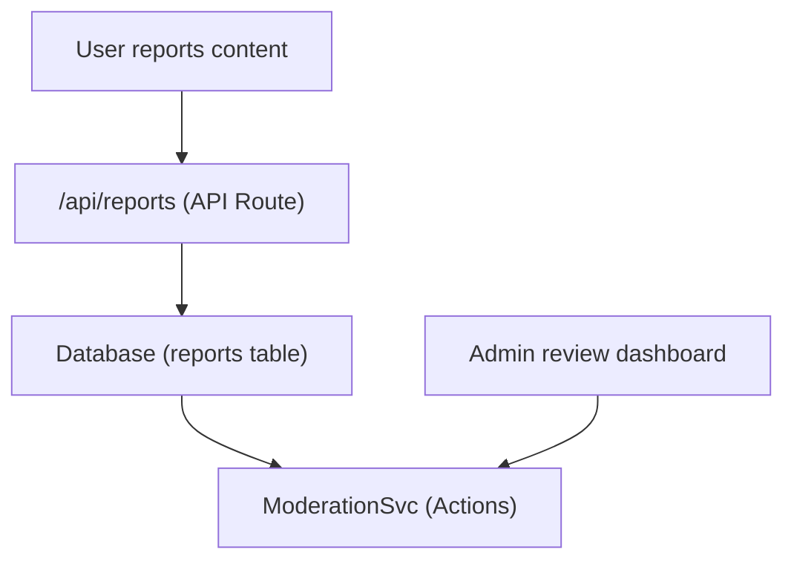

# Berichte und Inhaltsmoderation

Die Ever Works-Vorlage umfasst ein Inhaltsberichts- und Moderationssystem, mit dem Benutzer unangemessene Inhalte kennzeichnen und Administratoren Maßnahmen zu gemeldeten Elementen und Kommentaren ergreifen können.

## Architektur



## Inhaltstypen

Das System unterstützt die Meldung von zwei Inhaltstypen:

```typescript
enum ReportContentType {
  ITEM = 'item',
  COMMENT = 'comment',
}
```

## ModerationService

Der Dienst befindet sich bei `lib/services/moderation.service.ts` und bietet Moderationsaktionen:

### Lösung des Inhaltseigentümers

```typescript
async function getContentOwner(
  contentType: ReportContentTypeValues,
  contentId: string
): Promise<ContentOwnerResult>;
// Returns: { success: boolean, userId?: string, error?: string }
```

Ermittelt den Autor gemeldeter Inhalte, indem Kommentare über `getCommentById()` oder Elemente über `ItemRepository.findById()` nachgeschlagen werden.

### Moderationsaktionen

| Aktion | Beschreibung | Wirkung |
|--------|-------------|--------|
| **Inhalt entfernen** | Den gemeldeten Artikel oder Kommentar löschen | Inhalt entfernt, Verlauf aufgezeichnet |
| **Benutzer warnen** | Warnungsanzahl erhöhen | Warnungszähler erhöht |
| **Benutzer sperren** | Konto vorübergehend sperren | Kontozugriff eingeschränkt |
| **Benutzer sperren** | Konto dauerhaft sperren | Konto dauerhaft gesperrt |
| **Bericht ablehnen** | Bericht ohne Aktion als gelöst markieren | Bericht geschlossen |

### Aktionsumsetzung

Jede Aktion erstellt einen Moderationsverlaufseintrag und kann E-Mail-Benachrichtigungen auslösen:

```typescript
// Example: Remove content
async function removeContent(
  contentType: ReportContentTypeValues,
  contentId: string,
  reportId: string,
  adminId: string
): Promise<ModerationResult>;
```

Der Dienst delegiert an:
- `deleteComment()` – Zum Entfernen von Kommentaren
- `ItemRepository` – Zum Entfernen von Gegenständen
- `createModerationHistory()` – Für Audit-Trail
- `incrementWarningCount()` – Für Benutzerwarnungen
- `suspendUserQuery()` / `banUserQuery()` – Für Kontoaktionen
- `EmailNotificationService` – Für Benutzerbenachrichtigungs-E-Mails

## Admin-Hook

```typescript
import { useAdminReports } from '@/hooks/use-admin-reports';

const {
  reports,           // Report[]
  total, page, totalPages,
  isLoading, isSubmitting,
  resolveReport,     // (id, action, reason?) => Promise<boolean>
  dismissReport,     // (id, reason?) => Promise<boolean>
  deleteReport,      // (id) => Promise<boolean>
  refetch, refreshData,
} = useAdminReports({ page: 1, limit: 10 });
```

## Moderationsworkflow

1. **Benutzer meldet Inhalt** – Wählt einen Grund aus und sendet ihn über die Berichts-API
2. **Administratorbenachrichtigung** – `NotificationService.createItemReportedNotification()` oder `createCommentReportedNotification()` benachrichtigt Administratoren
3. **Administratorbewertungen** – Zeigt Berichtsdetails im Admin-Dashboard an
4. **Administrator ergreift Maßnahmen** – Wählt aus: Inhalt entfernen, Benutzer warnen, sperren, sperren oder entlassen
5. **Verlauf aufgezeichnet** – `createModerationHistory()` protokolliert die Aktion mit Administrator-ID, Zeitstempel und Grund
6. **Benutzer benachrichtigt** – E-Mail-Benachrichtigung an den Inhaltseigentümer über die ergriffene Maßnahme

## Moderationsaktionen-Enumeration

```typescript
enum ModerationAction {
  REMOVE_CONTENT = 'remove_content',
  WARN_USER = 'warn_user',
  SUSPEND_USER = 'suspend_user',
  BAN_USER = 'ban_user',
  DISMISS = 'dismiss',
}
```

## API-Endpunkte

| Methode | Endpunkt | Beschreibung |
|--------|----------|-------------|
| POST | `/api/reports` | Einen neuen Bericht einreichen |
| GET | `/api/admin/reports` | Listenberichte (admin, paginiert) |
| POST | `/api/admin/reports/:id/resolve` | Lösen Sie einen Bericht mit der Aktion | auf
| POST | `/api/admin/reports/:id/dismiss` | Einen Bericht verwerfen |
| LÖSCHEN | `/api/admin/reports/:id` | Einen Bericht löschen |

## Verwandte Dokumentation

- [Benachrichtigungssystem](./notifications.md) – Wie Berichtsbenachrichtigungen übermittelt werden
- [Abstimmung & Kommentare](./voting-comments.md) – Kommentarsystem, das gemeldet werden kann
