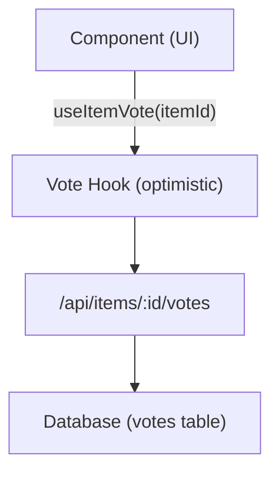

# Abstimmungs- und Kommentarsystem

Die Ever Works-Vorlage umfasst ein vollständiges Abstimmungs- und Kommentarsystem, das es Benutzern ermöglicht, Artikel hoch- oder runterzustimmen, Bewertungen mit Sternen zu hinterlassen und sich mit Inhalten zu beschäftigen. Beide Systeme nutzen optimistische Updates für sofortiges UI-Feedback.

## Abstimmungssystem

### Architektur

Das Abstimmungssystem verwendet ein Abstimmungsmodell pro Element, bei dem jeder authentifizierte Benutzer eine Stimme (nach oben oder unten) pro Element abgeben kann. Das System verfolgt die Nettostimmenzahl und die einzelnen Benutzerstimmen.



### useItemVote Hook

```typescript
import { useItemVote } from '@/hooks/use-item-vote';

const {
  voteCount,       // number -- net vote count
  userVote,        // 'up' | 'down' | null
  isLoading,       // boolean
  handleVote,      // (type: 'up' | 'down') => void
  refreshVotes,    // () => void
} = useItemVote(itemId);
```

### Abstimmungsverhalten

| Aktueller Status | Aktion | Ergebnis |
|--------------|--------|--------|
| Keine Abstimmung | Klicken Sie auf Nach oben | Upvote (+1) |
| Keine Abstimmung | Klicken Sie auf „Nach unten |“. Downvote (-1) |
| Hochgestuft | Klicken Sie auf Nach oben | Abstimmung entfernen (umschalten) |
| Hochgestuft | Klicken Sie auf „Nach unten |“. Wechseln Sie zu Downvote (-2 netto) |
| Abgestimmt | Klicken Sie auf „Nach unten |“. Abstimmung entfernen (umschalten) |
| Abgestimmt | Klicken Sie auf Nach oben | Zu Upvote wechseln (+2 netto) |

### Optimistische Updates

Der Vote-Hook implementiert optimistische Updates mit Rollback:

1. **onMutate** – Ausgehende Abfragen abbrechen, aktuellen Status erfassen, optimistisches Update anwenden
2. **onSuccess** – Optimistische Daten durch Serverantwort ersetzen
3. **onError** – Zum Snapshot zurückkehren, Fehler-Toast anzeigen

### Authentifizierung

Nicht authentifizierte Benutzer, die versuchen abzustimmen, sehen über `useLoginModal` ein Anmeldemodal:

```typescript
if (!user) {
  loginModal.onOpen('Please sign in to vote on this item');
  throw new Error('Authentication required');
}
```

### Cache-Verwaltung

Der Utility-Hook `useVoteCache` stellt komponentenübergreifende Cache-Operationen bereit:

```typescript
import { useVoteCache } from '@/hooks/use-item-vote';

const {
  invalidateAllVotes,     // () => void
  invalidateItemVotes,    // (itemId: string) => void
  clearVoteCache,         // () => void
  prefetchItemVotes,      // (itemId: string) => Promise<void>
} = useVoteCache();
```

## Kommentarsystem

### Architektur

Kommentare unterstützen vollständige CRUD-Vorgänge mit Sternebewertungen, Moderation und Echtzeitaktualisierungen.

### useComments Hook

```typescript
import { useComments } from '@/hooks/use-comments';

const {
  comments,              // CommentWithUser[]
  isPending,
  createComment,         // ({ content, itemId, rating }) => Promise
  isCreating,
  updateComment,         // ({ commentId, content?, rating? }) => Promise
  isUpdating,
  deleteComment,         // (commentId) => Promise
  isDeleting,
  rateComment,           // ({ commentId, rating }) => void
  isRatingComment,
  updateCommentRating,   // ({ commentId, rating }) => void
  isUpdatingRating,
  commentRating,         // number
  isLoadingRating,
} = useComments(itemId);
```

### Kommentardatenmodell

Jeder Kommentar beinhaltet:
- `id` – Eindeutige Kennung
- `content` – Kommentartext
- `rating` -- Optionale Sternebewertung (1-5)
- `userId` – Autorenangabe
- `itemId` – Zugehöriger Artikel
- `user` – Ausgefüllte Benutzerdaten (Name, E-Mail, Bild)
- `createdAt` / `updatedAt` – Zeitstempel

### Bewertungsintegration

Kommentare und Bewertungen sind eng integriert:
- Durch das Erstellen eines Kommentars mit einer Bewertung wird die Gesamtbewertung des Artikels aktualisiert
- Das Bearbeiten der Bewertung eines Kommentars löst eine Neuberechnung aus
- Die `["item-rating", itemId]` -Abfrage wird nach jeder Kommentarmutation erneut abgerufen

### Komponentenübergreifende Ereignisse

Das Kommentarsystem sendet benutzerdefinierte DOM-Ereignisse zur komponentenübergreifenden Koordination:

```typescript
const COMMENT_MUTATION_EVENT = "comment:mutated";
window.dispatchEvent(new CustomEvent(COMMENT_MUTATION_EVENT, { detail: comment }));
```

Andere Komponenten können ohne direkte React Query-Kopplung auf Kommentaränderungen warten.

### Admin-Moderation

Der `useAdminComments` -Hook ermöglicht die Kommentarverwaltung auf Administratorebene:

```typescript
import { useAdminComments } from '@/hooks/use-admin-comments';

const {
  comments,         // AdminCommentItem[]
  totalComments,
  totalPages,
  isDeleting,       // string | null (ID of comment being deleted)
  deleteComment,    // (id: string) => Promise<boolean>
} = useAdminComments({ page: 1, limit: 10, search: '' });
```

### API-Endpunkte

| Methode | Endpunkt | Beschreibung |
|--------|----------|-------------|
| GET | `/api/items/:id/comments` | Kommentare für einen Artikel abrufen |
| POST | `/api/items/:id/comments` | Einen neuen Kommentar erstellen |
| PUT | `/api/items/:id/comments/:commentId` | Einen Kommentar aktualisieren |
| LÖSCHEN | `/api/items/:id/comments/:commentId` | Einen Kommentar löschen |
| POST | `/api/items/:id/comments/rating` | Bewerten Sie einen Kommentar |
| PUT | `/api/items/:id/comments/rating` | Kommentarbewertung aktualisieren |
| GET | `/api/items/:id/comments/rating` | Gesamtbewertung abrufen |

## Feature-Flag-Integration

Sowohl Abstimmungen als auch Kommentare respektieren Feature-Flags:

```typescript
const flags = getFeatureFlags();
// flags.ratings -- Controls star rating display
// flags.comments -- Controls comment section visibility
```

Wenn die Datenbank nicht konfiguriert ist ( `DATABASE_URL` fehlt), werden diese Funktionen automatisch deaktiviert.
