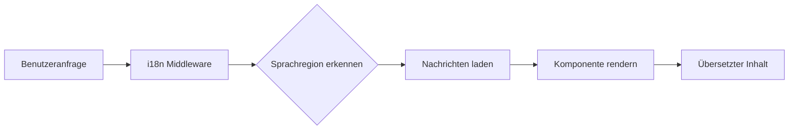

# Internationalisierungsübersicht

Ever Works wurde von Grund auf mit Internationalisierung entwickelt und unterstützt mehrere Sprachen direkt über `next-intl`.

## 🌍 Unterstützte Sprachen

Das Template bietet integrierte Unterstützung für:

- 🇬🇧 **Englisch** (en) – Standardsprache
- 🇫🇷 **Französisch** (fr)
- 🇪🇸 **Spanisch** (es)
- 🇩🇪 **Deutsch** (de)
- 🇨🇳 **Chinesisch** (zh)
- 🇸🇦 **Arabisch** (ar)
- 🇧🇬 **Bulgarisch** (bg)
- 🇳🇱 **Niederländisch** (nl)
- 🇮🇱 **Hebräisch** (he)
- 🇮🇹 **Italienisch** (it)
- 🇵🇱 **Polnisch** (pl)
- 🇵🇹 **Portugiesisch** (pt)
- 🇷🇺 **Russisch** (ru)

## Funktionsweise

### URL-basierte Lokalisierung

Ever Works verwendet URL-basierte Spracherkennung:

```
https://yoursite.com/en/about    → Englisch
https://yoursite.com/fr/about    → Französisch
https://yoursite.com/es/about    → Spanisch
```

### Automatische Spracherkennung

Das System erkennt automatisch:
1. Die Browsersprache des Benutzers
2. Weiterleitung zur entsprechenden Sprachregion
3. Speichert die Sprachpräferenz des Benutzers
4. Fällt auf die Standardsprache (Englisch) zurück

## Übersetzungsarchitektur



## Übersetzungsdateien

Übersetzungen werden in JSON-Dateien gespeichert:

```
messages/
├── en.json    # Englisch
├── fr.json    # Französisch
├── es.json    # Spanisch
├── de.json    # Deutsch
├── zh.json    # Chinesisch
└── ar.json    # Arabisch
```

## Schnellbeispiel

```typescript
import { useTranslations } from 'next-intl';

export function MyComponent() {
  const t = useTranslations('common');

  return (
    <div>
      <h1>{t('welcome')}</h1>
      <p>{t('description')}</p>
    </div>
  );
}
```

## Funktionen

### ✅ Vollständige Übersetzungsabdeckung
- UI-Komponenten
- Formularetiketten und Validierungsnachrichten
- E-Mail-Vorlagen
- Fehlermeldungen
- SEO-Metadaten

### ✅ RTL-Unterstützung
- Automatisches RTL-Layout für Arabisch und Hebräisch
- Gespiegelte UI-Elemente
- Korrekte Textausrichtung

### ✅ Datums- und Zahlenformatierung
- Gebietsschemaspezifische Datumsformate
- Währungsformatierung
- Zahlenformatierung

### ✅ Pluralformen
- Automatische Pluralformen
- Sprachspezifische Regeln

## Nächste Schritte

- [Übersetzungsanleitung →](./translation-guide) – Erfahren Sie, wie Sie Übersetzungen hinzufügen und verwalten
- [Erste Schritte](/getting-started) – Richten Sie Ihr Projekt ein
- [Anpassung](/guides/customization) – Passen Sie Ihre Seite an

## Benötigen Sie Hilfe?

Besuchen Sie unsere [Support-Seite](/advanced-guide/support) für Unterstützung bei der Internationalisierung.
