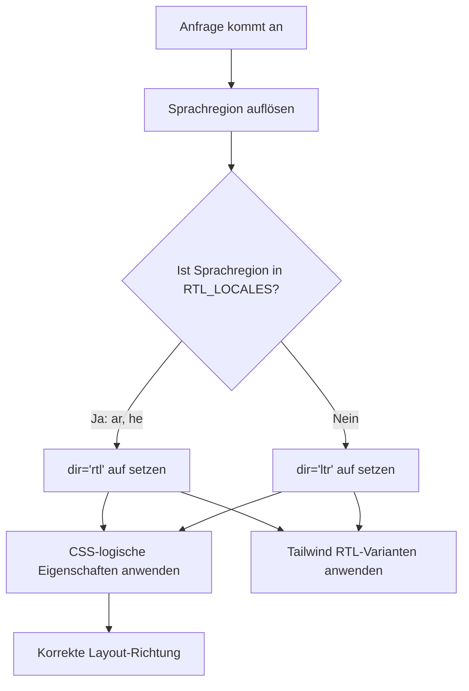

# RTL (Rechts-nach-Links) Unterstützung

Das Template unterstützt Rechts-nach-Links (RTL)-Sprachen wie Arabisch und Hebräisch vollständig. Diese Seite dokumentiert, wie die RTL-Erkennung funktioniert, wie die Layout-Richtung angewendet wird und wie sich Komponenten an RTL-Kontexte anpassen.

## Architekturübersicht



## Quelldateien

| Datei | Zweck |
|------|---------|
| `lib/constants.ts` | Definition der RTL-Sprachregionsliste |
| `app/layout.tsx` | Root-Layout mit `dir`-Attribut |
| `components/language-switcher.tsx` | Sprachkarte mit `isRTL`-Metadaten |

## RTL-Sprachregionskonfiguration

RTL-Sprachregionen werden als Konstante in `lib/constants.ts` definiert:

```typescript
export const RTL_LOCALES: readonly Locale[] = ['ar', 'he'] as const;
```

Der Sprachschalter pflegt auch RTL-Metadaten für jede Sprachregion:

```typescript
const languageMap = {
  en: { flagSrc: "/flags/en.svg", name: "EN", fullName: "English", isRTL: false },
  ar: { flagSrc: "/flags/ar.svg", name: "AR", fullName: "العربية", isRTL: true },
  he: { flagSrc: "/flags/he.svg", name: "HE", fullName: "עברית", isRTL: true },
  // ... alle anderen Sprachregionen mit isRTL: false
};
```

## Wie die Richtung angewendet wird

### Root-Layout-Erkennung

Das Root-`app/layout.tsx` erkennt die aktuelle Sprachregion und setzt das `dir`-Attribut am `<html>`-Element:

```typescript
export default async function RootLayout({ children }) {
  const locale = await getLocale();
  const dir = RTL_LOCALES.includes(locale as Locale) ? 'rtl' : 'ltr';

  return (
    <html lang={locale} dir={dir} suppressHydrationWarning>
      <body className={`${getFontClassNames(locale)} antialiased`}>
        {children}
      </body>
    </html>
  );
}
```

Wichtige Verhaltensweisen:

- `lang="ar"` teilt dem Browser die Inhaltssprache mit
- `dir="rtl"` kehrt die gesamte Seiten-Layout-Richtung um
- `getFontClassNames(locale)` kann sprachregionsspezifische Schriftarten laden (z.B. arabische Schrift-Schriftarten)

### Browser-Rendering

Wenn `dir="rtl"` auf `<html>` gesetzt ist:

| LTR-Verhalten | RTL-Verhalten |
|--------------|-------------|
| Text fließt von links nach rechts | Text fließt von rechts nach links |
| Inhalt beginnt am linken Rand | Inhalt beginnt am rechten Rand |
| Scrollleiste rechts | Scrollleiste links |
| `text-align: left` Standard | `text-align: right` Standard |
| `margin-left` schiebt nach rechts | `margin-left` schiebt nach links |

## CSS-Strategien für RTL

### 1. CSS-logische Eigenschaften

CSS-logische Eigenschaften passen sich automatisch an die Textrichtung des Dokuments an. Verwenden Sie diese anstelle physischer Richtungseigenschaften:

| Physische Eigenschaft | Logische Eigenschaft | LTR-Bedeutung | RTL-Bedeutung |
|-------------------|-----------------|-------------|-------------|
| `margin-left` | `margin-inline-start` | Linker Rand | Rechter Rand |
| `margin-right` | `margin-inline-end` | Rechter Rand | Linker Rand |
| `padding-left` | `padding-inline-start` | Linkes Padding | Rechtes Padding |
| `padding-right` | `padding-inline-end` | Rechtes Padding | Linkes Padding |
| `text-align: left` | `text-align: start` | Linksbündig | Rechtsbündig |
| `text-align: right` | `text-align: end` | Rechtsbündig | Linksbündig |
| `left` | `inset-inline-start` | Linke Position | Rechte Position |
| `right` | `inset-inline-end` | Rechte Position | Linke Position |
| `border-left` | `border-inline-start` | Linker Rand | Rechter Rand |
| `float: left` | `float: inline-start` | Links schweben | Rechts schweben |

### 2. Tailwind CSS RTL-Unterstützung

Tailwind CSS bietet `rtl:`- und `ltr:`-Varianten, die Stile bedingt anwenden:

```html
<!-- Rand, der sich an die Richtung anpasst -->
<div class="ml-4 rtl:mr-4 rtl:ml-0">
  Inhalt mit Richtungsrand
</div>

<!-- Symbol, das im RTL kippt -->
<svg class="rtl:rotate-180">
  <path d="M1 9 4-4-4-4" />  <!-- Pfeil rechts -->
</svg>

<!-- Flex-Richtung, die sich umkehrt -->
<div class="flex flex-row rtl:flex-row-reverse">
  <span>Erstes</span>
  <span>Zweites</span>
</div>
```

### 3. Tailwind-logische Hilfsprogramme

Modernes Tailwind (v3.3+) unterstützt logische Eigenschafts-Hilfsprogramme direkt:

```html
<!-- Diese passen sich automatisch an RTL an -->
<div class="ps-4">  <!-- padding-inline-start: 1rem -->
<div class="pe-4">  <!-- padding-inline-end: 1rem -->
<div class="ms-4">  <!-- margin-inline-start: 1rem -->
<div class="me-4">  <!-- margin-inline-end: 1rem -->
<div class="text-start">  <!-- text-align: start -->
<div class="text-end">    <!-- text-align: end -->
```

## Komponentenmuster für RTL

### Breadcrumb-Chevrons

Chevron-Trennzeichen in Breadcrumbs müssen im RTL die Richtung wechseln:

```tsx
function ChevronIcon() {
  return (
    <svg
      className="w-3 h-3 mx-1 rtl:rotate-180"
      viewBox="0 0 6 10"
    >
      <path d="m1 9 4-4-4-4" />
    </svg>
  );
}
```

### Navigations-Layouts

Flex-basierte Navigation sollte logische Eigenschaften verwenden:

```tsx
// Header mit Logo links, Aktionen rechts (passt sich an RTL an)
<header className="flex items-center justify-between">
  <div className="flex items-center gap-2">
    <Logo />
    <NavLinks />
  </div>
  <div className="flex items-center gap-2">
    <LanguageSwitcher />
    <ThemeToggler />
  </div>
</header>
```

### Icons, die nicht gespiegelt werden sollten

Einige Icons sollten ihre Ausrichtung unabhängig von der Richtung beibehalten:

```tsx
// Häkchen, X-Icons und Markenlogos sollten NICHT gespiegelt werden
<Check className="h-4 w-4" />  // Behalten wie ist

// Pfeile und Chevrons SOLLTEN gespiegelt werden
<ChevronRight className="h-4 w-4 rtl:rotate-180" />
```

## Schriftarthandhabung für RTL-Sprachen

Das Root-Layout verwendet `getFontClassNames(locale)`, um geeignete Schriftarten basierend auf der Sprachregion zu laden. Arabisch und Hebräisch haben besondere typografische Anforderungen:

- Arabische Schrift erfordert Schriftarten mit korrekter Glyphenverbindung (z.B. Noto Sans Arabic)
- Hebräische Schrift erfordert Schriftarten mit korrekten Glyphenformen
- Die Zeilenhöhe muss möglicherweise für arabische diakritische Zeichen angepasst werden

## RTL testen

### Manuelles Testen

1. Mit dem `LanguageSwitcher` auf Arabisch oder Hebräisch wechseln
2. Prüfen, ob die Seite komplett gespiegelt ist (Text, Ränder, Icons)
3. Prüfen, ob interaktive Elemente (Dropdowns, Modals) korrekt positioniert sind
4. Prüfen, ob die Scrollleistenposition auf die linke Seite wechselt

### Programmtests

```typescript
// Prüfen, ob die aktuelle Sprachregion RTL ist
import { RTL_LOCALES, type Locale } from "@/lib/constants";

function isRTL(locale: string): boolean {
  return RTL_LOCALES.includes(locale as Locale);
}
```

### Häufige RTL-Probleme

| Problem | Ursache | Lösung |
|-------|-------|-----|
| Falsche Textausrichtung | `text-left` statt `text-start` | Logische Eigenschaften verwenden |
| Icons nicht gespiegelt | Fehlendes `rtl:rotate-180` bei Richtungs-Icons | RTL-Variante hinzufügen |
| Rand auf falscher Seite | `ml-*` statt `ms-*` | Logische Tailwind-Hilfsprogramme verwenden |
| Dropdown falsch positioniert | Feste `left`/`right`-Positionierung | Logisches `inset-inline-*` verwenden |
| Rand auf falscher Seite | `border-l-*` statt `border-s-*` | `border-s-*` / `border-e-*` verwenden |
| Flex-Reihenfolge unerwartet umgekehrt | `flex-row-reverse` mit RTL | Explizite Umkehrung im RTL entfernen |

## Neue RTL-Sprache hinzufügen

Um Unterstützung für eine neue RTL-Sprache (z.B. Urdu) hinzuzufügen:

1. **Sprachregion hinzufügen** zu `LOCALES` in `lib/constants.ts`
2. **Zu `RTL_LOCALES` hinzufügen**:

```typescript
export const RTL_LOCALES: readonly Locale[] = ['ar', 'he', 'ur'] as const;
```

3. **Nachrichtendatei erstellen** unter `messages/ur.json` basierend auf `en.json`
4. **Sprachkarteneintrag hinzufügen** in `components/language-switcher.tsx`:

```typescript
ur: { flagSrc: "/flags/ur.svg", name: "UR", fullName: "اردو", isRTL: true },
```

5. **Flaggen-SVG hinzufügen** zu `public/flags/ur.svg`
6. **Layout gründlich testen** im RTL-Modus

## Richtungs-bewusste Komponenten-Checkliste

Beim Erstellen oder Überprüfen von Komponenten prüfen:

- [ ] Textausrichtung verwendet `text-start`/`text-end` statt `text-left`/`text-right`
- [ ] Ränder und Abstände verwenden `ms-*`/`me-*`/`ps-*`/`pe-*` logische Hilfsprogramme
- [ ] Richtungs-Icons (Pfeile, Chevrons) haben `rtl:rotate-180`
- [ ] Absolute/feste Positionierung verwendet `inset-inline-start`/`inset-inline-end`
- [ ] Rahmen verwenden `border-s-*`/`border-e-*` logische Varianten
- [ ] Flex-Layouts verlassen sich auf automatische Richtungsumkehr (kein explizites `flex-row-reverse` außer bei Bedarf für LTR und RTL)
- [ ] Übergänge und Transformationen sind richtungsneutral
- [ ] Modal- und Dropdown-Positionen passen sich korrekt an

## Best Practices

1. **CSS-logische Eigenschaften bevorzugen** gegenüber physischen Eigenschaften. Sie funktionieren in LTR und RTL korrekt ohne zusätzliche `rtl:`-Überschreibungen.

2. **`dir="rtl"` auf `<html>` verwenden** (bereits durch das Root-Layout gehandhabt). Einzelne Komponenten sollten ihr eigenes `dir` nicht setzen, außer beim Einbetten von Inhalten mit entgegengesetzter Richtung.

3. **Mit echtem arabischen/hebräischen Inhalt testen**, nicht nur englischem Text im RTL-Modus. Rechts-nach-links-Text mit gemischten Zahlen und lateinischen Zeichen zeigt Layout-Probleme, die umgekehrtes Englisch nicht aufzeigt.

4. **Dekorative Bilder oder Markenlogos nicht spiegeln**. Nur direktionale UI-Elemente (Pfeile, Chevrons, Fortschrittsanzeigen) sollten sich umkehren.
