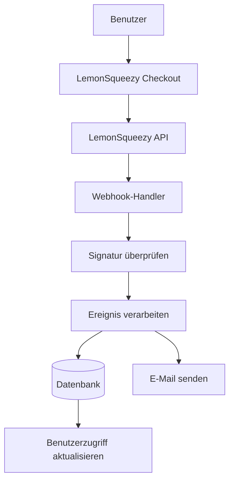

# LemonSqueezy Konfiguration

Diese Anleitung erklärt, wie LemonSqueezy als Zahlungsanbieter in Ihrer Ever Works-Anwendung konfiguriert wird.

## Überblick

LemonSqueezy ist eine Merchant-of-Record-Plattform, die Folgendes vereinfacht:

- 💰 Globale Zahlungen mit automatischer Steuerkonformität
- 🌍 Unterstützung für 135+ Länder
- 📊 Integrierter Betrugsschutz
- 🔄 Abonnementverwaltung
- 💳 Mehrere Zahlungsmethoden
- 📧 Automatische E-Mail-Belege

:::tip Warum LemonSqueezy?
LemonSqueezy fungiert als Merchant of Record und übernimmt automatisch die gesamte Steuerkonformität, Mehrwertsteuer und Umsatzsteuer. Das bedeutet, dass Sie sich nicht in verschiedenen Ländern für Steuern registrieren müssen.
:::

## Erforderliche Umgebungsvariablen

Fügen Sie diese Variablen zu Ihrer `.env.local`-Datei hinzu:

```env
# LemonSqueezy-Konfiguration
LEMONSQUEEZY_API_KEY=your_api_key_here
LEMONSQUEEZY_WEBHOOK_SECRET=your_webhook_secret_here
LEMONSQUEEZY_STORE_ID=your_store_id_here

# Produkt-/Varianten-IDs (optional)
NEXT_PUBLIC_LEMONSQUEEZY_PRO_VARIANT_ID=variant_id_here
NEXT_PUBLIC_LEMONSQUEEZY_SPONSOR_VARIANT_ID=variant_id_here
```

## LemonSqueezy Dashboard-Einrichtung

### Schritt 1: Ihren Shop erstellen

1. Registrieren Sie sich bei [LemonSqueezy](https://lemonsqueezy.com)
2. Erstellen Sie einen neuen Shop
3. Vervollständigen Sie Ihre Shop-Einstellungen (Name, Währung usw.)
4. Kopieren Sie Ihre **Shop-ID** aus der URL oder den Einstellungen

### Schritt 2: Produkte erstellen

1. Gehen Sie zu **Produkte** → **Neues Produkt**
2. Erstellen Sie Ihre Preistarife:

| Produkt | Preis | Typ | Beschreibung |
|---------|-------|-----|--------------|
| **Pro-Plan** | 10 $/Monat | Abonnement | Erweiterte Funktionen |
| **Sponsor-Plan** | 20 $ | Einmalig | Premium-Support |

3. Erstellen Sie für jedes Produkt **Varianten** mit spezifischen Preisen
4. Kopieren Sie die **Varianten-ID** für jede Preisoption

### Schritt 3: API-Schlüssel abrufen

1. Gehen Sie zu **Einstellungen** → **API**
2. Erstellen Sie einen neuen API-Schlüssel
3. Kopieren Sie den API-Schlüssel (beginnt mit `ls_`)
4. Fügen Sie ihn zu Ihrer `.env.local` als `LEMONSQUEEZY_API_KEY` hinzu

### Schritt 4: Webhooks konfigurieren

1. Gehen Sie zu **Einstellungen** → **Webhooks**
2. Klicken Sie auf **Webhook erstellen**
3. Konfigurieren Sie den Webhook:
   - **URL**: `https://ihredomain.com/api/lemonsqueezy/webhook`
   - **Ereignisse**: Wählen Sie alle Abonnement- und Bestellereignisse aus
   - **Geheimnis**: Generieren Sie einen geheimen Schlüssel

4. Kopieren Sie das **Webhook-Geheimnis** und fügen Sie es zu Ihrer `.env.local` hinzu

#### Empfohlene Ereignisse

Wählen Sie diese Ereignisse in Ihrer Webhook-Konfiguration:

- ✅ `subscription_created` - Neues Abonnement
- ✅ `subscription_updated` - Abonnementänderungen
- ✅ `subscription_cancelled` - Kündigung
- ✅ `subscription_payment_success` - Erfolgreiche Zahlung
- ✅ `subscription_payment_failed` - Fehlgeschlagene Zahlung
- ✅ `subscription_trial_will_end` - Testphase endet
- ✅ `order_created` - Einmaliger Kauf
- ✅ `order_refunded` - Erstattung verarbeitet

## Webhook-Endpunkt

Der Webhook ist verfügbar unter: `/api/lemonsqueezy/webhook`

### Unterstützte Ereigniszuordnung

| LemonSqueezy-Ereignis | Internes Ereignis | Beschreibung |
|----------------------|-------------------|--------------|
| `subscription_created` | `SUBSCRIPTION_CREATED` | Neues Abonnement erstellt |
| `subscription_updated` | `SUBSCRIPTION_UPDATED` | Abonnement aktualisiert |
| `subscription_cancelled` | `SUBSCRIPTION_CANCELLED` | Abonnement gekündigt |
| `subscription_payment_success` | `SUBSCRIPTION_PAYMENT_SUCCEEDED` | Zahlung erfolgreich |
| `subscription_payment_failed` | `SUBSCRIPTION_PAYMENT_FAILED` | Zahlung fehlgeschlagen |
| `subscription_trial_will_end` | `SUBSCRIPTION_TRIAL_ENDING` | Testphase endet bald |
| `order_created` | `PAYMENT_SUCCEEDED` | Einmalige Zahlung |
| `order_refunded` | `REFUND_SUCCEEDED` | Erstattung verarbeitet |

## Implementierung

### Zahlungssystem-Architektur



### Funktionen

#### Sicherheit

- ✅ HMAC-Signaturverifizierung (SHA-256)
- ✅ Webhook-Geheimnis-Validierung
- ✅ Umfassende Fehlerbehandlung
- ✅ Anfrage-Protokollierung

#### Funktionalität

- ✅ Verwaltung des Abonnement-Lebenszyklus
- ✅ Automatische Zahlungsverarbeitung
- ✅ E-Mail-Benachrichtigungen
- ✅ Datenbanksynchronisierung
- ✅ Fehlerüberwachung

## Verwendungsbeispiel

### Checkout erstellen

```typescript
import { LemonSqueezyProvider } from '@/lib/payment/providers/lemonsqueezy-provider';

const lsProvider = new LemonSqueezyProvider({
  apiKey: process.env.LEMONSQUEEZY_API_KEY!,
  storeId: process.env.LEMONSQUEEZY_STORE_ID!,
});

// Checkout-Sitzung erstellen
const checkout = await lsProvider.createCheckout({
  variantId: 'variant_id_here',
  customerId: 'customer_id',
  redirectUrl: 'https://yoursite.com/success',
});

// Benutzer zu checkout.url weiterleiten
```

## Tests

### Testmodus

1. LemonSqueezy bietet einen Testmodus für die Entwicklung
2. Verwenden Sie Test-API-Schlüssel (im Dashboard verfügbar)
3. Testen Sie Webhooks mit dem Webhook-Testtool von LemonSqueezy

### Lokale Tests

```bash
# Verwenden Sie ein Tool wie ngrok, um Ihren lokalen Server zu exponieren
ngrok http 3000

# Webhook-URL im LemonSqueezy-Dashboard aktualisieren
https://your-ngrok-url.ngrok.io/api/lemonsqueezy/webhook
```

## Überwachung

Alle Webhook-Ereignisse werden protokolliert:

- ✅ **Erfolg**: `✅ LemonSqueezy [event] handled successfully`
- ❌ **Fehler**: `❌ Failed to handle [event]: [error details]`

Überprüfen Sie Ihre Anwendungsprotokolle für die Webhook-Aktivität.

## Fehlerbehebung

### Häufige Probleme

**Problem**: Fehler „No signature provided"

- **Lösung**: Stellen Sie sicher, dass LemonSqueezy den `x-signature`-Header sendet
- Überprüfen Sie die Webhook-Konfiguration im LemonSqueezy-Dashboard

**Problem**: Fehler „Invalid signature"

- **Lösung**: Überprüfen Sie, ob `LEMONSQUEEZY_WEBHOOK_SECRET` mit dem Geheimnis in LemonSqueezy übereinstimmt
- Stellen Sie sicher, dass die Webhook-URL korrekt konfiguriert ist

**Problem**: Fehler „Missing required LemonSqueezy configuration"

- **Lösung**: Überprüfen Sie, ob alle erforderlichen Umgebungsvariablen gesetzt sind
- Verifizieren Sie, dass die Variablennamen exakt übereinstimmen

**Problem**: Webhook empfängt keine Ereignisse

- **Lösung**: Überprüfen Sie, ob die Webhook-URL öffentlich zugänglich ist
- Verwenden Sie ngrok für lokale Tests
- Überprüfen Sie die LemonSqueezy-Webhook-Protokolle

## Sicherheitsbeste Praktiken

1. **Nur HTTPS**: Verwenden Sie immer HTTPS für Webhook-Endpunkte in der Produktion
2. **Geheimnis-Rotation**: Rotieren Sie Webhook-Geheimnisse regelmäßig
3. **Überwachung**: Überwachen Sie Webhook-Protokolle auf verdächtige Aktivitäten
4. **Umgebungsvariablen**: Committen Sie Geheimnisse niemals in die Versionskontrolle
5. **Rate-Limiting**: Implementieren Sie Rate-Limiting für Produktions-Webhooks
