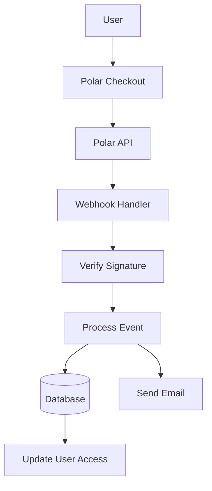

# Polarkonfiguration

In dieser Anleitung wird erklärt, wie Sie Polar als Zahlungsanbieter in Ihrer Ever Works-Anwendung konfigurieren.

## Übersicht

Polar ist eine moderne Zahlungsplattform für Entwickler und Kreative, die Folgendes bietet:

- 💻 Entwicklerfreundliche API und Dokumentation
- 🔄 Abonnement- und einmalige Zahlungsunterstützung
- 🐙 GitHub-Integration für Sponsoring
- 💰 Transparente Preisstruktur
- 🔒 Sichere Zahlungsabwicklung
- 📊 Integrierte Analyse und Berichterstattung

:::tip Warum Polar?
Polar wurde speziell für Entwickler und Open-Source-Projekte entwickelt und bietet eine saubere API, hervorragende Dokumentation und eine nahtlose GitHub-Integration für Sponsoring und Monetarisierung.
:::

## Erforderliche Umgebungsvariablen

Fügen Sie diese Variablen zu Ihrer `.env.local` -Datei hinzu:

```env
# Polar Configuration
POLAR_API_KEY=your_polar_api_key_here
POLAR_WEBHOOK_SECRET=your_webhook_secret_here
POLAR_APP_URL=https://your-app-url.com

# Product IDs (optional)
NEXT_PUBLIC_POLAR_SUBSCRIPTION_PRODUCT_ID=product_id_here
NEXT_PUBLIC_POLAR_ONETIME_PRODUCT_ID=product_id_here
```

:::warning
Überlassen Sie Ihre geheimen Schlüssel niemals der Versionskontrolle. Behalten Sie `.env.local` in Ihrer `.gitignore` -Datei.
:::

## Polar Dashboard-Setup

### Schritt 1: Erstellen Sie Ihr Konto

1. Melden Sie sich bei [Polar](https://polar.sh) an.
2. Schließen Sie die Einrichtung Ihres Kontos ab
3. Bestätigen Sie Ihre E-Mail-Adresse

### Schritt 2: Produkte erstellen

1. Navigieren Sie zu **Produkte** → **Neues Produkt**
2. Erstellen Sie Ihre Preisstufen:

| Produkt | Preis | Geben Sie | ein Beschreibung |
|---------|-------|------|-------------|
| **Pro-Plan** | 10 $/Monat | Abonnement | Erweiterte Funktionen |
| **Sponsorplan** | 20 $ | Einmalig | Premium-Support |

3. Produkteinstellungen konfigurieren:
   - Legen Sie Preise und Abrechnungszyklus fest
   - Produktbeschreibungen hinzufügen
   - Konfigurieren Sie Zugriffsebenen
4. Kopieren Sie die **Produkt-ID** für jedes Produkt

### Schritt 3: API-Schlüssel abrufen

1. Gehen Sie zu **Einstellungen** → **API-Schlüssel**
2. Erstellen Sie einen neuen API-Schlüssel
3. Kopieren Sie den API-Schlüssel
4. Addiere es zu deinen `.env.local` als `POLAR_API_KEY` :::tip
Polar stellt separate Schlüssel für Entwicklung und Produktion zur Verfügung. Verwenden Sie während der Entwicklung Testschlüssel.
:::

### Schritt 4: Webhooks konfigurieren

1. Gehen Sie zu **Einstellungen** → **Webhooks**
2. Klicken Sie auf **Webhook erstellen**
3. Konfigurieren Sie den Webhook:
   - **URL**: `https://yourdomain.com/api/polar/webhook` - **Ereignisse**: Wählen Sie alle Zahlungs- und Abonnementereignisse aus
   - **Geheimnis**: Generieren Sie einen geheimen Schlüssel

4. Kopieren Sie das **Webhook Secret** und fügen Sie es zu Ihrem `.env.local` hinzu

#### Empfohlene Veranstaltungen

Wählen Sie diese Ereignisse in Ihrer Webhook-Konfiguration aus:

- ✅ `payment.succeeded` - Erfolgreiche Zahlung
- ✅ `payment.failed` - Zahlung fehlgeschlagen
- ✅ `subscription.created` - Neues Abonnement
- ✅ `subscription.updated` - Abonnementänderungen
- ✅ `subscription.cancelled` - Stornierung
- ✅ `subscription.trial_will_end` – Testende
- ✅ `refund.created` – Rückerstattung bearbeitet

## Zahlungssystemarchitektur



### Polar-Anbieter

Der Polar-Anbieter ( `lib/payment/lib/providers/polar-provider.ts` ) implementiert:

- ✅ Kundenmanagement
- ✅ Produkt- und Preismanagement
- ✅ Abonnementlebenszyklus
- ✅ Zahlungsabwicklung
- ✅ Webhook-Handhabung
- ✅ Rückerstattungsunterstützung

### API-Routen

Die folgenden API-Routen sind verfügbar:

| Route | Methode | Beschreibung |
|-------|--------|-------------|
| `/api/polar/webhook` | POST | Behandeln Sie Polar-Webhooks |
| `/api/polar/subscription` | POST | Abonnement erstellen |
| `/api/polar/subscription` | PUT | Abonnement aktualisieren |
| `/api/polar/subscription` | LÖSCHEN | Abonnement kündigen |
| `/api/polar/checkout` | POST | Checkout-Sitzung erstellen |
| `/api/polar/payment` | GET | Zahlungsstatus überprüfen |

### UI-Komponenten

Das System nutzt die Checkout-Komponenten von Polar:

- `PolarCheckoutButton` - Komponente „Bezahlen“-Schaltfläche
- `PolarPaymentForm` - Zahlungsformular mit Validierung
- Responsive Design für Mobilgeräte und Desktops
- Unterstützung mehrerer Zahlungsmethoden

## Anwendungsbeispiele

### Erstellen Sie ein Abonnement

```typescript
import { PolarProvider } from '@/lib/payment/providers/polar-provider';

const configs = createProviderConfigs({
  apiKey: process.env.POLAR_API_KEY!,
  webhookSecret: process.env.POLAR_WEBHOOK_SECRET!,
  options: {
    appUrl: process.env.POLAR_APP_URL!
  }
});

const polarProvider = new PolarProvider(configs.polar);

const subscription = await polarProvider.createSubscription({
  customerId: 'customer_id',
  productId: 'product_id',
  paymentMethodId: 'payment_method_id',
  trialPeriodDays: 7
});
```

### Erstellen Sie eine Checkout-Sitzung

```typescript
const checkout = await polarProvider.createCheckout({
  productId: 'product_id_here',
  customerId: 'customer_id',
  successUrl: 'https://yoursite.com/success',
  cancelUrl: 'https://yoursite.com/cancel'
});

// Redirect user to checkout.url
```

### Verwenden Sie die Zahlungskomponente

```tsx
import { PolarCheckoutButton } from '@/lib/payment';

function PaymentPage() {
  return (
    <PolarCheckoutButton
      productId="product_id_here"
      amount={1000} // 10.00 USD in cents
      currency="usd"
      isSubscription={true}
      onSuccess={(paymentId) => {
        console.log('Payment succeeded:', paymentId);
        // Redirect to success page or update UI
      }}
      onError={(error) => {
        console.error('Payment error:', error);
        // Show error message to user
      }}
    />
  );
}
```

## Testen Sie Ihre Integration

### Testmodus

1. **Test-API-Schlüssel verwenden** (verfügbar im Polar Dashboard)
2. **Testzahlungsmethoden verwenden**:
   - Testkarten im Polar-Dashboard bereitgestellt
   - Testmodus für alle Zahlungsströme

3. **Webhooks lokal testen** mit einem Tool wie ngrok:

   „Bash
   ngrok http 3000
   „

   Aktualisieren Sie die Webhook-URL im Polar-Dashboard auf Ihre Ngrok-URL.

### Webhook-Tests

```bash
# Use ngrok to expose your local server
ngrok http 3000

# Update webhook URL in Polar dashboard
https://your-ngrok-url.ngrok.io/api/polar/webhook

# Trigger test events from Polar dashboard
```

## Fehlerbehandlung

Das System behandelt häufige Fehler automatisch:

| Fehlertyp | Handhabung |
|------------|----------|
| Zahlung abgelehnt | Benutzerfreundliche Fehlermeldung |
| Netzwerkprobleme | Automatische Wiederholungslogik |
| Webhook-Fehler | Zur manuellen Überprüfung angemeldet |
| Validierungsfehler | Formularfeldhervorhebung |
| Abonnementfehler | Fehlermeldungen löschen |

## Best Practices für die Sicherheit

1. **API-Schlüssel**:
   - Geben Sie niemals geheime Schlüssel im clientseitigen Code preis
   - Verwenden Sie Umgebungsvariablen
   - Schlüssel regelmäßig wechseln

2. **Webhook-Überprüfung**:
   - Überprüfen Sie stets Webhook-Signaturen
   - Validieren Sie Ereignisdaten vor der Verarbeitung
   – Verwenden Sie HTTPS für alle Webhook-Endpunkte

3. **Zahlungsdaten**:
   - Speichern Sie niemals Zahlungsdaten
   - Nutzen Sie die sichere Zahlungsabwicklung von Polar
   - Implementieren Sie eine ordnungsgemäße Authentifizierung

4. **Benutzersitzungen**:
   - Überprüfen Sie die Benutzerauthentifizierung
   - Benutzerberechtigungen validieren
   - Protokollieren Sie alle Zahlungsaktivitäten

## GitHub-Integration

Polar bietet eine nahtlose GitHub-Integration:

- **GitHub-Sponsoren**: Verbinden Sie Polar mit GitHub-Sponsoren
- **Repository-Zugriff**: Zugriff basierend auf Abonnements gewähren
- **Organisationsunterstützung**: Teamabonnements verwalten
- **Automatisierter Zugriff**: Automatische Zugriffsverwaltung

### GitHub-Integration einrichten

1. Gehen Sie zu **Einstellungen** → **Integrationen** → **GitHub**
2. Verbinden Sie Ihr GitHub-Konto
3. Konfigurieren Sie Repository-Zugriffsregeln
4. Richten Sie eine automatisierte Zugriffsverwaltung ein

## Abhängigkeiten

Erforderliche Pakete (bereits in Ever Works enthalten):

```json
{
  "@polar-sh/sdk": "^1.0.0"
}
```

## Fehlerbehebung

### Häufige Probleme

**Problem**: Webhook empfängt keine Ereignisse

- **Lösung**: Überprüfen Sie, ob die Webhook-URL öffentlich zugänglich ist
- Verwenden Sie ngrok für lokale Tests
– Überprüfen Sie, ob das Webhook-Geheimnis korrekt ist

**Problem**: Die Zahlung schlägt stillschweigend fehl

- **Lösung**: Überprüfen Sie die Browserkonsole auf Fehler
- Überprüfen Sie, ob die API-Schlüssel korrekt sind
- Überprüfen Sie die Polar-Dashboard-Protokolle

**Problem**: Abonnement wird nicht aktualisiert

- **Lösung**: Überprüfen Sie, ob Webhook-Ereignisse konfiguriert sind
– Überprüfen Sie die Webhook-Handler-Protokolle
- Stellen Sie sicher, dass Datenbankaktualisierungen funktionieren

**Problem**: GitHub-Integration funktioniert nicht

- **Lösung**: GitHub-Verbindung im Polar-Dashboard überprüfen
- Überprüfen Sie die Repository-Zugriffseinstellungen
- Stellen Sie sicher, dass die entsprechenden Berechtigungen erteilt werden

## Vergleich: Polar vs. andere Anbieter

| Funktion | Polar | Streifen | LemonSqueezy |
|---------|-------|--------|--------------|
| **Entwicklerfokus** | ✅ Ausgezeichnet | ⚠️Gut | ⚠️Gut |
| **GitHub-Integration** | ✅ Einheimisch | ❌ Nein | ❌ Nein |
| **Open-Source-freundlich** | ✅ Ja | ⚠️ Begrenzt | ⚠️ Begrenzt |
| **Setup-Komplexität** | ✅ Einfach | ⚠️ Mäßig | ✅ Einfach |
| **API-Qualität** | ✅ Ausgezeichnet | ✅ Ausgezeichnet | ⚠️Gut |
| **Steuerkonformität** | ⚠️ Handbuch | ⚠️ Handbuch | ✅ Automatisch |
| **Am besten für** | Entwickler, OSS | Hohes Volumen | Weltweiter Vertrieb |

## Nächste Schritte

- [Stripe-Konfiguration](./stripe) – Alternativer Zahlungsanbieter
- [LemonSqueezy-Konfiguration](./lemonsqueezy) – Alternativer Zahlungsanbieter
- [Zahlungsübersicht](/zahlung) - Zahlungsanbieter vergleichen
- [Umgebungsvariablen](/deployment/environment-variables) – Umgebungseinrichtung abschließen
- [Bereitstellung](/deployment) – Stellen Sie Ihre Zahlungsintegration bereit

## Ressourcen

- [Polar-Dokumentation](https://docs.polar.sh/)
- [API-Referenz](https://docs.polar.sh/api)
- [Webhook-Anleitung](https://docs.polar.sh/webhooks)
- [GitHub-Integration](https://docs.polar.sh/integrations/github)

## Unterstützung

Benötigen Sie Hilfe bei der Polar-Integration? Schauen Sie sich unsere [Support-Seite](/advanced-guide/support) an oder treten Sie unserer Community bei.
