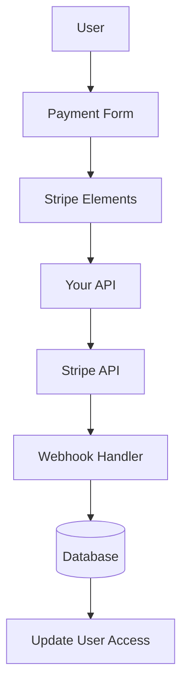

# Stripe-Konfiguration

In dieser Anleitung wird erläutert, wie Sie Stripe in Ihrer Ever Works-Anwendung mit einem vollständigen Abonnement- und Zahlungssystem konfigurieren.

## Übersicht

Stripe ist eine umfassende Zahlungsplattform, die Folgendes unterstützt:

- 💳 Einmalige Zahlungen
- 🔄 Wiederkehrende Abonnements
- 🌍 Mehrere Zahlungsmethoden (Karten, Apple Pay, Google Pay)
- 💰 Mehrere Währungen
- 📊 Erweiterte Analysen und Berichte

## Erforderliche Umgebungsvariablen

Fügen Sie diese Variablen zu Ihrer `.env.local` -Datei hinzu:

```bash
# Stripe Configuration
STRIPE_SECRET_KEY=sk_test_your_stripe_secret_key_here
STRIPE_WEBHOOK_SECRET=whsec_your_stripe_webhook_secret_here
NEXT_PUBLIC_STRIPE_PUBLISHABLE_KEY=pk_test_your_stripe_publishable_key_here

# Stripe Price IDs
NEXT_PUBLIC_STRIPE_SUBSCRIPTION_PRICE_ID=price_subscription_id_here
NEXT_PUBLIC_STRIPE_ONETIME_PRICE_ID=price_onetime_id_here
NEXT_PUBLIC_STRIPE_FREE_PRICE_ID=price_free_id_here

# Product Pricing (for display purposes)
NEXT_PUBLIC_PRODUCT_PRICE_PRO=10.00
NEXT_PUBLIC_PRODUCT_PRICE_SPONSOR=20.00
NEXT_PUBLIC_PRODUCT_PRICE_FREE=0.00
```

:::warning
Überlassen Sie Ihre geheimen Schlüssel niemals der Versionskontrolle. Behalten Sie `.env.local` in Ihrer `.gitignore` -Datei.
:::

## Stripe-Dashboard-Konfiguration

### Schritt 1: Produkte erstellen

In Ihrem [Stripe-Dashboard](https://dashboard.stripe.com/):

1. Navigieren Sie zu **Produkte** → **Produkt hinzufügen**
2. Erstellen Sie die folgenden Produkte:

| Produkt | Preis | Geben Sie | ein Beschreibung |
|---------|-------|------|-------------|
| **Kostenloser Plan** | 0,00 $ | Einmalig | Grundfunktionen |
| **Pro-Plan** | 10,00 $ | Monatsabonnement | Erweiterte Funktionen |
| **Sponsorplan** | 20,00 $ | Einmalig | Premium-Support |

3. Kopieren Sie die **Preis-ID** für jedes Produkt (beginnt mit `price_` )

### Schritt 2: Webhooks konfigurieren

Mithilfe von Webhooks kann Stripe Ihre Anwendung über Zahlungsereignisse benachrichtigen.

1. Gehen Sie zu **Entwickler** → **Webhooks** → **Endpunkt hinzufügen**
2. Legen Sie die Endpunkt-URL fest:
   - Entwicklung: `http://localhost:3000/api/stripe/webhook` - Produktion: `https://your-domain.com/api/stripe/webhook` 3. Wählen Sie Ereignisse aus, auf die Sie achten möchten:
   - `payment_intent.succeeded` - `payment_intent.payment_failed` - `customer.subscription.created` - `customer.subscription.updated` - `customer.subscription.deleted` - `customer.subscription.trial_will_end` - `invoice.payment_succeeded` - `invoice.payment_failed` 4. Kopieren Sie das **Signaturgeheimnis** (beginnt mit `whsec_` )

### Schritt 3: API-Schlüssel abrufen

In Ihrem Stripe-Dashboard:

1. **Geheimer Schlüssel**: **Entwickler** → **API-Schlüssel** → **Geheimer Schlüssel** (beginnt mit `sk_` )
2. **Veröffentlichbarer Schlüssel**: **Entwickler** → **API-Schlüssel** → **Veröffentlichbarer Schlüssel** (beginnt mit `pk_` )
3. **Webhook-Geheimnis**: **Entwickler** → **Webhooks** → Wählen Sie Ihren Webhook → **Signaturgeheimnis**

:::tip
Verwenden Sie während der Entwicklung die **Testmodus**-Tasten (sie beginnen mit `sk_test_` und `pk_test_` ). Wechseln Sie für die Produktion in den **Live-Modus**.
:::

## Zahlungssystemarchitektur



### Stripe-Anbieter

Der Stripe-Anbieter ( `lib/payment/lib/providers/stripe-provider.ts` ) implementiert:

- ✅ Kundenmanagement
- ✅ Erstellung von Zahlungsabsichten
- ✅ Abonnementverwaltung
- ✅ Webhook-Handhabung
- ✅ Unterstützung für Einrichtungsabsichten
- ✅ Rückerstattungen und Stornierungen

### API-Routen

Die folgenden API-Routen sind verfügbar:

| Route | Methode | Beschreibung |
|-------|--------|-------------|
| `/api/stripe/webhook` | POST | Behandeln Sie Stripe-Webhooks |
| `/api/stripe/subscription` | POST | Abonnement erstellen |
| `/api/stripe/subscription` | PUT | Abonnement aktualisieren |
| `/api/stripe/subscription` | LÖSCHEN | Abonnement kündigen |
| `/api/stripe/payment-intent` | POST | Zahlungsabsicht erstellen |
| `/api/stripe/payment-intent` | GET | Zahlung überprüfen |
| `/api/stripe/setup-intent` | POST | Zahlungsmethode einrichten |

### UI-Komponenten

Das System nutzt Stripe Elements für sichere Zahlungsformulare:

- `StripeElementsWrapper` – Hauptverpackungskomponente
- `StripePaymentForm` - Zahlungsformular mit Validierung
- Unterstützung für Apple Pay und Google Pay
- Responsive Design für Mobilgeräte und Desktops

## Anwendungsbeispiele

### Erstellen Sie ein Abonnement

```typescript
import { StripeProvider } from '@/lib/payment/providers/stripe-provider';

const configs = createProviderConfigs({
  apiKey: process.env.STRIPE_SECRET_KEY!,
  webhookSecret: process.env.STRIPE_WEBHOOK_SECRET!,
  options: {
    publishableKey: process.env.NEXT_PUBLIC_STRIPE_PUBLISHABLE_KEY!,
    apiVersion: '2023-10-16'
  }
});

const stripeProvider = new StripeProvider(configs.stripe);

const subscription = await stripeProvider.createSubscription({
  customerId: 'cus_customer_id',
  priceId: 'price_subscription_id',
  paymentMethodId: 'pm_payment_method_id',
  trialPeriodDays: 7
});
```

### Verwenden Sie die Zahlungskomponente

```tsx
import { PaymentForm } from '@/lib/payment';

function PaymentPage() {
  return (
    <PaymentForm
      amount={1000} // 10.00 USD in cents
      currency="usd"
      isSubscription={true}
      onSuccess={(paymentId) => {
        console.log('Payment succeeded:', paymentId);
        // Redirect to success page or update UI
      }}
      onError={(error) => {
        console.error('Payment error:', error);
        // Show error message to user
      }}
    />
  );
}
```

## Testen Sie Ihre Integration

### Testmodus

1. **Test-API-Schlüssel verwenden** (beginnen Sie mit `sk_test_` und `pk_test_` )
2. **Testkartennummern verwenden**:
   - Erfolg: `4242 4242 4242 4242` - Ablehnen: `4000 0000 0000 0002` - 3D Secure: `4000 0025 0000 3155` 3. **Webhooks lokal testen** mit Stripe CLI:

   „Bash
   Stripe Listen --forward-to localhost:3000/api/stripe/webhook
   „

### Webhook-Tests

```bash
# Install Stripe CLI
brew install stripe/stripe-cli/stripe

# Login to your Stripe account
stripe login

# Forward webhooks to your local server
stripe listen --forward-to localhost:3000/api/stripe/webhook

# Trigger test events
stripe trigger payment_intent.succeeded
```

## Fehlerbehandlung

Das System behandelt häufige Fehler automatisch:

| Fehlertyp | Handhabung |
|------------|----------|
| Karte abgelehnt | Benutzerfreundliche Fehlermeldung |
| Unzureichende Mittel | Mit anderer Karte erneut versuchen |
| Netzwerkprobleme | Automatische Wiederholungslogik |
| Webhook-Fehler | Zur manuellen Überprüfung angemeldet |
| Validierungsfehler | Formularfeldhervorhebung |

## Best Practices für die Sicherheit

1. **API-Schlüssel**:
   - Geben Sie niemals geheime Schlüssel im clientseitigen Code preis
   - Verwenden Sie Umgebungsvariablen
   - Schlüssel regelmäßig wechseln

2. **Webhook-Überprüfung**:
   - Überprüfen Sie stets Webhook-Signaturen
   - Validieren Sie Ereignisdaten vor der Verarbeitung

3. **Zahlungsdaten**:
   - Speichern Sie niemals Kartennummern
   - Nutzen Sie die Tokenisierung von Stripe
   - Implementieren Sie die PCI-Konformität

4. **Benutzersitzungen**:
   - Überprüfen Sie die Benutzerauthentifizierung
   - Benutzerberechtigungen validieren
   - Protokollieren Sie alle Zahlungsaktivitäten

## Abhängigkeiten

Erforderliche Pakete (bereits in Ever Works enthalten):

```json
{
  "@stripe/react-stripe-js": "^3.7.0",
  "@stripe/stripe-js": "^7.3.0",
  "stripe": "^18.1.0"
}
```

## Fehlerbehebung

### Häufige Probleme

**Problem**: Webhook empfängt keine Ereignisse

- **Lösung**: Überprüfen Sie, ob die Webhook-URL öffentlich zugänglich ist
- Verwenden Sie Stripe CLI für lokale Tests
– Überprüfen Sie, ob das Webhook-Geheimnis korrekt ist

**Problem**: Die Zahlung schlägt stillschweigend fehl

- **Lösung**: Überprüfen Sie die Browserkonsole auf Fehler
- Überprüfen Sie, ob die API-Schlüssel korrekt sind
- Überprüfen Sie die Stripe-Dashboard-Protokolle

**Problem**: 3D Secure funktioniert nicht

- **Lösung**: Stellen Sie sicher, dass Sie den Status `requires_action` verarbeiten
- Implementieren Sie den richtigen Weiterleitungsfluss
- Testen Sie mit 3D Secure-Testkarten

## Nächste Schritte

- [LemonSqueezy-Konfiguration](./lemonsqueezy) – Alternativer Zahlungsanbieter
- [Umgebungsvariablen](/deployment/environment-variables) – Umgebungseinrichtung abschließen
- [Bereitstellung](/deployment) – Stellen Sie Ihre Zahlungsintegration bereit

## Ressourcen

- [Stripe-Dokumentation](https://stripe.com/docs)
- [Next.js-Integrationsleitfaden](https://stripe.com/docs/zahlungen/accept-a-zahlung?platform=web&ui=elements)
- [Abonnementverwaltung](https://stripe.com/docs/billing/subscriptions)
- [Webhook-Ereignisse](https://stripe.com/docs/api/events/types)

## Unterstützung

Benötigen Sie Hilfe bei der Stripe-Integration? Schauen Sie sich unsere [Support-Seite](/advanced-guide/support) an oder treten Sie unserer Community bei.
