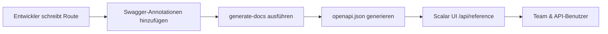

# API-Dokumentations-Training

Meistern Sie das automatisierte API-Dokumentationssystem mit Swagger-Annotationen und der Scalar UI.

## 🎯 Lernziele

Am Ende dieses Moduls werden Sie:

- ✅ Den API-Dokumentationsworkflow verstehen
- ✅ Korrekte Swagger-Annotationen schreiben
- ✅ Standardisierte Tag-Konventionen einhalten
- ✅ Dokumentation generieren und validieren
- ✅ Häufige Probleme beheben
- ✅ Hochwertige API-Dokumentation pflegen

**Geschätzte Zeit**: 2–3 Tage

---

## Warum dieses System?

### Gelöste Probleme

- **Inkonsistente Dokumentation**: Früher gab es 8 verschiedene Stripe-Tags über mehrere Endpunkte verteilt
- **Manuelle Synchronisierung**: Dokumentation oft veraltet im Vergleich zum tatsächlichen Code
- **Schlechte Entwicklererfahrung**: Einfache Swagger UI mit eingeschränkter Funktionalität
- **Keine Standards**: Jeder Entwickler dokumentierte unterschiedlich
- **Wartungsaufwand**: Separate Dokumentationsdateien zu pflegen

### Gewonnene Vorteile

- **Automatische Synchronisierung**: Dokumentation direkt aus Code-Annotationen generiert
- **Moderne Benutzeroberfläche**: Scalar UI mit interaktivem Testen und besserer UX
- **Konsistente Standards**: Einheitliches Tag-System und Dokumentationsmuster
- **Null Wartung**: Keine separaten Dokumentationsdateien zu pflegen
- **Bessere DX**: Entwickler dokumentieren beim Codieren, nicht nachträglich

---

## Systemarchitektur

### Kernkomponenten

1. **Swagger-Annotationen im Code**
   - JSDoc-Kommentare mit `@swagger`-Tags
   - OpenAPI 3.0-Spezifikationsformat
   - Direkt in Route-Dateien eingebettet
   - Versionskontrolliert mit dem Code

2. **generate-docs-Skript**
   - Scannt alle `app/api/**/route.ts`-Dateien
   - Extrahiert und validiert Swagger-Annotationen
   - Generiert einheitliche `public/openapi.json`
   - Erstellt automatische Sicherungskopien
   - Zusammenführung mit bestehender manueller Dokumentation

3. **Scalar UI-Oberfläche**
   - Moderne, responsive Dokumentationsoberfläche
   - Interaktive API-Testfähigkeiten
   - Erweiterte Such- und Filterfunktionen
   - Bessere UX als herkömmliche Swagger UI
   - Zugänglich unter `/api/reference`

4. **Automatisierte Workflow-Integration**
   - CI/CD-Validierung der Dokumentation
   - Pre-commit-Hooks für Konsistenz
   - Watch-Modus für die Entwicklung
   - Automatische Bereitstellung mit der App

### Vollständiger Workflow



---

## Erste Schritte

### 1. Dokumentation aufrufen

**Lokale Entwicklung**:

```bash
# Entwicklungsserver starten
yarn dev

# Dokumentation öffnen
open http://localhost:3000/api/reference
```

**Produktion**:

```bash
# Live-Dokumentation
https://demo.ever.works/api/reference
```

### 2. Wesentliche Befehle

```bash
# Dokumentation manuell generieren
yarn generate-docs

# Entwicklungsmodus mit Datei-Überwachung
yarn docs:watch

# Alle Annotationen validieren
yarn docs:validate

# Prüfen, ob Dokumentation aktuell ist
git status public/openapi.json
```

### 3. Entwicklungsworkflow

1. **Route erstellen/ändern** in `app/api/*/route.ts`
2. **Swagger-Annotationen hinzufügen** nach unseren Standards
3. **`yarn generate-docs` ausführen**, um Dokumentation zu aktualisieren
4. **Auf `/api/reference` prüfen**, ob die Dokumentation korrekt aussieht
5. **Änderungen committen** einschließlich der aktualisierten `public/openapi.json`

---

## Swagger-Annotationen schreiben

### Struktur verstehen

Jede Swagger-Annotation folgt der OpenAPI 3.0-Spezifikation und muss in einem JSDoc-Kommentarblock platziert werden, der mit `@swagger` beginnt.

---

## Standardisiertes Tag-System

### Warum konsistente Tags wichtig sind

Tags organisieren Endpunkte in der Scalar UI-Seitenleiste. Konsistente Tags bedeuten:

- **Bessere Navigation**: Benutzer finden verwandte Endpunkte leicht
- **Logische Gruppierung**: Ähnliche Funktionalität zusammengefasst
- **Professionelles Erscheinungsbild**: Saubere, organisierte Dokumentation
- **Skalierbarkeit**: Einfaches Hinzufügen neuer Endpunkte zu bestehenden Kategorien

### Unsere Tag-Konventionen

**Format**: `"Anbieter/Kategorie - Unterkategorie"` oder `"Kategorie"` für Kernfunktionen

#### Admin-Operationen

```yaml
"Admin - Users"        # Benutzerverwaltung (CRUD, Rollen, Berechtigungen)
"Admin - Categories"   # Kategorienverwaltung (erstellen, bearbeiten, löschen, neu anordnen)
"Admin - Items"        # Inhaltsverwaltung (genehmigen, ablehnen, hervorheben)
"Admin - Comments"     # Kommentarmoderation (löschen, genehmigen)
"Admin - Roles"        # Rollen- und Berechtigungsverwaltung
```

#### Kernfunktionen der Anwendung

```yaml
"Authentication"       # Anmeldung, Abmeldung, Passwortzurücksetzung, Sitzungsverwaltung
"Favorites"           # Benutzer-Favoriten (hinzufügen, entfernen, auflisten)
"Items & Content"     # Öffentliches Inhaltsbrowsing, Suche, Filterung
"Featured Items"      # Verwaltung hervorgehobener Inhalte
```

#### Zahlungssysteme

```yaml
"Stripe - Core"              # Checkout, Payment Intent, Setup Intent
"Stripe - Payment Methods"   # Zahlungsmethoden-CRUD-Operationen
"Stripe - Subscriptions"     # Abonnement-Lebenszyklusverwaltung
"Stripe - Webhooks"          # Webhook-Ereignisverarbeitung
"LemonSqueezy - Core"        # Alle LemonSqueezy-Operationen
"Payment Accounts"           # Anbieterübergreifende Kontoverwaltung
```

### Den richtigen Tag auswählen

**Entscheidungsbaum**:

1. **Ist es nur für Admins?** → `"Admin - [Kategorie]"` verwenden
2. **Ist es zahlungsbezogen?** → `"[Anbieter] - [Funktion]"` verwenden
3. **Ist es Kernfunktionalität?** → Einzelnes Wort wie `"Authentication"` verwenden
4. **Sind es benutzerspezifische Daten?** → `"User"` verwenden
5. **Ist es System/Infrastruktur?** → `"System"` verwenden

---

## Best Practices

### Effektive Beschreibungen schreiben

**Zusammenfassungsrichtlinien**:

- Aktionsverben verwenden: "Erstellen", "Aktualisieren", "Löschen", "Abrufen"
- Spezifisch sein: "Benutzerprofil abrufen" nicht "Benutzer abrufen"
- Unter 50 Zeichen für UI-Lesbarkeit halten

**Beschreibungsrichtlinien**:

- Den geschäftlichen Zweck erklären, nicht nur die technische Aktion
- Authentifizierungs-/Autorisierungsanforderungen einschließen
- Nebeneffekte oder wichtiges Verhalten erwähnen
- Maximal 1–3 Sätze verwenden

### Realistische Beispiele

Beispiele sind entscheidend für die API-Nutzbarkeit. Sie erscheinen in der Scalar UI und helfen Entwicklern, erwartete Datenformate zu verstehen:

```yaml
# ❌ Schlechte Beispiele
example: "string"
example: 123

# ✅ Gute Beispiele
example: "john.doe@company.com"
example: "user_123abc456def"
example: "2024-01-15T10:30:00.000Z"
```

---

## Entwickler-Checkliste

Vor dem Committen von API-Änderungen sicherstellen:

- [ ] Swagger-Annotation hinzugefügt oder aktualisiert
- [ ] Korrekter Tag aus standardisiertem System verwendet
- [ ] Sinnvolle Zusammenfassung und Beschreibung vorhanden
- [ ] Alle Anfrage-Body-Felder dokumentiert
- [ ] Alle Antwortcodes (2xx, 4xx, 5xx) dokumentiert
- [ ] Realistische Beispiele für alle Felder
- [ ] `yarn generate-docs` ausgeführt
- [ ] Dokumentation auf `/api/reference` verifiziert
- [ ] `public/openapi.json` im Commit enthalten
