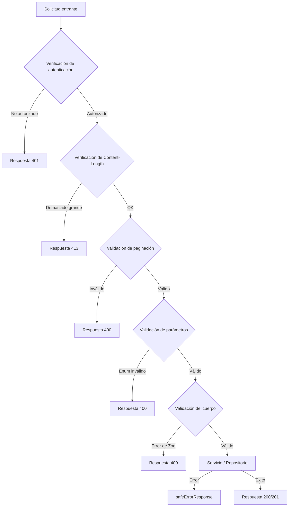

---
id: request-validation
title: "Validación de Solicitudes API"
sidebar_label: "Validación de Solicitudes"
sidebar_position: 8
---

# Validación de Solicitudes API

El template valida las solicitudes de la API en múltiples capas: esquemas Zod para validación de cuerpo/consulta, funciones de utilidad para paginación y límites de tamaño del cuerpo, y guardias de tipo en línea para parámetros de enumeración. Esta página documenta cada mecanismo de validación y cómo se utilizan en los manejadores de rutas de la API.

## Arquitectura de Validación



## Esquemas de Validación Zod

### Esquema de Ubicación (`lib/validations/item.ts`)

Todos los campos son opcionales; la rigurosidad se controla mediante la configuración del formulario:

```typescript
export const locationSchema = z.object({
  address: z.string().optional(),
  city: z.string().optional(),
  state: z.string().optional(),
  country: z.string().optional(),
  postal_code: z.string().optional(),
  latitude: z.number()
    .min(-90, 'Latitude must be between -90 and 90')
    .max(90, 'Latitude must be between -90 and 90')
    .optional(),
  longitude: z.number()
    .min(-180, 'Longitude must be between -180 and 180')
    .max(180, 'Longitude must be between -180 and 180')
    .optional(),
  service_area: z.enum(['local', 'regional', 'national', 'global']).optional(),
  is_remote: z.boolean().optional(),
  geocoded_by: z.enum(['mapbox', 'google']).optional(),
}).optional();
```

### Esquemas de Ítem de Cliente (`lib/validations/client-item.ts`)

#### Crear Ítem

```typescript
export const clientCreateItemSchema = z.object({
  name: z.string()
    .min(ITEM_VALIDATION.NAME_MIN_LENGTH)
    .max(ITEM_VALIDATION.NAME_MAX_LENGTH),
  description: z.string()
    .min(ITEM_VALIDATION.DESCRIPTION_MIN_LENGTH)
    .max(ITEM_VALIDATION.DESCRIPTION_MAX_LENGTH),
  source_url: z.string().url('Invalid URL format'),
  category: z.union([
    z.string().min(1, 'Category is required'),
    z.array(z.string().min(1)).min(1),
  ]).optional().nullable(),
  tags: z.array(z.string().min(1)).optional().default([]),
  icon_url: z.string().url().optional().or(z.literal('')),
  location: locationSchema,
});
```

#### Actualizar Ítem

Utiliza las mismas definiciones de campo con todos los campos opcionales:

```typescript
export const clientUpdateItemSchema = z.object({
  name: z.string().min(...).max(...).optional(),
  description: z.string().min(...).max(...).optional(),
  source_url: z.string().url().optional(),
  category: z.union([z.string(), z.array(z.string())]).optional(),
  tags: z.array(z.string()).optional(),
  icon_url: z.string().url().optional().or(z.literal('')),
  location: locationSchema,
});
```

#### Parámetros de Consulta de Lista

Los parámetros de consulta usan `.transform()` para convertir entradas de cadena a valores tipados:

```typescript
export const clientItemsListQuerySchema = z.object({
  page: z.string().optional()
    .transform(val => (val ? parseInt(val, 10) : 1))
    .refine(val => !Number.isNaN(val))
    .refine(val => val >= 1),
  limit: z.string().optional()
    .transform(val => (val ? parseInt(val, 10) : 10))
    .refine(val => !Number.isNaN(val))
    .refine(val => val >= 1 && val <= 100),
  status: z.enum(['all', 'pending', 'approved', 'rejected']).optional().default('all'),
  search: z.string().max(100).optional(),
  sortBy: z.enum(['name', 'updated_at', 'status', 'submitted_at']).optional().default('updated_at'),
  sortOrder: z.enum(['asc', 'desc']).optional().default('desc'),
  deleted: z.string().optional().transform(val => val === 'true'),
});
```

### Esquema de Contraseña (`lib/validations/auth.ts`)

```typescript
export const passwordSchema = z.string()
  .min(8, "Password must be at least 8 characters")
  .regex(/[A-Z]/, "Must contain at least one uppercase letter")
  .regex(/[a-z]/, "Must contain at least one lowercase letter")
  .regex(/[0-9]/, "Must contain at least one number")
  .regex(/[^A-Za-z0-9]/, "Must contain at least one special character");
```

### Esquemas de Empresa (`lib/validations/company.ts`)

```typescript
export const createCompanySchema = z.object({
  name: z.string().min(1).max(255),
  website: z.string().url().optional().or(z.literal("")),
  domain: z.string().max(255).optional()
    .transform(val => val?.toLowerCase().trim() || undefined),
  slug: z.string().max(255).optional()
    .transform(val => val?.toLowerCase().trim() || undefined)
    .refine(val => !val || /^[a-z0-9-]+$/.test(val)),
  status: z.enum(["active", "inactive"]).default("active"),
});
```

### Tipos Inferidos

Todos los esquemas exportan tipos inferidos de Zod junto al esquema:

```typescript
export type ClientUpdateItemInput = z.infer<typeof clientUpdateItemSchema>;
export type ClientCreateItemInput = z.infer<typeof clientCreateItemSchema>;
export type CreateCompanyInput = z.infer<typeof createCompanySchema>;
```

## Validación de Paginación (`lib/utils/pagination-validation.ts`)

Una utilidad compartida para validar los parámetros de consulta `page` y `limit`:

```typescript
export function validatePaginationParams(
  searchParams: URLSearchParams
): PaginationParams | PaginationError {
  const page = pageParam ? parseInt(pageParam, 10) : 1;
  const limit = limitParam ? parseInt(limitParam, 10) : 10;

  if (isNaN(page) || page < 1) {
    return { error: 'Invalid page parameter. Must be a positive integer.', status: 400 };
  }
  if (isNaN(limit) || limit < 1 || limit > 100) {
    return { error: 'Invalid limit parameter. Must be between 1 and 100.', status: 400 };
  }
  return { page, limit };
}
```

El uso en los manejadores de rutas sigue un patrón de unión discriminada:

```typescript
const paginationResult = validatePaginationParams(searchParams);
if ('error' in paginationResult) {
  return NextResponse.json(
    { success: false, error: paginationResult.error },
    { status: paginationResult.status }
  );
}
const { page, limit } = paginationResult;
```

## Límites de Tamaño del Cuerpo de la Solicitud (`lib/utils/request-body.ts`)

### `readBodyWithLimit`

Lee el cuerpo de la solicitud mediante `ReadableStream` con verificación incremental del tamaño:

```typescript
export async function readBodyWithLimit<T = unknown>(
  request: NextRequest,
  options: ReadBodyOptions
): Promise<ReadBodyResult<T>>
```

Características:
- Ruta rápida: verifica primero el encabezado `Content-Length`
- Incremental: lee fragmentos del stream y verifica el tamaño a medida que llegan los bytes
- Cancelación: llama a `reader.cancel()` cuando se excede el límite
- Análisis JSON: opcional, maneja `SyntaxError` de forma elegante

```typescript
// Uso
const { data } = await readBodyWithLimit(request, { maxSize: 1024 });
```

### `validateContentLength`

Rechazo temprano sin leer el cuerpo:

```typescript
export function validateContentLength(request: NextRequest, maxSize: number): boolean
```

Lanza `BodySizeLimitError` si el encabezado `Content-Length` excede el límite.

### `BodySizeLimitError`

Clase de error personalizada con propiedades `maxSize` y `actualSize`:

```typescript
export class BodySizeLimitError extends Error {
  constructor(
    public readonly maxSize: number,
    public readonly actualSize: number
  ) {
    super(`Request body too large. Maximum size is ${maxSize} bytes, received ${actualSize} bytes.`);
  }
}
```

## Validación de Parámetros en Línea

Para parámetros de enumeración no cubiertos por los esquemas Zod, los manejadores de rutas usan guardias de tipo en línea:

```typescript
// Validación de estado con seguridad de tipos
const validStatuses = ['draft', 'pending', 'approved', 'rejected'] as const;
type ItemStatus = (typeof validStatuses)[number];
const isItemStatus = (s: string): s is ItemStatus =>
  (validStatuses as readonly string[]).includes(s);

if (statusParam && !isItemStatus(statusParam)) {
  return NextResponse.json(
    { success: false, error: `Invalid status. Must be one of: ${validStatuses.join(', ')}` },
    { status: 400 }
  );
}
```

Este patrón se repite para los parámetros `sortBy` y `sortOrder`.

## Desinfección de Entradas de Búsqueda

Los parámetros de búsqueda de texto se recortan y normalizan:

```typescript
const searchRaw = searchParams.get('search');
const search = searchRaw?.trim() ? searchRaw.trim() : undefined;
```

Los parámetros CSV se analizan y normalizan:

```typescript
const parseCsv = (value: string | null): string[] | undefined => {
  if (!value) return undefined;
  const arr = value.split(',').map(v => v.trim()).filter(Boolean);
  return arr.length ? arr : undefined;
};
```

## Utilidades de Paginación (`lib/paginate.ts`)

Auxiliares de paginación simples para paginación a nivel de template:

```typescript
export const PER_PAGE = 12;

export function totalPages(size: number, perPage: number = PER_PAGE) {
  return Math.ceil(size / perPage);
}

export function paginateMeta(rawPage: number | string = 1, perPage: number = PER_PAGE) {
  const page = typeof rawPage === 'string' ? parseInt(rawPage) : rawPage;
  const start = (page - 1) * perPage;
  return { page, start };
}
```

## Resumen de la Capa de Validación

| Capa | Ubicación | Mecanismo | Propósito |
|-------|----------|-----------|---------|
| Autenticación | Manejador de ruta | `session?.user?.isAdmin` | Control de acceso basado en roles |
| Tamaño del cuerpo | `lib/utils/request-body.ts` | Lector de stream | Prevenir cargas demasiado grandes |
| Paginación | `lib/utils/pagination-validation.ts` | Análisis de URLSearchParams | Validar page/limit |
| Parámetros de enum | Manejador de ruta en línea | Funciones de guardia de tipo | Validar status, sortBy, etc. |
| Esquema del cuerpo | `lib/validations/*.ts` | Esquemas Zod | Validación de entrada estructurada |
| Búsqueda | Manejador de ruta en línea | Recorte + análisis CSV | Desinfección de entrada |
