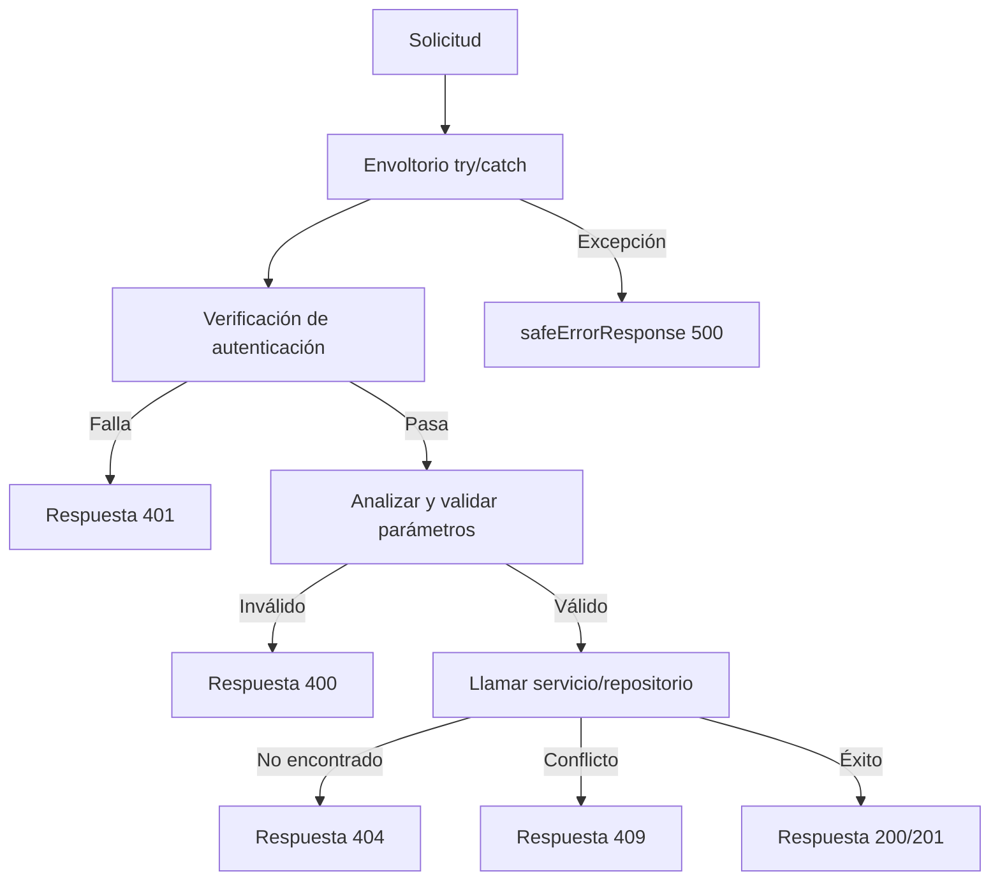

---
id: response-patterns
title: "Patrones de Respuesta API"
sidebar_label: "Patrones de Respuesta"
sidebar_position: 9
---

# Patrones de Respuesta API

Todas las rutas de la API siguen convenciones de respuesta consistentes: tipos de unión discriminada para éxito/error, mensajes de error adaptados al entorno, códigos de estado HTTP estándar y documentación con Swagger/JSDoc. Esta página cubre cada patrón.

## Sistema de Tipos de Respuesta

### Unión Discriminada (`lib/api/types.ts`)

Las respuestas de la API usan un booleano `success` como discriminante:

```typescript
export type ApiResponse<T = unknown> =
  | { success: true; data: T; total?: number; page?: number; limit?: number; totalPages?: number }
  | { success: false; error: string };
```

Esto permite a los llamadores reducir el tipo de forma segura:

```typescript
const response: ApiResponse<User[]> = await fetchUsers();
if (response.success) {
  // TypeScript sabe: response.data es User[]
  console.log(response.data);
} else {
  // TypeScript sabe: response.error es string
  console.error(response.error);
}
```

### Respuesta Paginada

Los endpoints de lista usan un contenedor paginado dedicado:

```typescript
export type PaginatedResponse<T> =
  | {
      success: true;
      data: T[];
      meta: {
        page: number;
        totalPages: number;
        total: number;
        limit: number;
      };
    }
  | { success: false; error: string };
```

### Tipos de Error

```typescript
export interface ApiError {
  message: string;
  status?: number;
  code?: string;
}

export interface ErrorResponse {
  success: false;
  error: string;
}
```

## Formas de Respuesta Estándar

### Respuestas Exitosas

#### Recurso Individual

```typescript
return NextResponse.json({
  success: true,
  item,
  message: "Item created successfully",
}, { status: 201 });
```

#### Lista con Paginación

```typescript
return NextResponse.json({
  success: true,
  items: result.items,
  total: result.total,
  page: result.page,
  limit: result.limit,
  totalPages: result.totalPages,
});
```

#### Confirmación de Acción

```typescript
return NextResponse.json({
  success: true,
  message: "Profile updated successfully",
});
```

### Respuestas de Error

Todas las respuestas de error incluyen `success: false` y una cadena `error`:

```typescript
// No autorizado
return NextResponse.json(
  { success: false, error: "Unauthorized. Admin access required." },
  { status: 401 }
);

// Error de validación
return NextResponse.json(
  { success: false, error: "Invalid page parameter. Must be a positive integer." },
  { status: 400 }
);

// Conflicto
return NextResponse.json(
  { success: false, error: `Item with slug '${slug}' already exists` },
  { status: 409 }
);
```

## Convenciones de Códigos de Estado HTTP

| Estado | Uso | Ejemplo |
|--------|-------|---------|
| `200` | GET, PUT, PATCH, DELETE exitosos | Listar ítems, actualizar perfil |
| `201` | POST exitoso (recurso creado) | Crear ítem, crear comentario |
| `400` | Parámetros o cuerpo inválidos | Paginación incorrecta, campos requeridos faltantes |
| `401` | Autenticación requerida o fallida | Sesión faltante, usuario no administrador |
| `404` | Recurso no encontrado | Ítem no encontrado, perfil no encontrado |
| `409` | Conflicto (recurso duplicado) | ID o slug de ítem duplicado |
| `413` | Cuerpo de solicitud demasiado grande | Cuerpo excede el máximo de `readBodyWithLimit` |
| `500` | Error interno del servidor | Excepciones no manejadas |

## Respuesta de Error Segura (`lib/utils/api-error.ts`)

### `safeErrorResponse`

Previene la fuga de información mostrando mensajes genéricos en producción y mensajes detallados en desarrollo:

```typescript
export function safeErrorResponse(
  error: unknown,
  fallbackMessage: string,
  status: number = 500
): NextResponse {
  const detail = error instanceof Error ? error.message : String(error);

  // Siempre registra los detalles completos del lado del servidor
  console.error(`[API Error] ${fallbackMessage}:`, detail);

  const message = process.env.NODE_ENV === "development" ? detail : fallbackMessage;

  return NextResponse.json({ success: false, error: message }, { status });
}
```

Uso en manejadores de rutas:

```typescript
export async function GET(request: NextRequest) {
  try {
    // ... lógica del manejador
  } catch (error) {
    return safeErrorResponse(error, 'Failed to fetch items');
  }
}
```

### `safeErrorMessage`

Extrae un mensaje seguro sin crear un `NextResponse`:

```typescript
export function safeErrorMessage(error: unknown, fallbackMessage: string): string {
  if (process.env.NODE_ENV === "development") {
    return error instanceof Error ? error.message : String(error);
  }
  return fallbackMessage;
}
```

### Comportamiento por Entorno

| Entorno | Salida de error | Registro del servidor |
|-------------|-------------|------------|
| Desarrollo | `error.message` (detalle completo) | Error completo registrado |
| Producción | `fallbackMessage` (genérico) | Error completo registrado |

## Estructura del Manejador de Ruta

Todos los manejadores de rutas de la API siguen una estructura consistente:



### Ejemplo Canónico de Manejador GET

```typescript
export async function GET(request: NextRequest) {
  try {
    // 1. Verificación de autenticación
    const session = await auth();
    if (!session?.user?.isAdmin) {
      return NextResponse.json(
        { success: false, error: "Unauthorized. Admin access required." },
        { status: 401 }
      );
    }

    // 2. Analizar y validar parámetros
    const { searchParams } = new URL(request.url);
    const paginationResult = validatePaginationParams(searchParams);
    if ('error' in paginationResult) {
      return NextResponse.json(
        { success: false, error: paginationResult.error },
        { status: paginationResult.status }
      );
    }

    // 3. Llamar a la capa de servicio
    const result = await repository.findAll(paginationResult);

    // 4. Devolver respuesta estructurada
    return NextResponse.json({
      success: true,
      items: result.items,
      total: result.total,
      page: result.page,
      limit: result.limit,
      totalPages: result.totalPages,
    });

  } catch (error) {
    return safeErrorResponse(error, 'Failed to fetch items');
  }
}
```

### Ejemplo Canónico de Manejador POST

```typescript
export async function POST(request: NextRequest) {
  try {
    // 1. Verificación de autenticación
    const session = await auth();
    if (!session?.user?.isAdmin) {
      return NextResponse.json(
        { success: false, error: "Unauthorized." },
        { status: 401 }
      );
    }

    // 2. Analizar y validar cuerpo
    const body = await request.json();
    if (!body.name || !body.description) {
      return NextResponse.json(
        { success: false, error: "Name and description are required" },
        { status: 400 }
      );
    }

    // 3. Verificar conflictos
    const existing = await repository.findBySlug(body.slug);
    if (existing) {
      return NextResponse.json(
        { success: false, error: `Resource with slug '${body.slug}' already exists` },
        { status: 409 }
      );
    }

    // 4. Crear recurso
    const item = await repository.create(body);

    // 5. Devolver recurso creado
    return NextResponse.json({
      success: true,
      item,
      message: "Created successfully",
    }, { status: 201 });

  } catch (error) {
    return safeErrorResponse(error, 'Failed to create resource');
  }
}
```

## Documentación Swagger / JSDoc

Las rutas de la API están documentadas con anotaciones Swagger en línea para documentación generada automáticamente:

```typescript
/**
 * @swagger
 * /api/admin/items:
 *   get:
 *     tags: ["Admin - Items"]
 *     summary: "Get paginated items list"
 *     security:
 *       - sessionAuth: []
 *     parameters:
 *       - name: "page"
 *         in: "query"
 *         schema:
 *           type: integer
 *           minimum: 1
 *           default: 1
 *     responses:
 *       200:
 *         description: "Items list retrieved successfully"
 *       400:
 *         description: "Bad request"
 *       401:
 *         description: "Unauthorized"
 *       500:
 *         description: "Internal server error"
 */
```

## Tipos de API del Lado del Cliente

La configuración del cliente de la API y las opciones de fetch:

```typescript
export interface ApiClientConfig extends Partial<AxiosRequestConfig> {
  baseURL?: string;
  timeout?: number;
  headers?: Record<string, string>;
  accessToken?: string;
  frontendUrl?: string;
}

export interface FetchOptions {
  method?: 'GET' | 'POST' | 'PUT' | 'PATCH' | 'DELETE';
  headers?: Record<string, string>;
  body?: unknown;
  params?: Record<string, string | number | boolean | undefined>;
}
```

## Resumen de Convenciones

| Convención | Descripción |
|------------|-------------|
| Todas las respuestas incluyen `success` | Unión discriminada para seguridad de tipos |
| Los errores usan `{ success: false, error: string }` | Forma de error consistente |
| `safeErrorResponse` envuelve los bloques catch | Enmascaramiento de errores adaptado al entorno |
| La paginación usa `total`, `page`, `limit`, `totalPages` | Metadatos consistentes |
| La verificación de autenticación es la primera operación | Patrón fail-fast |
| La validación devuelve temprano en caso de fallo | Sin condicionales anidados |
| Anotaciones Swagger en todas las rutas de administrador | Documentación API generada automáticamente |
