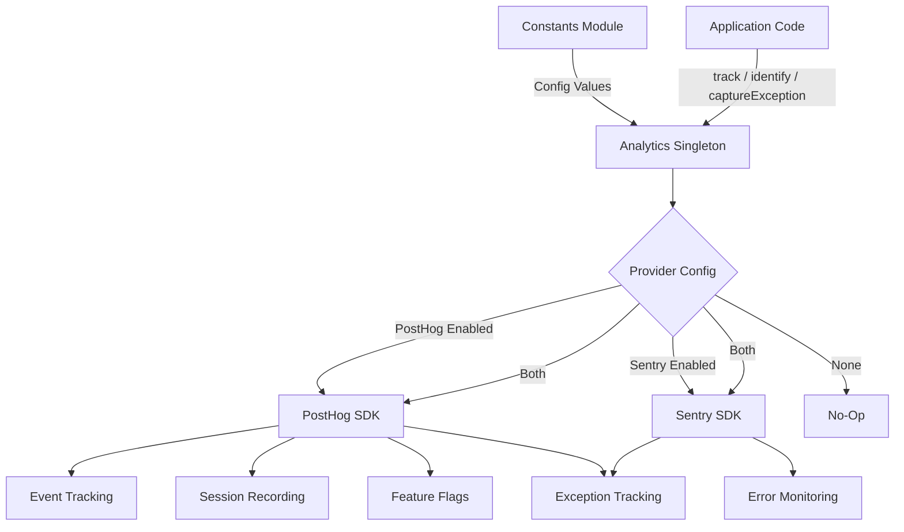
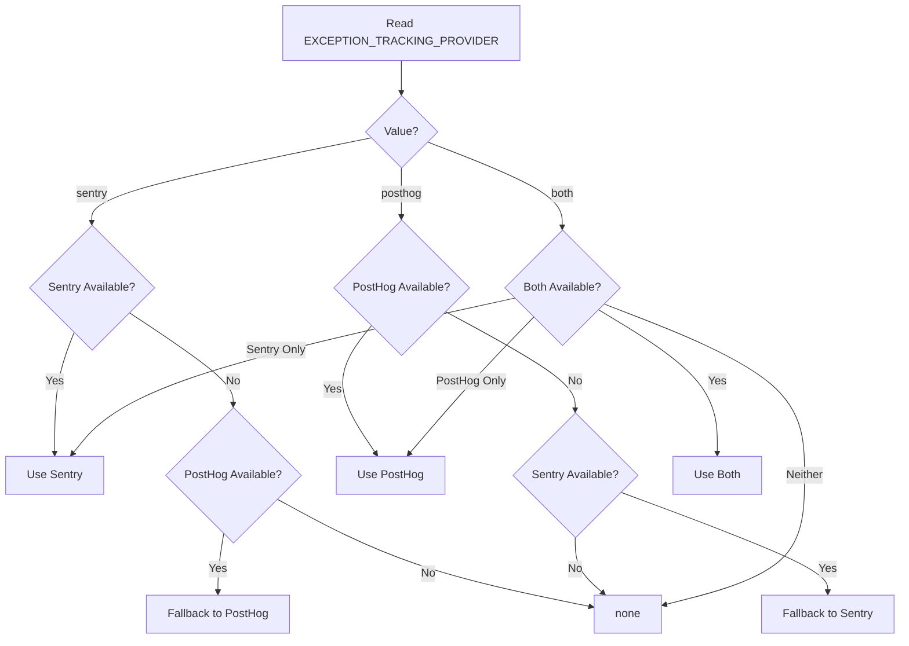

# Módulo de análisis

El módulo de análisis (`template/lib/analytics/`) proporciona una clase singleton unificada para el seguimiento de eventos del lado del cliente, la identificación de usuarios, la evaluación de indicadores de características y la captura de excepciones. Integra **PostHog** para análisis de productos y **Sentry** para monitoreo de errores, con soporte para usar cualquiera de los proveedores individualmente, ambos simultáneamente o ninguno.

## Descripción general de la arquitectura



## Archivos fuente

|Archivo|Descripción|
|------|-------------|
|`lib/analytics/index.ts`|`Analytics` clase singleton y `analytics` exportación|

## Clase principal: `Analytics`

La clase `Analytics` es un singleton que envuelve PostHog y Sentry. Es seguro llamar en el lado del servidor: todos los métodos regresan silenciosamente cuando `window` no está definido.

### Definiciones de tipo

```typescript
type EventProperties = Properties;          // PostHog Properties type
type UserProperties = Record<string, any>;
type ExceptionTrackingProvider = 'sentry' | 'posthog' | 'both' | 'none';
```

### Acceso único

```typescript
// Get the singleton instance
const analytics = Analytics.getInstance();

// Or use the pre-created export
import { analytics } from '@/lib/analytics';
```

### `init(): void`

Inicializa PostHog con configuración centralizada y configura el seguimiento de excepciones. Se debe llamar una vez en el lado del cliente (normalmente en un diseño raíz o componente de proveedor).

```typescript
// In your root layout or PostHog provider
'use client';
import { analytics } from '@/lib/analytics';

useEffect(() => {
  analytics.init();
}, []);
```

**Comportamiento:**
- Omite la inicialización si ya está inicializada o si se ejecuta en el lado del servidor
- Lee la configuración de constantes (`POSTHOG_KEY`, `POSTHOG_HOST`, `POSTHOG_ENABLED`, etc.)
- Configura la grabación de sesiones con enmascaramiento cuando `POSTHOG_SESSION_RECORDING_ENABLED` es verdadero
- Aplica una tasa de muestreo (`POSTHOG_SAMPLE_RATE`): en producción, el valor predeterminado es 10 %.
- Configura los controladores globales `window.onerror` y `unhandledrejection` cuando el seguimiento de excepciones de PostHog está habilitado
- Vincula PostHog con Sentry cuando ambos proveedores están activos

### `identify(userId: string, properties?: UserProperties): void`

Asocia el usuario anónimo actual con un ID de usuario identificado. También establece el contexto del usuario de Sentry cuando Sentry está habilitado.

```typescript
analytics.identify(session.user.id, {
  email: session.user.email,
  plan: 'premium',
});
```

### `reset(): void`

Restablece la identidad del usuario actual (por ejemplo, al cerrar sesión). Borra los contextos de usuario de PostHog y Sentry.

```typescript
analytics.reset();
```

### `track(eventName: string, properties?: EventProperties): void`

Captura un evento personalizado en PostHog.

```typescript
analytics.track('item_submitted', {
  itemId: 'abc-123',
  category: 'SaaS Tools',
});
```

### `trackPageView(url: string, properties?: EventProperties): void`

Captura manualmente un evento de vista de página. Úselo cuando `POSTHOG_AUTO_CAPTURE` esté deshabilitado y necesite un seguimiento explícito de las visitas a la página.

```typescript
analytics.trackPageView(window.location.href, {
  referrer: document.referrer,
});
```

### `isFeatureEnabled(flagKey: string, defaultValue?: boolean): boolean`

Evalúa un indicador de función de PostHog de forma sincrónica.

```typescript
const showNewUI = analytics.isFeatureEnabled('new-dashboard-ui', false);
```

### `reloadFeatureFlags(): Promise<void>`

Fuerza una recuperación de indicadores de funciones del servidor PostHog.

```typescript
await analytics.reloadFeatureFlags();
```

### `captureException(error: Error | string, context?: Record<string, any>): void`

Seguimiento de excepciones unificado que se envía a los proveedores configurados.

```typescript
try {
  await riskyOperation();
} catch (error) {
  analytics.captureException(error, {
    component: 'PaymentForm',
    action: 'submit',
  });
}
```

**Enrutamiento del proveedor:**
- `'posthog'` -- Envía el evento `$exception` a PostHog con seguimiento de pila
- `'sentry'` -- Llama a `Sentry.captureException` con contexto adicional
- `'both'` -- Envía a ambos proveedores
- `'none'` -- Descarta silenciosamente

### `captureError(error: Error, context?: Record<string, any>): void`

**Obsoleto.** Alias de `captureException`. Registra una advertencia de obsolescencia.

### `getExceptionTrackingProvider(): ExceptionTrackingProvider`

Devuelve el proveedor de seguimiento de excepciones actualmente activo.

### `setUserProperties(properties: UserProperties): void`

Establece propiedades de usuario persistentes en el perfil de persona de PostHog a través de `posthog.people.set()`.

```typescript
analytics.setUserProperties({
  subscription_tier: 'premium',
  company: 'Acme Corp',
});
```

### `setSuperProperties(properties: Record<string, any>): void`

Registra superpropiedades enviadas con cada evento posterior a través de `posthog.register()`.

```typescript
analytics.setSuperProperties({
  app_version: '2.1.0',
  environment: 'production',
});
```

## Constantes de configuración

Toda la configuración de análisis está impulsada por constantes de `lib/constants.ts`:

|constante|Predeterminado|Descripción|
|----------|---------|-------------|
|`POSTHOG_KEY`|var env|Clave API del proyecto PostHog|
|`POSTHOG_HOST`|var env|URL del host de la API de PostHog|
|`POSTHOG_ENABLED`|derivado|Verdadero cuando se configuran tanto la clave como el host|
|`POSTHOG_DEBUG`|var env|Habilitar el registro de depuración de PostHog|
|`POSTHOG_SESSION_RECORDING_ENABLED`|`'true'`|Habilitar grabación de sesión|
|`POSTHOG_AUTO_CAPTURE`|`'false'`|Captura automática de vistas de página|
|`POSTHOG_SAMPLE_RATE`|`0.1` (producción) / `1.0` (desarrollador)|Tasa de muestreo de eventos|
|`POSTHOG_SESSION_RECORDING_SAMPLE_RATE`|`0.1` (producción) / `1.0` (desarrollador)|Frecuencia de muestreo de grabación|
|`EXCEPTION_TRACKING_PROVIDER`|`'both'`|¿Qué proveedor maneja las excepciones?|
|`SENTRY_ENABLED`|derivado|Verdadero cuando DSN está configurado y env lo permite|

## Resolución del proveedor de seguimiento de excepciones

El proveedor se determina en el momento de la construcción con una lógica alternativa:



## Uso con Next.js

Integración típica en un proyecto de Next.js App Router:

```tsx
// app/providers.tsx
'use client';
import { useEffect } from 'react';
import { analytics } from '@/lib/analytics';
import { useSession } from 'next-auth/react';
import { usePathname } from 'next/navigation';

export function AnalyticsProvider({ children }: { children: React.ReactNode }) {
  const { data: session } = useSession();
  const pathname = usePathname();

  useEffect(() => {
    analytics.init();
  }, []);

  useEffect(() => {
    if (session?.user?.id) {
      analytics.identify(session.user.id, {
        email: session.user.email,
      });
    }
  }, [session]);

  useEffect(() => {
    analytics.trackPageView(pathname);
  }, [pathname]);

  return <>{children}</>;
}
```
