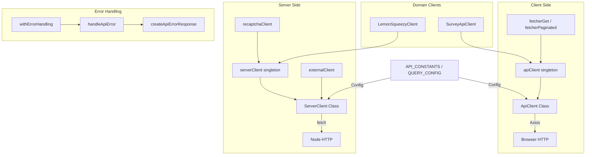

# Módulo de cliente API

El módulo de cliente API (`template/lib/api/`) proporciona una capa de cliente HTTP integral para la comunicación API tanto del lado del cliente como del lado del servidor. Incluye un cliente basado en Axios para uso del navegador, un cliente de servidor nativo basado en `fetch` con almacenamiento en caché y reintentos, clientes de dominio especializados y manejo de errores estandarizado.

## Descripción general de la arquitectura



## Archivos fuente

|Archivo|Descripción|
|------|-------------|
|`lib/api/types.ts`|Definiciones de tipos compartidos para la capa API|
|`lib/api/constants.ts`|Constantes API y configuración de consultas.|
|`lib/api/api-client-class.ts`|`ApiClient` -- Cliente basado en Axios para navegador|
|`lib/api/singleton.ts`|`ApiClientSingleton` gerente|
|`lib/api/api-client.ts`|Instancia de cliente prediseñada y asistentes de recuperación|
|`lib/api/server-api-client.ts`|`ServerClient` -- cliente de servidor basado en búsqueda|
|`lib/api/error-handler.ts`|Manejo de errores API estandarizado|
|`lib/api/lemonsqueezy-client.ts`|Cliente de pago LemonSqueezy|
|`lib/api/survey-api.client.ts`|Encuesta cliente CRUD|

## Definiciones de tipo

### Tipos de núcleos

```typescript
type ApiEndpoint = string;
type QueryParams = Record<string, string | number | boolean | undefined>;
type RequestBody = Record<string, unknown>;

interface PaginationParams {
  page?: number;
  limit?: number;
  search?: string;
  sortBy?: string;
  sortOrder?: 'asc' | 'desc';
}
```

### Tipos de respuesta (sindicatos discriminados)

```typescript
type ApiResponse<T = unknown> =
  | { success: true; data: T; total?: number; page?: number; limit?: number; totalPages?: number }
  | { success: false; error: string };

type PaginatedResponse<T> =
  | { success: true; data: T[]; meta: { page: number; totalPages: number; total: number; limit: number } }
  | { success: false; error: string };
```

### Configuración del cliente

```typescript
interface ApiClientConfig extends Partial<AxiosRequestConfig> {
  baseURL?: string;
  timeout?: number;
  headers?: Record<string, string>;
  accessToken?: string;
  frontendUrl?: string;
}

interface ApiError {
  message: string;
  status?: number;
  code?: string;
}
```

## Lado del cliente: `ApiClient`

La clase `ApiClient` envuelve Axios con inyección automática de tokens, manejo de errores de respuesta y respuestas escritas.

### Constructor

```typescript
const client = new ApiClient({
  baseURL: 'https://api.example.com',
  accessToken: 'bearer-token',
  headers: { 'X-Custom': 'value' },
});
```

### Métodos HTTP

Todos los métodos desenvuelven el sobre `ApiResponse` y devuelven el campo `data` directamente:

```typescript
// GET with query params
const items = await client.get<Item[]>('/items', { category: 'tools', limit: 10 });

// POST with body
const created = await client.post<Item>('/items', { name: 'New Tool', url: 'https://...' });

// PUT
const updated = await client.put<Item>('/items/123', { name: 'Updated' });

// PATCH
const patched = await client.patch<Item>('/items/123', { status: 'approved' });

// DELETE
await client.delete<void>('/items/123');

// Paginated GET
const page = await client.getPaginated<Item>('/items', { page: 1, limit: 20, search: 'react' });
```

### Acceso único

```typescript
import { getApiClient } from '@/lib/api/singleton';

const client = getApiClient();                    // Default instance
ApiClientSingleton.resetInstance();                // Reset (for tests)
```

### Exportaciones de conveniencia

```typescript
import { apiClient, fetcherGet, fetcherPaginated } from '@/lib/api/api-client';

// Use with React Query / SWR
const data = await fetcherGet<Item[]>('/api/items', { status: 'published' });
const page = await fetcherPaginated<Item>('/api/items', { page: 1, limit: 20 });
```

## Lado del servidor: `ServerClient`

La clase `ServerClient` utiliza `fetch` nativo con manejo de tiempo de espera, reintentos automáticos, almacenamiento en caché LRU y resolución de URL específica del servidor.

### Características clave

- **Manejo del tiempo de espera** con `AbortController` (predeterminado: 30 segundos)
- **Reintentos automáticos** en caso de errores de red (predeterminado: 3 reintentos con 1 segundo de retraso)
- **Caché LRU en memoria** para solicitudes GET (100 entradas, TTL de 5 minutos)
- **Resolución de URL del servidor** para rutas API internas durante SSR
- **Soporte de FormData** con manejo automático de tipo de contenido

### Instancias prediseñadas

```typescript
import { serverClient, externalClient, createApiClient, recaptchaClient } from '@/lib/api/server-api-client';

// Default server client
const result = await serverClient.get<UserData>('/api/users/me');

// External API client (15s timeout, 2 retries)
const external = await externalClient.get<any>('https://api.third-party.com/data');

// Custom client
const customClient = createApiClient('https://api.service.com', { timeout: 10000 });

// ReCAPTCHA verification
const captcha = await recaptchaClient.verify(token);
```

### Métodos HTTP

```typescript
// All methods return ApiResponse<T>
const result = await serverClient.get<T>(endpoint, options?);
const result = await serverClient.post<T>(endpoint, data?, options?);
const result = await serverClient.put<T>(endpoint, data?, options?);
const result = await serverClient.patch<T>(endpoint, data?, options?);
const result = await serverClient.delete<T>(endpoint, options?);

// File upload
const result = await serverClient.upload<T>(endpoint, fileOrFormData, options?);

// URL-encoded form data
const result = await serverClient.postForm<T>(endpoint, { key: 'value' }, options?);
```

### Control de caché

```typescript
serverClient.setCacheEnabled(false);   // Disable caching
serverClient.clearCache();             // Clear all cached responses
apiUtils.clearCache();                 // Same via utility
```

### Funciones de utilidad

```typescript
import { apiUtils } from '@/lib/api/server-api-client';

apiUtils.isSuccess(response);                              // Type guard
apiUtils.getErrorMessage(response);                        // Extract error
apiUtils.createQueryString({ page: 1, limit: 20 });       // 'page=1&limit=20'
apiUtils.buildUrl('/api/items', { page: 1, limit: 20 });  // '/api/items?page=1&limit=20'
```

## Manejo de errores

### `HttpStatus` Enumeración

```typescript
enum HttpStatus {
  BAD_REQUEST = 400,
  UNAUTHORIZED = 401,
  FORBIDDEN = 403,
  NOT_FOUND = 404,
  METHOD_NOT_ALLOWED = 405,
  CONFLICT = 409,
  UNPROCESSABLE_ENTITY = 422,
  INTERNAL_SERVER_ERROR = 500,
  SERVICE_UNAVAILABLE = 503,
}
```

### `handleApiError(error, context?): NextResponse`

Maneja errores de ruta API con detección automática de códigos de estado a partir de mensajes de error:

```typescript
import { handleApiError } from '@/lib/api/error-handler';

export async function GET() {
  try {
    const data = await fetchData();
    return NextResponse.json({ success: true, data });
  } catch (error) {
    return handleApiError(error, 'GET /api/items');
  }
}
```

### `withErrorHandling(handler, context?): Promise`

Función de orden superior que envuelve un controlador asíncrono con manejo de errores:

```typescript
import { withErrorHandling } from '@/lib/api/error-handler';

export async function GET() {
  return withErrorHandling(async () => {
    const data = await fetchData();
    return NextResponse.json({ success: true, data });
  }, 'GET /api/items');
}
```

## Constantes API

```typescript
const API_CONSTANTS = {
  HEADERS: { CONTENT_TYPE: 'application/json', ACCEPT: 'application/json' },
  STATUS: { UNAUTHORIZED: 401, FORBIDDEN: 403, NOT_FOUND: 404, SERVER_ERROR: 500 },
  DEFAULT_ERROR_MESSAGE: 'An unexpected error occurred',
};

const QUERY_CONFIG = {
  staleTime: 300_000,    // 5 minutes
  gcTime: 86_400_000,    // 1 day
  retry: 1,
  refetchOnWindowFocus: false,
};
```

## Clientes de dominio

### LimónExprimidoCliente

```typescript
import { lemonsqueezyClient } from '@/lib/api/lemonsqueezy-client';

const checkout = await lemonsqueezyClient.createCheckout({
  variantId: 12345,
  email: 'user@example.com',
  customPrice: 4900,
});
// Returns: { checkoutUrl, email, customPrice, variantId, metadata }

const health = await lemonsqueezyClient.healthCheck();
const validation = lemonsqueezyClient.validateCheckoutParams(params);
```

### EncuestaApiCliente

```typescript
import { surveyApiClient } from '@/lib/api/survey-api.client';

const surveys = await surveyApiClient.getMany({ type: 'nps', status: 'active' });
const survey = await surveyApiClient.getOne('survey-id');
const created = await surveyApiClient.create({ title: 'Feedback', type: 'nps' });
await surveyApiClient.submitResponse({ surveyId: 'id', answers: [...] });
const responses = await surveyApiClient.getResponses('survey-id', { page: 1 });
```
