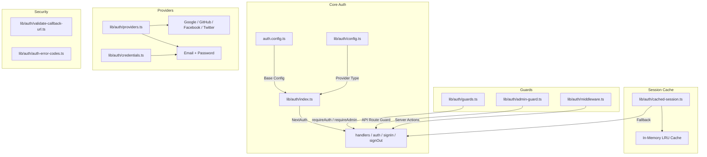
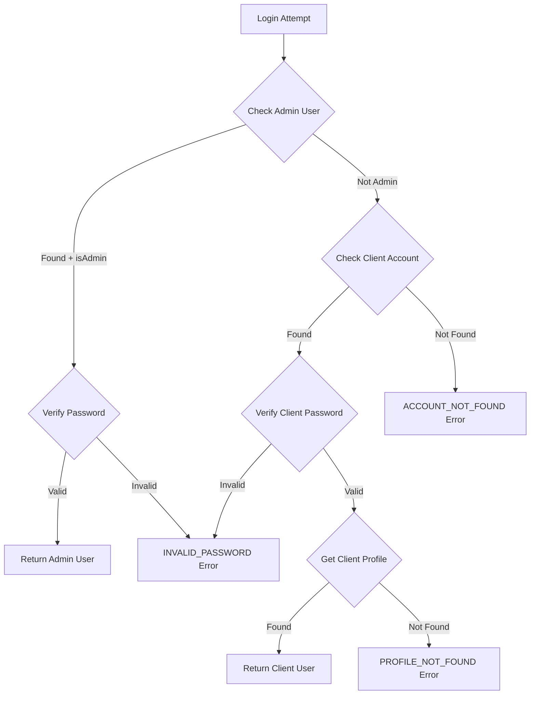

# Módulo de utilidades de autenticación

El módulo de utilidades de autenticación (`template/lib/auth/`) proporciona una capa de autenticación integral construida sobre NextAuth.js (Auth.js) con soporte para múltiples proveedores, almacenamiento en caché de sesiones, protecciones del lado del servidor, acciones de servidor validadas y Supabase como backend de autenticación alternativo.

## Descripción general de la arquitectura



## Archivos fuente

|Archivo|Descripción|
|------|-------------|
|`lib/auth/index.ts`|Configuración de NextAuth.js con adaptador Drizzle|
|`lib/auth/config.ts`|Configuración del tipo de proveedor de autenticación|
|`lib/auth/credentials.ts`|Proveedor de credenciales de correo electrónico/contraseña|
|`lib/auth/providers.ts`|Fábrica de proveedores de OAuth|
|`lib/auth/guards.ts`|Protectores de página del lado del servidor|
|`lib/auth/admin-guard.ts`|Guardia de administrador de ruta API|
|`lib/auth/middleware.ts`|Middleware de acción de servidor validado|
|`lib/auth/cached-session.ts`|Capa de almacenamiento en caché de sesión|
|`lib/auth/session-cache.ts`|Implementación de caché|
|`lib/auth/validate-callback-url.ts`|Validación de URL de redireccionamiento|
|`lib/auth/auth-error-codes.ts`|Enumeración de código de error|
|`lib/auth/supabase/`|Cliente/servidor/middleware de autenticación de Supabase|

## Configuración de NextAuth.js (`index.ts`)

La exportación principal proporciona la interfaz estándar NextAuth.js:

```typescript
import { auth, signIn, signOut, handlers, unstable_update } from '@/lib/auth';
```

### Estrategia de sesión

- **Estrategia:** JWT (no sesiones de base de datos)
- **Edad máxima:** 30 días
- **Edad de actualización:** 24 horas (intervalo de actualización de la sesión)

### Devolución de llamada JWT

La devolución de llamada de JWT enriquece los tokens con:
- `userId` -- del objeto o token de usuario `sub`
- `clientProfileId` -- creado automáticamente para usuarios de OAuth en el primer inicio de sesión
- `isAdmin` -- determinado a partir de `isClient`/`isAdmin` banderas o por defecto `false`
- `provider` -- el nombre del proveedor de autenticación

### Devolución de llamada de sesión

La devolución de llamada de la sesión asigna campos JWT al objeto de la sesión:
- `session.user.id`
- `session.user.clientProfileId`
- `session.user.provider`
- `session.user.isAdmin`

### Páginas personalizadas

```typescript
pages: {
  signIn: '/auth/signin',
  signOut: '/auth/signout',
  error: '/auth/error',
  verifyRequest: '/auth/verify-request',
  newUser: '/auth/register',
}
```

### Eventos

- **signOut** -- invalida el caché de sesión para el usuario
- **updateUser**: invalida la caché de la sesión cuando cambian los datos del usuario.

## Configuración de autenticación (`config.ts`)

### `AuthProviderType`

```typescript
type AuthProviderType = 'supabase' | 'next-auth' | 'both';
```

### `AuthConfig`

```typescript
interface AuthConfig {
  provider: AuthProviderType;
  supabase?: {
    url: string;
    anonKey: string;
    redirectUrl?: string;
  };
  nextAuth?: {
    enableCredentials?: boolean;
    enableOAuth?: boolean;
    providers?: any[];
  };
}
```

### `getAuthConfig(): AuthConfig`

Resuelve la configuración con esta prioridad:
1. Anulación global a través de `configureAuth()`
2. Detección basada en el entorno (URL de Supabase/presencia de clave)
3. Valor predeterminado: `next-auth` con credenciales y OAuth habilitado

## Proveedor de credenciales (`credentials.ts`)

### Funciones de contraseña

```typescript
async function hashPassword(password: string): Promise<string>;
// Uses bcryptjs with 10 salt rounds, loaded via dynamic import

async function comparePasswords(plainText: string, hashed: string | null): Promise<boolean>;
// Returns false if hashed is null
```

### Flujo de autenticación



### `AuthProviders` Enumeración

```typescript
enum AuthProviders {
  CREDENTIALS = 'credentials',
  GOOGLE = 'google',
  FACEBOOK = 'facebook',
  GITHUB = 'github',
  TWITTER = 'twitter',
  X = 'x',
  MICROSOFT = 'microsoft',
}
```

## Proveedores de OAuth (`providers.ts`)

### `createNextAuthProviders(config?): Provider[]`

Crea dinámicamente instancias de proveedor NextAuth según la configuración:

```typescript
import { createNextAuthProviders } from '@/lib/auth/providers';

const providers = createNextAuthProviders({
  google: { enabled: true, clientId: '...', clientSecret: '...' },
  github: { enabled: true, clientId: '...', clientSecret: '...' },
  credentials: { enabled: true },
});
```

Proveedores admitidos: **Google**, **GitHub**, **Facebook**, **Twitter**, **Credenciales**.

## Guardias del lado del servidor (`guards.ts`)

### `requireAuth(): Promise<Session>`

Requiere autenticación. Redirecciona a `/auth/signin` si no está autenticado.

```typescript
export default async function ProtectedPage() {
  const session = await requireAuth();
  return <div>Welcome {session.user.email}</div>;
}
```

### `requireAdmin(): Promise<Session>`

Requiere rol de administrador. Redirecciona a `/admin/auth/signin` si no está autenticado, `/unauthorized` si no es administrador.

```typescript
export default async function AdminPage() {
  const session = await requireAdmin();
  return <div>Admin Dashboard</div>;
}
```

### `getSession(): Promise<Session | null>`

Obtiene la sesión actual sin redirigir. Devuelve `null` para usuarios no autenticados.

### `checkIsAdmin(): Promise<boolean>`

Comprueba el estado del administrador sin redirigir.

## Guardia de ruta API (`admin-guard.ts`)

### `checkAdminAuth(): Promise<NextResponse | null>`

Devuelve `null` si está autorizado, o un error `NextResponse` (401/403/500) si no:

```typescript
export async function GET() {
  const authError = await checkAdminAuth();
  if (authError) return authError;
  // ... handle authorized request
}
```

### `withAdminAuth(handler): handler`

Función de orden superior que envuelve los controladores de ruta API:

```typescript
import { withAdminAuth } from '@/lib/auth/admin-guard';

export const GET = withAdminAuth(async (request) => {
  // Only reached if user is authenticated admin
  return NextResponse.json({ data: await getAdminData() });
});
```

## Acciones de servidor validadas (`middleware.ts`)

### `validatedAction(schema, action)`

Envuelve una acción del servidor con la validación de Zod:

```typescript
import { validatedAction } from '@/lib/auth/middleware';
import { z } from 'zod';

const schema = z.object({ name: z.string().min(1), email: z.string().email() });

export const updateProfile = validatedAction(schema, async (data, formData) => {
  await db.update(users).set(data);
  return { success: 'Profile updated' };
});
```

### `validatedActionWithUser(schema, action)`

Igual que el anterior pero también verifica la autenticación e inyecta al usuario:

```typescript
export const submitItem = validatedActionWithUser(schema, async (data, formData, user) => {
  await db.insert(items).values({ ...data, userId: user.id });
  return { success: 'Item submitted' };
});
```

### `ActionState` Tipo

```typescript
type ActionState = {
  error?: string;
  success?: string;
  redirect?: string;
  [key: string]: any;
};
```

## Almacenamiento en caché de sesión (`cached-session.ts`)

Reduce la sobrecarga de autenticación al almacenar en caché las sesiones decodificadas en la memoria.

### `getCachedSession(request?): Promise<Session | null>`

```typescript
import { getCachedSession } from '@/lib/auth/cached-session';

// In server components
const session = await getCachedSession();

// In API routes (pass request for token extraction)
const session = await getCachedSession(request);
```

### `invalidateSessionCache(token?, userId?): Promise<void>`

Invalida las sesiones almacenadas en caché por token o ID de usuario.

### `clearSessionCache(): void`

Borra todas las sesiones almacenadas en caché (para implementaciones o actualizaciones críticas).

### Extracción de tokens

Los tokens se extraen de las solicitudes en este orden:
1. `next-auth.session-token` o `__Secure-next-auth.session-token` galleta
2. `Authorization: Bearer <token>` encabezado
3. `X-Session-Token` encabezado personalizado

## Códigos de error (`auth-error-codes.ts`)

```typescript
enum AuthErrorCode {
  ACCOUNT_NOT_FOUND = 'ACCOUNT_NOT_FOUND',
  INVALID_PASSWORD = 'INVALID_PASSWORD',
  PROFILE_NOT_FOUND = 'PROFILE_NOT_FOUND',
  GENERIC_ERROR = 'GENERIC_ERROR',
  RATE_LIMITED = 'RATE_LIMITED',
  USE_OAUTH_PROVIDER = 'USE_OAUTH_PROVIDER',
  SESSION_REFRESH_FAILED = 'SESSION_REFRESH_FAILED',
  PAGE_REFRESH_FAILED = 'PAGE_REFRESH_FAILED',
}
```

## Validación de URL de devolución de llamada (`validate-callback-url.ts`)

### `isValidCallbackUrl(url: string | null): boolean`

Previene vulnerabilidades de redireccionamiento abierto:

```typescript
isValidCallbackUrl('/admin/items')       // true
isValidCallbackUrl('/client/dashboard')  // true
isValidCallbackUrl('https://evil.com')   // false
isValidCallbackUrl('//evil.com')         // false
```

### `getSafeRedirectPath(callbackUrl, fallbackPath): string`

Devuelve la URL de devolución de llamada si es válida; en caso contrario, la ruta alternativa.

### `createSafeCallbackUrl(pathname, search?): string`

Crea una URL de devolución de llamada limitada a 2048 caracteres para evitar la contaminación de parámetros.
