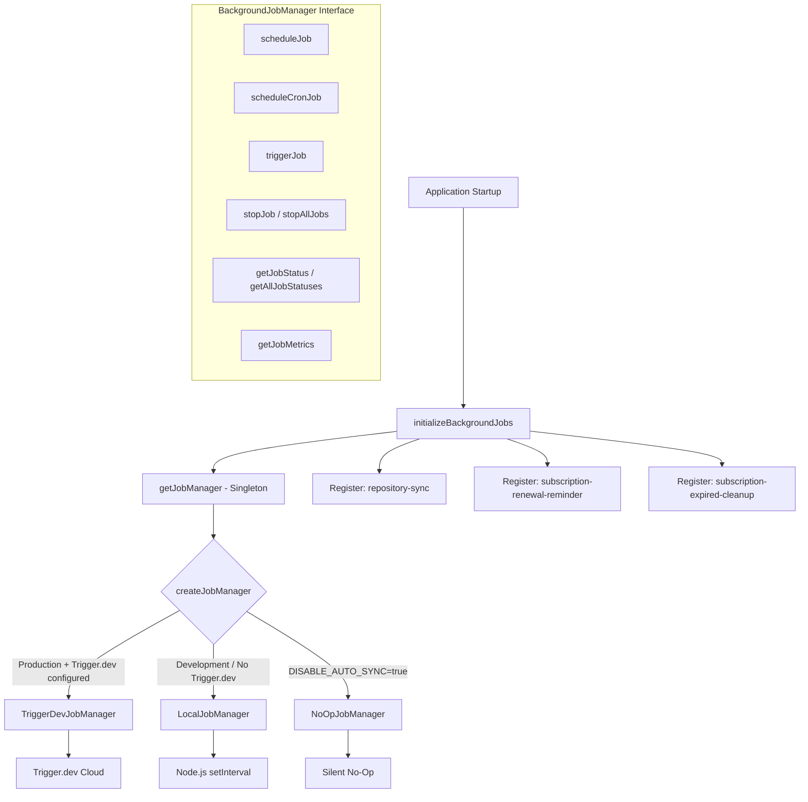
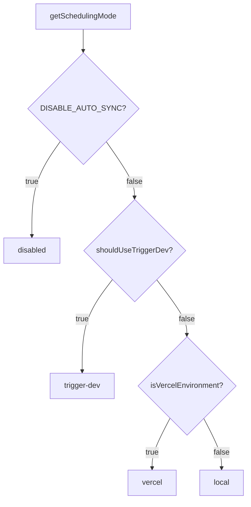

# Módulo de trabajos en segundo plano

El módulo de trabajos en segundo plano (`template/lib/background-jobs/`) proporciona una capa de abstracción para programar y ejecutar tareas recurrentes. Admite tres estrategias de tiempo de ejecución: **Trigger.dev** para producción, **local `setInterval`** para desarrollo y un modo **no-op** para deshabilitar trabajos por completo, seleccionadas automáticamente según la configuración del entorno.

## Descripción general de la arquitectura



## Archivos fuente

|Archivo|Descripción|
|------|-------------|
|`lib/background-jobs/types.ts`|Definiciones de interfaz y tipo|
|`lib/background-jobs/config.ts`|Configuración de Trigger.dev y detección del modo de programación|
|`lib/background-jobs/job-factory.ts`|Función de fábrica y administrador singleton|
|`lib/background-jobs/local-job-manager.ts`|`LocalJobManager` implementación|
|`lib/background-jobs/trigger-dev-job-manager.ts`|`TriggerDevJobManager` implementación|
|`lib/background-jobs/noop-job-manager.ts`|`NoOpJobManager` implementación|
|`lib/background-jobs/initialize-jobs.ts`|Registro de trabajo al iniciar la aplicación|
|`lib/background-jobs/index.ts`|Exportaciones de barriles|

## Definiciones de tipo

### `BackgroundJobManager` Interfaz

```typescript
interface BackgroundJobManager {
  scheduleJob(id: string, name: string, job: () => void | Promise<void>, interval: number): void;
  scheduleCronJob(id: string, name: string, job: () => void | Promise<void>, cronExpression: string): void;
  triggerJob(id: string): Promise<void>;
  stopJob(id: string): void;
  stopAllJobs(): void;
  getJobStatus(id: string): JobStatus | undefined;
  getAllJobStatuses(): JobStatus[];
  getJobMetrics(): JobMetrics;
}
```

### `JobStatus`

```typescript
type JobStatusType = 'running' | 'completed' | 'failed' | 'scheduled' | 'stopped';

interface JobStatus {
  id: string;
  name: string;
  status: JobStatusType;
  lastRun: Date | null;
  nextRun: Date | null;
  duration: number;     // Last execution duration in ms
  error?: string;       // Error message if status is 'failed'
}
```

### `JobMetrics`

```typescript
interface JobMetrics {
  totalExecutions: number;       // Total invocations (not unique jobs)
  successfulJobs: number;
  failedJobs: number;
  averageJobDuration: number;    // Rolling average in ms
  lastCleanup: Date;
}
```

### `TriggerDevConfig`

```typescript
interface TriggerDevConfig {
  enabled: boolean;
  apiKey?: string;
  apiUrl?: string;
  environment: string;
  isFullyConfigured: boolean;
  isPartiallyConfigured: boolean;
}
```

### `SchedulingMode`

```typescript
type SchedulingMode = 'trigger-dev' | 'vercel' | 'local' | 'disabled';
```

## Funciones de configuración

### `getTriggerDevConfig(): TriggerDevConfig`

Lee la configuración de Trigger.dev desde ConfigService.

### `shouldUseTriggerDev(): boolean`

Devuelve `true` cuando Trigger.dev está completamente configurado, habilitado y el entorno es de producción.

### `getSchedulingMode(): SchedulingMode`

Determina qué sistema de programación debe estar activo usando esta prioridad:



## Fábrica y Singleton

### `createJobManager(): BackgroundJobManager`

Crea el administrador de trabajos adecuado según el entorno:

```typescript
import { createJobManager } from '@/lib/background-jobs';

const manager = createJobManager();
// Returns: TriggerDevJobManager | LocalJobManager | NoOpJobManager
```

### `getJobManager(): BackgroundJobManager`

Devuelve la instancia singleton, creándola en la primera llamada:

```typescript
import { getJobManager } from '@/lib/background-jobs';

const manager = getJobManager();
manager.scheduleJob('my-job', 'My Job', async () => {
  await doWork();
}, 60_000);
```

### `resetJobManager(): void`

Detiene todos los trabajos y destruye el singleton (útil para pruebas):

```typescript
import { resetJobManager } from '@/lib/background-jobs';
resetJobManager();
```

## Administrador de trabajos locales

Utiliza Node.js `setInterval` para entornos de desarrollo y respaldo.

**Comportamientos clave:**
- Omite la ejecución cuando un trabajo ya se está ejecutando (evita la superposición)
- Realiza un seguimiento de las métricas con una duración promedio móvil
- Convierte expresiones cron en intervalos mediante mapeo simplificado
- Reduce el registro de la consola en modo de desarrollo

### Mapeo de cron a intervalo

|Patrón cron|Intervalo|
|-------------|----------|
| `*/30 * * * * *` |30 segundos|
| `*/2 * * * *` |2 minutos|
| `*/5 * * * *` |5 minutos|
| `*/15 * * * *` |15 minutos|
| `0 * * * *` |1 hora|
| `0 9 * * *` |24 horas|
|Predeterminado|1 minuto|

## TriggerDevJobManager

Registra horarios con la API de horarios `@trigger.dev/sdk` v4. **No** ejecuta temporizadores locales; la ejecución la maneja el proceso de trabajo Trigger.dev.

**Comportamientos clave:**
- Cargas diferidas `@trigger.dev/sdk` mediante importación dinámica
- Convierte programaciones basadas en intervalos en expresiones cron
- Realiza un seguimiento de las métricas locales cuando las tareas se ejecutan en el contexto del trabajador
- `stopJob` / `stopAllJobs` solo borra el estado local (los horarios remotos son administrados por Trigger.dev)

## NoOpJobManager

Todas las operaciones son silenciosas y no operativas. Se utiliza cuando `DISABLE_AUTO_SYNC=true` está en desarrollo.

## Registro de Trabajo

La función `initializeBackgroundJobs()` registra todos los trabajos de la aplicación al inicio:

```typescript
import { initializeBackgroundJobs } from '@/lib/background-jobs/initialize-jobs';

// Called once during app initialization
await initializeBackgroundJobs();
```

### Empleos registrados

|ID de trabajo|Horario|Descripción|
|--------|----------|-------------|
|`repository-sync`|Cada 5 minutos|Sincroniza contenido CMS basado en Git a través de `syncManager.performSync()`|
|`subscription-renewal-reminder`|Todos los días a las 9:00 a.m.|Envía recordatorios de renovación para suscripciones que vencen en 7 días|
|`subscription-expired-cleanup`|Diariamente a medianoche|Procesa y vence las suscripciones después de su fecha de finalización|

**Importante:** Todas las devoluciones de llamadas de trabajos utilizan importaciones dinámicas para evitar que el paquete web incluya módulos específicos de Node.js en el momento de la compilación:

```typescript
manager.scheduleJob('repository-sync', 'Repository Synchronization', async () => {
  // Dynamic import prevents webpack bundling of isomorphic-git chain
  const { syncManager } = await import('@/lib/services/sync-service');
  await syncManager.performSync();
}, 5 * 60 * 1000);
```

## Ejemplos de uso

### Programar un trabajo personalizado

```typescript
import { getJobManager } from '@/lib/background-jobs';

const manager = getJobManager();

// Interval-based (every 10 minutes)
manager.scheduleJob('cleanup-temp', 'Temp File Cleanup', async () => {
  await cleanupTempFiles();
}, 10 * 60 * 1000);

// Cron-based (every hour)
manager.scheduleCronJob('hourly-report', 'Hourly Report', async () => {
  await generateReport();
}, '0 * * * *');
```

### Monitoreo de trabajos

```typescript
const manager = getJobManager();

// Check specific job
const status = manager.getJobStatus('repository-sync');
console.log(status?.status, status?.lastRun, status?.duration);

// List all jobs
const allStatuses = manager.getAllJobStatuses();

// Get aggregate metrics
const metrics = manager.getJobMetrics();
console.log(`Total: ${metrics.totalExecutions}, Failed: ${metrics.failedJobs}`);
```

### Disparador manual

```typescript
const manager = getJobManager();
await manager.triggerJob('repository-sync');
```
