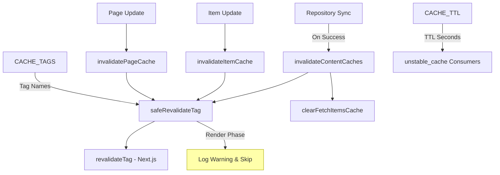
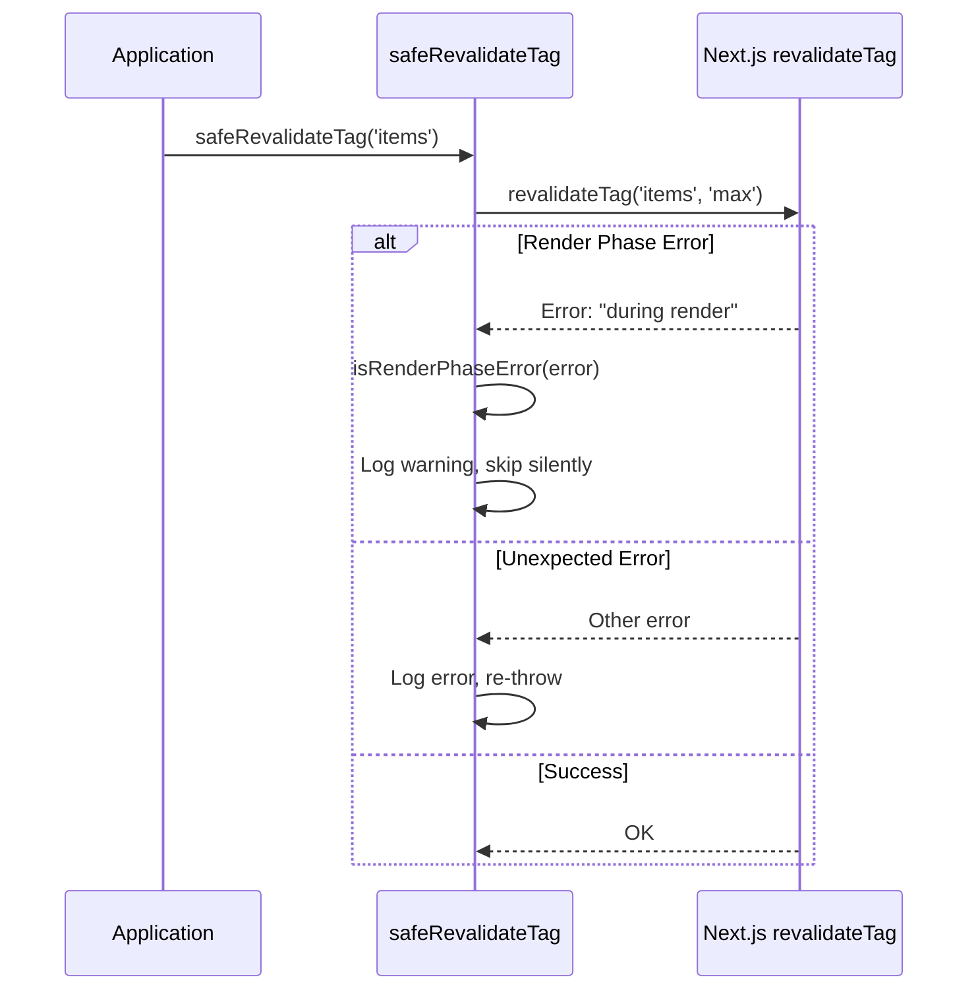
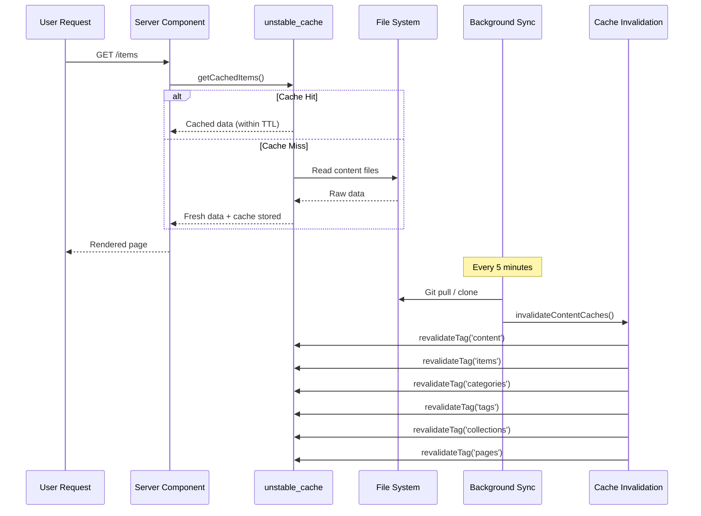

# Módulo de invalidación de caché

El módulo de invalidación de caché (`template/lib/cache-config.ts` y `template/lib/cache-invalidation.ts`) proporciona un sistema de etiquetas de caché centralizado y funciones de invalidación para Next.js `unstable_cache` y `revalidateTag`. Garantiza que los cachés de contenido se invaliden correctamente después de la sincronización del repositorio mientras maneja con elegancia las restricciones de la fase de procesamiento de Next.js.

## Descripción general de la arquitectura



## Archivos fuente

|Archivo|Descripción|
|------|-------------|
|`lib/cache-config.ts`|Caché de constantes TTL y definiciones de etiquetas|
|`lib/cache-invalidation.ts`|Funciones de invalidación con seguridad en la fase de renderizado|

## Configuración de caché TTL

Todos los valores TTL están en **segundos** y se usan con Next.js `unstable_cache`:

```typescript
const CACHE_TTL = {
  CONTENT: 600,   // 10 minutes -- content listings
  ITEM: 600,      // 10 minutes -- individual items
  CONFIG: 600,    // 10 minutes -- site configuration
  PAGES: 600,     // 10 minutes -- static pages
} as const;
```

### Uso con `unstable_cache`

```typescript
import { unstable_cache } from 'next/cache';
import { CACHE_TTL, CACHE_TAGS } from '@/lib/cache-config';

const getCachedItems = unstable_cache(
  async () => fetchAllItems(),
  ['items-list'],
  {
    revalidate: CACHE_TTL.CONTENT,
    tags: [CACHE_TAGS.CONTENT, CACHE_TAGS.ITEMS],
  }
);
```

## Etiquetas de caché

Las etiquetas se utilizan con `revalidateTag()` para invalidar cachés de forma selectiva.

### Etiquetas estáticas

|Etiqueta constante|Valor|Descripción|
|-------------|-------|-------------|
|`CACHE_TAGS.CONTENT`|`'content'`|Etiqueta maestra: invalida todos los cachés de contenido|
|`CACHE_TAGS.ITEMS`|`'items'`|Colección de todos los artículos.|
|`CACHE_TAGS.CATEGORIES`|`'categories'`|Todas las categorias|
|`CACHE_TAGS.TAGS`|`'tags'`|Todas las etiquetas|
|`CACHE_TAGS.COLLECTIONS`|`'collections'`|Todas las colecciones|
|`CACHE_TAGS.CONFIG`|`'config'`|Configuración del sitio|
|`CACHE_TAGS.PAGES`|`'pages'`|Todas las páginas estáticas|

### Etiquetas dinámicas (funciones)

|Función de etiqueta|Salida de ejemplo|Descripción|
|-------------|---------------|-------------|
|`CACHE_TAGS.ITEM(slug)`|`'item:my-tool'`|Artículo específico por babosa|
|`CACHE_TAGS.PAGE(slug)`|`'page:about'`|Página específica por slug|
|`CACHE_TAGS.ITEMS_LOCALE(locale)`|`'items:en'`|Artículos filtrados por localidad|
|`CACHE_TAGS.CATEGORIES_LOCALE(locale)`|`'categories:fr'`|Categorías por localidad|
|`CACHE_TAGS.TAGS_LOCALE(locale)`|`'tags:de'`|Etiquetas por localidad|
|`CACHE_TAGS.COLLECTIONS_LOCALE(locale)`|`'collections:es'`|Colecciones por localidad|

### Ejemplo: almacenamiento en caché específico de la configuración regional

```typescript
import { CACHE_TAGS, CACHE_TTL } from '@/lib/cache-config';

const getCachedItemsByLocale = unstable_cache(
  async (locale: string) => fetchItemsByLocale(locale),
  ['items-by-locale'],
  {
    revalidate: CACHE_TTL.CONTENT,
    tags: [CACHE_TAGS.ITEMS, CACHE_TAGS.ITEMS_LOCALE('en')],
  }
);
```

## Funciones de invalidación

### `invalidateContentCaches(): Promise<void>`

Invalida **todos** los cachés relacionados con el contenido. Se llama después de que la sincronización del repositorio se completa correctamente.

```typescript
import { invalidateContentCaches } from '@/lib/cache-invalidation';

// After successful repository sync
await performSync();
await invalidateContentCaches();
```

**Invalida estas etiquetas:**
- `CONTENT`, `ITEMS`, `CATEGORIES`, `TAGS`, `COLLECTIONS`, `PAGES`
- También borra el caché en memoria `fetchItems` a través de `clearFetchItemsCache()`

### `invalidateItemCache(slug: string): Promise<void>`

Invalida el caché de un solo elemento.

```typescript
import { invalidateItemCache } from '@/lib/cache-invalidation';

await invalidateItemCache('my-saas-tool');
// Revalidates tag: 'item:my-saas-tool'
```

### `invalidatePageCache(slug: string): Promise<void>`

Invalida el caché de una sola página estática.

```typescript
import { invalidatePageCache } from '@/lib/cache-invalidation';

await invalidatePageCache('about');
// Revalidates tag: 'page:about'
```

## Seguridad en la fase de renderizado

Next.js no permite `revalidateTag()` durante la fase de renderizado de los componentes del servidor. El módulo maneja esto con un contenedor `safeRevalidateTag`.

### Cómo funciona



### Patrones de detección de errores

La función `isRenderPhaseError` comprueba que varios patrones sean resistentes a los cambios en los mensajes de error de Next.js:

- `"during render"` -- Mensaje actual de Next.js
- `"render phase"` -- Frase alternativa
- `"revalidate"` + `"render"` -- Ambas palabras clave presentes
- `"unsupported"` + `"render"` -- Verificación combinada

## Diagrama de flujo de caché


