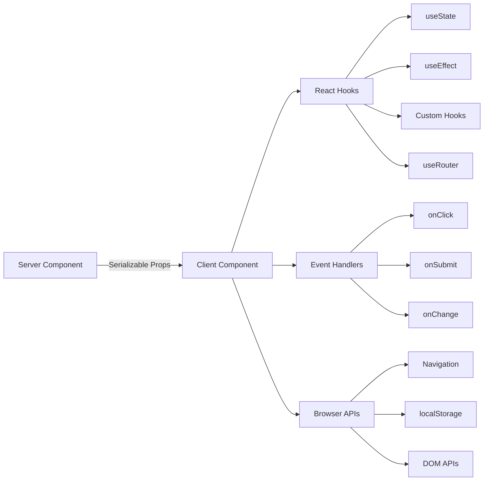

# Patrones de componentes del cliente

## Descripción general

Los componentes del cliente en la plantilla Ever Works son "islas" interactivas que manejan eventos de usuario, administran el estado local y se integran con las API del navegador. Se identifican mediante la directiva `"use client"` en la parte superior del archivo y se utilizan de forma selectiva cuando se requiere interactividad.

## Arquitectura



## Archivos fuente

|Archivo|Patrón|
|------|---------|
|`template/app/[locale]/admin/page.tsx`|Envoltorio de cliente mínimo que delega al componente|
|`template/app/not-found.tsx`|Navegación del cliente con `useRouter`|
|`template/app/global-error.tsx`|Límite de error con función de reinicio|
|`template/components/filters/filter-url-parser.tsx`|Gestión del estado de URL|
|`template/components/header/more-menu.tsx`|Menús desplegables interactivos|

## Patrones centrales

### Patrón 1: Envoltorios de cliente mínimos

Muchos componentes de la página utilizan el contenedor de cliente más delgado posible:

```typescript
"use client";

import { AdminDashboard } from "@/components/admin";

export default function AdminPage() {
    return <AdminDashboard />;
}
```

Este patrón mantiene el archivo de página pequeño mientras delega toda la lógica a un componente separado. La directiva `"use client"` marca el límite donde el árbol de componentes del servidor pasa a la representación del cliente.

### Patrón 2: Componentes del límite de error

El controlador de errores global demuestra el patrón de límite de error:

```typescript
'use client';

export default function GlobalError({
    error,
    reset,
}: {
    error: Error & { digest?: string };
    reset: () => void;
}) {
    useEffect(() => {
        console.error(error);
    }, [error]);

    return (
        <html lang="en">
            <body>
                <div>
                    <h1>Something went wrong!</h1>
                    {process.env.NODE_ENV !== 'production' && (
                        <div>
                            <p>{error.message}</p>
                            {error.digest && <p>Error ID: {error.digest}</p>}
                        </div>
                    )}
                    <Button onPress={() => reset()}>Refresh</Button>
                    <Link href="/">Go Home</Link>
                </div>
            </body>
        </html>
    );
}
```

Aspectos clave:
- El accesorio `error` incluye un `digest` opcional para el seguimiento de errores del servidor.
- La función `reset()` vuelve a representar los elementos secundarios del límite de error.
- Los seguimientos de pila solo se muestran en desarrollo
- El componente envuelve sus propias etiquetas `<html>` y `<body>` ya que los errores globales reemplazan toda la página.

### Patrón 3: navegación del lado del cliente

La página No encontrado muestra patrones de navegación del lado del cliente:

```typescript
'use client';

import { useRouter } from 'next/navigation';

export default function NotFound() {
    const router = useRouter();

    return (
        <div>
            <Button onClick={() => router.back()}>Go Back</Button>
            <Button onClick={() => router.push('/')}>Back to Home</Button>
            <button onClick={() => router.push('/help')}>Contact Support</button>
        </div>
    );
}
```

El enlace `useRouter` de `next/navigation` proporciona navegación programática. Tenga en cuenta que esto es de `next/navigation`, no de `next/router` (enrutador de páginas).

### Patrón 4: Navegación del cliente compatible con i18n

La plantilla proporciona enlaces de navegación con reconocimiento regional a través de `i18n/navigation.ts`:

```typescript
import { createNavigation } from "next-intl/navigation";
import { routing } from "./routing";

export const { Link, redirect, usePathname, useRouter, getPathname } =
    createNavigation(routing);
```

Componentes del cliente que necesitan importar navegación según la configuración regional desde este módulo en lugar de `next/navigation`:

```typescript
'use client';

import { Link, useRouter, usePathname } from '@/i18n/navigation';

function LocaleAwareComponent() {
    const router = useRouter();
    const pathname = usePathname();

    // router.push('/about') automatically includes the current locale prefix
    return <Link href="/about">About</Link>;
}
```

### Patrón 5: Acciones del servidor con validación de formulario

Los componentes del cliente se integran con las acciones del servidor utilizando el patrón de acción validado de `lib/auth/middleware.ts`:

```typescript
// Server action (lib/auth/middleware.ts)
export function validatedAction<S extends z.ZodType, T>(
    schema: S,
    action: ValidatedActionFunction<S, T>
) {
    return async (prevState: ActionState, formData: FormData): Promise<T> => {
        const result = schema.safeParse(Object.fromEntries(formData));
        if (!result.success) {
            return { error: result.error.issues[0].message } as T;
        }
        return action(result.data, formData);
    };
}

// Client component
'use client';

import { useActionState } from 'react';
import { myServerAction } from './actions';

function MyForm() {
    const [state, formAction, isPending] = useActionState(myServerAction, {});

    return (
        <form action={formAction}>
            {state.error && <p>{state.error}</p>}
            <input name="email" type="email" />
            <button type="submit" disabled={isPending}>Submit</button>
        </form>
    );
}
```

### Patrón 6: Gestión del estado con ganchos personalizados

La plantilla organiza la lógica del lado del cliente en enlaces personalizados en el directorio `hooks/`:

```typescript
'use client';

import { useFavorites } from '@/hooks/useFavorites';
import { useFilters } from '@/hooks/useFilters';

function ItemList() {
    const { favorites, toggleFavorite } = useFavorites();
    const { filters, updateFilter, resetFilters } = useFilters();

    return (
        <div>
            <FilterBar filters={filters} onChange={updateFilter} onReset={resetFilters} />
            <ItemGrid items={items} favorites={favorites} onToggleFavorite={toggleFavorite} />
        </div>
    );
}
```

## Límites de los componentes del cliente

### Cuándo utilizar `"use client"`

- **Manejadores de eventos**: `onClick`, `onSubmit`, `onChange`
- **Ganchos de reacción**: `useState`, `useEffect`, `useRef`, ganchos personalizados
- **API del navegador**: `window`, `localStorage`, `navigator`
- **Bibliotecas cliente de terceros**: bibliotecas de componentes de interfaz de usuario que requieren interactividad

### Cuándo conservarlo como componente del servidor

- Representación de contenido estático
- Obtención y transformación de datos.
- Cargando traducción (`getTranslations`)
- Generación de metadatos
- Envoltorios de diseño

## Mejores prácticas en la plantilla

1. **Empuje `"use client"` lo más profundo posible** - mantenga el límite cerca de la hoja interactiva
2. **Pasar datos del servidor como accesorios**: evite volver a buscarlos en el cliente
3. **Utilice `useEffect` solo para efectos secundarios**, no para obtener datos
4. **Prefiera acciones del servidor a rutas API**: para envíos de formularios y mutaciones
5. **Importar navegación desde `@/i18n/navigation`**: garantiza un enrutamiento que tenga en cuenta la configuración regional
6. **Interfaz de usuario exclusiva para desarrollo de puerta**: utilice comprobaciones `process.env.NODE_ENV !== 'production'`
