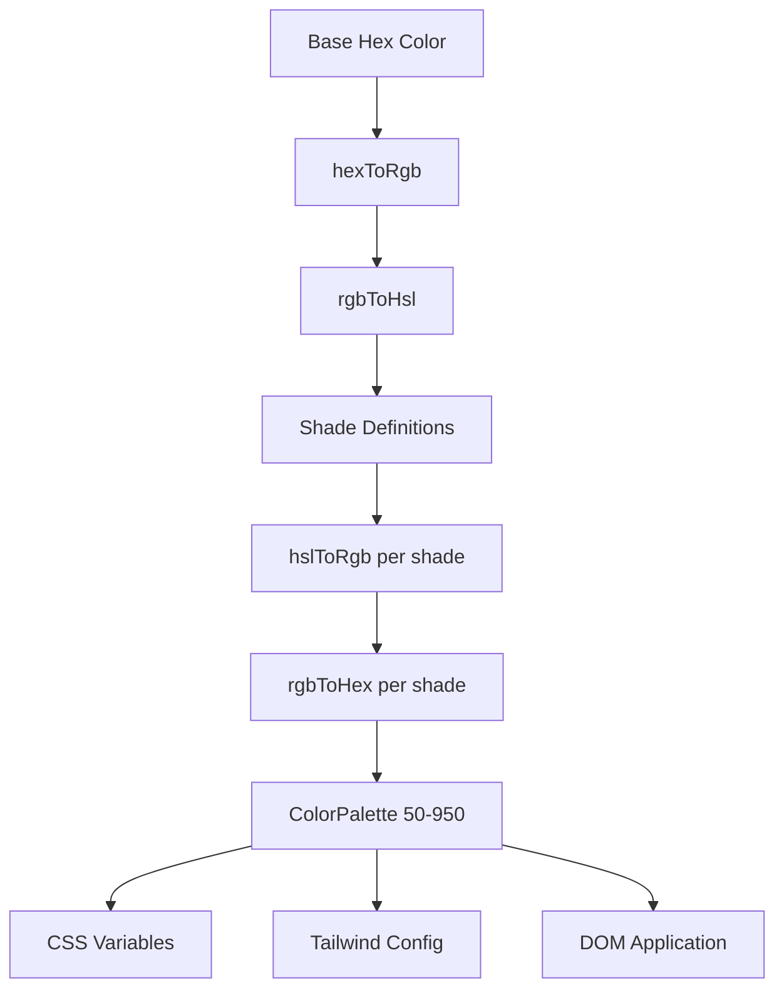

# Sistema de colores

La plantilla utiliza un sistema dinámico de generación de colores que crea paletas de colores completas a partir de colores hexadecimales base. Esto impulsa el motor de temas y permite la personalización del color en tiempo de ejecución a través de variables CSS y la integración de Tailwind CSS.

## Descripción general de la arquitectura



## Archivos fuente

|Archivo|Propósito|
|------|---------|
|`lib/color-generator.ts`|Generación de paleta central a partir de colores hexadecimales|
|`lib/theme-color-manager.ts`|Aplicación de color a nivel de tema y generación de CSS|
|`lib/theme-utils.ts`|Clases de utilidad, ayudas de opacidad y ajustes preestablecidos de temas|

## Canal de conversión de color

El sistema convierte colores a través de múltiples representaciones para generar sombras con precisión. Cuatro funciones de conversión manejan el viaje completo de ida y vuelta.

```typescript
// Hex -> RGB -> HSL (for manipulation) -> RGB -> Hex (output)
export function hexToRgb(hex: string): { r: number; g: number; b: number };
export function rgbToHsl(r: number, g: number, b: number): { h: number; s: number; l: number };
export function hslToRgb(h: number, s: number, l: number): { r: number; g: number; b: number };
export function rgbToHex(r: number, g: number, b: number): string;
```

Los ajustes de luminosidad y saturación se realizan en el espacio de color HSL, que proporciona transiciones de tonos perceptualmente uniformes en toda la paleta.

## Definiciones de sombra

Cada nivel de tono tiene ajustes fijos de luminosidad y saturación en relación con el color base (500):

|sombra|Ajuste de luminosidad|Ajuste de saturación|Uso|
|-------|-----------------|-------------------|-------|
| 50 | +45 | -30 |Fondos más claros|
| 100 | +40 | -25 |Fondos flotantes|
| 200 | +30 | -20 |Fondos activos|
| 300 | +20 | -10 |Fronteras|
| 400 | +10 | -5 |Texto de marcador de posición|
| **500** | **0** | **0** |**Color básico**|
| 600 | -10 | +5 |Estados flotantes|
| 700 | -20 | +10 |Estados activos|
| 800 | -30 | +15 |Texto de énfasis|
| 900 | -40 | +20 |Titulares|
| 950 | -45 | +25 |Fondos más oscuros|

## Interfaz de paleta de colores

```typescript
export interface ColorPalette {
  50: string;
  100: string;
  200: string;
  300: string;
  400: string;
  500: string;  // Base color
  600: string;
  700: string;
  800: string;
  900: string;
  950: string;
}
```

## Generando una paleta

La función `generateColorPalette` toma cualquier color hexadecimal y produce la paleta completa de 11 tonos:

```typescript
import { generateColorPalette } from '@/lib/color-generator';

const palette = generateColorPalette('#3b82f6');
// Returns: { 50: '#e8f0fe', 100: '#d4e4fd', ..., 950: '#0a1d3d' }
```

Los valores están fijados entre 0 y 100 tanto para la luminosidad como para la saturación para evitar colores fuera de rango.

## Generación de variables CSS

El sistema genera propiedades CSS personalizadas para cada tono:

```typescript
import { generateCssVariables } from '@/lib/color-generator';

const palette = generateColorPalette('#3b82f6');
const css = generateCssVariables('theme-primary', palette);
// Output:
// --theme-primary: #3b82f6;
// --theme-primary-50: #e8f0fe;
// --theme-primary-100: #d4e4fd;
// ... (all 11 shades)
```

## Integración CSS de viento de cola

Genere objetos de configuración de Tailwind que hagan referencia a variables CSS:

```typescript
import { generateTailwindConfig } from '@/lib/color-generator';

const config = generateTailwindConfig('theme-primary');
// Returns: {
//   DEFAULT: 'var(--theme-primary)',
//   50: 'var(--theme-primary-50)',
//   100: 'var(--theme-primary-100)',
//   ...
// }
```

## Administrador de colores del tema

El módulo `theme-color-manager.ts` aplica paletas al DOM en tiempo de ejecución.

### Configuraciones de temas extendidos

Cuatro temas integrados definen colores base para primario, secundario, acento, fondo, superficie y texto:

```typescript
export const EXTENDED_THEME_CONFIGS: Record<ThemeKey, ThemeConfig> = {
  everworks: {
    primary: "#3d70ef",
    secondary: "#00c853",
    accent: "#0056b3",
    background: "#ffffff",
    surface: "#f8f9fa",
    text: "#1a1a1a",
    textSecondary: "#6c757d",
  },
  corporate: { /* ... */ },
  material: { /* ... */ },
  funny: { /* ... */ },
};
```

### Aplicar paletas al DOM

```typescript
import { applyColorPalette, applyThemeWithPalettes } from '@/lib/theme-color-manager';

// Apply a single color palette
applyColorPalette('theme-primary', '#3d70ef');

// Apply an entire theme (primary + secondary + accent + utility colors)
applyThemeWithPalettes('everworks');
```

La función `applyColorPalette` también genera una variante RGB para soporte de opacidad:

```typescript
// Sets both:
// --theme-primary: #3d70ef
// --theme-primary-rgb: 61, 112, 239
```

### Generando CSS estático

Para renderizado del lado del servidor o generación de CSS en tiempo de compilación:

```typescript
import { generateThemeCss } from '@/lib/theme-color-manager';

const css = generateThemeCss('everworks');
// Returns full CSS variable string for all theme colors
```

## Clases de utilidad temática

El módulo `theme-utils.ts` proporciona combinaciones de clases Tailwind prediseñadas:

```typescript
import { themeClasses } from '@/lib/theme-utils';

// Button variants
themeClasses.button.primary   // "bg-theme-primary hover:bg-theme-accent text-white"
themeClasses.button.secondary // "bg-theme-secondary hover:bg-theme-secondary/80 text-white"
themeClasses.button.outline   // "border-2 border-theme-primary text-theme-primary ..."
themeClasses.button.ghost     // "text-theme-primary hover:bg-theme-primary/10"

// Text variants
themeClasses.text.primary     // "text-theme-text"
themeClasses.text.secondary   // "text-theme-text-secondary"
themeClasses.text.accent      // "text-theme-primary"
```

### Funciones auxiliares

```typescript
import { withOpacity, getCssVariable, cn, buildThemeClasses } from '@/lib/theme-utils';

// Generate opacity variant
withOpacity('bg-theme-primary', 50); // "bg-theme-primary/50"

// Get CSS variable reference
getCssVariable('theme-primary'); // "var(--theme-primary)"

// Conditional class building
buildThemeClasses('base-class', 'theme-class', {
  'active-class': isActive,
  'disabled-class': isDisabled,
});
```

## Generación de color de tema por lotes

Genere configuración CSS y Tailwind para múltiples colores a la vez:

```typescript
import { generateThemeColors } from '@/lib/color-generator';

const result = generateThemeColors({
  primary: '#3d70ef',
  secondary: '#00c853',
  accent: '#0056b3',
});

// result.css - Complete CSS variable declarations
// result.tailwind - Tailwind config object for all colors
```

## Aplicación de tema personalizado

Aplique colores arbitrarios sin utilizar los temas preestablecidos:

```typescript
import { applyCustomTheme } from '@/lib/theme-color-manager';

applyCustomTheme({
  primary: '#e91e63',
  secondary: '#9c27b0',
  accent: '#673ab7',
});
```

## Manejo de errores

El administrador de color del tema incluye un comportamiento alternativo:

- Si no se encuentra una clave de tema, vuelve al tema predeterminado `everworks`.
- Si al aplicar un tema se produce un error y el tema solicitado no es `everworks`, automáticamente vuelve a intentarlo con el tema predeterminado.
- Seguridad SSR: `useThemeWithPalettes` comprueba la disponibilidad de `window` antes de aplicar los cambios DOM.
