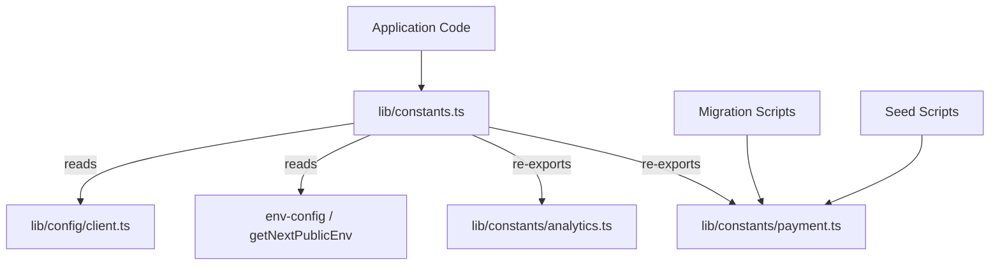

# Referencia de constantes

El módulo de constantes (`template/lib/constants.ts` y `template/lib/constants/`) centraliza todos los valores de configuración, enumeraciones, configuraciones basadas en el entorno y números mágicos de toda la aplicación. Las constantes se organizan en archivos específicos del dominio para permitir importaciones seguras en contextos fuera del tiempo de ejecución de Next.js (por ejemplo, scripts de migración, scripts de semilla).

## Descripción general de la arquitectura



## Archivos fuente

|Archivo|Descripción|
|------|-------------|
|`lib/constants.ts`|Barril de constantes principales: importa desde env-config y reexporta submódulos|
|`lib/constants/payment.ts`|Enumeraciones y tipos de pagos (seguros para scripts)|
|`lib/constants/analytics.ts`|Constantes relacionadas con el análisis|

## Constantes de localización

```typescript
const DEFAULT_LOCALE = 'en';

const LOCALES = [
  'en', 'fr', 'es', 'de', 'zh', 'ar', 'he', 'ru', 'uk', 'pt',
  'it', 'ja', 'ko', 'nl', 'pl', 'tr', 'vi', 'th', 'hi', 'id', 'bg'
] as const;

type Locale = (typeof LOCALES)[number];

/** Right-to-left locales */
const RTL_LOCALES: readonly Locale[] = ['ar', 'he'] as const;
```

## Marca y interfaz de usuario

```typescript
const LOGO_URL = '/logo-ever-work-3.png';
```

## API y back-end

```typescript
/** Base URL for internal Next.js API routes */
const API_BASE_URL = getNextPublicEnv('NEXT_PUBLIC_API_BASE_URL');
```

## Autenticación y seguridad

```typescript
const COOKIE_SECRET = getNextPublicEnv('COOKIE_SECRET');
const JWT_ACCESS_TOKEN_EXPIRES_IN = getNextPublicEnv('JWT_ACCESS_TOKEN_EXPIRES_IN');
const JWT_REFRESH_TOKEN_EXPIRES_IN = getNextPublicEnv('JWT_REFRESH_TOKEN_EXPIRES_IN');
```

## Análisis - PostHog

|constante|Fuente|Descripción|
|----------|--------|-------------|
|`POSTHOG_KEY`|`NEXT_PUBLIC_POSTHOG_KEY`|Clave API del proyecto PostHog|
|`POSTHOG_HOST`|`NEXT_PUBLIC_POSTHOG_HOST`|Anfitrión de la API de PostHog|
|`POSTHOG_ENABLED`|Derivado|Verdadero cuando existen tanto la clave como el host|
|`POSTHOG_DEBUG`|`POSTHOG_DEBUG`|Habilitar el registro de depuración|
|`POSTHOG_SESSION_RECORDING_ENABLED`|entorno / `'true'`|Alternar grabación de sesión|
|`POSTHOG_AUTO_CAPTURE`|entorno / `'false'`|Captura automática de vistas de página|
|`POSTHOG_SAMPLE_RATE`|Calculado|`0.1` en producción, `1.0` en desarrollo|
|`POSTHOG_SESSION_RECORDING_SAMPLE_RATE`|Calculado|`0.1` en producción, `1.0` en desarrollo|

## Seguimiento de errores: centinela

|constante|Fuente|Descripción|
|----------|--------|-------------|
|`SENTRY_DSN`|`NEXT_PUBLIC_SENTRY_DSN`|Nombre de la fuente de datos centinela|
|`SENTRY_ENABLE_DEV`|`SENTRY_ENABLE_DEV`|Habilitar Sentry en desarrollo|
|`SENTRY_DEBUG`|`SENTRY_DEBUG`|Modo de depuración centinela|
|`SENTRY_ENABLED`|Derivado|Verdadero cuando se establece DSN y el entorno lo permite|

## Seguimiento unificado de excepciones

```typescript
const EXCEPTION_TRACKING_PROVIDER = getNextPublicEnv('EXCEPTION_TRACKING_PROVIDER', 'both');
const POSTHOG_EXCEPTION_TRACKING = getNextPublicEnv('POSTHOG_EXCEPTION_TRACKING', 'true');
const SENTRY_EXCEPTION_TRACKING = getNextPublicEnv('SENTRY_EXCEPTION_TRACKING', 'true');

type ExceptionTrackingProvider = 'sentry' | 'posthog' | 'both' | 'none';
```

## ReCAPTCHA

```typescript
const RECAPTCHA_SITE_KEY = getNextPublicEnv('NEXT_PUBLIC_RECAPTCHA_SITE_KEY');
const RECAPTCHA_SECRET_KEY = getNextPublicEnv('RECAPTCHA_SECRET_KEY');
```

## Constantes de pago (`constants/payment.ts`)

Este archivo está separado intencionalmente de `constants.ts` para evitar importar `@/lib/config`, lo que permite su uso en scripts de migración y semilla que se ejecutan fuera de Next.js.

### Enumeraciones

```typescript
enum PaymentFlow {
  PAY_AT_START = 'pay_at_start',
  PAY_AT_END = 'pay_at_end',
}

enum PaymentStatus {
  PENDING = 'pending',
  PAID = 'paid',
  FAILED = 'failed',
}

enum PaymentInterval {
  DAILY = 'daily',
  WEEKLY = 'weekly',
  MONTHLY = 'monthly',
  YEARLY = 'yearly',
  ONE_TIME = 'one-time',
  PER_SUBMISSION = 'per-submission',
}

enum PaymentPlan {
  FREE = 'free',
  STANDARD = 'standard',
  PREMIUM = 'premium',
}

enum PaymentMethod {
  CREDIT_CARD = 'credit_card',
  PAYPAL = 'paypal',
}

enum PaymentCurrency {
  USD = 'USD',
  EUR = 'EUR',
  GBP = 'GBP',
  CAD = 'CAD',
  AUD = 'AUD',
  ETH = 'ETH',
}

enum PaymentProvider {
  STRIPE = 'stripe',
  SOLIDGATE = 'solidgate',
  LEMONSQUEEZY = 'lemonsqueezy',
  POLAR = 'polar',
}

enum SubmissionStatus {
  DRAFT = 'draft',
  PENDING = 'pending',
  APPROVED = 'approved',
  REJECTED = 'rejected',
  PUBLISHED = 'published',
  ARCHIVED = 'archived',
}
```

### Nombres para mostrar del plan

```typescript
const PAYMENT_PLAN_NAMES: Record<PaymentPlan, string> = {
  free: 'Free Plan',
  standard: 'Standard Plan',
  premium: 'Premium Plan',
};
```

### Precio de los anuncios del patrocinador

```typescript
const SponsorAdPricing = {
  WEEKLY: 100,    // $100.00
  MONTHLY: 300,   // $300.00
} as const;
```

## Constantes de análisis (`constants/analytics.ts`)

```typescript
/** Cookie name for anonymous viewer tracking */
const VIEWER_COOKIE_NAME = 'ever_viewer_id';

/** Cookie max age: 365 days in seconds */
const VIEWER_COOKIE_MAX_AGE = 365 * 24 * 60 * 60;  // 31,536,000
```

## Importar patrones

### Código de solicitud completo

```typescript
// Import everything from the main barrel
import {
  DEFAULT_LOCALE,
  LOCALES,
  POSTHOG_ENABLED,
  PaymentPlan,
  PaymentProvider,
  SubmissionStatus,
  VIEWER_COOKIE_NAME,
} from '@/lib/constants';
```

### Scripts fuera del tiempo de ejecución de Next.js

```typescript
// Import only from payment.ts to avoid Next.js dependencies
import { PaymentPlan, PaymentStatus, SubmissionStatus } from '@/lib/constants/payment';
```
