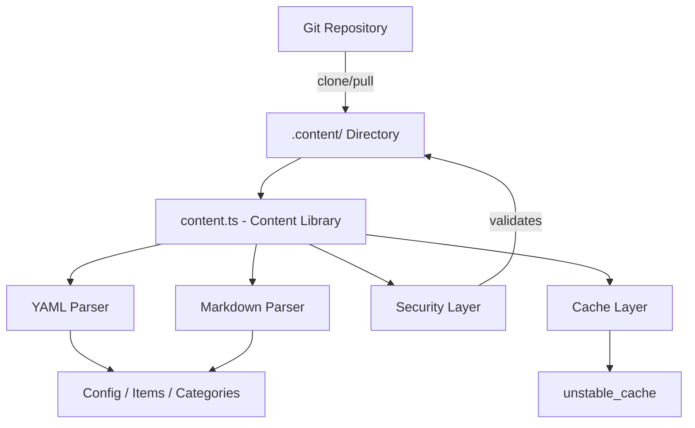
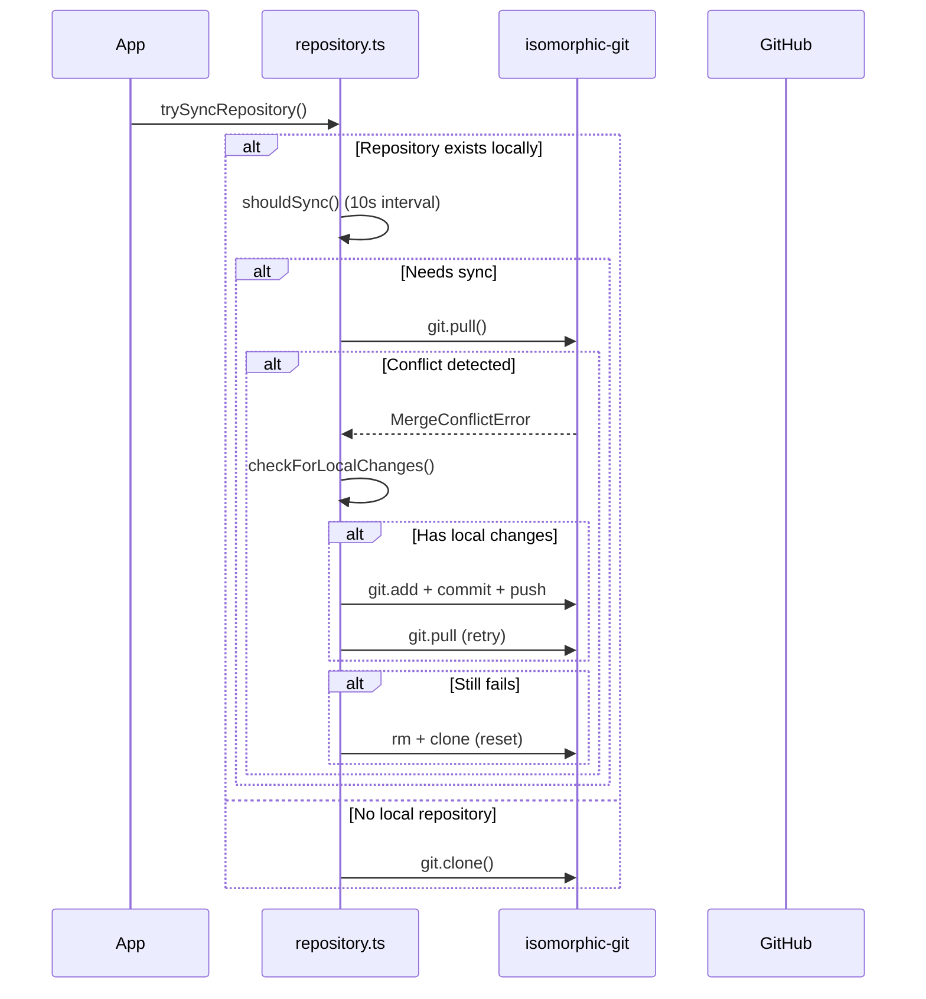

# Biblioteca de contenido

La biblioteca de contenido (`lib/content.ts`) proporciona utilidades del lado del servidor para leer, analizar y almacenar en caché contenido desde un repositorio CMS basado en Git. Maneja archivos de contenido YAML/Markdown, gestión de configuración y sincronización de contenido con sólidas medidas de seguridad.

## Descripción general de la arquitectura



## Archivos fuente

|Archivo|Propósito|
|------|---------|
|`lib/content.ts`|Procesamiento, lectura y almacenamiento en caché del contenido principal|
|`lib/repository.ts`|Sincronización de clon/pull de Git con repositorio remoto|
|`lib/lib.ts`|Utilidades de ruta (`getContentPath`, `fsExists`, `dirExists`)|
|`lib/cache-config.ts`|Etiquetas de caché y configuración TTL|

## Capa de seguridad

La biblioteca de contenido aplica múltiples medidas de seguridad para evitar ataques de inyección y cruce de rutas.

### Validación del código de idioma

```typescript
function validateLanguageCode(lang: string): boolean {
  const validLangPattern = /^[a-zA-Z0-9_-]+$/;
  return validLangPattern.test(lang) && lang.length <= 10;
}
```

Sólo se aceptan caracteres alfanuméricos, guiones y guiones bajos con una longitud máxima de 10 caracteres.

### Desinfección de nombres de archivos

```typescript
function sanitizeFilename(filename: string): string {
  const sanitized = path.basename(filename);
  if (sanitized.includes('..') || sanitized.includes('/') || sanitized.includes('\\')) {
    throw new Error('Invalid filename: contains dangerous characters');
  }
  return sanitized;
}
```

Utiliza `path.basename` para eliminar los componentes del directorio y rechaza los caracteres transversales restantes.

### Validación de ruta

```typescript
function validatePath(filepath: string, basePath: string): void {
  const resolvedPath = path.resolve(filepath);
  const resolvedBase = path.resolve(basePath);
  if (!resolvedPath.startsWith(resolvedBase + path.sep) && resolvedPath !== resolvedBase) {
    throw new Error('Invalid file path: outside of allowed directory');
  }
}
```

La función `safeReadFile` realiza una doble verificación: valida la ruta y luego verifica que la ruta real resuelta (siguiendo enlaces simbólicos) permanece dentro del directorio base.

### Validación de URL

```typescript
function isValidUrl(url: string): boolean {
  const trimmed = url.trim();
  if (trimmed.startsWith('/') && !trimmed.startsWith('//')) return true;
  return trimmed.startsWith('http://') || trimmed.startsWith('https://');
}
```

Bloquea `javascript:`, `data:`, `vbscript:` y otros esquemas de protocolos peligrosos.

### Validación de tamaño CSS

```typescript
function isValidCssSize(value: string): boolean {
  if (['auto', 'inherit', 'initial', 'unset'].includes(value.trim())) return true;
  return /^\d+(\.\d+)?(px|em|rem|vh|vw|%|pt|cm|mm|in)?$/.test(value.trim());
}
```

Previene la inyección de CSS a través de campos de front-matter de héroe personalizados.

## Procesamiento de contenido

### Análisis YAML

Los archivos de contenido se analizan utilizando la biblioteca `yaml` con validación de esquema Zod para frontmatter:

```typescript
const customHeroFrontmatterSchema = z.object({
  background_image: z.string().refine(isValidUrl, {
    message: 'Invalid URL: must be http, https, or relative path'
  }).optional(),
  // ... additional validated fields
});
```

### Almacenamiento en caché de configuración

La configuración del sitio se almacena en caché utilizando Next.js `unstable_cache` con TTL definidos y etiquetas de caché:

```typescript
import { CACHE_TAGS, CACHE_TTL } from './cache-config';

const getCachedConfig = unstable_cache(
  async () => { /* read and parse config.yml */ },
  [CACHE_TAGS.CONFIG],
  { revalidate: CACHE_TTL }
);
```

## Sincronización del repositorio Git

El módulo `repository.ts` administra las operaciones de Git usando `isomorphic-git`.

### Flujo de sincronización



### Protección de tiempo de espera

Todas las operaciones de Git están empaquetadas con tiempos de espera configurables:

```typescript
async function withTimeout<T>(promise: Promise<T>, timeoutMs: number = 120000): Promise<T> {
  const timeoutPromise = new Promise<never>((_, reject) => {
    setTimeout(() => reject(new Error(`Operation timeout after ${timeoutMs}ms`)), timeoutMs);
  });
  return Promise.race([promise, timeoutPromise]);
}
```

### Resolución de conflictos

El sistema maneja los conflictos de fusión a través de una estrategia de varios pasos:

1. **Detectar cambios locales** a través de `git.statusMatrix()`
2. **Intente impulsar** los cambios locales antes de realizar la extracción.
3. **Reintentar extracción** después de una inserción exitosa
4. **Restablecimiento completo** (eliminar + volver a clonar) como último recurso

### Comportamiento alternativo

Si `DATA_REPOSITORY` no está configurado o la clonación falla, el sistema crea un contenido alternativo mínimo:

```typescript
// Creates empty content directory with minimal config
const DEFAULT_CONFIG = `site_name: Website
item_name: Item
items_name: Items
copyright_year: ${new Date().getFullYear()}
`;
```

## Aplicación solo del servidor

Tanto `content.ts` como `repository.ts` utilizan la importación `server-only` para evitar el uso accidental del lado del cliente:

```typescript
'use server';
import 'server-only';
```

Esto garantiza que las operaciones de contenido con acceso al sistema de archivos nunca se filtren en los paquetes de clientes.

## Funciones clave exportadas

|Función|Descripción|
|----------|-------------|
|`getCachedConfig()`|Devuelve la configuración del sitio en caché de `config.yml`|
|`trySyncRepository()`|Clona o extrae contenido del repositorio Git remoto|
|`pullChanges()`|Extrae los últimos cambios con resolución de conflictos|
|`validateLanguageCode()`|Valida el formato de código de idioma i18n.|
|`sanitizeFilename()`|Elimina los componentes del directorio de los nombres de archivos|
|`safeReadFile()`|Lee archivos con protección transversal de ruta completa|
