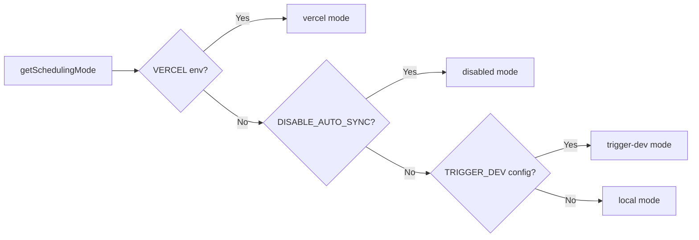

# Sistema de trabajo cron

## Descripción general

La plantilla Ever Works implementa un sistema de trabajo en segundo plano flexible que admite tres modos de programación: **Vercel Cron**, **Trigger.dev** y un **programador local**. Los puntos finales de cron son rutas API Next.js estándar autenticadas a través de `CRON_SECRET`, y el sistema incluye un módulo de inicialización singleton que garantiza que los trabajos se configuren exactamente una vez por proceso.

## Arquitectura

```mermaid
flowchart TD
    A[Scheduling Mode Detection] --> B{getSchedulingMode}

    B -->|vercel| C[Vercel Cron]
    B -->|trigger-dev| D[Trigger.dev]
    B -->|local| E[Local Scheduler]
    B -->|disabled| F[No Jobs]

    C --> G[vercel.json crons]
    G --> G1[/api/cron/sync]
    G --> G2[/api/cron/subscription-reminders]
    G --> G3[/api/cron/subscription-expiration]

    G1 --> H[CRON_SECRET Verification]
    G2 --> H
    G3 --> H

    H -->|Valid| I[Execute Job]
    H -->|Invalid| J[401 Unauthorized]

    I --> I1[triggerManualSync]
    I --> I2[subscriptionRenewalReminderJob]
    I --> I3[processExpiredSubscriptions]

    D --> K[Trigger.dev SDK]
    E --> L[Internal setInterval]

    K --> I
    L --> I
```

## Archivos fuente

|Archivo|Propósito|
|------|---------|
|`template/vercel.json`|Definiciones de programación cron de Vercel|
|`template/app/api/cron/sync/route.ts`|Punto final cron de sincronización de contenido|
|`template/app/api/cron/subscription-reminders/route.ts`|Correos electrónicos de recordatorio de renovación|
|`template/app/api/cron/subscription-expiration/route.ts`|Procesamiento de suscripción caducada|
|`template/app/api/cron/jobs/background-jobs-init.ts`|Inicialización de trabajo singleton|

## Configuración de programación cron

### vercel.json

```json
{
    "crons": [
        {
            "path": "/api/cron/sync",
            "schedule": "0 3 * * *"
        },
        {
            "path": "/api/cron/subscription-reminders",
            "schedule": "0 9 * * *"
        },
        {
            "path": "/api/cron/subscription-expiration",
            "schedule": "0 0 * * *"
        }
    ]
}
```

|Trabajo|Horario|tiempo|Descripción|
|-----|----------|------|-------------|
|Sincronización de contenido| `0 3 * * *` |3:00 a. m. UTC todos los días|Sincroniza contenido desde CMS basado en Git|
|Recordatorios de suscripción| `0 9 * * *` |9:00 a. m. UTC todos los días|Envía correos electrónicos de recordatorio de renovación|
|Vencimiento de la suscripción| `0 0 * * *` |Medianoche UTC todos los días|Procesa suscripciones caducadas|

## Autenticación

### Verificación secreta segura en el momento

Todos los puntos finales de cron verifican `CRON_SECRET` mediante una comparación de sincronización segura para evitar ataques de sincronización:

```typescript
import crypto from 'crypto';

function verifyCronSecret(request: NextRequest): boolean {
    const authHeader = request.headers.get('authorization');
    const cronSecret = process.env.CRON_SECRET;

    // Development bypass
    if (!cronSecret && process.env.NODE_ENV === 'development') {
        console.log('[Cron] Bypassing cron auth in development');
        return true;
    }

    if (!cronSecret || !authHeader) return false;

    const expectedValue = `Bearer ${cronSecret}`;

    // Length check before timing-safe comparison
    if (authHeader.length !== expectedValue.length) return false;

    return crypto.timingSafeEqual(
        Buffer.from(authHeader, 'utf8'),
        Buffer.from(expectedValue, 'utf8')
    );
}
```

Funciones de seguridad clave:
- **Comparación segura de tiempos** a través de `crypto.timingSafeEqual`: evita que los atacantes midan las diferencias en los tiempos de respuesta para adivinar el secreto.
- **Verificación previa de longitud** -- `timingSafeEqual` requiere buffers de igual longitud
- **Omisión de desarrollo**: solo cuando `CRON_SECRET` no está configurado y `NODE_ENV=development`

### Autenticación automática de Vercel

Cuando se implementa en Vercel, la plataforma incluye automáticamente el encabezado `Authorization: Bearer <CRON_SECRET>` para los trabajos cron configurados. Solo necesita configurar la variable de entorno `CRON_SECRET` en el panel de Vercel.

## Implementaciones de trabajo

### Trabajo de sincronización de contenido

```typescript
export async function GET(request: Request): Promise<NextResponse> {
    const startTime = Date.now();

    // Verify authorization
    if (!isAuthorized) {
        return NextResponse.json({ success: false, message: "Unauthorized" }, { status: 401 });
    }

    try {
        const result = await triggerManualSync();
        const duration = Date.now() - startTime;

        return NextResponse.json({
            success: result.success,
            timestamp: new Date().toISOString(),
            duration,
            message: result.message,
        }, {
            headers: { "Cache-Control": "no-cache, no-store, must-revalidate" },
        });
    } catch (error) {
        return NextResponse.json({
            success: false,
            message: "Cron sync failed",
            details: safeErrorMessage(error, "Unknown error"),
        }, { status: 500 });
    }
}
```

Formato de respuesta:
```json
{
    "success": true,
    "timestamp": "2025-01-15T03:00:05.123Z",
    "duration": 5123,
    "message": "Sync completed successfully"
}
```

### Trabajo de vencimiento de suscripción

Este trabajo procesa suscripciones caducadas y envía correos electrónicos de notificación:

```typescript
export async function GET(request: NextRequest) {
    if (!verifyCronSecret(request)) {
        return NextResponse.json({ success: false, message: 'Unauthorized' }, { status: 401 });
    }

    // 1. Find and update expired subscriptions
    const result = await subscriptionService.processExpiredSubscriptions();

    // 2. Send notification emails
    const { service: emailService } = await createEmailService();
    if (emailService.isServiceAvailable()) {
        for (const subscription of result.subscriptions) {
            const user = await getUserById(subscription.userId);
            const emailTemplate = getSubscriptionExpiredTemplate({ /* ... */ });
            await sendEmailSafely(emailService, emailConfig, emailTemplate, user.email);
        }
    }

    // 3. Return results
    return NextResponse.json({
        success: true,
        data: {
            processed: result.processed,
            affectedUsers,
            errors: result.errors,
            timestamp: new Date().toISOString()
        }
    });
}
```

Comportamientos clave:
- Los fallos del correo electrónico no provocan que el trabajo falle
- El método `POST` también se exporta como alias para activadores manuales.
- Devuelve `207 Multi-Status` para éxitos parciales.

### Trabajo de recordatorios de suscripción

```typescript
export async function GET(request: NextRequest) {
    if (!verifyCronSecret(request)) {
        return NextResponse.json({ error: 'Unauthorized' }, { status: 401 });
    }

    const result = await subscriptionRenewalReminderJob();

    if (!result.success) {
        return NextResponse.json(
            { error: 'Job completed with errors', ...result },
            { status: 207 }  // Multi-Status for partial success
        );
    }

    return NextResponse.json({
        message: 'Subscription reminder job completed',
        ...result
    });
}

// Support POST for Vercel Cron
export async function POST(request: NextRequest) {
    return GET(request);
}
```

## Inicialización de trabajos en segundo plano

### Patrón singleton

El módulo de inicialización utiliza `globalThis` para garantizar que los trabajos se configuren exactamente una vez, incluso en invocaciones de funciones sin servidor:

```typescript
const GLOBAL_KEY = '__BACKGROUND_JOBS_INIT__' as const;

interface BackgroundJobsGlobalState {
    initializationState: 'pending' | 'initializing' | 'completed';
    initializationPromise: Promise<void> | null;
    loggedMode: SchedulingMode | null;
}

export async function ensureBackgroundJobsInitialized(): Promise<void> {
    // Skip during tests and builds
    if (process.env.NODE_ENV === 'test') return;
    if (process.env.NEXT_PHASE === 'phase-production-build') return;

    const state = getGlobalState();

    // Fast path: already completed
    if (state.initializationState === 'completed') return;

    // Wait for in-progress initialization
    if (state.initializationState === 'initializing') {
        return state.initializationPromise;
    }

    // Start initialization
    state.initializationState = 'initializing';
    state.initializationPromise = doInitialize();

    try {
        await state.initializationPromise;
        state.initializationState = 'completed';
    } catch (error) {
        state.initializationState = 'pending'; // Allow retry
        throw error;
    }
}
```

### Modos de programación



|Modo|Comportamiento|
|------|----------|
|`vercel`|Trabajos manejados por Vercel Cron a través de puntos finales HTTP|
|`trigger-dev`|Trabajos gestionados por el programador en la nube Trigger.dev|
|`local`|Programador interno basado en `setInterval` para desarrollo|
|`disabled`|Sin programación automática (`DISABLE_AUTO_SYNC=true`)|

## Variables de entorno

|variable|Requerido|Descripción|
|----------|----------|-------------|
|`CRON_SECRET`|Sólo producción|Token de portador para autenticación cron|
|`DISABLE_AUTO_SYNC`|No|Establezca en `true` para desactivar todos los trabajos en segundo plano.|
|`VERCEL`|Configuración automática|Configurado automáticamente por la plataforma Vercel|

## Mejores prácticas

1. **Utilice siempre una comparación segura de tiempo** para los secretos de cron: evita ataques de tiempo
2. **Exporta GET y POST**: Vercel Cron puede usar cualquiera de los métodos
3. **Establezca `Cache-Control: no-cache`** en las respuestas: evite el almacenamiento en caché de los resultados del trabajo.
4. **Registrar la duración del trabajo**: ayuda a identificar regresiones de rendimiento
5. **Maneje los errores de correo electrónico con elegancia**: no permita que los errores de notificación bloqueen el trabajo
6. **Utilice `207 Multi-Status`** para éxitos parciales: se distingue del éxito/fracaso total
