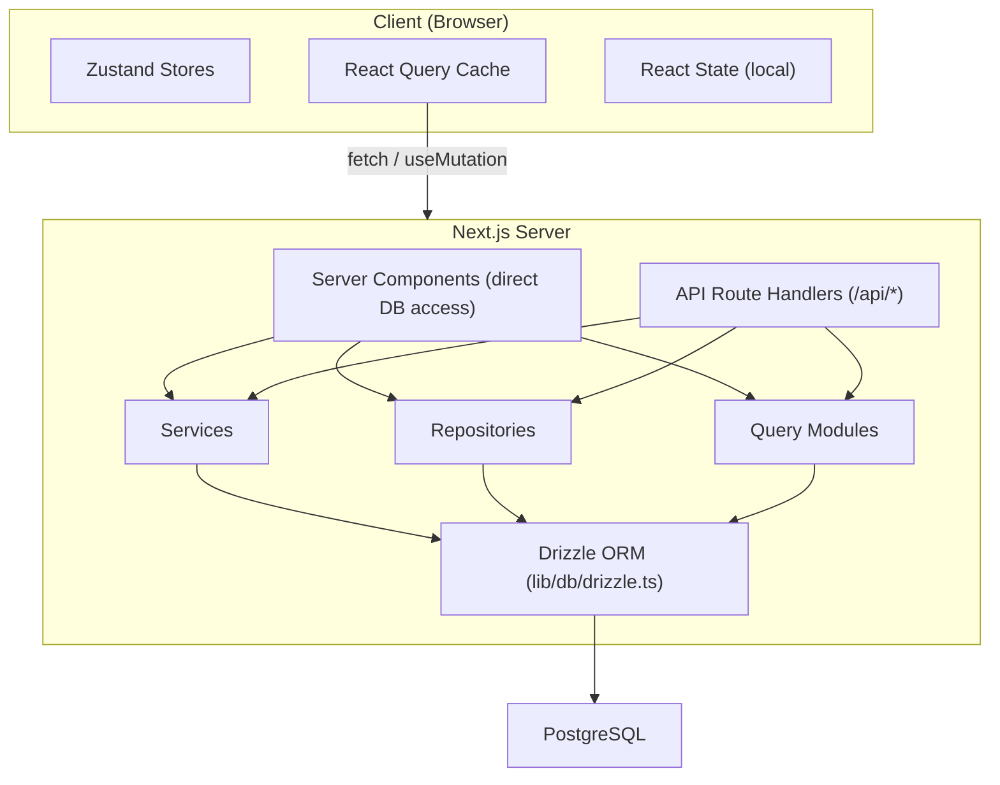

# Flujo de datos y gestión de estado

Este documento describe cómo fluyen los datos a través de la plantilla Ever Works, desde la base de datos hasta la interfaz de usuario, y cubre los componentes del servidor, las rutas API, React Query, los almacenes Zustand y el patrón del repositorio.

## Descripción general de la arquitectura

La plantilla emplea una arquitectura de datos de varias capas:



## Obtención de datos del lado del servidor

### Componentes del servidor (acceso directo a la base de datos)

Los componentes del servidor en el directorio `app/` pueden importar y llamar directamente a funciones de consulta de bases de datos o métodos de repositorio. Esta es la ruta más eficiente porque evita viajes de ida y vuelta HTTP innecesarios.

```typescript
// app/[locale]/admin/items/page.tsx (simplified)
import { getItems } from '@/lib/db/queries';

export default async function AdminItemsPage() {
  const items = await getItems();
  return <ItemsList items={items} />;
}
```

### Controladores de ruta API

Las rutas API en `app/api/` sirven como puente entre los componentes del cliente y la lógica del lado del servidor. Siguen un patrón de controlador ligero: validan la entrada, llaman al servicio o repositorio apropiado y devuelven una respuesta HTTP.

```typescript
// Typical API route pattern
export async function GET(request: NextRequest) {
  const session = await auth();
  if (!session?.user) {
    return NextResponse.json({ error: 'Unauthorized' }, { status: 401 });
  }

  const data = await someRepository.findAll();
  return NextResponse.json({ success: true, data });
}
```

## Gestión del estado del lado del cliente

### Consulta TanStack (consulta de reacción 5)

React Query es la herramienta principal para la gestión del estado del servidor del lado del cliente. La plantilla lo utiliza ampliamente a través de enlaces personalizados en el directorio `hooks/`.

**Configuración global** (`lib/react-query-config.ts`):
- Tiempo de espera predeterminado: 5 minutos
- Tiempo de recogida de basura: 10 minutos.
- Reintento automático con retroceso exponencial (hasta 3 reintentos)
- Vuelva a buscar el foco de la ventana y vuelva a conectarse
- No hay reintentos en errores del cliente 4xx

**Patrón de gancho**: cada área de funciones tiene ganchos dedicados que envuelven React Query:

```typescript
// hooks/use-admin-items.ts (simplified pattern)
import { useQuery, useMutation, useQueryClient } from '@tanstack/react-query';

export function useAdminItems(params) {
  return useQuery({
    queryKey: ['admin', 'items', params],
    queryFn: () => fetch('/api/admin/items').then(r => r.json()),
    staleTime: 5 * 60 * 1000,
  });
}

export function useCreateItem() {
  const queryClient = useQueryClient();
  return useMutation({
    mutationFn: (data) => fetch('/api/admin/items', {
      method: 'POST',
      body: JSON.stringify(data),
    }).then(r => r.json()),
    onSuccess: () => {
      queryClient.invalidateQueries({ queryKey: ['admin', 'items'] });
    },
  });
}
```

### Tiendas Zustand

Zustand se utiliza para el estado de la interfaz de usuario solo del cliente que no necesita sincronización del servidor. Los ejemplos incluyen:

- **Estado del tema**: Preferencia de modo claro/oscuro
- **Estado del filtro**: selecciones de filtro activas
- **Estado modal**: Estado abierto/cerrado para modales y superposiciones
- **Preferencias de diseño**: vista de cuadrícula o de lista, estado de la barra lateral

### Reaccionar contexto

Los proveedores de contexto de React en `components/context/` y `components/providers/` suministran estado compartido a los subárboles de componentes. El contenedor de proveedores raíz (`app/[locale]/providers.tsx`) compone:

- Proveedor de consultas React (con cliente de consultas)
- Proveedor de temas
- Proveedor de sesión de autenticación
- Proveedor de notificaciones de brindis

## Capas de acceso a datos

### Patrón de repositorio

Los repositorios en `lib/repositories/` proporcionan una abstracción limpia sobre las operaciones de la base de datos. Cada repositorio encapsula consultas para una entidad de dominio específica.

```
lib/repositories/
├── admin-analytics-optimized.repository.ts
├── admin-stats.repository.ts
├── category.repository.ts
├── client-dashboard.repository.ts
├── client-item.repository.ts
├── collection.repository.ts
├── integration-mapping.repository.ts
├── item.repository.ts
├── role.repository.ts
├── sponsor-ad.repository.ts
├── tag.repository.ts
├── twenty-crm-config.repository.ts
└── user.repository.ts
```

### Módulos de consulta

El directorio `lib/db/queries/` contiene más de 23 módulos de consulta organizados por dominio. Estos proporcionan funciones de consulta ORM de Drizzle sin procesar que consumen los repositorios y servicios.

### Capa de servicios

El directorio `lib/services/` contiene más de 30 archivos de servicio que implementan la lógica empresarial. Los servicios organizan múltiples repositorios, llamadas API externas y efectos secundarios (correo electrónico, notificaciones, webhooks).

## Arquitectura de cliente API

### Cliente API del lado del servidor

`lib/api/server-api-client.ts` proporciona un cliente HTTP centralizado para llamadas del lado del servidor con:
- Reintento automático con retroceso exponencial
- Tiempos de espera configurables (predeterminado 30 segundos)
- Registro estructurado en desarrollo
- Normalización de errores

### Cliente API del lado del navegador

`lib/api/api-client.ts` y `lib/api/api-client-class.ts` proporcionan la abstracción de API del lado del cliente utilizada por los ganchos de React Query para llamar a rutas API.

## Datos de contenido (CMS basado en Git)

El contenido de los elementos (listados de directorios) se almacena en un repositorio Git y se administra a través de `lib/content.ts` y `lib/repository.ts`. Este contenido se clona en `.content/` en el momento de la compilación y se sincroniza periódicamente. El sistema de contenido utiliza `isomorphic-git` para las operaciones de Git directamente desde Node.js.

## Estrategia de caché

La plantilla implementa un enfoque de almacenamiento en caché de varios niveles:

1. **Caché de consultas de React**: del lado del cliente con tiempos de obsolescencia/GC configurables por consulta
2. **Caché de Next.js**: renderizado del lado del servidor y caché de datos a través de `lib/cache-config.ts`
3. **Invalidación de caché**: invalidación dirigida a través de `lib/cache-invalidation.ts` usando etiquetas de revalidación
4. **Agrupación de conexiones de bases de datos**: Configurado en `lib/db/drizzle.ts` con tamaños de grupo entre 1 y 50 conexiones.
