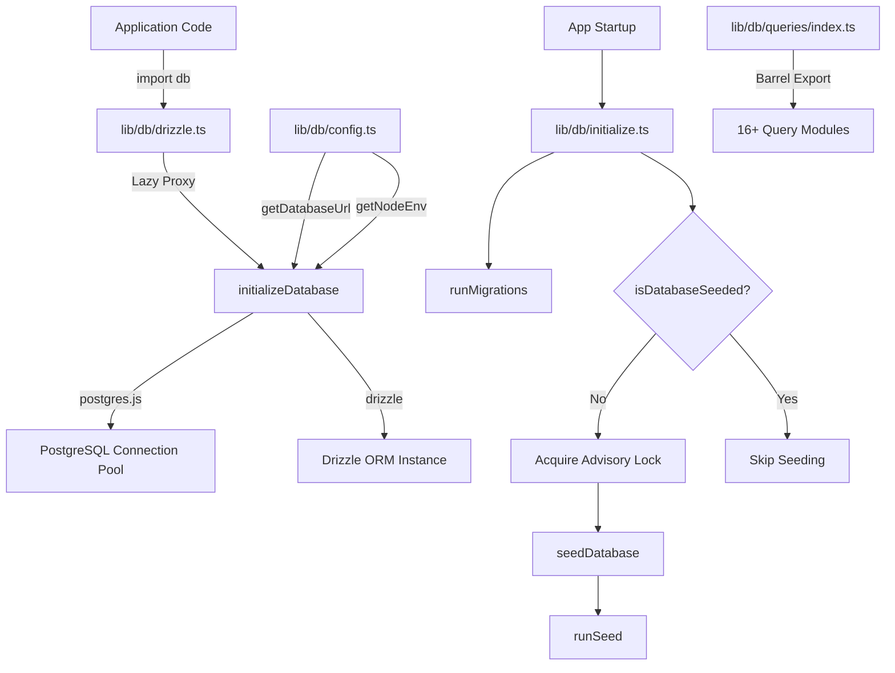
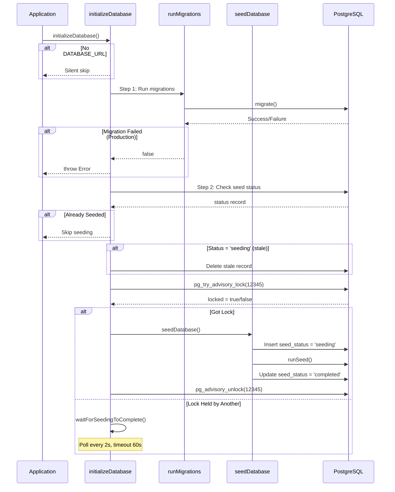

# Módulo de utilidades de base de datos

El módulo de utilidades de base de datos (`template/lib/db/`) administra la agrupación de conexiones PostgreSQL a través de `postgres.js`, la inicialización de Drizzle ORM, las migraciones automatizadas y la inicialización de bases de datos con bloqueo seguro de concurrencia. Está diseñado para funcionar en entornos sin servidor (Vercel) donde pueden ejecutarse múltiples arranques en frío para inicializar la base de datos.

## Descripción general de la arquitectura



## Archivos fuente

|Archivo|Descripción|
|------|-------------|
|`lib/db/config.ts`|Configuración de base de datos segura para scripts (no `server-only`)|
|`lib/db/drizzle.ts`|Grupo de conexiones e instancia de Drizzle con proxy diferido|
|`lib/db/initialize.ts`|Migración automática y orquestación de siembra|
|`lib/db/migrate.ts`|corredor de migración|
|`lib/db/queries/index.ts`|Exportación de barriles para todos los módulos de consulta|

## Configuración de base de datos (`config.ts`)

Funciones seguras para scripts que **no** importan `server-only`, lo que permite su uso en scripts de migración y semilla:

```typescript
function getDatabaseUrl(): string | undefined;
function getNodeEnv(): 'development' | 'production' | 'test';
function isProduction(): boolean;
```

## Conexión y ORM (`drizzle.ts`)

### Patrón de proxy perezoso

La exportación `db` utiliza JavaScript `Proxy` para diferir la inicialización de la conexión hasta el primer uso. Esto evita errores de conexión durante el tiempo de compilación cuando `DATABASE_URL` puede no estar disponible.

```typescript
// Proxy intercepts all property access and initializes on demand
export const db = new Proxy({} as ReturnType<typeof drizzle>, {
  get(target, prop) {
    const database = initializeDatabase();
    return database[prop as keyof typeof database];
  },
});
```

### Configuración del grupo de conexiones

```typescript
function getPoolSize(): number;
// - Reads DB_POOL_SIZE env var (clamped to 1-50)
// - Defaults: 20 (production), 10 (development)
```

Configuración de la piscina:
- `idle_timeout`: 20 segundos
- `connect_timeout`: 30 segundos
- `prepare`: falso (obligatorio para algunos entornos sin servidor)

### Singleton a través de `globalThis`

La conexión se almacena en caché en `globalThis` para sobrevivir a las recargas del módulo activo de Next.js en desarrollo:

```typescript
const globalForDb = globalThis as unknown as {
  conn: postgres.Sql | undefined;
  db: ReturnType<typeof drizzle> | undefined;
};
```

### Acceso directo a la instancia

Para casos que requieren la instancia real de Drizzle (por ejemplo, el adaptador NextAuth.js Drizzle):

```typescript
import { getDrizzleInstance } from '@/lib/db/drizzle';

const adapter = DrizzleAdapter(getDrizzleInstance(), { ... });
```

## Corredor de migración (`migrate.ts`)

### `runMigrations(): Promise<boolean>`

Ejecuta migraciones de Drizzle desde la carpeta `./lib/db/migrations`. Es seguro recurrir a cada startup porque `migrate()` de Drizzle es idempotente: rastrea las migraciones aplicadas en una tabla `__drizzle_migrations`.

```typescript
import { runMigrations } from '@/lib/db/migrate';

const success = await runMigrations();
if (!success) {
  console.error('Migrations failed -- run pnpm db:migrate manually');
}
```

**Comportamiento:**
- Registra el historial de migración reciente antes y después de la ejecución.
- Devuelve `true` en caso de éxito, `false` en caso de error.
- No arroja: los errores se registran y se devuelven como booleanos

## Inicialización de la base de datos (`initialize.ts`)

### `initializeDatabase(): Promise<void>`

La función de inicialización principal se llama al inicio de la aplicación. Maneja el ciclo de vida completo:



### Seguridad de concurrencia

Se pueden iniciar varias instancias sin servidor simultáneamente. El módulo evita la siembra duplicada mediante:

1. **Bloqueo de aviso de PostgreSQL** (`pg_try_advisory_lock(12345)`) -- sin bloqueo
2. **Tabla de estado de semillas** seguimiento de estados `seeding`, `completed`, `failed`
3. **Detección obsoleta**: umbral de 5 minutos para el estado atascado `seeding`
4. **Esperar y sondear**: instancias que no pueden adquirir la encuesta de bloqueo cada 2 segundos.

### Funciones auxiliares

```typescript
// Check if database has been successfully seeded
async function isDatabaseSeeded(): Promise<boolean>;

// Wait for another instance to finish seeding (60s timeout, 2s intervals)
async function waitForSeedingToComplete(): Promise<boolean>;
```

## Módulos de consulta

El directorio `lib/db/queries/` contiene módulos de consulta específicos del dominio, todos reexportados a través de `index.ts`:

|Módulo|Dominio|
|--------|--------|
|`activity.queries.ts`|Registro de actividad|
|`auth.queries.ts`|Autenticación (búsqueda de usuario, verificación de contraseña)|
|`client.queries.ts`|Perfiles de clientes|
|`comment.queries.ts`|Comentarios|
|`company.queries.ts`|Perfiles de empresa|
|`dashboard.queries.ts`|Estadísticas del panel|
|`engagement.queries.ts`|Vistas, votos, agregación de favoritos.|
|`item.queries.ts`|Artículo CRUD|
|`location-index.queries.ts`|Indexación basada en la ubicación|
|`newsletter.queries.ts`|Suscripciones a boletines|
|`payment.queries.ts`|Registros de pago|
|`report.queries.ts`|Informes|
|`subscription.queries.ts`|Suscripciones|
|`survey.queries.ts`|Encuestas y respuestas|
|`user.queries.ts`|Gestión de usuarios|
|`vote.queries.ts`|Sistema de votación|

### Patrón de importación

```typescript
import {
  getUserByEmail,
  getClientProfileByUserId,
  logActivity,
  isUserAdmin,
} from '@/lib/db/queries';
```

## Variables de entorno

|variable|Requerido|Descripción|
|----------|----------|-------------|
|`DATABASE_URL`|No (base de datos opcional)|Cadena de conexión PostgreSQL|
|`DB_POOL_SIZE`|No|Tamaño del grupo de conexiones (predeterminado: 10/20)|
|`NODE_ENV`|No|Determina los valores predeterminados y el registro del tamaño del grupo|
