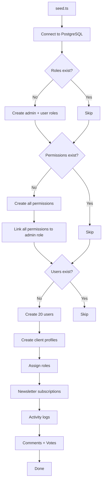
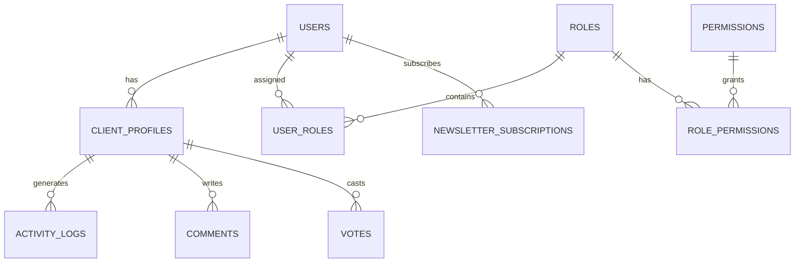

# Sistema de datos ficticio

La plantilla proporciona dos enfoques para probar datos: datos ficticios estáticos para el desarrollo de UI y la creación de prototipos, y un sistema de inicialización de bases de datos para generar registros realistas en PostgreSQL. Juntos cubren el ciclo de vida completo del desarrollo, desde maquetas hasta pruebas de integración.

## Descripción general

```mermaid
graph TD
    A[Test Data] --> B[Static Dummy Data<br/>lib/dummy-data.ts]
    A --> C[Database Seeding<br/>scripts/seed.ts]

    B --> D[UI Prototyping]
    B --> E[Component Stories]
    B --> F[Frontend Tests]

    C --> G[Integration Testing]
    C --> H[Development Database]
    C --> I[Demo Environments]
```



## Datos ficticios estáticos

El módulo `lib/dummy-data.ts` exporta datos de muestra escritos para su uso en componentes durante el desarrollo.

### Interfaz de envío

```typescript
export interface Submission {
  id: string;
  title: string;
  description: string;
  status: "approved" | "pending" | "rejected";
  submittedAt: string | null;
  approvedAt?: string;
  rejectedAt?: string;
  rejectionReason?: string;
  category: string;
  tags: string[];
  views: number;
  likes: number;
}
```

### ficticioPresentación

Seis envíos de muestra que cubren todos los estados de estado:

|identificación|Título|Estado|categoría|Vistas|Me gusta|
|---|---|---|---|---|---|
| 1 |Plataforma de comercio electrónico moderna|aprobado|Desarrollo web| 1250 | 89 |
| 2 |Aplicación de gestión de tareas|pendiente|Desarrollo Móvil| 567 | 23 |
| 3 |Panel meteorológico|rechazado|Desarrollo web| 890 | 45 |
| 4 |Asistente de chat de IA|aprobado|IA/ML| 2100 | 156 |
| 5 |Aplicación de seguimiento de actividad física|pendiente|Desarrollo Móvil| 432 | 18 |
| 6 |Plataforma de blogs|pendiente|Desarrollo web| 0 | 0 |

Uso en componentes:

```typescript
import { dummySubmissions } from '@/lib/dummy-data';

export function SubmissionList() {
  return (
    <div>
      {dummySubmissions.map((submission) => (
        <SubmissionCard key={submission.id} submission={submission} />
      ))}
    </div>
  );
}
```

### maniquíPortafolio

Tres elementos de cartera de muestra para exhibir tarjetas de proyectos:

|identificación|Título|Destacado|Etiquetas|
|---|---|---|---|
| 1 |Plataforma de comercio electrónico|si|Next.js, Stripe, Comercio electrónico|
| 2 |Aplicación de gestión de tareas|si|Reaccionar, Firebase, en tiempo real|
| 3 |Panel meteorológico|No|Vue.js, API meteorológica, panel de control|

Cada artículo del portafolio incluye:

```typescript
{
  id: string;
  title: string;
  description: string;
  imageUrl: string;      // Unsplash placeholder image
  externalUrl: string;   // Demo link
  tags: string[];
  isFeatured: boolean;
}
```

## Siembra de base de datos

El script `scripts/seed.ts` genera datos realistas directamente en PostgreSQL usando Drizzle ORM.

### Arquitectura de siembra



### Relaciones de datos



### Perfiles de usuario generados

La sembradora crea perfiles con variación determinista:

```typescript
// Plan distribution
plan: i % 5 === 0 ? 'premium'    // 20% premium
    : i % 3 === 0 ? 'standard'   // ~13% standard
    : 'free';                     // ~67% free

// Job titles alternate
jobTitle: i % 2 === 0 ? 'Developer' : 'Designer';

// Companies alternate
company: i % 2 === 0 ? 'Acme Inc.' : 'Globex';

// Bios for every 3rd user
bio: i % 3 === 0 ? 'Power user' : null;
```

### Patrones de registro de actividad

Los registros de actividad pasan por cuatro tipos de acciones:

|Patrón de índice|acción|Descripción|
|---|---|---|
|`i % 4 === 0`|`SIGN_UP`|Creación de cuenta|
|`i % 4 === 1`|`SIGN_IN`|Evento de inicio de sesión|
|`i % 4 === 2`|`COMMENT`|Comentario publicado|
|`i % 4 === 3`|`VOTE`|voto emitido|

Las marcas de tiempo son aleatorias dentro de los últimos 7 días.

### Distribución de votos

Los votos utilizan una división de 75/25 a favor de los votos a favor:

```typescript
voteType: i % 4 === 0 ? VoteType.DOWNVOTE : VoteType.UPVOTE
```

### Configuración de conexión

El seeder utiliza configuraciones de conexión conservadoras adecuadas para scripts:

```typescript
const conn = postgres(databaseUrl, {
  max: 1,              // Single connection (no pool needed)
  idle_timeout: 20,    // Close idle connections after 20s
  connect_timeout: 10, // 10-second connection timeout
  prepare: false,      // Disable prepared statements
});
```

## Siembra de productos a rayas

El script `scripts/seed-stripe-products.ts` crea el catálogo de facturación en Stripe. Consulte la documentación [Scripts de base de datos](../development/database-scripts.md) para obtener la lista completa de productos.

## Idempotencia

Ambos enfoques de siembra están diseñados para ser seguros para ejecuciones repetidas:

|Tipo de datos|Condición de guardia|Comportamiento al volver a ejecutar|
|---|---|---|
|Roles|`SELECT * FROM roles LIMIT 1`|Saltar si existe alguno|
|Permisos|`SELECT * FROM permissions LIMIT 1`|Saltar si existe alguno|
|Usuarios|`SELECT count(*) FROM users`|Saltar si cuenta > 0|
|Boletín|Incluido en el bloque de creación de usuarios|Saltado con los usuarios|

## Uso de datos ficticios en desarrollo

### Patrón 1: creación de prototipos de componentes

Utilice datos ficticios estáticos para crear componentes de interfaz de usuario antes de que el backend esté listo:

```typescript
import { dummySubmissions, type Submission } from '@/lib/dummy-data';

interface SubmissionCardProps {
  submission: Submission;
}

export function SubmissionCard({ submission }: SubmissionCardProps) {
  const statusColors = {
    approved: 'bg-green-100 text-green-800',
    pending: 'bg-yellow-100 text-yellow-800',
    rejected: 'bg-red-100 text-red-800',
  };

  return (
    <div className="p-4 border rounded-lg">
      <h3>{submission.title}</h3>
      <span className={statusColors[submission.status]}>
        {submission.status}
      </span>
      <p>{submission.description}</p>
      <div className="flex gap-2">
        {submission.tags.map(tag => (
          <span key={tag} className="badge">{tag}</span>
        ))}
      </div>
    </div>
  );
}
```

### Patrón 2: maquetas de tableros

```typescript
import { dummySubmissions } from '@/lib/dummy-data';

// Derive stats from dummy data
const stats = {
  total: dummySubmissions.length,
  approved: dummySubmissions.filter(s => s.status === 'approved').length,
  pending: dummySubmissions.filter(s => s.status === 'pending').length,
  rejected: dummySubmissions.filter(s => s.status === 'rejected').length,
  totalViews: dummySubmissions.reduce((sum, s) => sum + s.views, 0),
};
```

### Patrón 3: Reemplazar con datos reales

Cuando la integración de backend esté lista, intercambie la importación:

```typescript
// Before (dummy data)
import { dummySubmissions } from '@/lib/dummy-data';
const submissions = dummySubmissions;

// After (real data)
const submissions = await getSubmissions();
```

## Agregar nuevos datos ficticios

Al agregar nuevas funciones, extienda `lib/dummy-data.ts` con datos de muestra escritos:

1. Definir la interfaz TypeScript para la forma de datos
2. Exportarlo para usarlo en componentes.
3. Cree entradas de muestra que cubran casos extremos (campos vacíos, cadenas de longitud máxima, todos los valores de estado)
4. Utilice valores realistas (nombres propios, URL válidas, números razonables)
5. Incluya artículos destacados y no destacados cuando corresponda

```typescript
// Example: adding dummy reviews
export interface DummyReview {
  id: string;
  authorName: string;
  rating: number;
  comment: string;
  createdAt: string;
}

export const dummyReviews: DummyReview[] = [
  {
    id: "1",
    authorName: "Jane Developer",
    rating: 5,
    comment: "Excellent tool for rapid prototyping",
    createdAt: "2024-02-01T10:00:00Z"
  },
  // ... more entries covering 1-star, no comment, etc.
];
```
