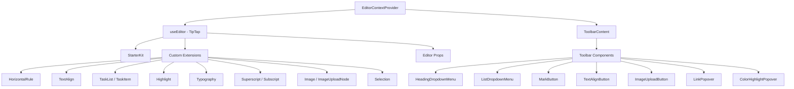

# Sistema de edición

La plantilla incluye un editor de texto enriquecido basado en TipTap (ProseMirror) con una arquitectura modular de extensiones, componentes de barra de herramientas, enlaces y funciones de utilidad. El editor admite encabezados, listas, listas de tareas, imágenes, bloques de código, formato de texto y más.

## Descripción general de la arquitectura



## Archivos fuente

|Directorio|Contenidos|
|-----------|----------|
|`lib/editor/extensions/`|Reexportaciones y configuración de la extensión TipTap|
|`lib/editor/components/`|Componentes de la interfaz de usuario (botones de la barra de herramientas, ventanas emergentes, iconos)|
|`lib/editor/hooks/`|Ganchos de reacción para la gestión del estado del editor|
|`lib/editor/providers/`|Proveedor de contexto del editor con configuración de extensión|
|`lib/editor/contents/`|Componentes de contenido del editor y diseño de la barra de herramientas|
|`lib/editor/utils/`|Funciones de utilidad (atajos, validación, carga)|

## Configuración de extensión

Las extensiones se registran en `EditorContextProvider`. `StarterKit` proporciona una funcionalidad básica, con extensiones adicionales superpuestas:

```typescript
const extensions = useMemo(() => [
  StarterKit.configure({
    horizontalRule: false,
    link: { openOnClick: false, enableClickSelection: true },
  }),
  HorizontalRule,
  TextAlign.configure({ types: ['heading', 'paragraph'] }),
  ImageUploadNode.configure({
    accept: 'image/*',
    maxSize: MAX_FILE_SIZE, // 5MB
    limit: 3,
    upload: handleImageUpload,
    onError: (error) => console.error('Upload failed:', error),
  }),
  TaskList,
  TaskItem.configure({ nested: true }),
  Highlight.configure({ multicolor: true }),
  Image,
  Typography,
  Superscript,
  Subscript,
  Selection,
], []);
```

### Resumen de extensión

|Extensión|Fuente|Propósito|
|-----------|--------|---------|
|`StarterKit`|`@tiptap/starter-kit`|Párrafos, negrita, cursiva, listas, código, cita en bloque|
|`HorizontalRule`|`@tiptap/extension-horizontal-rule`|Divisores horizontales|
|`TextAlign`|`@tiptap/extension-text-align`|Izquierda, centro, derecha, justificar alineación|
|`TaskList` / `TaskItem`|`@tiptap/extension-list`|Listas de casillas de verificación interactivas|
|`Highlight`|`@tiptap/extension-highlight`|Resaltado de texto multicolor|
|`Typography`|`@tiptap/extension-typography`|Comillas tipográficas, guiones y puntos suspensivos|
|`Superscript`|`@tiptap/extension-superscript`|Texto en superíndice|
|`Subscript`|`@tiptap/extension-subscript`|Texto de subíndice|
|`Selection`|`@tiptap/extensions`|Manejo de selección mejorado|
|`Image`|`@tiptap/extension-image`|Visualización de imágenes estáticas|
|`ImageUploadNode`|personalizado|Carga de imágenes con arrastrar y soltar con progreso|

## Proveedor de contexto del editor

El editor se proporciona a través de React Context para acceso a todo el árbol:

```typescript
export const EditorContext = createContext<Editor | null>(null);

export function EditorContextProvider({ children }: { children: React.ReactNode }) {
  const editor = useEditor({
    immediatelyRender: false,
    shouldRerenderOnTransaction: false,
    editorProps: {
      attributes: {
        autocomplete: 'on',
        autocorrect: 'on',
        autocapitalize: 'off',
        'aria-label': 'Main content area, start typing to enter text.',
        class: cn('min-h-96'),
      },
    },
    extensions,
  });

  return <EditorContext.Provider value={editor}>{children}</EditorContext.Provider>;
}
```

Opciones de configuración clave:
- `immediatelyRender: false` previene los desajustes de hidratación SSR
- `shouldRerenderOnTransaction: false` optimiza el rendimiento evitando re-renderizaciones innecesarias

## Configuración de la barra de herramientas

El componente `ToolbarContent` define el diseño completo de la barra de herramientas organizada en grupos:

|grupo|Componentes|
|-------|------------|
|Historia|Deshacer, Rehacer|
|Tipos de bloques|Menú desplegable de encabezado (H1-H4), menú desplegable de lista (viñeta, ordenado, tarea), cita en bloque, bloque de código|
|Marcas en línea|Negrita, cursiva, tachado, código, subrayado, resaltado de color, enlace|
|Guión|Superíndice, Subíndice|
|Alineación|Izquierda, Centro, Derecha, Justificar|
|Medios|Subir imagen|

Los grupos están separados por componentes `ToolbarSeparator` con elementos `Spacer` para posicionamiento.

## Ganchos del editor

### `useTiptapEditor`

Proporciona acceso flexible a la instancia del editor, ya sea desde accesorios o contexto:

```typescript
export function useTiptapEditor(providedEditor?: Editor | null): {
  editor: Editor | null;
  editorState?: Editor["state"];
  canCommand?: Editor["can"];
}
```

Este enlace combina un editor proporcionado directamente con el editor de contexto, lo que permite que los componentes funcionen de forma independiente y dentro del árbol de proveedores.

### Ganchos adicionales

|Gancho|Propósito|
|------|---------|
|`use-editor.ts`|Gestión del estado del editor principal|
|`use-editor-sync.ts`|Sincronización entre instancias del editor|
|`use-cursor-visibility.ts`|Seguimiento de visibilidad y posición del cursor|
|`use-element-rect.ts`|Seguimiento del rectángulo delimitador de elementos|
|`use-scrolling.ts`|Posición y comportamiento del desplazamiento|
|`use-throttled-callback.ts`|Ejecución de devolución de llamada limitada|
|`use-window-size.ts`|Seguimiento responsivo del tamaño de la ventana|
|`use-unmount.ts`|Limpieza al desmontar componentes|

## Funciones de utilidad

### Formato de teclas de método abreviado

El sistema maneja atajos de teclado específicos de la plataforma:

```typescript
export const MAC_SYMBOLS: Record<string, string> = {
  mod: "Command", command: "Command", meta: "Command",
  ctrl: "Ctrl", alt: "Option", shift: "Shift",
  // ... additional mappings
};

export const formatShortcutKey = (key: string, isMac: boolean, capitalize?: boolean) => {
  // Returns Mac symbols or formatted key names
};

export const parseShortcutKeys = (props: {
  shortcutKeys: string | undefined;
  delimiter?: string;
  capitalize?: boolean;
}) => string[];
```

### Validación de esquema

```typescript
// Check if a mark type exists in the editor schema
export const isMarkInSchema = (markName: string, editor: Editor | null): boolean;

// Check if a node type exists in the editor schema
export const isNodeInSchema = (nodeName: string, editor: Editor | null): boolean;

// Check if extensions are registered
export function isExtensionAvailable(editor: Editor | null, extensionNames: string | string[]): boolean;
```

### Navegación de nodos

```typescript
// Find a node at a specific document position
export function findNodeAtPosition(editor: Editor, position: number): TiptapNode | null;

// Find a node by reference or position
export function findNodePosition(props: {
  editor: Editor | null;
  node?: TiptapNode | null;
  nodePos?: number | null;
}): { pos: number; node: TiptapNode } | null;

// Move focus to the next node
export function focusNextNode(editor: Editor): boolean;
```

### Subir imagen

```typescript
export const MAX_FILE_SIZE = 5 * 1024 * 1024; // 5MB

export const handleImageUpload = async (
  file: File,
  onProgress?: (event: { progress: number }) => void,
  abortSignal?: AbortSignal
): Promise<string>;
```

El controlador de carga valida el tamaño del archivo, admite el seguimiento del progreso y maneja la cancelación a través de `AbortSignal`.

### Desinfección de URL

```typescript
export function isAllowedUri(uri: string | undefined, protocols?: ProtocolConfig): boolean;
export function sanitizeUrl(inputUrl: string, baseUrl: string, protocols?: ProtocolConfig): string;
```

Garantiza que solo se permitan protocolos seguros (`http`, `https`, `ftp`, `mailto`, etc.) en los enlaces. Las URL no seguras se reemplazan por `"#"`.
