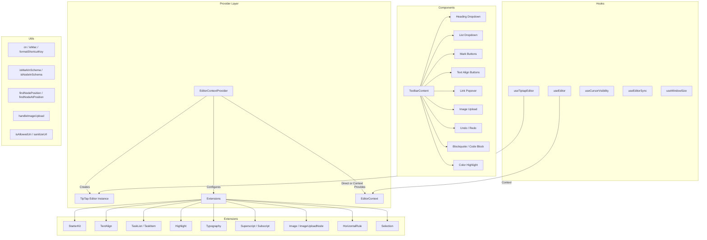

# Módulo de utilidades del editor

El módulo de utilidades del editor (`template/lib/editor/`) proporciona una solución completa de edición de texto enriquecido basada en **TipTap** (ProseMirror). Incluye un proveedor de editor preconfigurado, extensiones TipTap, una biblioteca completa de componentes de barra de herramientas, funciones de utilidad para manipulación DOM y ganchos React personalizados para la gestión del estado del editor.

## Descripción general de la arquitectura



## Archivos fuente

|Directorio|Descripción|
|-----------|-------------|
|`lib/editor/index.ts`|Exportación de barriles para todos los submódulos|
|`lib/editor/providers/`|`EditorContextProvider` y `EditorContext`|
|`lib/editor/extensions/`|Reexportaciones de la extensión TipTap|
|`lib/editor/hooks/`|Ganchos de reacción personalizados|
|`lib/editor/utils/`|Funciones de utilidad|
|`lib/editor/contents/`|Componentes `ToolbarContent` y `EditorContent`|
|`lib/editor/components/`|Primitivas de la interfaz de usuario, botones de la barra de herramientas, iconos, nodos|
|`lib/editor/styles/`|Editor de estilos CSS|

## Proveedor de editores

### `EditorContextProvider`

Envuelve elementos secundarios con una instancia del editor TipTap preconfigurada:

```tsx
import { EditorContextProvider } from '@/lib/editor';

function MyEditor() {
  return (
    <EditorContextProvider>
      <ToolbarContent editor={null} />
      <EditorContent />
    </EditorContextProvider>
  );
}
```

### Configuración

El proveedor configura TipTap con estas configuraciones:

```typescript
const editor = useEditor({
  immediatelyRender: false,
  shouldRerenderOnTransaction: false,
  editorProps: {
    attributes: {
      autocomplete: 'on',
      autocorrect: 'on',
      autocapitalize: 'off',
      'aria-label': 'Main content area, start typing to enter text.',
      class: 'min-h-96',
    },
  },
  extensions: [/* ... */],
});
```

### Extensiones preconfiguradas

|Extensión|Configuración|
|-----------|--------------|
|`StarterKit`|`horizontalRule: false`, `link.openOnClick: false`|
|`HorizontalRule`|Predeterminado|
|`TextAlign`|Se aplica a los nodos `heading` y `paragraph`|
|`ImageUploadNode`|Aceptar: `image/*`, máximo 5 MB, límite 3 imágenes|
|`TaskList` / `TaskItem`|Tareas anidadas habilitadas|
|`Highlight`|Multicolor habilitado|
|`Image`|Predeterminado|
|`Typography`|Comillas tipográficas y guiones|
|`Superscript` / `Subscript`|Predeterminado|
|`Selection`|Predeterminado|

## Ganchos

### `useEditor(): Editor`

Recupera la instancia del editor de `EditorContext`. Debe usarse dentro de un `EditorContextProvider`.

```typescript
import { useEditor } from '@/lib/editor';

function MyComponent() {
  const editor = useEditor();
  // editor is the TipTap Editor instance
}
```

### `useTiptapEditor(providedEditor?): { editor, editorState?, canCommand? }`

Gancho flexible que acepta una instancia de editor opcional o recurre al contexto TipTap:

```typescript
import { useTiptapEditor } from '@/lib/editor/hooks';

function ToolbarButton({ editor: externalEditor }) {
  const { editor, editorState, canCommand } = useTiptapEditor(externalEditor);

  const isBold = editorState ? editor?.isActive('bold') : false;
  const canBold = canCommand ? canCommand().toggleBold() : false;
}
```

### Otros ganchos

|Gancho|Propósito|
|------|---------|
|`useCursorVisibility`|Realiza un seguimiento de la visibilidad de la posición del cursor en la ventana gráfica|
|`useEditorSync`|Sincroniza el contenido del editor con el estado externo.|
|`useElementRect`|Rectángulo delimitador del elemento de seguimiento|
|`useScrolling`|Detecta el estado de desplazamiento|
|`useThrottledCallback`|Limita una función de devolución de llamada|
|`useUnmount`|Ejecuta la limpieza al desmontar el componente.|
|`useWindowSize`|Seguimiento de las dimensiones de la ventana|

## Funciones de utilidad

### Ayudante de nombre de clase

```typescript
function cn(...classes: (string | boolean | undefined | null)[]): string;
// Filters falsy values and joins with space
cn('min-h-96', isActive && 'bg-blue-500', undefined); // 'min-h-96 bg-blue-500'
```

### Detección de plataforma

```typescript
function isMac(): boolean;
// Returns true if navigator.platform includes 'mac'
```

### Formato de teclas de método abreviado

```typescript
function formatShortcutKey(key: string, isMac: boolean, capitalize?: boolean): string;
// Mac: 'ctrl' -> '???', 'alt' -> '???', 'shift' -> '???', 'meta' -> '???'
// Windows: 'ctrl' -> 'Ctrl'

function parseShortcutKeys(props: {
  shortcutKeys: string | undefined;
  delimiter?: string;    // default: '+'
  capitalize?: boolean;  // default: true
}): string[];
// 'ctrl+shift+b' -> ['???', '???', 'B'] (Mac) or ['Ctrl', 'Shift', 'B'] (Windows)
```

### Inspección de esquema

```typescript
function isMarkInSchema(markName: string, editor: Editor | null): boolean;
// Checks if a mark type exists in the editor schema

function isNodeInSchema(nodeName: string, editor: Editor | null): boolean;
// Checks if a node type exists in the editor schema

function isExtensionAvailable(editor: Editor | null, extensionNames: string | string[]): boolean;
// Checks if one or more extensions are registered
// Logs a warning if none found
```

### Operaciones de nodo

```typescript
function findNodeAtPosition(editor: Editor, position: number): TiptapNode | null;
// Returns the node at the given document position

function findNodePosition(props: {
  editor: Editor | null;
  node?: TiptapNode | null;
  nodePos?: number | null;
}): { pos: number; node: TiptapNode } | null;
// Finds position by node reference or position number

function focusNextNode(editor: Editor): boolean;
// Moves cursor to the next node, creating a paragraph if at end

function isNodeTypeSelected(editor: Editor | null, types: string[]): boolean;
// Checks if current selection is a NodeSelection matching any type

function isValidPosition(pos: number | null | undefined): pos is number;
// Type guard for valid document positions (>= 0)
```

### Subir imagen

```typescript
const MAX_FILE_SIZE = 5 * 1024 * 1024; // 5MB

async function handleImageUpload(
  file: File,
  onProgress?: (event: { progress: number }) => void,
  abortSignal?: AbortSignal,
): Promise<string>;
// Returns the URL of the uploaded image
// Default implementation is a demo stub -- replace with actual upload logic
```

### Validación de URL

```typescript
function isAllowedUri(uri: string | undefined, protocols?: ProtocolConfig): boolean;
// Checks URI against allowed protocols:
// http, https, ftp, ftps, mailto, tel, callto, sms, cid, xmpp
// Plus any custom protocols passed in

function sanitizeUrl(inputUrl: string, baseUrl: string, protocols?: ProtocolConfig): string;
// Returns sanitized URL or '#' if not allowed
```

## Contenido de la barra de herramientas

El componente `ToolbarContent` proporciona una barra de herramientas completa y preconfigurada:

```tsx
import { ToolbarContent } from '@/lib/editor/contents';

<ToolbarContent editor={editor} />
```

### Grupos de barras de herramientas

|grupo|Componentes|
|-------|-----------|
|Deshacer/Rehacer|`UndoRedoButton` (deshacer, rehacer)|
|Formato de bloque|`HeadingDropdownMenu` (H1-H4), `ListDropdownMenu` (bala, ordenado, tarea), `BlockquoteButton`, `CodeBlockButton`|
|Formato en línea|`MarkButton` (negrita, cursiva, tachado, código, subrayado), `ColorHighlightPopover`, `LinkPopover`|
|Superíndice|`MarkButton` (superíndice, subíndice)|
|Alineación de texto|`TextAlignButton` (izquierda, centro, derecha, justificar)|
|Medios|`ImageUploadButton`|

## Biblioteca de componentes

### Componentes primitivos

Componentes básicos de la interfaz de usuario utilizados por los botones de la barra de herramientas:

- `Badge`, `Button`, `Card`, `DropdownMenu`, `Input`, `Popover`, `Separator`, `Spacer`, `Toolbar`, `Tooltip`

### Componentes del nodo

Vistas personalizadas del nodo TipTap:

- `HorizontalRuleNode` -- extensión de regla horizontal personalizada
- `ImageUploadNode` -- nodo de carga de archivos con arrastrar y soltar

### Componentes de iconos

Iconos SVG para todas las acciones de la barra de herramientas (negrita, cursiva, niveles de encabezado, listas, alineación, etc.).
