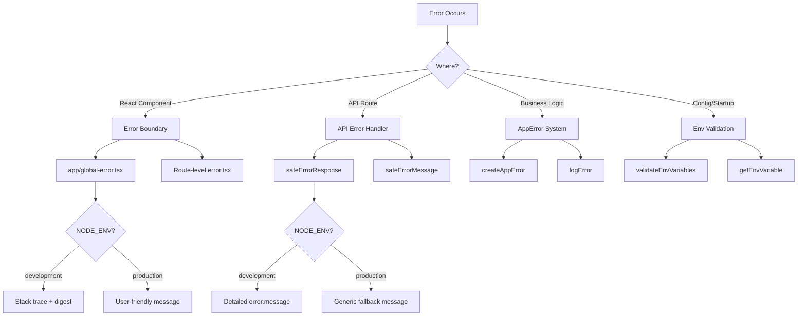

# Patrones de manejo de errores

## Descripción general

La plantilla Ever Works implementa una estrategia de manejo de errores de múltiples capas que cubre los límites de error de React, las respuestas de error de ruta API, los errores de aplicación escritos y la validación de variables de entorno. El diseño prioriza la seguridad (sin fugas de información en producción) al tiempo que mantiene una depuración amigable para los desarrolladores en el desarrollo.

## Arquitectura



## Archivos fuente

|Archivo|Propósito|
|------|---------|
|`template/app/global-error.tsx`|Límite de error de React a nivel raíz|
|`template/app/not-found.tsx`|404 Página no encontrada|
|`template/lib/utils/api-error.ts`|Utilidades de error de ruta API|
|`template/lib/utils/error-handler.ts`|Tipos de errores de aplicaciones y registro|
|`template/lib/auth/error-handler.ts`|Manejo de errores específicos de autenticación|

## Límites de error de reacción

### Límite de error global

El archivo `global-error.tsx` detecta errores no controlados en la raíz de la aplicación:

```typescript
'use client';

export default function GlobalError({
    error,
    reset,
}: {
    error: Error & { digest?: string };
    reset: () => void;
}) {
    useEffect(() => {
        console.error(error);
    }, [error]);

    return (
        <html lang="en">
            <body>
                <h1>Something went wrong!</h1>
                {process.env.NODE_ENV !== 'production' && (
                    <div>
                        <p className="text-red-600">{error.message}</p>
                        {error.stack && <pre>{error.stack}</pre>}
                        {error.digest && <p>Error ID: {error.digest}</p>}
                    </div>
                )}
                <Button onPress={() => reset()}>Refresh</Button>
                <Link href="/">Go Home</Link>
            </body>
        </html>
    );
}
```

Comportamientos clave:
- **Desarrollo**: muestra mensajes de error, seguimiento de pila y resumen de errores
- **Producción**: Muestra solo un mensaje genérico
- **Resumen de errores**: una identificación única generada por Next.js para la correlación de errores del lado del servidor
- **Función de reinicio**: Vuelve a representar el subárbol del límite de error
- **HTML autónomo**: incluye sus propias etiquetas `<html>` y `<body>`, ya que reemplaza toda la página.

### Página no encontrada

```typescript
'use client';

export default function NotFound() {
    const router = useRouter();
    return (
        <div>
            <h1>404</h1>
            <h2>Page Not Found</h2>
            <Button onClick={() => router.back()}>Go Back</Button>
            <Button onClick={() => router.push('/')}>Back to Home</Button>
        </div>
    );
}
```

## Manejo de errores de API

### respuesta de error segura

La utilidad principal para respuestas de error de ruta API:

```typescript
export function safeErrorResponse(
    error: unknown,
    fallbackMessage: string,
    status: number = 500
): NextResponse {
    const detail = error instanceof Error ? error.message : String(error);

    // Always log full details server-side
    console.error(`[API Error] ${fallbackMessage}:`, detail);

    const message = process.env.NODE_ENV === "development" ? detail : fallbackMessage;

    return NextResponse.json({ success: false, error: message }, { status });
}
```

Uso en rutas API:

```typescript
export async function GET(request: NextRequest) {
    try {
        const result = await someOperation();
        return NextResponse.json(result);
    } catch (error) {
        return safeErrorResponse(error, 'Failed to process request');
    }
}
```

### mensaje de error seguro

Para los casos en los que necesita la cadena de error sin crear una Respuesta:

```typescript
export function safeErrorMessage(error: unknown, fallbackMessage: string): string {
    if (process.env.NODE_ENV === "development") {
        return error instanceof Error ? error.message : String(error);
    }
    return fallbackMessage;
}
```

## Sistema de errores de aplicación

### Tipos de errores

```typescript
export enum ErrorType {
    AUTH = 'auth',
    CONFIG = 'config',
    DATABASE = 'database',
    NETWORK = 'network',
    VALIDATION = 'validation',
    UNKNOWN = 'unknown'
}

export interface AppError {
    message: string;
    type: ErrorType;
    code?: string;
    originalError?: unknown;
}
```

### Crear errores escritos

```typescript
import { createAppError, ErrorType } from '@/lib/utils/error-handler';

const error = createAppError(
    'Failed to configure OAuth providers',
    ErrorType.CONFIG,
    'OAUTH_CONFIG_FAILED',
    originalError
);
```

### Registro de errores estructurado

```typescript
import { logError } from '@/lib/utils/error-handler';

// Logs: [CONFIG] [Auth Config]: Failed to configure OAuth providers
// Logs: Error code: OAUTH_CONFIG_FAILED
// Logs: Original error: <original error details>
logError(error, 'Auth Config');
```

La función `logError` maneja tres formas de error:
1. **AppError**: registro estructurado con tipo, código y error original
2. **Error**: registro estándar con mensaje y seguimiento de pila
3. **Desconocido** -- registro de respaldo con coerción de cadena

### Validación de variables de entorno

```typescript
import { validateEnvVariables, getEnvVariable } from '@/lib/utils/error-handler';

// Validate multiple variables at once
const validationError = validateEnvVariables([
    'DATABASE_URL', 'AUTH_SECRET', 'CRON_SECRET'
]);
if (validationError) {
    logError(validationError, 'Startup');
}

// Get a single required variable (throws if missing)
const dbUrl = getEnvVariable('DATABASE_URL');

// Get an optional variable
const optional = getEnvVariable('OPTIONAL_VAR', false);
```

## Manejo de errores en autenticación

La configuración de autenticación utiliza una degradación elegante:

```typescript
const configureProviders = () => {
    try {
        const oauthProviders = configureOAuthProviders();
        return createNextAuthProviders({ /* full config */ });
    } catch (error) {
        const appError = createAppError(
            'Failed to configure OAuth providers. Falling back to credentials only.',
            ErrorType.CONFIG,
            'OAUTH_CONFIG_FAILED',
            error
        );
        logError(appError, 'Auth Config');

        // Fallback to credentials only
        return createNextAuthProviders({
            credentials: { enabled: true },
            google: { enabled: false },
            github: { enabled: false },
            facebook: { enabled: false },
            twitter: { enabled: false },
        });
    }
};
```

Si la configuración del proveedor de OAuth falla, el sistema recurre a la autenticación de solo credenciales en lugar de fallar.

## Flujo de manejo de errores por capa

|capa|Estrategia|Comportamiento de producción|
|-------|----------|-------------------|
|Reaccionar componentes|Límite de error (`global-error.tsx`)|Mensaje genérico, sin seguimiento de pila.|
|Rutas API|`safeErrorResponse()`|Mensaje de reserva genérico|
|Acciones del servidor|`validatedAction()` detecta errores de Zod|Primer mensaje de error de validación|
|Configuración de autenticación|Probar/capturar con `createAppError()`|Degradación elegante de las credenciales|
|Trabajos cronificados|Probar/capturar + registro estructurado|Error registrado, respuesta devuelta|
|Ganchos web|Probar/atrapar + 400 respuesta|Mensaje de error genérico al proveedor.|

## Mejores prácticas

1. **Nunca exponga elementos internos en producción**: use siempre `safeErrorResponse` para rutas API
2. **Registra todo en el lado del servidor**: los detalles completos del error van a la consola/registro independientemente del entorno
3. **Utilice errores escritos** -- `createAppError` con `ErrorType` para una categorización coherente
4. **Degradación elegante**: recurra a una funcionalidad reducida en lugar de fallar
5. **Resúmenes de errores para correlación**: use el campo `digest` de los errores de Next.js para rastrear problemas del lado del servidor
6. **Validar en los límites**: verifique las variables de entorno al inicio, valide la entrada en los límites de la API
