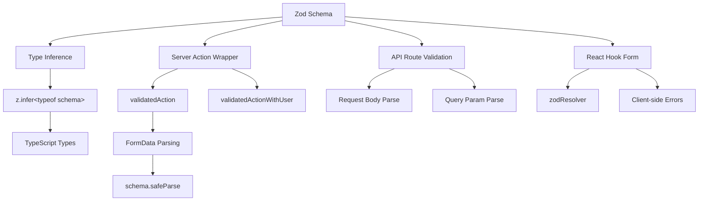

# Patrones de validación de formularios

## Descripción general

La plantilla Ever Works utiliza **Zod** como única fuente de verdad para la validación de datos en los límites del cliente y del servidor. Los esquemas de validación están organizados en `lib/validations/` y son consumidos por:

- **Acciones del servidor** a través de contenedores `validatedAction()` y `validatedActionWithUser()`
- **Manejadores de rutas API** para validación de parámetros de consulta/cuerpo de solicitud
- **Integración de formulario React Hook** para validación de formularios del lado del cliente
- **Inferencia de tipos** a través de `z.infer<>` para seguridad de tipos de un extremo a otro

## Arquitectura



## Archivos fuente

|Archivo|Propósito|
|------|---------|
|`template/lib/validations/auth.ts`|Esquema de validación de contraseña|
|`template/lib/validations/company.ts`|Esquemas CRUD de la empresa|
|`template/lib/validations/client-item.ts`|Esquemas de envío/actualización de artículos del cliente|
|`template/lib/validations/client-dashboard.ts`|Esquemas de consulta del panel|
|`template/lib/validations/sponsor-ad.ts`|Esquemas del ciclo de vida de los anuncios patrocinadores|
|`template/lib/validations/item.ts`|Esquema de datos de ubicación|
|`template/lib/validations/user-location.ts`|Esquema de configuración de ubicación del usuario|
|`template/lib/auth/middleware.ts`|`validatedAction` / `validatedActionWithUser` utilidades|

## Patrones de esquema de validación

### Patrón 1: Validación de contraseña con reglas encadenadas

```typescript
import { z } from "zod";

export const passwordSchema = z
    .string()
    .min(8, "Password must be at least 8 characters")
    .regex(/[A-Z]/, "Password must contain at least one uppercase letter")
    .regex(/[a-z]/, "Password must contain at least one lowercase letter")
    .regex(/[0-9]/, "Password must contain at least one number")
    .regex(/[^A-Za-z0-9]/, "Password must contain at least one special character");
```

Este esquema impone requisitos de contraseña estrictos mediante refinamientos encadenados. Cada `.regex()` proporciona un mensaje de error específico que la interfaz de usuario puede mostrar en línea.

### Patrón 2: crear/actualizar pares de esquemas

La validación de la empresa demuestra el patrón de creación/actualización:

```typescript
export const createCompanySchema = z.object({
    name: z.string().min(1, "Company name is required").max(255),
    website: z.string().url("Invalid URL format").optional().or(z.literal("")),
    domain: z.string().max(255).optional()
        .transform((val) => val?.toLowerCase().trim() || undefined),
    slug: z.string().max(255).optional()
        .transform((val) => val?.toLowerCase().trim() || undefined)
        .refine(
            (val) => !val || /^[a-z0-9-]+$/.test(val),
            { message: "Slug must contain only lowercase letters, numbers, and hyphens" }
        ),
    status: z.enum(companyStatus).default("active"),
});

export const updateCompanySchema = z.object({
    id: z.string().uuid(),
    name: z.string().min(1).max(255).optional(),  // Optional for updates
    // ... other fields also optional
    status: z.enum(companyStatus).optional(),
});
```

Diferencias clave:
- **Crear esquemas** tiene campos obligatorios con valores predeterminados
- **Actualizar esquemas** requiere `id` y hace que todos los demás campos sean opcionales
- Ambos comparten la lógica `.transform()` para la normalización (por ejemplo, slugs en minúsculas)

### Patrón 3: campos de estado basados en enumeraciones

```typescript
export const companyStatus = ["active", "inactive"] as const;
export const itemStatus = ['pending', 'approved', 'rejected'] as const;
export const sponsorAdStatuses = [
    "pending_payment", "pending", "rejected",
    "active", "expired", "cancelled",
] as const;

// Usage in schemas
status: z.enum(companyStatus).default("active"),
status: z.enum(sponsorAdStatuses).optional(),
```

El uso de matrices `as const` con `z.enum()` proporciona validación en tiempo de ejecución y seguridad de tipos en tiempo de compilación.

### Patrón 4: esquemas de parámetros de consulta con transformaciones

```typescript
export const clientItemsListQuerySchema = z.object({
    page: z.string().optional()
        .transform(val => (val ? parseInt(val, 10) : 1))
        .refine(val => !Number.isNaN(val), { message: 'Page must be a valid number' })
        .refine(val => val >= 1, { message: 'Page must be at least 1' }),
    limit: z.string().optional()
        .transform(val => (val ? parseInt(val, 10) : 10))
        .refine(val => val >= 1 && val <= 100, { message: 'Limit must be between 1 and 100' }),
    status: z.enum(clientStatusFilter).optional().default('all'),
    search: z.string().max(100, 'Search query is too long').optional(),
    sortBy: z.enum(['name', 'updated_at', 'status', 'submitted_at']).optional().default('updated_at'),
    sortOrder: z.enum(['asc', 'desc']).optional().default('desc'),
    deleted: z.string().optional().transform(val => val === 'true'),
});
```

Los parámetros de consulta llegan como cadenas. El esquema utiliza `.transform()` para convertirlos a los tipos correctos (números, booleanos) mientras aplica validación y valores predeterminados.

### Patrón 5: esquemas de objetos anidados con validación entre campos

```typescript
export const updateLocationSchema = z
    .object({
        defaultLatitude: z.number().min(-90).max(90).nullable().optional(),
        defaultLongitude: z.number().min(-180).max(180).nullable().optional(),
        defaultCity: z.string().max(200).nullable().optional(),
        defaultCountry: z.string().max(100).nullable().optional(),
        locationPrivacy: locationPrivacySchema.optional(),
    })
    .refine(
        (data) => {
            const hasLat = data.defaultLatitude != null;
            const hasLng = data.defaultLongitude != null;
            return hasLat === hasLng;  // Both or neither
        },
        { message: 'Both latitude and longitude must be provided together' }
    );
```

El `.refine()` a nivel de objeto valida las dependencias entre campos: la latitud y la longitud deben estar presentes o ambas ausentes.

### Patrón 6: Tipos de unión para entradas flexibles

```typescript
category: z.union([
    z.string().min(1, 'Category is required'),
    z.array(z.string().min(1)).min(1, 'At least one category is required'),
]).optional().nullable(),
```

This accepts both a single string and an array of strings for the category field, accommodating different form input types.

## Validación del lado del servidor

### Envoltura de acción validada

```typescript
export function validatedAction<S extends z.ZodType<any, any>, T>(
    schema: S,
    action: ValidatedActionFunction<S, T>
) {
    return async (prevState: ActionState, formData: FormData): Promise<T> => {
        const result = schema.safeParse(Object.fromEntries(formData));
        if (!result.success) {
            return { error: result.error.issues[0].message } as T;
        }
        return action(result.data, formData);
    };
}
```

Esta función de orden superior:
1. Convierte `FormData` en un objeto simple
2. Valida contra el esquema Zod usando `safeParse()`
3. Devuelve el primer error de validación si no es válido.
4. Llama a la función de acción con datos analizados y escritos si son válidos

### validadoActionWithUser Wrapper

```typescript
export function validatedActionWithUser<S extends z.ZodType<any, any>, T>(
    schema: S,
    action: ValidatedActionWithUserFunction<S, T>
) {
    return async (prevState: ActionState, formData: FormData): Promise<T> => {
        const session = await auth();
        if (!session?.user) {
            throw new Error("User is not authenticated");
        }
        const result = schema.safeParse(Object.fromEntries(formData));
        if (!result.success) {
            return { error: result.error.issues[0].message } as T;
        }
        return action(result.data, formData, session.user);
    };
}
```

Esto agrega una verificación de autenticación antes de la validación, pasando el objeto `user` autenticado a la función de acción.

## Inferencia de tipos

Cada esquema exporta tipos de TypeScript inferidos:

```typescript
export type CreateCompanyInput = z.infer<typeof createCompanySchema>;
export type UpdateCompanyInput = z.infer<typeof updateCompanySchema>;
export type ClientUpdateItemInput = z.infer<typeof clientUpdateItemSchema>;
export type ClientCreateItemInput = z.infer<typeof clientCreateItemSchema>;
```

Estos tipos se utilizan en toda la capa de servicio y en las rutas API, lo que garantiza que la forma de los datos validados coincida con lo que espera la lógica empresarial.

## Mejores prácticas

1. **Esquema único, múltiples consumidores** - definir una vez en `lib/validations/`, utilizar en todas partes
2. **Transformar en el límite**: use `.transform()` para convertir cadenas al tipo adecuado
3. **Mensajes de error personalizados**: cada regla de validación incluye un mensaje fácil de usar
4. **Subesquemas compartidos**: reutilice esquemas como `locationSchema` y `passwordSchema` en todos los formularios.
5. **Inferir tipos a partir de esquemas**: nunca defina manualmente tipos que dupliquen definiciones de esquemas
6. **Validación entre campos**: use `.refine()` a nivel de objeto para reglas de múltiples campos
7. **Valores predeterminados razonables**: use `.default()` para campos opcionales con valores estándar
