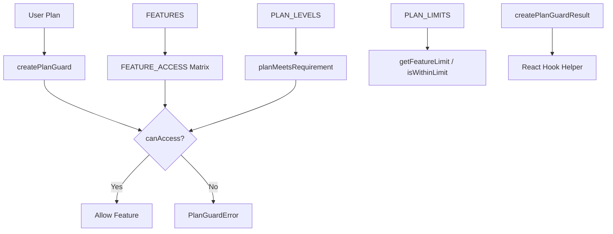

# Módulo de Guardias

El módulo de guardias (`template/lib/guards/`) proporciona un sistema de control de acceso a funciones basado en planes. Define qué planes de suscripción pueden acceder a qué funciones, impone límites numéricos por plan y proporciona funciones de protección del lado del servidor y un generador de resultados compatible con React para uso del lado del cliente.

## Descripción general de la arquitectura



## Archivos fuente

|Archivo|Descripción|
|------|-------------|
|`lib/guards/index.ts`|Exportaciones de barriles|
|`lib/guards/plan-features.guard.ts`|Implementación de guardia completa|

## Jerarquía del plan

Los planes están ordenados por nivel, donde los niveles superiores incluyen todas las funciones de los niveles inferiores cuando se configuran con `minPlan`:

```typescript
const PLAN_LEVELS: Record<string, number> = {
  free: 1,
  standard: 2,
  premium: 3,
};
```

### `getPlanLevel(plan: string): number`

Devuelve el nivel numérico de una cadena de plan. Devuelve `0` para planes desconocidos.

### `planMeetsRequirement(userPlan: string, requiredPlan: string): boolean`

Comprueba si el nivel del plan de un usuario es mayor o igual al nivel del plan requerido.

```typescript
planMeetsRequirement('premium', 'standard'); // true
planMeetsRequirement('free', 'standard');    // false
```

## Definiciones de funciones

Todas las funciones disponibles se declaran como constantes:

```typescript
const FEATURES = {
  // Submission Features
  SUBMIT_PRODUCT: 'submit_product',
  EXTENDED_DESCRIPTION: 'extended_description',
  UNLIMITED_DESCRIPTION: 'unlimited_description',
  UPLOAD_IMAGES: 'upload_images',
  UPLOAD_VIDEO: 'upload_video',
  VERIFIED_BADGE: 'verified_badge',
  SPONSORED_BADGE: 'sponsored_badge',

  // Review & Priority
  PRIORITY_REVIEW: 'priority_review',
  INSTANT_REVIEW: 'instant_review',

  // Visibility & Placement
  SEARCH_VISIBILITY: 'search_visibility',
  CATEGORY_PLACEMENT: 'category_placement',
  SPONSORED_POSITION: 'sponsored_position',
  HOMEPAGE_FEATURED: 'homepage_featured',
  NEWSLETTER_MENTION: 'newsletter_mention',

  // Statistics & Analytics
  VIEW_STATISTICS: 'view_statistics',
  ADVANCED_ANALYTICS: 'advanced_analytics',

  // Support
  EMAIL_SUPPORT: 'email_support',
  PRIORITY_EMAIL_SUPPORT: 'priority_email_support',
  PHONE_SUPPORT: 'phone_support',

  // Social & Marketing
  SOCIAL_SHARING: 'social_sharing',
  LEARN_MORE_BUTTON: 'learn_more_button',

  // Modifications
  FREE_MODIFICATIONS: 'free_modifications',

  // Submissions
  UNLIMITED_SUBMISSIONS: 'unlimited_submissions',
} as const;

type Feature = (typeof FEATURES)[keyof typeof FEATURES];
```

## Matriz de acceso a funciones

El registro `FEATURE_ACCESS` asigna cada característica a su regla de acceso:

```typescript
type FeatureAccess =
  | PaymentPlan             // Only that specific plan
  | PaymentPlan[]           // Any of these plans
  | 'all'                   // All plans have access
  | { minPlan: PaymentPlan }; // That plan and above
```

### Resumen de reglas de acceso

|Característica|Regla de acceso|
|---------|------------|
|`submit_product`|`'all'`|
|`extended_description`|`{ minPlan: 'standard' }`|
|`unlimited_description`|`'premium'`|
|`upload_images`|`'all'`|
|`upload_video`|`'premium'`|
|`verified_badge`|`{ minPlan: 'standard' }`|
|`sponsored_badge`|`'premium'`|
|`priority_review`|`{ minPlan: 'standard' }`|
|`instant_review`|`'premium'`|
|`search_visibility`|`'all'`|
|`category_placement`|`'all'`|
|`sponsored_position`|`'premium'`|
|`homepage_featured`|`'premium'`|
|`newsletter_mention`|`'premium'`|
|`view_statistics`|`{ minPlan: 'standard' }`|
|`advanced_analytics`|`'premium'`|
|`email_support`|`'all'`|
|`priority_email_support`|`{ minPlan: 'standard' }`|
|`phone_support`|`'premium'`|
|`social_sharing`|`{ minPlan: 'standard' }`|
|`learn_more_button`|`'premium'`|
|`free_modifications`|`{ minPlan: 'standard' }`|
|`unlimited_submissions`|`'premium'`|

## Límites del plan

Límites numéricos para funciones con restricciones de cantidad. `null` indica ilimitado.

```typescript
const PLAN_LIMITS: Record<PaymentPlan, FeatureLimits> = {
  free: {
    max_images: 1,
    max_description_words: 200,
    max_submissions: 1,
    review_days: 7,
    free_modification_days: 0,
  },
  standard: {
    max_images: 5,
    max_description_words: 500,
    max_submissions: 10,
    review_days: 3,
    free_modification_days: 30,
  },
  premium: {
    max_images: null,            // unlimited
    max_description_words: null, // unlimited
    max_submissions: null,       // unlimited
    review_days: 1,
    free_modification_days: 365,
  },
};
```

## Funciones de verificación de acceso

### `canAccessFeature(feature: Feature, userPlan: string): boolean`

Verificación de acceso principal que evalúa la regla de acceso a funciones:

```typescript
import { canAccessFeature, FEATURES } from '@/lib/guards';

canAccessFeature(FEATURES.UPLOAD_VIDEO, 'premium');   // true
canAccessFeature(FEATURES.UPLOAD_VIDEO, 'standard');  // false
canAccessFeature(FEATURES.UPLOAD_IMAGES, 'free');     // true ('all')
canAccessFeature(FEATURES.VERIFIED_BADGE, 'standard'); // true (minPlan: standard)
canAccessFeature(FEATURES.VERIFIED_BADGE, 'free');     // false
```

### `getFeatureLimit<K>(limitName: K, userPlan: string): FeatureLimits[K]`

Devuelve el valor límite de un plan:

```typescript
import { getFeatureLimit } from '@/lib/guards';

getFeatureLimit('max_images', 'free');     // 1
getFeatureLimit('max_images', 'premium');  // null (unlimited)
getFeatureLimit('review_days', 'standard'); // 3
```

### `isWithinLimit(limitName, value, userPlan): boolean`

Comprueba si un valor está dentro del límite del plan:

```typescript
import { isWithinLimit } from '@/lib/guards';

isWithinLimit('max_images', 3, 'free');     // false (limit: 1)
isWithinLimit('max_images', 3, 'standard'); // true (limit: 5)
isWithinLimit('max_images', 100, 'premium'); // true (unlimited)
```

### `getAccessibleFeatures(userPlan: string): Feature[]`

Devuelve todas las funciones accesibles mediante un plan determinado.

### `getMinimumPlanForFeature(feature: Feature): PaymentPlan`

Devuelve el plan más bajo que puede acceder a una función.

## Planta de guardia de planos

### `createPlanGuard(userPlan: string)`

Crea una instancia de guardia con métodos vinculados para un plan específico:

```typescript
import { createPlanGuard, FEATURES } from '@/lib/guards';

const guard = createPlanGuard('standard');

// Check access
guard.canAccess(FEATURES.VERIFIED_BADGE); // true
guard.canAccess(FEATURES.PHONE_SUPPORT);  // false

// Require access (throws PlanGuardError)
guard.requireFeature(FEATURES.VERIFIED_BADGE); // OK
guard.requireFeature(FEATURES.PHONE_SUPPORT);  // throws!

// Limits
guard.getLimit('max_images');             // 5
guard.isWithinLimit('max_images', 3);     // true
guard.requireWithinLimit('max_images', 3); // OK
guard.requireWithinLimit('max_images', 10); // throws!

// Info
guard.getAccessibleFeatures();  // Feature[]
guard.getPlan();                // 'standard'
guard.getPlanLevel();           // 2
```

### `PlanGuardError`

Error personalizado lanzado por `requireFeature`:

```typescript
class PlanGuardError extends Error {
  readonly feature: Feature;
  readonly userPlan: string;
  readonly requiredPlan: PaymentPlan;
}
```

### Ejemplo de manejo de errores

```typescript
import { createPlanGuard, PlanGuardError, FEATURES } from '@/lib/guards';

try {
  const guard = createPlanGuard(userPlan);
  guard.requireFeature(FEATURES.UPLOAD_VIDEO);
  // Proceed with video upload
} catch (error) {
  if (error instanceof PlanGuardError) {
    return NextResponse.json({
      error: `Upgrade to ${error.requiredPlan} to access this feature`,
      requiredPlan: error.requiredPlan,
    }, { status: 403 });
  }
  throw error;
}
```

## Ayudante de gancho de reacción

### `PlanGuardResult` Interfaz

```typescript
interface PlanGuardResult {
  canAccess: (feature: Feature) => boolean;
  getLimit: <K extends keyof FeatureLimits>(limitName: K) => FeatureLimits[K];
  isWithinLimit: (limitName: keyof FeatureLimits, value: number) => boolean;
  accessibleFeatures: Feature[];
}
```

### `createPlanGuardResult(userPlan: string): PlanGuardResult`

Crea un objeto simple adecuado para su uso en ganchos y componentes de React:

```typescript
import { createPlanGuardResult, FEATURES } from '@/lib/guards';

// In a custom hook
function usePlanGuard(plan: string) {
  return useMemo(() => createPlanGuardResult(plan), [plan]);
}

// In a component
function SubmissionForm({ userPlan }) {
  const guard = usePlanGuard(userPlan);

  return (
    <form>
      <ImageUploader
        maxImages={guard.getLimit('max_images') ?? Infinity}
        disabled={!guard.canAccess(FEATURES.UPLOAD_IMAGES)}
      />
      {guard.canAccess(FEATURES.UPLOAD_VIDEO) && <VideoUploader />}
    </form>
  );
}
```
